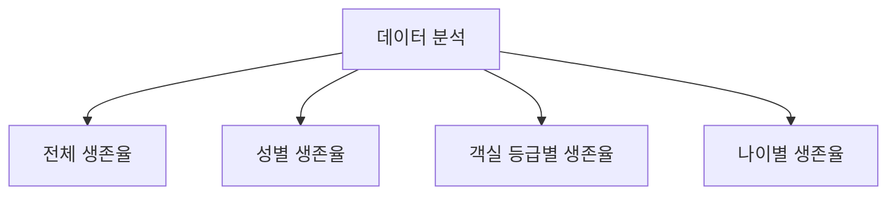

:::div{.callout}
**이번 챕터의 목표**

이번 챕터에서는 데이터 분석이 무엇을 하는지 **직접 경험해보는 시간**입니다. 이 챕터를 Pandas와 NumPy 앞에 배치한 이유는 데이터 분석의 전체 흐름을 먼저 파악하면, 이후에 어떤 부분에 집중해야 할지 알 수 있기 때문입니다.
:::

# 1. 캐글

**캐글**(Kaggle)은 데이터 분석 및 머신러닝 경진대회를 주최하는 세계 최대의 플랫폼입니다. 데이터 분석가와 머신러닝 엔지니어들이 다양한 주제의 데이터셋을 활용하여 경쟁하고, 서로의 모델을 공유하며 성능을 높이는 공간입니다.

## 1.1 캐글의 장점

- **실전 경험**: 다양한 데이터셋으로 문제 해결 능력 향상
- **커뮤니티**: 다른 분석가들의 코드와 노하우 학습
- **포트폴리오**: 경진대회 성적으로 실력 증명 가능

한국에는 **데이콘**(DACON)이라는 유사한 플랫폼이 있습니다.

::a[캐글]{class='btn-link' href="https://www.kaggle.com/" target="_blank"}

::a[데이콘]{class='btn-link' href="https://dacon.io/" target="_blank"}

# 2. 타이타닉 생존자 예측

**타이타닉 생존자 예측**은 캐글에서 가장 유명한 경진대회 중 하나입니다. 데이터는 승객의 정보와 생존 여부로 구성되어 있습니다. 이 대회는 데이터 분석을 하고, 머신러닝을 통해 `test.csv` 데이터의 생존 여부를 예측하는 것입니다.

## 2.1 이번 실습의 범위

다만 우리 수업에서는 머신러닝을 다루지 않기 때문에, 데이터를 불러와서 분석을 해보도록 하겠습니다.


이러한 데이터 분석 과정은 실무에서도 진행하는 일련의 과정이므로, 실습을 통해 데이터 분석의 전반적인 흐름을 파악할 수 있습니다.

## 2.2 학습 순서 안내

여기서는 NumPy와 Pandas를 사용하여 데이터 분석의 흐름을 파악합니다. 실습 전에 NumPy나 Pandas에 대해 먼저 배우고 싶다면 다음 챕터로 넘어갔다가 다시 돌아오셔도 됩니다.

<highlight>이 책에서는 NumPy와 Pandas는 기초적인 내용만 다루고 있습니다. 상세한 내용을 원하신다면 아래 링크를 참고하세요.</highlight>

::a[NumPy Pandas essentials]{class='btn-link' href="https://www.books.weniv.co.kr/essentials-numpy-pandas" target="_blank"}

# 3. 데이터 분석

:::div{.callout}
**실습 전 주의사항**

- 해당 챕터는 **차례대로 실행**해야 합니다. 중간부터 실행하면 데이터가 없어 오류가 발생합니다.
- 위니북스에서는 그래프에서 **한글을 지원하지 않습니다**.
- 위니북스에서는 `show()`를, Colab에서는 `plt.show()`를 사용합니다.
:::

아래 코드를 먼저 실행하고 진행해주세요.

```python-exec
def show(n):
    el = js.document.querySelectorAll('py-repl')[n]
    display(plt.gcf(), target=el.getAttribute('id')+'-1')

print('실행 완료')
```

# 4. 라이브러리 및 데이터 불러오기

## 4.1 Colab 환경

Colab 환경에서는 아래와 같은 코드로 데이터를 불러올 수 있습니다.

```python
import pandas as pd
 
df = pd.read_csv('https://weniv.link/titanic')
df
```

## 4.2 위니북스 환경

위니북스에서는 위의 코드를 실행시킬 수 없기 때문에 아래와 같은 코드를 사용해야 합니다.

```python-exec
import pandas as pd
from pyodide.http import open_url

url = 'https://paullab.co.kr/titanic_train.csv'
data = open_url(url)
df = pd.read_csv(data)
df
```

## 4.3 pd.read_csv() 함수

여기서 중요한 코드는 `pd.read_csv()` 함수입니다. 이 함수는 CSV 파일을 읽어 데이터프레임으로 변환합니다.

| 함수 | 설명 |
|------|------|
| `pd.read_csv()` | CSV 파일 읽기 |
| `pd.read_excel()` | Excel 파일 읽기 |
| `pd.read_sql()` | SQL 쿼리 결과 읽기 |
| `pd.read_json()` | JSON 파일 읽기 |
| `pd.read_html()` | HTML 테이블 읽기 |

# 5. 데이터 확인

데이터는 행과 열로 되어 있습니다.

::img{src="/images/essentials-numpy-pandas/chapter04/pandas_data_structure.png"}

쉽게 말해 엑셀과 같은 데이터라고 생각해주시면 됩니다. 행과 열이 있는 것은 데이터 프레임이며 이 데이터 프레임 중 하나의 열을 시리즈라고 합니다. 데이터 프레임은 여러 시리즈로 이루어져 있습니다.

우선 생존자를 확인해보겠습니다. 아래와 같이 실행하면 생존자를 확인할 수 있습니다.

```python-exec
# 데이터 열 확인
print(df['Survived'])
```

이렇게 확인한 데이터의 타입을 살펴보도록 하겠습니다.

```python-exec
print(type(df))
print(type(df['Survived']))
```

타입을 확인해보니 행과 열로 이뤄진 것은 데이터프레임이며, 그 중 열로만 이뤄진 데이터는 시리즈로 이뤄진 것을 확인할 수 있습니다.

# 6. 데이터 확인 및 기초 통계

데이터 분석의 첫 단계는 주어진 데이터셋을 철저히 이해하는 것입니다. 이를 위해 데이터의 구조, 각 특성의 의미, 그리고 기본적인 통계 정보를 살펴봅니다.


```python-exec
# 데이터 크기 확인
df.shape
```

여기서 출력된 (891, 12)는 `(행, 열)` 입니다. 이를 통해 데이터셋에는 891개의 행(승객)과 12개의 열(특성)이 있음을 알 수 있습니다.

```python-exec
# 데이터 일부 확인
print("데이터 상위 5행:")
df.head()

# 하위 5행 확인
# print("데이터 하위 5행:")
# df.tail()
```

데이터 분석에서 가장 먼저 하는 것은 데이터 확인입니다. 데이터의 상위 5행을 확인하면 각 열이 어떤 정보를 담고 있는지 대략적으로 파악할 수 있습니다. 더 많은 데이터를 보고 싶다면 `head(10)`과 같이 숫자를 넣어주면 됩니다. 하위 5행을 확인하고 싶다면 `tail()`을 사용하면 됩니다.

## 5.1 컬럼 설명

| 컬럼 | 설명 |
|------|------|
| PassengerId | 각 승객의 고유 식별자 |
| Survived | 생존 여부 (0: 사망, 1: 생존) |
| Pclass | 객실 등급 (1, 2, 3등급) |
| Name | 승객의 이름 |
| Sex | 성별 |
| Age | 나이 |
| SibSp | 함께 탑승한 형제자매와 배우자의 수 |
| Parch | 함께 탑승한 부모와 자녀의 수 |
| Ticket | 티켓 번호 |
| Fare | 요금 |
| Cabin | 객실 번호 |
| Embarked | 승선 항구 (C: Cherbourg, Q: Queenstown, S: Southampton) |

```python-exec
# 기본 통계 정보
print("기본 통계 정보:")
df.describe()
```

기본 통계 정보를 확인하면 각 수치형 특성의 평균, 표준편차, 최솟값, 최댓값 등을 확인할 수 있습니다. 이를 통해 데이터의 분포와 특성을 대략적으로 파악할 수 있습니다. 예를 들어, 'Age' 열의 평균값은 약 29.7세이고, 최소 0.42세에서 최대 80세까지의 분포를 보입니다.

```python-exec
# 데이터 정보 확인
print("데이터 정보:")
df.info()
```

마지막으로 `info()` 함수를 사용하여 데이터의 정보를 확인할 수 있습니다. 이 함수는 데이터프레임의 각 열에 대한 정보(데이터 타입, 결측치 여부 등)를 제공합니다. 이를 통해 데이터의 전반적인 상태를 파악할 수 있습니다.

:::div{.callout}
**수치형 데이터와 범주형 데이터**

수치형 데이터는 연속적인 값을 가지는 데이터로, 예를 들어 나이, 키, 몸무게 등이 있습니다. 반면 범주형 데이터는 이산적인 값을 가지는 데이터로, 예를 들어 성별, 혈액형, 학력 수준 등이 있습니다. 수치형 데이터는 연산이 가능하며, 평균, 표준편차 등의 통계량을 계산할 수 있습니다. 그래서 보통 범주형 데이터도 수치형 데이터로 변환하여 분석에 활용합니다.
:::

```python-exec
# 결측치 확인
print("결측치 개수:")
print(df.isnull().sum())
```

결측치는 데이터셋에 누락된 값이 있는 경우를 의미합니다. 결측치가 있는 경우, 이를 처리해야 하는데, 대표적인 방법으로는 결측치를 채우거나 해당 행 또는 열을 삭제하는 방법이 있습니다. 결측치 처리는 데이터 분석의 정확성을 높이기 위해 중요한 단계입니다.

결측치 확인 결과를 보면, 'Age' 열에 177개, 'Cabin' 열에 687개, 'Embarked' 열에 2개의 결측치가 있음을 알 수 있습니다. 이는 향후 데이터 전처리 과정에서 처리해야 할 중요한 사항입니다.

```python-exec
# 각 열의 고유값 개수
print("각 열의 고유값 개수:")
print(df.nunique())
```

고유값 개수를 확인하면 각 열의 고유값 개수를 알 수 있습니다. 여기서 'Sex'를 보면 2개의 고유값이 있음을 알 수 있습니다. 이는 성별이 남성과 여성 두 가지로 구분되기 때문입니다.


# 7. 데이터 전처리

데이터 전처리는 분석의 정확성과 효율성을 높이기 위한 중요한 단계입니다.

## 7.1 전처리 과정 개요


이 과정에서는 결측치 처리, 불필요한 특성 제거, 범주형 데이터를 수치형 데이터로 바꾸는 범주형 데이터 인코딩 등을 수행합니다.

## 7.2 파생 변수 생성 및 열 제거

먼저 필요한 열을 만들고, 불필요한 열을 제거해보겠습니다.

```python-exec
# 필요한 열 만들기
df['FamilySize'] = df['SibSp'] + df['Parch'] + 1

# 불필요한 열 제거
df = df.drop(['PassengerId', 'Name', 'Ticket'], axis=1)
df
```

`drop()` 함수를 사용하여 'PassengerId', 'Name', 'Ticket' 열을 제거했습니다. 이 열들은 승객의 생존 여부와 직접적인 관련이 없다고 판단되어 제거했습니다.

:::div{.callout}
**주의사항**

- 'Name'의 경우 일부 유용한 정보(예: 직위)를 포함할 수 있지만, 이 분석에서는 단순화를 위해 제외했습니다.
- 이 코드를 2번 실행하면 오류가 발생합니다. 이미 제거된 열을 다시 제거하려고 하기 때문입니다.
- 'SibSp'와 'Parch'로 'FamilySize'를 만들었으므로 보통 이 두 열도 함께 제거합니다.
:::

```python-exec
# Age 결측치 처리
# 결측치를 중앙값으로 대체
df['Age'].fillna(df['Age'].median(), inplace=True)
df['Age']
```

## 7.3 결측치 처리

`fillna()` 함수를 사용하여 결측치를 채울 수 있습니다. 결측치는 'Age'의 중앙값으로 대체했습니다.

<highlight>중앙값을 사용한 이유는 평균값보다 극단값의 영향을 덜 받기 때문입니다.</highlight>

나이 데이터의 경우 극단값(매우 어리거나 매우 나이 든 승객)이 있을 수 있어 중앙값이 더 적절한 대체값이 될 수 있습니다. 다만, 남자와 여자의 나이 평균이 다르기 때문에 성별에 따라 중앙값을 대체하는 것이 더 좋을 수 있습니다.

:::div{.callout}
**결측치 처리 방법의 선택**

데이터 분석은 데이터의 특성에 따라 다르므로 신중한 판단이 필요합니다. 머신러닝 결과로 성능이 좋지 않다면 이러한 전처리 방법을 바꿔보는 것도 좋습니다.
:::

```python-exec
# Embarked 결측치 처리
# 결측치를 최빈값(가장 많은 빈도를 가지고 있는 값)으로 대체
df['Embarked'].fillna(df['Embarked'].mode()[0], inplace=True)
df['Embarked']
```

`mode()` 함수를 사용하여 최빈값을 구할 수 있습니다. 최빈값은 가장 많이 등장하는 값으로, 범주형 데이터의 결측치를 대체하는 데 유용합니다. 'Embarked' 열의 결측치를 최빈값으로 대체했습니다.

```python-exec
# Cabin 결측치 처리 (있음/없음으로 분류)
# 결측치를 'No Cabin'으로, 값이 있다면 'Has Cabin'으로 변환
df['Cabin'] = df['Cabin'].apply(lambda x: 'No Cabin' if pd.isnull(x) else 'Has Cabin')
df['Cabin']
```

`apply()` 함수를 사용하여 'Cabin' 열의 결측치를 'No Cabin'으로, 값이 있다면 'Has Cabin'으로 변환했습니다. 이는 객실 번호 자체보다는 객실 배정 여부가 생존과 관련이 있을 수 있다는 가정 하에 수행한 전처리입니다.

```python-exec
# 결과 확인
df.head()
```

결과가 어떻게 변했는지 확인해보겠습니다. 'PassengerId', 'Name', 'Ticket' 열이 제거되었고, 'Age', 'Embarked', 'Cabin' 열의 결측치가 처리되었음을 확인할 수 있습니다. 필요하다면 `info()` 함수 등을 사용하여 데이터의 상태를 다시 확인할 수 있습니다.

```python-exec
print("결측치 개수:")
print(df.isnull().sum())
```

결측치 개수를 확인하면 'Age', 'Embarked', 'Cabin' 열의 결측치가 모두 처리되었음을 알 수 있습니다. 이제 모든 특성이 결측치 없이 처리된 상태가 되었습니다.

## 7.4 범주형 데이터 인코딩

다음으로, 범주형 데이터를 수치형으로 바꾸는 범주형 데이터 인코딩을 수행하겠습니다.

```python-exec
# 범주형 데이터 인코딩
df = pd.get_dummies(df, columns=['Sex', 'Embarked', 'Cabin'])

# 결과 확인
df.head()
```

```python-exec
print("데이터 정보:")
df.info()
```

이 코드에서는 'Sex', 'Embarked', 'Cabin' 열에 대해 **원-핫 인코딩**(One-Hot Encoding)을 수행했습니다.

:::div{.callout}
**원-핫 인코딩이란?**

원-핫 인코딩은 각 범주를 별도의 이진 열로 변환하는 방법입니다.

예를 들어, 'Sex' 열은 'Sex_female'과 'Sex_male' 두 개의 열로 변환됩니다.
- 여성인 경우: `Sex_female=1`, `Sex_male=0`
- 남성인 경우: `Sex_female=0`, `Sex_male=1`

이렇게 인코딩을 하면 범주형 데이터를 수치화하여 머신러닝 모델에 입력할 수 있게 됩니다.
:::

전처리 과정을 마친 후, 우리는 데이터의 최종 상태를 확인합니다. 결측치가 모두 처리되었고, 모든 특성이 수치형으로 변환되었음을 알 수 있습니다. 이제 이 데이터셋은 추가적인 분석이나 머신러닝 모델 학습에 사용될 준비가 되었습니다.

이러한 전처리 과정은 데이터 분석의 결과에 큰 영향을 미칠 수 있습니다. 예를 들어, 'Age' 결측치를 어떻게 처리하느냐에 따라 나이와 생존율의 관계 분석 결과가 달라질 수 있습니다. 또한, 'Cabin' 정보를 어떻게 활용하느냐에 따라 객실 정보와 생존율의 관계 분석 결과가 달라질 수 있습니다.

따라서, 전처리 과정에서 취한 각각의 결정에 대해 그 이유를 명확히 이해하고, 필요하다면 다른 방법을 시도해보는 것도 좋습니다. 예를 들어, 'Age' 결측치를 평균값으로 대체하거나, 'Cabin' 정보를 더 세분화하여 활용하는 등의 다양한 시도를 해볼 수 있습니다.

다음 단계에서는 이렇게 전처리된 데이터를 바탕으로 더 깊이 있는 분석을 진행할 수 있습니다. 예를 들어, 각 특성과 생존율 간의 관계를 시각화하거나, 특성 간의 상관관계를 분석하는 등의 작업을 수행할 수 있습니다.

# 8. 데이터 분석

데이터 전처리를 마친 후, 이제 본격적인 데이터 분석을 시작할 수 있습니다. 이 단계에서는 각 특성과 생존율 간의 관계를 살펴보고, 데이터에서 의미 있는 패턴을 찾아내는 것이 목표입니다.

## 8.1 분석 항목



다양한 시각화 기법을 활용하여 데이터의 특성을 더욱 명확하게 이해할 수 있습니다.

## 8.2 전체 생존율

먼저 전체 생존율을 확인해보겠습니다.

```python-exec
import matplotlib.pyplot as plt

survival_counts = df['Survived'].value_counts()
plt.figure(figsize=(8, 6))
plt.pie(survival_counts, labels=['Not Survived', 'Survived'], autopct='%1.1f%%', colors=['#ff9999','#66b3ff'])
plt.title('Overall Survival Rate')

# 위니북스 환경
show(18)

# 코랩 환경
# plt.show()
```

:::div{.callout}
**그래프 출력 방법**

- Colab 환경: `plt.show()` 사용
- 위니북스 환경: `show()` 함수 사용
:::

```python-exec
print("생존자 수:", survival_counts[1])
print("사망자 수:", survival_counts[0])
print("생존율:", round(survival_counts[1] / len(df) * 100, 2), "%")
```

이 원형 그래프는 전체 승객 중 생존자와 사망자의 비율을 보여줍니다.

<highlight>전체 승객 중 약 38.38%가 생존했습니다. 과반수 이상의 승객이 사망했다는 사실은 타이타닉 침몰 사고가 얼마나 치명적이었는지를 보여줍니다.</highlight>

## 8.3 성별 생존율

다음으로, 성별에 따른 생존율을 분석해보겠습니다.

```python-exec
gender_survival = df.groupby('Sex_female')['Survived'].mean()
plt.figure(figsize=(8, 6))
gender_survival.plot(kind='bar')
plt.title('Survival Rate by Gender')
plt.ylabel('Survival Rate')
plt.xticks([0, 1], ['Male', 'Female'], rotation=0)

# 위니북스 환경
show(20)

# 코랩 환경
# plt.show()
```

```python-exec
print("남성 생존율:", round(gender_survival[0] * 100, 2), "%")
print("여성 생존율:", round(gender_survival[1] * 100, 2), "%")
```

이 막대 그래프는 성별에 따른 생존율의 차이를 보여줍니다.

<highlight>여성의 생존율이 남성보다 현저히 높습니다. 이는 "여성과 어린이 먼저"(Women and Children First) 원칙이 적용되었음을 시사합니다.</highlight>

당시의 사회적 규범과 구조가 이러한 결과에 영향을 미쳤을 것으로 추정할 수 있습니다.

## 8.4 객실 등급별 생존율

객실 등급에 따른 생존율도 살펴보겠습니다.

```python-exec
class_survival = df.groupby('Pclass')['Survived'].mean()
plt.figure(figsize=(8, 6))
class_survival.plot(kind='bar')
plt.title('Survival Rate by Passenger Class')
plt.xlabel('Passenger Class')
plt.ylabel('Survival Rate')
plt.xticks(rotation=0)

# 위니북스 환경
show(22)

# 코랩 환경
# plt.show()
```

```python-exec
for pclass, rate in class_survival.items():
    print(f"{pclass}등급 생존율: {round(rate * 100, 2)}%")
```

이 그래프는 객실 등급별 생존율을 보여줍니다.

<highlight>1등급 승객의 생존율이 가장 높고, 3등급 승객의 생존율이 가장 낮습니다.</highlight>

이는 상위 등급 객실이 구명보트에 더 가까웠거나, 더 나은 정보와 자원에 접근할 수 있었을 가능성을 시사합니다. 당시의 사회경제적 계층과 생존 기회 사이의 관계를 보여주는 중요한 지표가 될 수 있습니다.

## 8.5 나이별 생존율

나이 분포와 생존율의 관계도 분석해보겠습니다.

```python-exec
plt.figure(figsize=(12, 6))
plt.hist([df[df['Survived']==1]['Age'], df[df['Survived']==0]['Age']], 
         label=['Survived', 'Not Survived'], bins=20, stacked=True)
plt.title('Age Distribution of Survivors and Non-Survivors')
plt.xlabel('Age')
plt.ylabel('Count')
plt.legend()

# 위니북스 환경
show(24)

# 코랩 환경
# plt.show()
```

```python-exec
# 나이대별 생존율
age_survival = df.groupby(pd.cut(df['Age'], bins=[0, 10, 20, 30, 40, 50, 60, 70, 80]))['Survived'].mean()
print("나이대별 생존율:")
print(age_survival)
```

이 히스토그램은 생존자와 사망자의 나이 분포를 보여줍니다.

## 8.6 분석 결과 요약

| 발견 사항 | 설명 |
|----------|------|
| 어린이 우선 | 0-10세 나이대의 생존율이 상대적으로 높음 |
| 성인 남성 희생 | 20-40세 사이의 승객 생존율이 가장 낮음 |
| 고령자 배려 | 60세 이상 고령 승객도 중간 정도의 생존율 유지 |

:::div{.callout}
**분석 인사이트**

성별, 객실 등급, 나이 등이 생존 확률에 큰 영향을 미쳤습니다. 이는 당시의 사회적 규범, 경제적 계층, 그리고 구조 작업의 우선순위 등을 반영하는 중요한 데이터입니다.
:::

이후 좀 더 복잡한 데이터 분석을 진행할 수도 있습니다. 다만 통계학적 지식이 필요하므로 이번 챕터는 여기까지 진행합니다.

이러한 데이터 분석이 이뤄진 이후에는 **머신러닝 모델**을 학습시켜 생존자 예측을 수행할 수 있습니다.

::a[초급자를 위한 딥러닝]{class='btn-link' href="https://inf.run/Q3q2" target="_blank"}