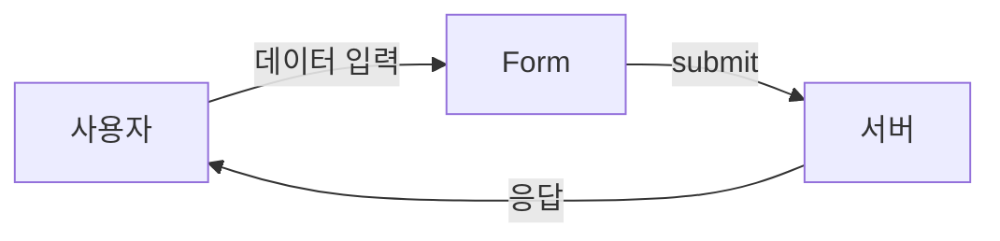
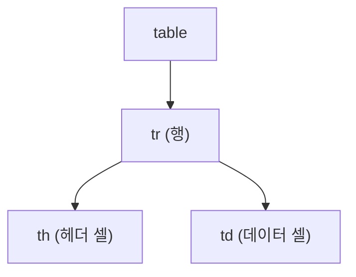

# 1. Forms & Table 태그

## 1.1 Forms

폼(Form)은 웹 페이지에서 **사용자로부터 데이터를 수집하고 서버로 전송**하는 데 사용되는 HTML 요소입니다. 로그인, 회원 가입, 검색, 설문조사 등 다양한 상호작용을 구현할 때 폼을 활용합니다.



### 1.1.1 form 태그

`<form>` 태그는 폼을 구성하는 **컨테이너** 역할을 합니다. 이 태그 내부에는 다양한 입력 요소들을 배치할 수 있습니다.

| 속성 | 설명 |
| --- | --- |
| `action` | 폼 데이터를 처리할 서버의 URL |
| `method` | 데이터 전송 방식 (GET 또는 POST) |

**GET vs POST:**
- **GET**: URL에 데이터가 노출됨, 데이터 조회용
- **POST**: URL에 데이터 미노출, 데이터 생성/수정용

```html
<form action="/login" method="POST">
  <!-- 폼 요소들 -->
</form>
```

### 1.1.2 input 태그

`<input>` 태그는 사용자로부터 데이터를 입력받는 가장 기본적인 HTML 요소입니다. 다양한 형태의 입력을 지원합니다.

| 속성 | 설명 |
| --- | --- |
| `type` | 입력 필드의 유형 (text, password, checkbox, radio 등) |
| `name` | 서버로 전송될 때 사용되는 필드 이름 |
| `id` | label 요소와 연결하기 위한 고유 식별자 |

**주요 input type:**
| type | 용도 |
| --- | --- |
| `text` | 일반 텍스트 입력 |
| `password` | 비밀번호 입력 (마스킹 처리) |
| `checkbox` | 다중 선택 |
| `radio` | 단일 선택 |
| `file` | 파일 업로드 |
| `submit` | 폼 제출 버튼 |

:::div{.htmlPlay}

```html
<input type="text" id="username" name="username" />
<input type="password" id="password" name="password" />
<input type="checkbox" id="remember" name="remember" />
<input type="radio" id="gender-male" name="gender" value="male" />
```

:::

### 1.1.3 label 태그

`<label>` 태그는 입력 필드의 설명을 제공하고, 해당 레이블을 클릭하면 연결된 입력 요소에 포커스가 맞춰지도록 합니다. 이는 사용자가 손쉽게 입력 필드를 선택할 수 있게 하며, 폼의 사용성을 크게 향상시킵니다.

- **for 속성**: 이 속성은 `<label>`이 설명하는 입력 요소의 ID를 지정합니다. for 속성의 값은 해당 입력 요소의 id 속성값과 일치해야 합니다.

:::div{.htmlPlay}

```html
<label for="username">아이디:</label>
<input type="text" id="username" name="username" />

<label for="password">비밀번호:</label>
<input type="password" id="password" name="password" />
```

:::

### 1.1.4 button 태그

사용자가 클릭하여 상호작용 할 수 있는 요소입니다. form 내부뿐만 아니라 버튼이 필요한 곳이라면 어디에든 배치할 수 있습니다.
:::div{.htmlPlay}

```html
<button>접속하기</button>
```

:::
:::div{.callout}

**a 태그 vs button 태그**

| 태그 | 용도 |
| --- | --- |
| `<a>` | 다른 페이지 또는 페이지 내 특정 영역으로 **이동** |
| `<button>` | 사용자의 동작 실행을 위한 **트리거** (JS와 함께 사용) |

:::

### 1.1.5 폼 예제

다음은 간단한 로그인 폼의 예제입니다. 사용자의 이름과 비밀번호를 입력받아 서버로 전송하는 폼을 구현합니다.

:::div{.htmlPlay}

```html
<form action="/login" method="POST">
  <label for="username">아이디:</label>
  <input type="text" id="username" name="username" />

  <label for="password">비밀번호:</label>
  <input type="password" id="password" name="password" />

  <button type="submit">로그인</button>
</form>
```

:::

이 폼은 아이디와 비밀번호를 입력받아, 제출 시 `/login` URL로 POST 방식으로 데이터를 전송합니다.

좀 더 다양한 형태의 입력 요소를 사용해 보도록 하겠습니다.

:::div{.htmlPlay}

```html
<form>
  <label for="username">텍스트 input:</label>
  <input type="text" id="username" name="username" /><br />

  <label for="password">비밀번호 input:</label>
  <input type="password" id="password" name="password" /><br />

  <label for="file">파일 input:</label>
  <input type="file" id="file" name="file" /><br />

  <label for="checkbox">체크박스 input:</label>
  <input type="checkbox" id="checkbox" name="checkbox" /><br />

  <label for="radio">라디오 버튼 input:</label>
  <input type="radio" id="radio" name="radio" /><br />

  <label for="submit">제출 버튼:</label>
  <button type="submit" id="submit">제출</button>
</form>
```

:::

---

## 2. Table

테이블(table)은 **정보를 구조화하여 표현**하는 데 사용되는 HTML 요소입니다. 데이터를 행과 열로 정렬하여 보여주며, 다양한 정보를 시각적으로 이해하기 쉽게 만들어 줍니다.



:::div{.callout}

**격자무늬 레이아웃은 테이블 사용하면 안 되나요?**

과거에는 테이블을 이용하여 웹 페이지의 레이아웃을 구성하기도 했지만, 현대적인 웹 개발에서는 CSS를 사용하여 레이아웃을 구성하는 것이 일반적입니다. 테이블은 주로 데이터를 표현하는 용도로 사용됩니다.

지금은 격자무늬 레이아웃을 만들기 위해 테이블을 사용하지 않는 것이 좋습니다. 대신, CSS의 그리드(grid)나 플렉스(flex)를 활용하여 레이아웃을 구성하는 것이 좋습니다.

:::

### 2.1. 테이블 구성 요소

| 태그 | 이름 | 설명 |
| --- | --- | --- |
| `<table>` | table | 테이블 전체를 감싸는 컨테이너 |
| `<tr>` | table row | 테이블의 행을 정의 |
| `<th>` | table header | 헤더 셀 (굵은 글씨, 가운데 정렬) |
| `<td>` | table data | 데이터 셀 |
| `<caption>` | caption | 테이블의 제목/설명 |

### 2.2. 테이블 예제

다음은 간단한 테이블의 예제입니다.

:::div{.htmlPlay}

```html
<table>
  <caption>
    학생 성적표
  </caption>
  <tr>
    <th>학생</th>
    <th>영어</th>
    <th>수학</th>
  </tr>
  <tr>
    <td>라이캣</td>
    <td>100</td>
    <td>90</td>
  </tr>
  <tr>
    <td>로지</td>
    <td>80</td>
    <td>90</td>
  </tr>
  <tr>
    <td>평균</td>
    <td>90</td>
    <td>90</td>
  </tr>
</table>
```

```css
table {
  width: 100%;
  border-collapse: collapse;
  margin-bottom: 20px;
}
th,
td {
  border: 1px solid #ddd;
  padding: 8px;
  text-align: left;
}
th {
  background-color: #f2f2f2;
}
caption {
  caption-side: top;
  font-weight: bold;
  font-size: 1.2em;
  margin-bottom: 10px;
}
```

:::

이 예제에서는 `<table>` 태그를 사용하여 테이블을 만들고, `<tr>` 태그로 행을 정의합니다. 첫 번째 행에는 `<th>` 태그를 사용하여 헤더 셀을 만들고, 나머지 행에는 `<td>` 태그를 사용하여 데이터 셀을 만듭니다. CSS를 사용하여 테이블의 스타일을 지정할 수 있습니다.

# 웹사이트 참고하기

::a[위니브 부트캠프]{class="btn-link" href="https://bootcamp.weniv.co.kr/" target="\_blank"}

::a[MDN Web Docs]{class="btn-link" href="https://developer.mozilla.org/ko/" target="\_blank"}
