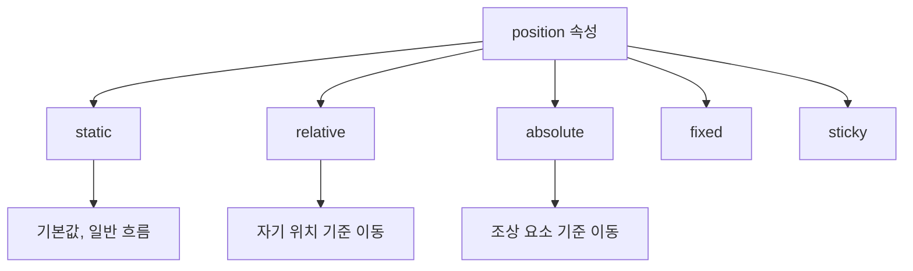

# 1. CSS position 속성

<highlight>`position` 속성은 요소를 어떻게, 어디에 배치할지 결정합니다.</highlight> 복잡한 레이아웃을 구성할 때 유용하게 사용됩니다. 이번 장에서는 자주 사용되는 `static`, `relative`, `absolute` 속성에 대해 알아보겠습니다.



| 값 | 기준점 | 흐름에서 제거 | 설명 |
| --- | --- | --- | --- |
| `static` | 없음 | X | 기본값, 일반 문서 흐름 |
| `relative` | 자기 자신 | X | 원래 위치 기준 이동 |
| `absolute` | 조상 요소 | O | position이 static이 아닌 조상 기준 |
| `fixed` | 뷰포트 | O | 화면에 고정 |
| `sticky` | 스크롤 영역 | 조건부 | 스크롤 시 고정 |

## 1.1 static (기본값)

`static`은 `position` 속성의 기본값입니다. "정적인", "고정된" 상태를 의미합니다. html을 작성한 순으로 정상적인 흐름(normal flow)에 따라 위치가 지정되게 됩니다.

## 1.2 relative

`relative`는 요소를 상대적으로 배치합니다. "상대적인" 위치를 가지게 됩니다. 바로 자신이 있어야 하는 위치에 "상대적인" 것이죠. 다른 요소들과의 관계를 유지하면서 위치를 조정할 때 사용합니다. 다른 콘텐츠들의 위치에 영향을 미치지 않습니다.

:::div{.htmlPlay}

```html
<div>hello world</div>
<div class="relative-box">이 요소는 relative입니다.</div>
<div>hello world</div>
```

```css
div {
  width: 200px;
  border: 2px solid black;
}

.relative-box {
  position: relative;
  left: 10px;
  top: 10px;
  border: 2px solid red;
}
```

:::

## 1.3 absolute

<highlight>`absolute`는 요소를 절대적인 위치로 배치합니다.</highlight> 가장 가까운 조상 요소 중 `position` 속성이 `static`이 아닌 값을 가진 요소를 기준으로 위치를 잡습니다. 만약 그런 조상이 없다면, `body` 요소를 기준으로 위치를 잡습니다. 문서의 일반 흐름에서 제거되어 다른 요소의 레이아웃에 영향을 주지 않습니다.

:::div{.htmlPlay}

```html
<div class="container">
  <div class="absolute-box">이 요소는 absolute입니다.</div>
</div>
```

```css
.container {
  position: relative;
  height: 100px;
  border: 2px solid black;
}
.absolute-box {
  position: absolute;
  right: 10px;
  bottom: 10px;
  border: 2px solid blue;
  padding: 5px;
}
```

:::

여기에 언급된 것 말고도 `sticky`, `fixed` 등 다양한 속성이 있습니다.
