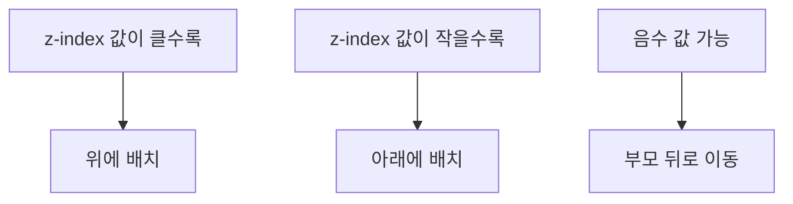

# 1. 3차원 공간에서의 요소 배치

웹 페이지는 기본적으로 2차원 평면이지만, 요소들이 겹칠 때는 3차원적인 고려가 필요합니다. <highlight>이때 사용하는 것이 바로 `z-index` 속성입니다.</highlight> `z-index`는 요소의 쌓임 순서(stacking order)를 결정하며, 어떤 요소가 다른 요소 위에 나타날지를 제어합니다. 이는 파워포인트와 같은 프로그램에서 `맨 앞으로 가져오기`와 같은 기능이라고 생각하시면 됩니다.




## 1.1 z-index의 기본 특성

오직 static을 제외한 position 속성값이 적용된 요소의 Z축 순서를 결정할 수 있으며, z-index 값이 더 큰 요소가 값이 작은 요소의 위를 덮어버리게 됩니다.

또한 부모가 z-index를 높여 자식 앞으로 나올 수 없습니다. 자식은 z-index를 낮춰 부모 뒤로 가는 것은 가능합니다.

아래 예제에서 `z-index`를 사용해 보겠습니다. red 박스가 가장 위에 있고, green 박스가 그다음, blue 박스가 가장 아래에 있습니다. 이 box의 순서를 바꾸어 보세요.

:::div{.htmlPlay}

```html
<div class="container">
  <div class="box red">Red Box</div>
  <div class="box green">Green Box</div>
  <div class="box blue">Blue Box</div>
</div>
```

```css
.container {
  position: relative;
  height: 200px;
}
.box {
  position: absolute;
  width: 100px;
  height: 100px;
  border: 2px solid black;
  display: flex;
  align-items: center;
  justify-content: center;
}
.red {
  background-color: rgba(255, 0, 0, 0.8);
  top: 40px;
  left: 40px;
  z-index: 3;
}
.green {
  background-color: rgba(0, 255, 0, 0.8);
  top: 80px;
  left: 80px;
  z-index: 2;
}
.blue {
  background-color: rgba(0, 0, 255, 0.8);
  top: 120px;
  left: 120px;
  z-index: 1;
}
```

:::

**[정리]**

| 특성 | 설명 |
| --- | --- |
| 적용 대상 | `position`이 `static`이 아닌 요소 |
| 값이 클수록 | 위에 배치 |
| 부모-자식 관계 | 부모는 자식 앞으로 나올 수 없음 |
| 음수 값 | 자식이 부모 뒤로 갈 수 있음 |
| 유지보수 팁 | 10이나 100 단위로 작업 권장 |

::a[z-index - CSS: Cascading Style Sheets | MDN]{class="btn-link" href="https://developer.mozilla.org/ko/docs/Web/CSS/z-index" target="\_blank"}
