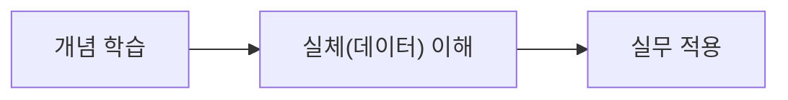

# 1. 강의 특징

## 1.1 이론과 실습의 균형

- 이론만 설명하는 것이 아니라 실습을 통해 **실무에서 어떤 지식이 필요한지 함께 설명**합니다.

## 1.2 실체 중심의 학습

- 개념보다는 **실체**(데이터)에 대해 이야기합니다. 우리와 밀접하게 연관이 있는 것은 개념이 아니라 실체(데이터)입니다. 예를 들어 OSI 7 Layer에 대한 개념을 잘 안다고 해서 실무의 코드 작성 능력이 올라가는 것은 아닙니다. 그러나 실제로 주고받는 데이터(패킷)가 무엇인지 알면 실무에서 활용할 수 있습니다. 따라서 개념보다는 실체(데이터)에 대한 이야기를 좀 더 비중 있게 다룹니다.

## 1.3 코드를 통한 실습

- Python, HTML, CSS, JS 코드를 통해 실제 어떠한 값을 주고받는지 **출력해보며 살펴**봅니다.
  - 다만 이 수업이 Python, HTML, CSS, JS 수업이 아니므로 코드를 라인별로 해석하기보다는 출력 결과를 주로 살펴보며 이야기 나눕니다.
  - 따라서 실습하는 언어를 몰라도 크게 문제가 되지 않습니다.

## 1.4 내장 모듈 중심

- 프레임워크나 외부 라이브러리 의존도를 최소화하고 가능하면 내장 모듈을 사용하여 살펴봅니다.

## 1.5 교안 제공

- 이 교안은 위니북스로도 제공됩니다.

::a[위니북스]{class='btn-link' href="https://www.books.weniv.co.kr/" target="\_blank"}