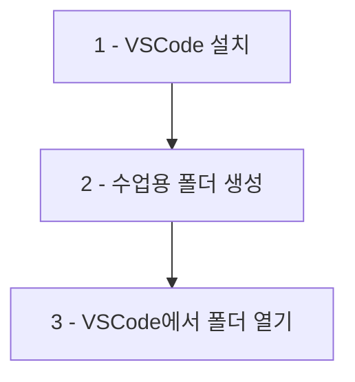

# 1. 수업 실습 환경

:::div{.callout}

사용하고 계신 브라우저와 IDE를 사용하셔도 좋으나, 설명은 아래 도구를 기준으로 진행합니다.

:::

## 1.1 필수 도구

::a[Chrome 웹브라우저]{class='btn-link' href="https://www.google.com/intl/ko_kr/chrome/" target="\_blank"}

::a[VSCode(Visual Studio Code)]{class='btn-link' href="https://code.visualstudio.com/" target="\_blank"}

## 1.2 환경 설정 순서

1. VSCode를 설치합니다.

2. 바탕화면에 수업용 새 폴더를 생성합니다.

3. VSCode에서 해당 폴더를 열어줍니다. (폴더 드래그 앤 드롭 또는 `File > Open Folder`)
