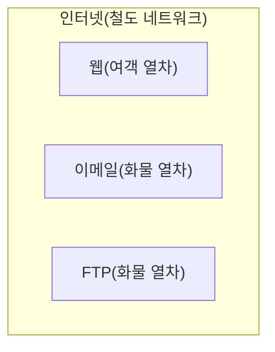

# 2. 웹과 인터넷

## 2.1 웹(Web)이란?

### 2.1.1 웹과 인터넷의 차이

**World Wide Web**(WWW)은 인터넷(거대한 네트워크 망)과 동일한 개념이 아닙니다.

비유를 하자면 인터넷은 철도 네트워크와 같습니다. 철도 위에는 다양한 종류의 열차가 운행되는데, 그중 하나가 바로 웹이라고 할 수 있습니다. 웹은 KTX, 새마을호, 무궁화호와 같은 여객 열차에 비유할 수 있습니다. 이 열차에 탑승한 승객은 대부분 웹 페이지입니다. 웹 페이지 외에도 음성 파일, 이미지 등이 승객에 해당됩니다.

하지만 철도 위에는 여객 열차만 운행되는 것이 아닙니다. 화물을 실어 나르는 화물 열차도 있습니다. 이는 인터넷상에서 웹 이외의 다른 서비스들, 예를 들어 이메일, FTP 등을 의미합니다. 이들은 웹과는 다른 기술을 사용하여 동작합니다.

### 2.1.2 웹의 정의

- 웹은 인터넷을 통해 정보를 공유하고 다양한 서비스를 이용할 수 있게 해주는 **서비스**입니다.
- 웹은 **웹 페이지**라고 불리는 문서들의 모음으로 구성되어 있는 전 세계적인 정보 서비스입니다.
- 이 웹 페이지는 **하이퍼텍스트**를 이용하여 연결됩니다. 하이퍼텍스트는 하이퍼링크, 우리가 흔히 부르는 **링크**를 포함하고 있습니다.

### 2.1.3 웹의 구성 요소

추후에도 상세히 다루겠지만, 여기서 웹의 중요 구성 요소에 대해 간단히 살펴보겠습니다.

#### 웹 페이지의 중요 구성 요소

| 구성 요소 | 역할 |
|-----------|------|
| **HTML**(Hypertext Markup Language) | 웹 페이지의 구조와 내용을 정의 |
| **CSS**(Cascading Style Sheets) | 웹 페이지의 디자인과 레이아웃을 정의 |
| **JavaScript** | 웹 페이지의 동적인 기능을 구현 |

#### 웹의 중요 구성 요소

| 구성 요소 | 역할 |
|-----------|------|
| **URL**(Uniform Resource Locator) | 웹상의 자원 위치를 나타내는 주소 |
| **HTTP**(Hypertext Transfer Protocol) | 웹 브라우저와 웹 서버 간의 통신 규약(통신 약속) |
| **DNS**(Domain Name System) | 도메인 이름을 IP 주소로 변환하는 시스템 |
| **웹 서버** | 클라이언트의 요청을 받아 처리하고 응답을 반환하는 서버 |
| **웹 브라우저** | 사용자가 웹 페이지를 요청하고 받은 응답을 해석하여 보여주는 프로그램 |
