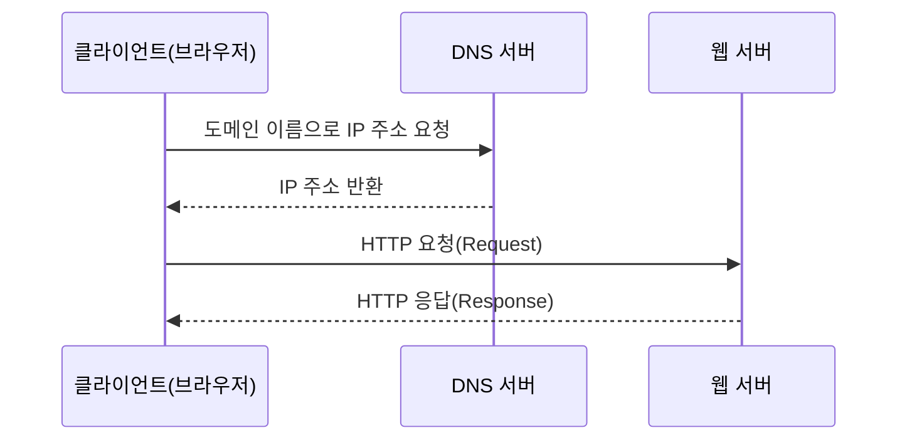
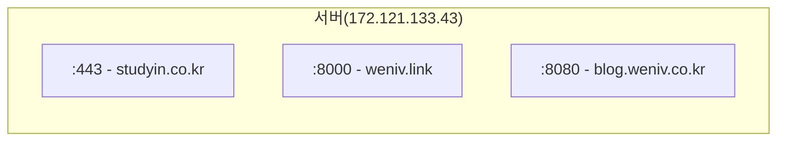

## 2.2 웹의 동작


### 2.2.1 요청과 응답

브라우저 주소 입력란에 URL을 입력하면 브라우저는 서버에게 해당 주소에 대한 리소스(파일 등의 정보)를 **요청**(Request)하고, 웹 서버는 **응답**(Response)을 통해 리소스를 전송합니다.



### 2.2.2 DNS와 IP 주소

클라이언트가 서버를 찾아가려면 주소(IP)가 있어야 하는데, 그 주소는 DNS에 있습니다.

### 2.2.3 포트(PORT)의 개념

같은 서버에도 여러 웹 페이지가 있을 수 있습니다. 예를 들어 아래와 같이 매핑할 수 있습니다. (실제로 서비스가 아래 IP들과 매핑되어 있는 상태는 아닙니다.)

```
https://www.studyin.co.kr/ ⇒ 172.121.133.43:443
https://weniv.link/ ⇒ 172.121.133.43:8000
https://blog.weniv.co.kr/  ⇒ 172.121.133.43:8080
```

이렇게 각기 다른 URL을 하나의 도메인(URL)과 주소(IP)에서 PORT만 다르게 하여 서비스하는 것이 가능합니다. 다만 PORT 개념을 이해하기 위한 예제일 뿐 일반적인 구성은 아닙니다.


