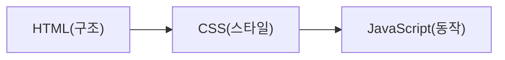

# 3. 웹상에서 프로그래밍 언어 역할


웹 페이지를 구성하는 핵심 기술인 HTML, CSS, JavaScript의 역할을 알아보겠습니다.



## 3.1 HTML

**HyperText Markup Language**의 약자입니다.

| 용어 | 설명 |
|------|------|
| **HyperText**(하이퍼텍스트) | 정해진 순서 없이 '참조'를 통해 한 문서에서 다른 문서로 이동할 수 있는 텍스트 |
| **Markup Language**(마크업 언어) | 태그 등을 이용하여 문서나 데이터의 구조를 표시하는 언어 |

- HTML은 프로그래밍 언어가 아닌 콘텐츠의 구조를 정의하는 마크업 언어입니다.
- 웹을 이루는 가장 기초적인 구성 요소로, **웹 콘텐츠의 의미와 구조를 정의**합니다.
- 확장자: `.html`

```html
<h1>hello world</h1>
```

## 3.2 CSS

**Cascading Style Sheets**의 약자입니다.

- **웹 페이지의 모양/표현**을 담당합니다.
- 확장자: `.css`

```css
h1 {
  color: red;
}
```

## 3.3 JavaScript

- **웹 페이지의 기능/동작**을 담당합니다.
- 확장자: `.js`

```javascript
window.alert('hello world'); // 엄밀히 말하면 JS는 아니고 BOM이긴 합니다.
```
