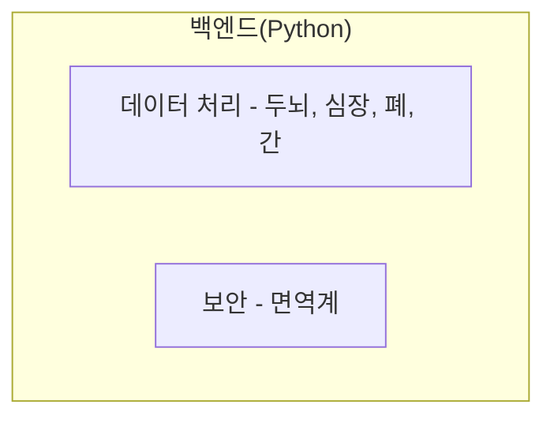

## 3.4 Python


### 3.4.1 백엔드에서의 Python 역할

- **웹 페이지의 데이터 처리 담당**
- 눈에 보이지는 않지만 핵심 기능을 수행하고 처리하는 중요한 역할을 수행합니다.
- 확장자: `.py` (백엔드는 더 다양한 언어로 처리가 가능합니다.)



### 3.4.2 간단한 HTTP 서버 예제

아래는 Python의 내장 모듈만으로 간단한 HTTP 서버를 구현한 예제입니다.

```python
from http.server import BaseHTTPRequestHandler, HTTPServer
import os

class SimpleHTTPRequestHandler(BaseHTTPRequestHandler):
    def do_GET(self):
        if self.path == '/':
            self.path = '/index.html'

        try:
            file_to_open = open(self.path[1:]).read()
            self.send_response(200)
        except:
            file_to_open = "File not found"
            self.send_response(404)

        self.end_headers()
        self.wfile.write(bytes(file_to_open, 'utf-8'))

def run(port=8080):
    server_address = ('', port)
    httpd = HTTPServer(server_address, SimpleHTTPRequestHandler)
    print(f'Server running on port {port}')
    httpd.serve_forever()

if __name__ == '__main__':
    run()
```

:::div{.callout}
**주요 용어 정리**

| 용어 | 설명 |
|------|------|
| 클라이언트 | 서비스를 요청하는 컴퓨터(또는 프로그램). 웹 브라우저를 통해 서버에 접속하는 사용자의 디바이스를 의미 |
| 서버 | 클라이언트의 요청에 따라 서비스를 제공하는 컴퓨터(또는 프로그램) |

**프론트엔드와 백엔드의 역할**

| 영역 | 기술 | 역할 |
|------|------|------|
| FE | HTML | 데이터를 구조화 |
| FE | CSS | 스타일 시트 |
| FE | JavaScript | 사용자와 상호작용 또는 데이터 컨트롤 |
| BE | Python | HTML, CSS, JS 코드를 상태 코드 등과 함께 사용자에게 전달 |
:::