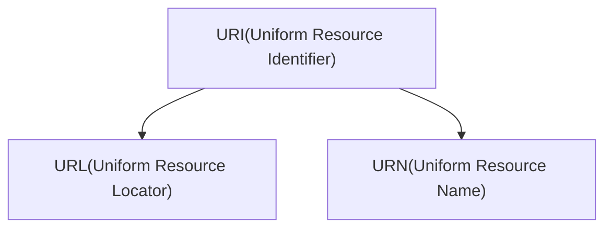

# 4. URL 개념과 활용

URI, URL, URN의 차이점을 알아보겠습니다.

## 4.1 URI(Uniform Resource Identifier) - 통합 자원 식별자

URI는 위치(Locator), 이름(Name) 또는 둘 다 추가로 분류될 수 있습니다.

### 4.1.1 URI, URL, URN 비교

| 구분 | 설명 | 예시 |
|------|------|------|
| **URI** | 리소스를 식별하는 통일된 방식 | `urn:isbn:1234567890`, `http://example.com/page.html` |
| **URL** | 리소스가 있는 **위치**를 지정 | `http://example.com/page.html`, `ftp://example.com/file.zip` |
| **URN** | 리소스에 **이름**을 부여 | `urn:isbn:0-486-27557-4`, `urn:uuid:f81d4fae-7dec-11d0-a765-00a0c91e6bf6` |

### 4.1.2 URI 구성 요소

| 구성 요소 | 설명 |
|-----------|------|
| **Uniform** | 리소스 식별하는 통일된 방식 |
| **Resource** | 자원, URI로 식별할 수 있는 모든 것(제한 없음) |
| **Identifier** | 다른 항목과 구분하는 데 필요한 정보 |

:::div{.callout}
**위치(주소)는 변할 수 있지만, 이름(URN)은 변하지 않는다!**

`Name: 위니브` / `Locator: 제주 제주시 첨단로 330`

"택시 기사님 `위니브`로 가주세요!"라고 말하면 주소가 변해도 그곳으로 갑니다.
:::

## 4.2 URL(Uniform Resource Locator)

- 웹 사이트를 표시하기 위해 입력하는 주소를 말합니다.
  - 웹상에서는 실질적으로 `주소`가 아니라 `이름` 역할을 합니다.
  - `/about.html`로 접속했다고 해서 실제 불러온 값이 `/about.html`임을 보장하지는 않습니다.
- 자원이 어디 있는지를 알려주기 위한 규약입니다.
- 흔히 웹사이트 주소로 알고 있지만, **URL은 웹사이트 주소뿐만 아니라 컴퓨터 네트워크상의 자원을 모두 나타낼 수 있습니다.**

:::figure
::img{src="/images/basecamp-fastapi/chapter02/02-5.png"}
::figcaption[https://nodejs.org/api/url.html#url]
:::

### 4.2.1 포트 번호 범위

| 범위 | 이름 | 설명 |
|------|------|------|
| 0번 ~ 1023번 | 잘 알려진 포트(well-known port) | HTTP(80), HTTPS(443) 등 |
| 1024번 ~ 49151번 | 등록된 포트(registered port) | 특정 애플리케이션용 |
| 49152번 ~ 65535번 | 동적 포트(dynamic port) | 임시 연결용 |
