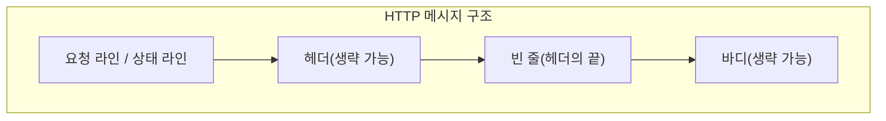

# 5. HTTP

## 5.1 HTTP란?

**HTTP**(HyperText Transfer Protocol)는 클라이언트와 서버 간에 데이터를 주고받기 위한 약속(프로토콜)입니다.

:::div{.callout}
**Protocol(프로토콜)** - 약속

- 데이터가 전송되는 방식을 결정하는 규약입니다.
- 송/수신자 사이의 합의를 통해 '데이터 포맷, 오류 제어 등의 규칙은 우리가 서로 **합의한 형식**으로 주고받자!'와 같이 서로 통신할 때 이해할 수 있는 규칙을 만든 것을 의미합니다.
:::

### 5.1.1 HTTP의 특징

- 웹에서 이뤄지는 데이터 통신의 기초이며, 주로 TCP를 사용합니다.
- HTML, XML, JavaScript, 오디오, 비디오, 이미지, PDF 등 다양한 형태의 데이터를 전송할 수 있습니다.
- 주고받는 데이터는 개발자 도구의 Network 탭에서 확인할 수 있습니다.

### 5.1.2 HTTP 버전

| 버전 | 출시년도 | 설명 |
|------|----------|------|
| **HTTP/1.1** | 1997년 | 현재 가장 많이 사용되는 버전 |
| HTTP/2 | 2015년 | 성능 개선, 점진적 도입 중 |
| HTTP/3 | 2022년 | UDP 기반, 점진적 도입 중 |

RFC(Request for Comments)는 인터넷 표준을 정의하는 문서 시리즈로, HTTP는 RFC2068(1997년)부터 계속 발전해왔습니다.

### 5.1.3 HTTPS

**HTTPS**(HTTP + Secure)는 HTTP에 보안 기능을 추가한 프로토콜입니다.

## 5.2 HTTP 메시지 구조

HTTP 요청과 응답은 다음의 형식을 따릅니다.



:::div{.callout}
상세 내용은 메시지 구조 챕터에서 다룹니다. 형태만 봐주세요.
:::


### 5.2.1 HTTP 요청 메시지 구조

```
GET /index.html HTTP/1.1
Host: www.example.com
User-Agent: Mozilla/5.0 (Windows NT 10.0; Win64; x64; rv:93.0) Gecko/20100101 Firefox/93.0
Accept: text/html,application/xhtml+xml,application/xml;q=0.9,image/avif,image/webp,*/*;q=0.8
Accept-Language: en-US,en;q=0.5
Accept-Encoding: gzip, deflate, br
Connection: keep-alive
```

| 구성 요소 | 내용 |
|-----------|------|
| 요청 라인 | `GET /index.html HTTP/1.1` |
| 헤더 | `Host`, `User-Agent`, `Accept`, `Accept-Language`, `Accept-Encoding`, `Connection` |
| 빈 줄 | 헤더 다음의 빈 줄 |
| 바디 | 이 GET 요청에는 바디가 없습니다. |

### 5.2.2 HTTP 응답 메시지 구조

```html
HTTP/1.1 200 OK
Date: Fri, 29 Mar 2023 10:30:00 GMT
Server: Apache/2.4.41(Ubuntu)
Last-Modified: Thu, 28 Mar 2023 12:00:00 GMT
Content-Type: text/html
Content-Length: 1234
Connection: keep-alive

<!DOCTYPE html>
<html lang="en">
  <head>
    <meta charset="UTF-8" />
    <title>Example Page</title>
  </head>
  <body>
    <h1>Welcome to Example Page</h1>
    <p>This is a sample HTML page.</p>
  </body>
</html>
```

| 구성 요소 | 내용 |
|-----------|------|
| 상태 라인 | `HTTP/1.1 200 OK` |
| 헤더 | `Date`, `Server`, `Last-Modified`, `Content-Type`, `Content-Length`, `Connection` |
| 빈 줄 | 헤더 다음의 빈 줄 |
| 바디 | HTML 내용 |

## 5.3 요청 라인, 상태 라인, 헤더 정보 상세

HTTP 헤더에 들어가는 정보의 상세입니다. 모두 외우기보다는 필요할 때 하나씩 찾아서 공부하시는 것을 권장합니다.

### 5.3.1 요청 라인

HTTP 요청 메시지의 첫 번째 줄로, 클라이언트가 서버에 요청하는 내용을 나타냅니다.

| 구성 요소 | 설명 |
|-----------|------|
| HTTP 메서드 | 수행할 작업의 종류 (GET, POST, PUT, DELETE 등) |
| 요청 대상(Request-URI) | 요청하는 리소스의 경로 (절대/상대 경로 또는 절대 URI) |
| HTTP 버전 | 사용 중인 HTTP 프로토콜 버전 (예: HTTP/1.1, HTTP/2) |

### 5.3.2 상태 라인

HTTP 응답 메시지의 첫 번째 줄로, 요청에 대한 서버의 처리 결과를 나타냅니다.

| 구성 요소 | 설명 |
|-----------|------|
| HTTP 버전 | 사용 중인 HTTP 프로토콜 버전 |
| 상태 코드(Status Code) | 요청 처리 결과를 나타내는 3자리 숫자 (1xx, 2xx, 3xx, 4xx, 5xx) |
| 상태 메시지(Reason Phrase) | 상태 코드에 대한 간략한 설명 |

### 5.3.3 주요 헤더 정보

| 헤더 | 설명 | 예시 |
|------|------|------|
| Date | 서버가 응답을 생성한 날짜와 시간 | `Date: Fri, 29 Mar 2023 10:30:00 GMT` |
| Server | 서버 소프트웨어의 이름과 버전 | `Server: Apache/2.4.41 (Ubuntu)` |
| Last-Modified | 리소스가 마지막으로 수정된 날짜와 시간 | `Last-Modified: Thu, 28 Mar 2023 12:00:00 GMT` |
| Content-Type | 응답 본문의 미디어 타입 | `Content-Type: text/html; charset=UTF-8` |
| Content-Length | 응답 본문의 바이트 길이 | `Content-Length: 1234` |
| Connection | 네트워크 접속 유지 여부 | `Connection: keep-alive` |
| Accept | 클라이언트가 허용하는 콘텐츠 타입 | `Accept: text/html,application/xml;q=0.9` |
| Accept-Language | 클라이언트가 선호하는 언어 | `Accept-Language: en-US,en;q=0.5` |
| Accept-Encoding | 클라이언트가 허용하는 인코딩 방식 | `Accept-Encoding: gzip, deflate, br` |
| User-Agent | 클라이언트 소프트웨어 정보 | `User-Agent: Mozilla/5.0...` |
