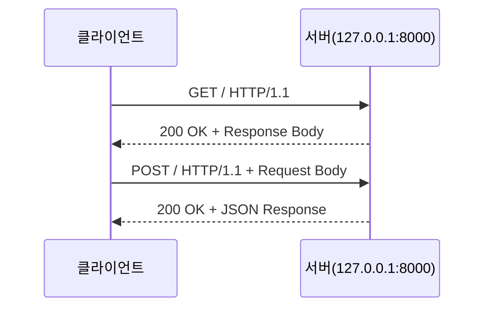

## 5.4 실습

HTTP 통신을 직접 실습해보겠습니다.

### 5.4.1 Python 서버 구동

다음 Python 코드로 간단한 HTTP 서버를 구동할 수 있습니다.

```python
import socket
import json
from http.server import BaseHTTPRequestHandler, HTTPServer

class CustomHTTPRequestHandler(BaseHTTPRequestHandler):
    def do_OPTIONS(self):
        self.send_response(200)
        self.send_header("Access-Control-Allow-Origin", "*")
        self.send_header("Access-Control-Allow-Methods", "GET, POST, OPTIONS")
        self.send_header("Access-Control-Allow-Headers", "Content-Type")
        self.end_headers()

    def do_GET(self):
        self.send_response(200)
        self.send_header("Access-Control-Allow-Origin", "*")
        self.send_header("Content-type", "text/plain")  # 실습1
        # self.send_header("Content-type", "text/html")  # 실습2
        # -- 실습3 --
        # data = {
        #     "message": "Hello, World!",
        #     "status": "success"
        # }
        # json_data = json.dumps(data)
        # self.send_header('Content-type', 'application/json')
        # -- //실습3 --
        self.end_headers()
        self.wfile.write(b"<h1>Hello, World!</h1>")
        # self.wfile.write(json_data.encode())  # 실습3

        print(
            f"Received GET request from {self.client_address[0]}:{self.client_address[1]}"
        )
        print(f"Request Headers:\n{self.headers}")
        print(f"Request Method: {self.command}")
        print(f"Request Path: {self.path}")
        print(f"Request Version: {self.request_version}")

    def do_POST(self):
        content_length = int(self.headers["Content-Length"])
        post_data = self.rfile.read(content_length)

        self.send_response(200)
        self.send_header("Access-Control-Allow-Origin", "*")
        # self.send_header("Content-type", "text/plain")  # 실습1
        # self.send_header("Content-type", "text/html")  # 실습2
        self.send_header("Content-type", "application/json")
        self.end_headers()
        # self.wfile.write(b"Received POST request")  # 실습1
        # self.wfile.write(b"<h1>Hello, World!</h1>")  # 실습2
        data = {"message": "Received POST request", "status": "success"}
        json_data = json.dumps(data)
        self.wfile.write(json_data.encode())

        print(
            f"Received POST request from {self.client_address[0]}:{self.client_address[1]}"
        )
        print(f"Request Headers:\n{self.headers}")
        print(f"Request Method: {self.command}")
        print(f"Request Path: {self.path}")
        print(f"Request Version: {self.request_version}")
        print(f"Request Body:\n{post_data.decode()}")

def run_server(port=8000):
    server_address = ("", port)
    httpd = HTTPServer(server_address, CustomHTTPRequestHandler)
    print(f"Starting server on port {port}")
    httpd.serve_forever()

if __name__ == "__main__":
    run_server()
```

서버를 실행한 후 http://127.0.0.1:8000/ 에 접속하여 다음을 확인해보세요.

- HTML이 어떻게 접속되는지 확인
- header와 method 확인

### 5.4.2 HTML/JavaScript 코드를 통해 요청(Request)

주로 HTML이나 JavaScript에서 서버로 통신을 보내기에 이번 챕터에서는 Python으로 실습하지 않습니다.

#### JavaScript로 GET 요청 보내기

```javascript
fetch('http://127.0.0.1:8000/')
  .then((response) => response.json())
  .then((json) => console.log(json))
  .catch((error) => console.error(error));
```

#### JavaScript로 POST 요청 보내기

```javascript
fetch('http://127.0.0.1:8000/', {
  method: 'POST',
  headers: {
    'Content-Type': 'application/json',
  },
  body: JSON.stringify({
    title: 'test',
    content: 'test',
  }),
})
  .then((response) => response.json())
  .then((json) => console.log(json))
  .catch((error) => console.error(error));
```

#### HTML Form으로 GET과 POST 요청 보내기

```html
<h2>POST</h2>
<form action="http://127.0.0.1:8000" method="post">
    <input type="text" name="username" value="hellopost">
    <input type="password" name="password" value="worldpost">
    <input type="submit" value="Login">
</form>

<h2>GET</h2>
<form action="http://127.0.0.1:8000" method="get">
    <input type="text" name="username" value="helloget">
    <input type="password" name="password" value="worldget">
    <input type="submit" value="Login">
</form>
```


