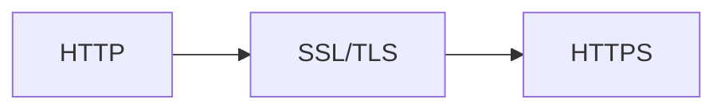

# 10. HTTPS

Wireshark를 통해 아래 홈페이지(**https**://paullab.co.kr/)와 통신하는 패킷을 잡아보도록 하겠습니다. 여러분이 실습하실 필요는 없습니다.

::a[바울랩, 위니브]{class='btn-link' href="https://paullab.co.kr/" target="\_blank"}

데이터는 Encrypted Application Data라는 곳에 담겨 확인할 수 없습니다. 도청(패킷 스니핑)을 하더라도 확인할 수가 없습니다.

## 10.1 HTTP + 암호화 + 인증 + 무결성 = HTTPS

**HTTP**(Hypertext Transfer Protocol)는 인터넷에서 웹 브라우저와 웹 서버 간에 데이터를 주고받기 위한 프로토콜입니다. 그러나 HTTP는 암호화되지 않은 평문 통신이기 때문에 도청이나 변조, 중간자 공격에 취약합니다.

이러한 HTTP의 취약점을 보완하기 위해 **HTTPS**(HTTP Secure)가 등장했습니다.

### 10.1.1 HTTPS의 특징

| 특징 | 설명 |
|------|------|
| **암호화** | SSL/TLS 프로토콜을 사용하여 **통신 내용을 암호화**. 중간에서 데이터를 가로채더라도 내용 확인 불가 |
| **인증** | SSL 인증서를 사용하여 통신 상대방의 신원 확인. 신뢰할 수 있는 인증 기관(CA)에서 발급받은 인증서 사용 |
| **무결성** | 해시 함수와 디지털 서명을 사용하여 데이터가 변조되지 않았음을 보장 |

### 10.1.2 프로토콜 스택 비교

| 프로토콜 | 구조 |
|----------|------|
| HTTP | HTTP → TCP → IP |
| HTTPS | HTTP → SSL/TLS → TCP → IP |

:::div{.callout}
SSL은 보안 취약점이 발견되어 업데이트된 버전이 TLS입니다. 그런데 대다수의 사람이 SSL 이름에 익숙하다 보니 이 이름이 아직도 함께 따라다니고 있습니다. SSL은 key를 통해 암호화와 복호화를 진행합니다.
:::
