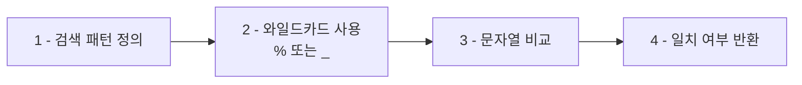
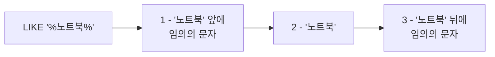

<highlight>LIKE 연산자는 텍스트 데이터에서 특정 패턴을 검색할 때 사용됩니다.</highlight> `=` 연산자로는 처리할 수 없는 **부분 일치 검색**을 수행할 수 있으며, 주로 와일드카드(`%`, `_`)와 함께 사용됩니다.



# 1. 와일드카드란?

<highlight>와일드카드는 특정 패턴을 검색할 때 사용하는 특수 문자입니다.</highlight> SQL에서는 두 가지 와일드카드를 제공합니다.

| 와일드카드 | 의미 | 예시 | 설명 |
|------------|------|------|------|
| `%` | 0개 이상의 문자 | `'%노트북%'` | '노트북' 앞뒤에 어떤 문자가 와도 됨 |
| `_` | 정확히 1개의 문자 | `'__준'` | 정확히 3글자이며 마지막이 '준'인 문자열 |

# 2. `%` 와일드카드 사용 예시

## 2.1 끝 부분 일치

다음 쿼리는 '스티커'**로 끝나는** 모든 상품명을 검색하는 예시입니다.

```sql
SELECT 상품명
FROM 상품
WHERE 상품명 LIKE '%스티커';
```

::a[실습환경 바로가기]{class='btn-link' href="https://sql.weniv.co.kr/?code=SELECT%20%EC%83%81%ED%92%88%EB%AA%85%0AFROM%20%EC%83%81%ED%92%88%0AWHERE%20%EC%83%81%ED%92%88%EB%AA%85%20LIKE%20%27%25%EC%8A%A4%ED%8B%B0%EC%BB%A4%27%3B" target="_blank"}

`%스티커`는 '스티커' 앞에 어떤 문자나 문자열이 와도 상관없다는 의미입니다. 예: '한정판 노트북 스티커', '귀여운 스티커'

## 2.2 포함 검색

다음 쿼리는 '노트북'**을 포함하는** 모든 상품명을 검색하는 예시입니다.

```sql
SELECT 상품명
FROM 상품
WHERE 상품명 LIKE '%노트북%';
```

::a[실습환경 바로가기]{class='btn-link' href="https://sql.weniv.co.kr/?code=SELECT%20%EC%83%81%ED%92%88%EB%AA%85%0AFROM%20%EC%83%81%ED%92%88%0AWHERE%20%EC%83%81%ED%92%88%EB%AA%85%20LIKE%20%27%25%EB%85%B8%ED%8A%B8%EB%B6%81%25%27%3B" target="_blank"}

`%노트북%`은 '노트북' 앞뒤에 어떤 문자가 와도 된다는 의미입니다. 예: '게이밍 노트북', '노트북 가방', '초경량 노트북 스탠드'

# 3. `_` 와일드카드 사용 예시

**언더스코어(_)는 정확히 하나의 문자를 대체**합니다. 문자의 개수를 정확히 지정하고 싶을 때 유용합니다.

다음 쿼리는 이름이 **정확히 3글자**이며 마지막 글자가 '준'인 모든 고객을 조회하는 예시입니다.

```sql
SELECT 이름
FROM 고객
WHERE 이름 LIKE '__준';
```

::a[실습환경 바로가기]{class='btn-link' href="https://sql.weniv.co.kr/?code=SELECT%20%EC%9D%B4%EB%A6%84%0AFROM%20%EA%B3%A0%EA%B0%9D%0AWHERE%20%EC%9D%B4%EB%A6%84%20LIKE%20%27__%EC%A4%80%27%3B" target="_blank"}

두 개의 밑줄(`__`)은 첫 두 문자가 무엇이든 상관없음을 나타냅니다. 예: '민준', '서준', '도준' (모두 3글자)

언더스코어를 하나만 사용하면 2글자인 이름을 검색할 수 있습니다.



# 4. NOT LIKE 사용

`LIKE` 연산자와 반대로, **특정 패턴을 제외한 데이터**를 검색하고 싶다면 `NOT LIKE`를 사용할 수 있습니다.

다음 쿼리는 '스피커'**로 끝나지 않는** 상품명을 검색하는 예시입니다.

```sql
SELECT 상품명
FROM 상품
WHERE 상품명 NOT LIKE '%스피커';
```

::a[실습환경 바로가기]{class='btn-link' href="https://sql.weniv.co.kr/?code=SELECT%20%EC%83%81%ED%92%88%EB%AA%85%0AFROM%20%EC%83%81%ED%92%88%0AWHERE%20%EC%83%81%ED%92%88%EB%AA%85%20NOT%20LIKE%20%27%25%EC%8A%A4%ED%94%BC%EC%BB%A4%27%3B" target="_blank"}

이 쿼리는 '스피커'로 끝나지 않는 모든 상품명을 조회합니다.

LIKE 연산자를 사용하면 **검색 기능, 필터링, 데이터 정제** 등 복잡한 패턴 매칭을 간단하게 수행할 수 있습니다.
