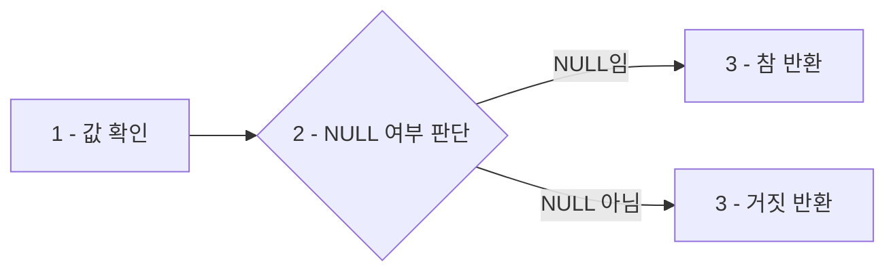
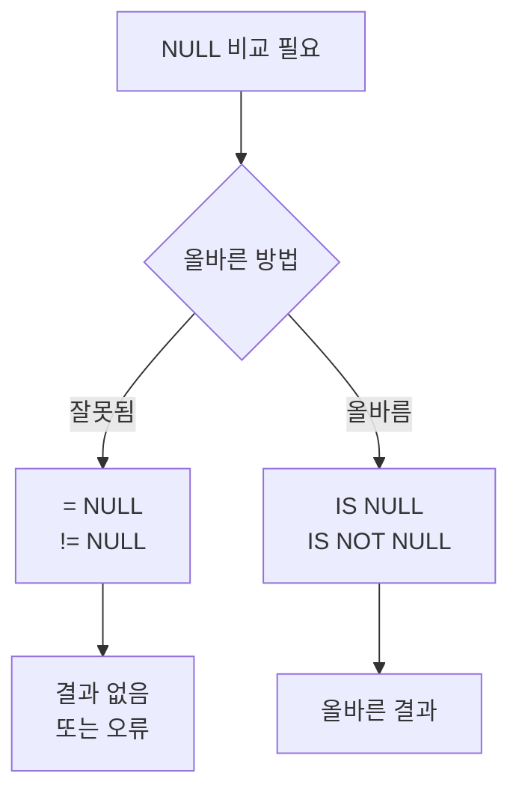

<highlight>IS NULL 연산자는 값이 NULL인 데이터를 조회할 때 사용됩니다.</highlight> **NULL은 값이 없음**을 의미하며, 단순히 빈 값이나 0이 아닌, **아예 값이 존재하지 않는 상태**를 나타냅니다.



<highlight>중요: = 연산자로는 NULL을 비교할 수 없기 때문에, 반드시 IS NULL 또는 IS NOT NULL을 사용해야 합니다.</highlight>

## 1.1 IS NULL 사용 예시

다음 쿼리는 상품의 설명이 없는(NULL 값인) 상품을 조회하는 예시입니다. 현재 데이터에는 설명이 비어있는 값이 없습니다.

```sql
SELECT 상품명, 설명
FROM 상품
WHERE 설명 IS NULL;
```
::a[실습환경 바로가기]{class='btn-link' href="https://sql.weniv.co.kr/?code=SELECT%20%EC%83%81%ED%92%88%EB%AA%85%2C%20%EC%84%A4%EB%AA%85%0AFROM%20%EC%83%81%ED%92%88%0AWHERE%20%EC%84%A4%EB%AA%85%20IS%20NULL%3B" target="_blank"}

NULL 데이터를 생성하기 위해 아래 코드를 실행할 수 있습니다.

:::div{.callout}
현재는 INSERT 구문 실행 시 값이 2개씩 들어가는 오류가 있습니다. 이 점 참고해주세요.
:::

```sql
INSERT INTO 상품 (상품ID, 상품명, 카테고리ID, 가격, 재고, 설명, 공급업체ID)
VALUES (31, '테스트 상품', 9, 100000, 10, NULL, 101);
```
::a[실습환경 바로가기]{class='btn-link' href="https://sql.weniv.co.kr/?code=INSERT%20INTO%20%EC%83%81%ED%92%88%20%28%EC%83%81%ED%92%88ID%2C%20%EC%83%81%ED%92%88%EB%AA%85%2C%20%EC%B9%B4%ED%85%8C%EA%B3%A0%EB%A6%ACID%2C%20%EA%B0%80%EA%B2%A9%2C%20%EC%9E%AC%EA%B3%A0%2C%20%EC%84%A4%EB%AA%85%2C%20%EA%B3%B5%EA%B8%89%EC%97%85%EC%B2%B4ID%29%0AVALUES%20%2831%2C%20%27%ED%85%8C%EC%8A%A4%ED%8A%B8%20%EC%83%81%ED%92%88%27%2C%209%2C%20100000%2C%2010%2C%20NULL%2C%20101%29%3B" target="_blank"}

위 코드를 실행한 후 다시 첫 번째 쿼리를 실행하면 설명이 비어있는 상품을 조회할 수 있습니다.

## 1.2 IS NOT NULL 사용 예시

반대로, **값이 NULL이 아닌 데이터**를 조회하고 싶을 때는 `IS NOT NULL`을 사용할 수 있습니다. 다음 쿼리는 설명이 있는 상품을 조회하는 예시입니다.

```sql
SELECT 상품명, 설명
FROM 상품
WHERE 설명 IS NOT NULL;
```

::a[실습환경 바로가기]{class='btn-link' href="https://sql.weniv.co.kr/?code=SELECT%20%EC%83%81%ED%92%88%EB%AA%85%2C%20%EC%84%A4%EB%AA%85%0AFROM%20%EC%83%81%ED%92%88%0AWHERE%20%EC%84%A4%EB%AA%85%20IS%20NOT%20NULL%3B" target="_blank"}

이 쿼리는 설명이 존재하는 상품들만 조회합니다.

## 1.3 NULL 처리 시 주의사항

<highlight>NULL은 값이 존재하지 않는 상태를 나타내므로, 수치 계산이나 문자열 비교 연산에서 예상치 못한 결과를 초래할 수 있습니다.</highlight> 예를 들어, NULL과의 비교는 항상 FALSE를 반환합니다.

다음 쿼리는 **NULL과의 직접 비교가 작동하지 않는** 예시입니다.

```sql
SELECT 상품명
FROM 상품
WHERE 설명 = NULL;  -- 잘못된 쿼리
-- WHERE 설명 != NULL;  -- 잘못된 쿼리
```

이 쿼리는 아무런 결과도 반환하지 않습니다.

**NULL 비교 규칙**

| 비교 | 결과 | 올바른 방법 |
|------|------|-------------|
| `설명 = NULL` | 항상 FALSE | `설명 IS NULL` |
| `설명 != NULL` | 항상 FALSE | `설명 IS NOT NULL` |
| `NULL = NULL` | FALSE | `IS NULL` 사용 |



실무에서는 **데이터 무결성 확인, 필수 입력 검증, 데이터 정제** 등에 IS NULL을 자주 사용합니다.
