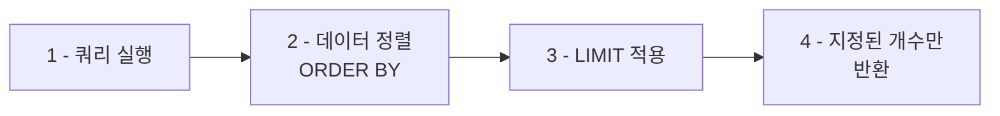

<highlight>LIMIT 구문은 쿼리 결과에서 반환할 행(Row)의 개수를 제한할 때 사용합니다.</highlight> 대량의 데이터에서 상위 N개만 조회하거나, 페이지네이션을 구현할 때 매우 유용합니다.



# 1. 기본 LIMIT 사용

다음은 가격이 높은 상위 5개의 상품을 조회하는 예시입니다.

```sql
SELECT 상품명, 가격
FROM 상품
ORDER BY 가격 DESC
LIMIT 5;
```

::a[실습환경 바로가기]{class='btn-link' href="https://sql.weniv.co.kr/?code=SELECT%20%EC%83%81%ED%92%88%EB%AA%85%2C%20%EA%B0%80%EA%B2%A9%0AFROM%20%EC%83%81%ED%92%88%0AORDER%20BY%20%EA%B0%80%EA%B2%A9%20DESC%0ALIMIT%205%3B" target="_blank"}

이 쿼리는 가격이 높은 순서대로 상위 5개의 상품을 조회합니다.

**정렬과 LIMIT 조합**
- `ORDER BY` 절로 데이터를 먼저 정렬
- `LIMIT`으로 반환되는 행의 개수를 제한
- `DESC`: 내림차순 정렬 (큰 값부터)
- `ASC`: 오름차순 정렬 (작은 값부터, 기본값)

# 2. OFFSET과 LIMIT 조합 사용

<highlight>LIMIT과 함께 OFFSET을 사용하면 결과 집합에서 특정 위치부터 행을 가져올 수 있습니다.</highlight> `OFFSET`은 건너뛸 행의 수를 지정하며, 그 이후부터 데이터를 가져옵니다. 다음은 10번째부터 상위 5개의 상품을 조회하는 예시입니다.

```sql
SELECT 상품명, 가격
FROM 상품
ORDER BY 가격 DESC
LIMIT 5 OFFSET 10;
```

::a[실습환경 바로가기]{class='btn-link' href="https://sql.weniv.co.kr/?code=SELECT%20%EC%83%81%ED%92%88%EB%AA%85%2C%20%EA%B0%80%EA%B2%A9%0AFROM%20%EC%83%81%ED%92%88%0AORDER%20BY%20%EA%B0%80%EA%B2%A9%20DESC%0ALIMIT%205%20OFFSET%2010%3B" target="_blank"}

이 쿼리는 10번째 행 이후의 상품 중 상위 5개의 상품을 조회합니다.