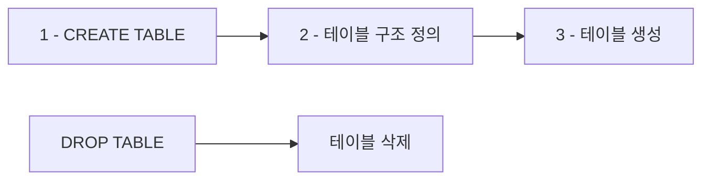

# 1. CREATE, DROP

**CREATE TABLE**과 **DROP TABLE**은 데이터베이스의 구조를 변경하는 DDL(Data Definition Language) 명령어입니다.

- **CREATE TABLE**: 새로운 테이블 생성
- **DROP TABLE**: 기존 테이블 삭제

:::div{.callout}
명령어가 2번씩 실행되어 테이블이 이미 존재한다는 에러가 발생하는데, 이는 정상작동한 것입니다.
:::



## 1.1 CREATE TABLE 사용

다음은 간단한 테이블을 생성하는 예시입니다.

```sql
CREATE TABLE sampledata_table (
    id INTEGER PRIMARY KEY, 
    name TEXT, 
    age INTEGER
);
```
::a[실습환경 바로가기]{class='btn-link' href="https://sql.weniv.co.kr/?code=CREATE%20TABLE%20sampledata_table%20%28%0A%20%20%20%20id%20INTEGER%20PRIMARY%20KEY%2C%20%0A%20%20%20%20name%20TEXT%2C%20%0A%20%20%20%20age%20INTEGER%0A%29%3B" target="_blank"}

테이블이 생성되었으니 데이터를 넣어보겠습니다.

```sql
INSERT INTO sampledata_table (name, age) VALUES ('Alice', 25);
INSERT INTO sampledata_table (name, age) VALUES ('Bob', 30);
INSERT INTO sampledata_table (name, age) VALUES ('Charlie', 35);
SELECT * FROM sampledata_table;
```
::a[실습환경 바로가기]{class='btn-link' href="https://sql.weniv.co.kr/?code=INSERT%20INTO%20sampledata_table%20%28name%2C%20age%29%20VALUES%20%28%27Alice%27%2C%2025%29%3B%0AINSERT%20INTO%20sampledata_table%20%28name%2C%20age%29%20VALUES%20%28%27Bob%27%2C%2030%29%3B%0AINSERT%20INTO%20sampledata_table%20%28name%2C%20age%29%20VALUES%20%28%27Charlie%27%2C%2035%29%3B%0ASELECT%20%2A%20FROM%20sampledata_table%3B" target="_blank"}

데이터가 잘 출력되는 것을 확인할 수 있습니다.

## 1.2 DROP TABLE 사용

이제 생성한 테이블을 삭제해보겠습니다.

```sql
DROP TABLE sampledata_table;
-- SELECT * FROM sampledata_table;
```
::a[실습환경 바로가기]{class='btn-link' href="https://sql.weniv.co.kr/?code=DROP%20TABLE%20sampledata_table%3B%0A--%20SELECT%20%2A%20FROM%20sampledata_table%3B" target="_blank"}

<highlight>주의: DROP TABLE은 테이블과 그 안의 모든 데이터를 영구적으로 삭제합니다. 복구할 수 없으므로 신중하게 사용해야 합니다.</highlight>

# 2. SHOW, DESC

**SHOW**와 **DESC**는 데이터베이스나 테이블 구조를 확인할 때 사용하는 명령어입니다.

<highlight>SQLite에서는 SHOW와 DESC가 지원되지 않지만</highlight>, 다음과 같은 명령어를 통해 유사한 기능을 수행할 수 있습니다.

```sql
SELECT name FROM sqlite_master WHERE type='table';
```
::a[실습환경 바로가기]{class='btn-link' href="https://sql.weniv.co.kr/?code=SELECT%20name%20FROM%20sqlite_master%20WHERE%20type%3D%27table%27%3B" target="_blank"}

**데이터베이스별 차이점**
- **MySQL**: `SHOW TABLES`, `DESC 테이블명` 명령어 사용
- **SQLite**: `sqlite_master` 시스템 테이블을 쿼리하여 확인

이 쿼리는 현재 데이터베이스에 있는 모든 테이블의 목록을 조회합니다. `sqlite_master`는 SQLite의 메타데이터를 저장하는 시스템 테이블입니다.