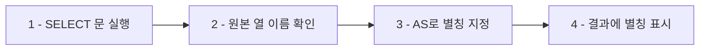

# 1. AS란?

<highlight>AS는 열(Column)에 별칭(Alias)을 지정할 때 사용하는 키워드입니다.</highlight> 별칭을 지정하면 쿼리 결과를 출력할 때 원본 열 이름 대신 별칭이 표시됩니다. 별칭을 사용하면 다음과 같은 장점이 있습니다.

- 열 이름이 길거나 복잡한 경우 간단하게 표현 가능
- 연산 결과에 의미 있는 이름 부여
- 결과 테이블의 가독성 향상
- 영문 열 이름을 한글로, 한글을 영문으로 변경 가능

**기본 구문**
```sql
SELECT column_name AS alias_name
FROM table_name;
```



## 1.1 기본 사용 예제

간단한 예제를 살펴보겠습니다. 다음은 상품 테이블의 상품명을 '상품'이라는 별칭으로 지정하여 출력하는 코드입니다.

```sql
SELECT 상품명 AS 상품 FROM 상품;
```
::a[실습환경 바로가기]{class='btn-link' href="https://sql.weniv.co.kr/?code=SELECT%20%EC%83%81%ED%92%88%EB%AA%85%20AS%20%EC%83%81%ED%92%88%20FROM%20%EC%83%81%ED%92%88;" target="\_blank"}

## 1.2 여러 열에 별칭 지정하기

아래 코드를 먼저 실행한 후, 첫 번째 줄의 코드를 주석처리하고 두 번째 줄의 주석을 풀어서 실행해보세요. **`Ctrl + /` 단축키**를 사용하면 주석을 쉽게 추가 및 제거할 수 있습니다.

```sql
SELECT 상품명, 가격 FROM 상품;
-- SELECT 상품명 AS product_name, 가격 AS price FROM 상품;
```
::a[실습환경 바로가기]{class='btn-link' href="https://sql.weniv.co.kr/?code=SELECT%20%EC%83%81%ED%92%88%EB%AA%85%2C%20%EA%B0%80%EA%B2%A9%20FROM%20%EC%83%81%ED%92%88%3B%0A--%20SELECT%20%EC%83%81%ED%92%88%EB%AA%85%20AS%20product_name%2C%20%EA%B0%80%EA%B2%A9%20AS%20price%20FROM%20%EC%83%81%ED%92%88%3B" target="\_blank"}

열 이름이 영문으로 변경된 것을 확인할 수 있습니다. 여러 열에 동시에 별칭을 지정할 때는 쉼표(,)로 구분합니다.

# 2. AS와 연산

AS는 **연산 결과에도 별칭을 지정**할 수 있습니다. 연산식이 그대로 열 이름으로 표시되면 가독성이 떨어지므로, AS를 사용해 의미 있는 이름을 부여하는 것이 좋습니다.


다음은 가격에 1을 더한 결과를 확인하는 예제입니다.

```sql
SELECT 상품명, 가격+1 FROM 상품;
-- SELECT 상품명, 가격+1 AS price FROM 상품;
```
::a[실습환경 바로가기]{class='btn-link' href="https://sql.weniv.co.kr/?code=SELECT%20%EC%83%81%ED%92%88%EB%AA%85%2C%20%EA%B0%80%EA%B2%A9%2B1%20FROM%20%EC%83%81%ED%92%88%3B%0A--%20SELECT%20%EC%83%81%ED%92%88%EB%AA%85%2C%20%EA%B0%80%EA%B2%A9%2B1%20AS%20price%20FROM%20%EC%83%81%ED%92%88%3B" target="\_blank"}

첫 번째 쿼리는 연산 결과가 '가격+1'이라는 열 이름으로 표시되지만, 두 번째 쿼리는 'price'라는 명확한 별칭으로 표시됩니다. 실무에서는 **연산 결과에 항상 별칭을 지정하는 것이 권장**됩니다.