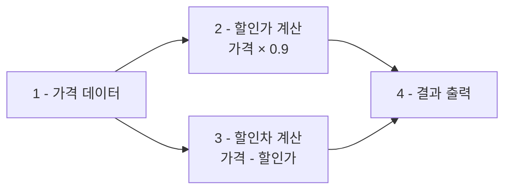

# 1. 산술연산이란?

SQL에서는 **산술연산**을 통해 더하기, 빼기, 곱하기, 나누기 등의 계산을 수행할 수 있습니다. 산술연산은 SELECT문과 함께 사용하여 데이터를 조회하면서 동시에 계산을 수행할 수 있습니다.

## 1.1 기본 산술연산

다음과 같이 여러 SELECT문을 사용하여 산술연산을 수행할 수 있습니다.

```sql
SELECT 1 + 1;
SELECT 1 - 1;
SELECT 2 * 2;
SELECT 2 / 2;
```
::a[실습환경 바로가기]{class='btn-link' href="https://sql.weniv.co.kr/?code=SELECT%201%20%2B%201%3B%0ASELECT%201%20-%201%3B%0ASELECT%202%20%2A%202%3B%0ASELECT%202%20%2F%202%3B" target="\_blank"}

## 1.2 지원하는 산술 연산자

<highlight>SQL에서 지원하는 주요 산술 연산자는 다음과 같습니다.</highlight>

| 연산자 | 의미 | 예시 | 결과 |
|--------|------|------|------|
| `+` | 덧셈 | `5 + 3` | `8` |
| `-` | 뺄셈 | `5 - 3` | `2` |
| `*` | 곱셈 | `5 * 3` | `15` |
| `/` | 나눗셈 | `6 / 3` | `2` |
| `%` | 나머지 | `5 % 3` | `2` |


# 2. 산술연산과 열

산술연산은 **테이블의 열(Column)과 함께 사용**할 수 있습니다. 이를 통해 데이터를 조회하면서 동시에 계산을 수행하여 새로운 정보를 생성할 수 있습니다.

## 2.1 단일 연산 수행

다음은 상품 가격에 0.9를 곱하여 10% 할인가를 계산하는 예제입니다.

```sql
SELECT 상품명, 가격, 가격 * 0.9 AS 할인 FROM 상품;
```
::a[실습환경 바로가기]{class='btn-link' href="https://sql.weniv.co.kr/?code=SELECT%20%EC%83%81%ED%92%88%EB%AA%85%2C%20%EA%B0%80%EA%B2%A9%2C%20%EA%B0%80%EA%B2%A9%20%2A%200.9%20AS%20%ED%95%A0%EC%9D%B8%20FROM%20%EC%83%81%ED%92%88%3B" target="\_blank"}

이 쿼리는 원래 가격과 함께 10% 할인된 가격을 '할인'이라는 별칭으로 표시합니다.

## 2.2 복합 연산 수행

여러 산술연산을 조합하여 더 복잡한 계산을 수행할 수 있습니다. **AS를 사용하면 결과 테이블에 직관적인 이름을 부여**할 수 있습니다.

```sql
SELECT 상품명, 가격, 가격 * 0.9 AS 할인, 가격 - (가격 * 0.9) AS 할인차 FROM 상품;
```
::a[실습환경 바로가기]{class='btn-link' href="https://sql.weniv.co.kr/?code=SELECT%20%EC%83%81%ED%92%88%EB%AA%85%2C%20%EA%B0%80%EA%B2%A9%2C%20%EA%B0%80%EA%B2%A9%20%2A%200.9%20AS%20%ED%95%A0%EC%9D%B8%2C%20%EA%B0%80%EA%B2%A9%20-%20%28%EA%B0%80%EA%B2%A9%20%2A%200.9%29%20AS%20%ED%95%A0%EC%9D%B8%EC%B0%A8%20FROM%20%EC%83%81%ED%92%88%3B" target="\_blank"}

이 쿼리는 다음을 계산합니다.
- **할인**: 10% 할인된 가격
- **할인차**: 원래 가격과 할인가의 차이



실무에서는 이러한 산술연산을 활용하여 **세금 계산, 할인율 적용, 총액 계산** 등 다양한 비즈니스 로직을 구현할 수 있습니다.

