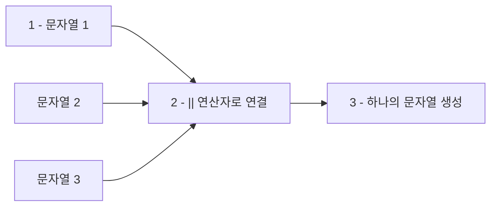
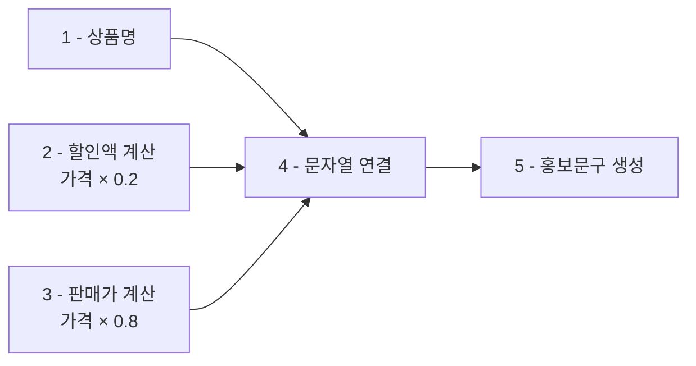

# 1. 문자열 연결 연산자

SQL에서 **문자열을 연결**할 때는 <highlight>더하기(+)가 아닌 이중 파이프(||) 연산자를 사용합니다.</highlight> 이는 SQLite의 표준 문자열 연결 방식입니다.

## 1.1 기본 문자열 연결

다음 코드를 실행해보세요. 여러 문자열을 `||` 연산자로 연결하여 하나의 문장을 만들 수 있습니다.

```sql
-- SELECT 상품명 + 설명 from 상품;
SELECT '안녕하세요' || ' ' || 'SQL' || ' ' || '캠프';
```
::a[실습환경 바로가기]{class='btn-link' href="https://sql.weniv.co.kr/?code=--%20SELECT%20%EC%83%81%ED%92%88%EB%AA%85%20%2B%20%EC%84%A4%EB%AA%85%20from%20%EC%83%81%ED%92%88%3B%0ASELECT%20%27%EC%95%88%EB%85%95%ED%95%98%EC%84%B8%EC%9A%94%27%20%7C%7C%20%27%20%27%20%7C%7C%20%27SQL%27%20%7C%7C%20%27%20%27%20%7C%7C%20%27%EC%BA%A0%ED%94%84%27%3B" target="\_blank"}

주석을 바꿔서 `+` 연산자를 사용하면 에러가 발생하는 것을 확인해보세요. SQLite에서 `+`는 산술연산에만 사용됩니다.



# 2. 문자열 연결 활용

문자열 연결은 **여러 열(Column)을 조합하여 새로운 정보를 생성**할 때 매우 유용합니다.

## 2.1 열 데이터 연결하기

다음은 상품명과 설명을 콜론(:)으로 연결하여 출력하는 예제입니다.

```sql
SELECT 상품명 || ': ' || 설명 from 상품;
```
::a[실습환경 바로가기]{class='btn-link' href="https://sql.weniv.co.kr/?code=SELECT%20%EC%83%81%ED%92%88%EB%AA%85%20%7C%7C%20%27%3A%20%27%20%7C%7C%20%EC%84%A4%EB%AA%85%20from%20%EC%83%81%ED%92%88%3B" target="\_blank"}

이렇게 여러 컬럼을 연결하면 데이터를 더 읽기 쉬운 형태로 표현할 수 있습니다.

## 2.2 문자열과 연산 결과 조합

문자열 연결과 산술연산을 함께 사용하여 **동적인 메시지**를 생성할 수 있습니다. 다음은 할인 정보를 포함한 홍보 문구를 만드는 예제입니다.

```sql
SELECT 상품명 AS 제품이름, 상품명 || '가 ' || (가격*0.2) || '할인되어 ' || (가격*0.8) || '에 판매합니다!' AS 홍보문구 FROM 상품;
```
::a[실습환경 바로가기]{class='btn-link' href="https://sql.weniv.co.kr/?code=SELECT%20%EC%83%81%ED%92%88%EB%AA%85%20AS%20%EC%A0%9C%ED%92%88%EC%9D%B4%EB%A6%84%2C%20%EC%83%81%ED%92%88%EB%AA%85%20%7C%7C%20%27%EA%B0%80%20%27%20%7C%7C%20%28%EA%B0%80%EA%B2%A9%2A0.2%29%20%7C%7C%20%27%ED%95%A0%EC%9D%B8%EB%90%98%EC%96%B4%20%27%20%7C%7C%20%28%EA%B0%80%EA%B2%A9%2A0.8%29%20%7C%7C%20%27%EC%97%90%20%ED%8C%90%EB%A7%A4%ED%95%A9%EB%8B%88%EB%8B%A4%21%27%20AS%20%ED%99%8D%EB%B3%B4%EB%AC%B8%EA%B5%AC%20FROM%20%EC%83%81%ED%92%88%3B" target="\_blank"}

이 쿼리는 다음을 수행합니다.
1. 상품명을 '제품이름'이라는 별칭으로 표시
2. 상품명, 할인액(가격×0.2), 판매가(가격×0.8)를 조합하여 홍보 문구 생성



실무에서는 이러한 문자열 연결 기능을 활용하여 **이메일 본문, 리포트 생성, 주소 조합** 등 다양한 용도로 사용할 수 있습니다.

