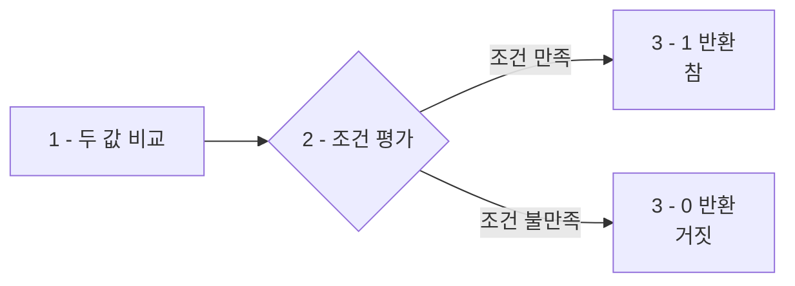
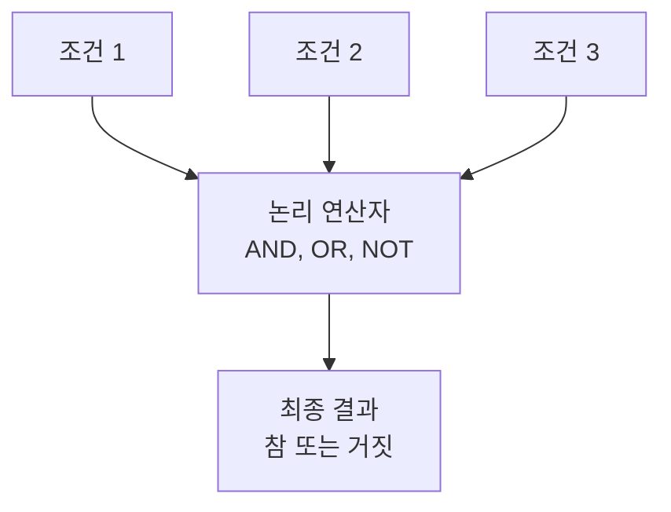

이번 장에서는 **비교 연산과 논리 연산**에 대해 살펴보겠습니다. 이러한 연산자들은 데이터를 필터링하고 조건을 설정하는 데 필수적입니다.

이 두 연산자의 실제 활용을 보여주기 위해 `WHERE` 절을 일부 사용하겠습니다. `WHERE`에 대한 자세한 내용은 별도 챕터에서 다룹니다.

# 1. 비교 연산자

<highlight>비교 연산자는 두 값을 비교하여 참(1) 또는 거짓(0)을 반환하는 연산자입니다.</highlight> 데이터를 필터링하고 조건을 설정하는 데 필수적으로 사용됩니다.

## 1.1 비교 연산자 종류

| 연산자 | 의미 | 예시 | 결과 |
|--------|------|------|------|
| `=` | 같음 | `5 = 5` | `1 (참)` |
| `!=`, `<>` | 같지 않음 | `5 != 3` | `1 (참)` |
| `>` | 크다 | `5 > 3` | `1 (참)` |
| `<` | 작다 | `5 < 3` | `0 (거짓)` |
| `>=` | 크거나 같다 | `5 >= 5` | `1 (참)` |
| `<=` | 작거나 같다 | `5 <= 3` | `0 (거짓)` |

## 1.2 기본 비교 연산 예제

다음 코드를 실행하여 비교 연산의 결과를 확인해보세요.

```sql
SELECT 1 = 1; -- 1
SELECT 1 != 1; -- 0
SELECT 1 > 1; -- 0
SELECT 1 < 1; -- 0
```
::a[실습환경 바로가기]{class='btn-link' href="https://sql.weniv.co.kr/?code=SELECT%201%20%3D%201%3B%0ASELECT%201%20%21%3D%201%3B%0ASELECT%201%20%3E%201%3B%0ASELECT%201%20%3C%201%3B" target="_blank"}



## 1.3 실제 데이터에 적용

다음 예시는 `WHERE`를 사용하여 가격이 50,000원 이상인 상품을 조회하는 쿼리입니다.

```sql
SELECT 상품명, 가격
FROM 상품
WHERE 가격 >= 50000;
```
::a[실습환경 바로가기]{class='btn-link' href="https://sql.weniv.co.kr/?code=SELECT%20%EC%83%81%ED%92%88%EB%AA%85%2C%20%EA%B0%80%EA%B2%A9%0AFROM%20%EC%83%81%ED%92%88%0AWHERE%20%EA%B0%80%EA%B2%A9%20%3E%3D%2050000%3B" target="_blank"}

`<>` 연산자는 두 값이 다르면 참을 반환합니다. 다음 쿼리는 카테고리가 '디지털'이 아닌 상품을 조회하는 예시입니다. 한 번 실행한 다음 `WHERE`를 주석처리하고 실행해보세요.

```sql
SELECT 상품명, 가격, 카테고리ID
FROM 상품
WHERE 카테고리ID <> 9;
```
::a[실습환경 바로가기]{class='btn-link' href="https://sql.weniv.co.kr/?code=SELECT%20%EC%83%81%ED%92%88%EB%AA%85%2C%20%EA%B0%80%EA%B2%A9%2C%20%EC%B9%B4%ED%85%8C%EA%B3%A0%EB%A6%ACID%0AFROM%20%EC%83%81%ED%92%88%0AWHERE%20%EC%B9%B4%ED%85%8C%EA%B3%A0%EB%A6%ACID%20%3C%3E%209%3B" target="_blank"}

# 2. 논리 연산자

<highlight>논리 연산자는 여러 조건을 결합하여 복잡한 필터링 조건을 만들 수 있게 해줍니다.</highlight> 비교 연산자로 만든 개별 조건들을 논리 연산자로 연결하여 더 정교한 데이터 검색이 가능합니다.

주요 논리 연산자는 `AND`, `OR`, `NOT`이 있으며, 참은 **1 또는 TRUE**, 거짓은 **0 또는 FALSE**로 표현됩니다.



## 2.1 AND 연산자

<highlight>AND 연산자는 두 조건이 모두 참일 때만 참을 반환합니다.</highlight> 모든 조건을 만족하는 데이터만 검색할 때 사용합니다.

**AND 연산 진리표**

| 조건1 | 조건2 | 결과 |
|-------|-------|------|
| TRUE | TRUE | **TRUE** |
| TRUE | FALSE | FALSE |
| FALSE | TRUE | FALSE |
| FALSE | FALSE | FALSE |

```sql
SELECT TRUE AND TRUE; -- 1, TRUE
SELECT TRUE AND FALSE; -- 0, FALSE
```

다음 쿼리는 카테고리가 '디지털'(카테고리ID = 9)**이고**, 가격이 100,000원 이상인 상품을 조회하는 예시입니다.

```sql
SELECT 상품명, 가격, 카테고리ID
FROM 상품
WHERE 카테고리ID = 9 AND 가격 >= 100000;
```
::a[실습환경 바로가기]{class='btn-link' href="https://sql.weniv.co.kr/?code=SELECT%20%EC%83%81%ED%92%88%EB%AA%85%2C%20%EA%B0%80%EA%B2%A9%2C%20%EC%B9%B4%ED%85%8C%EA%B3%A0%EB%A6%ACID%0AFROM%20%EC%83%81%ED%92%88%0AWHERE%20%EC%B9%B4%ED%85%8C%EA%B3%A0%EB%A6%ACID%20%3D%209%20AND%20%EA%B0%80%EA%B2%A9%20%3E%3D%20100000%3B" target="_blank"}

## 2.2 OR 연산자

<highlight>OR 연산자는 두 조건 중 하나라도 참이면 참을 반환합니다.</highlight> 여러 조건 중 하나만 만족해도 되는 경우에 사용합니다.

**OR 연산 진리표**

| 조건1 | 조건2 | 결과 |
|-------|-------|------|
| TRUE | TRUE | **TRUE** |
| TRUE | FALSE | **TRUE** |
| FALSE | TRUE | **TRUE** |
| FALSE | FALSE | FALSE |

```sql
SELECT TRUE OR FALSE; -- 1, TRUE
SELECT FALSE OR FALSE; -- 0, FALSE
```

다음 쿼리는 카테고리가 '디지털'**이거나** 가격이 100,000원 이상인 상품을 조회하는 예시입니다.

```sql
SELECT 상품명, 가격, 카테고리ID
FROM 상품
WHERE 카테고리ID = 9 OR 가격 >= 100000;
```
::a[실습환경 바로가기]{class='btn-link' href="https://sql.weniv.co.kr/?code=SELECT%20%EC%83%81%ED%92%88%EB%AA%85%2C%20%EA%B0%80%EA%B2%A9%2C%20%EC%B9%B4%ED%85%8C%EA%B3%A0%EB%A6%ACID%0AFROM%20%EC%83%81%ED%92%88%0AWHERE%20%EC%B9%B4%ED%85%8C%EA%B3%A0%EB%A6%ACID%20%3D%209%20OR%20%EA%B0%80%EA%B2%A9%20%3E%3D%20100000%3B" target="_blank"}

## 2.3 NOT 연산자

<highlight>NOT 연산자는 조건의 결과를 반대로 바꿉니다.</highlight> 특정 조건을 제외하고 싶을 때 사용합니다.

**NOT 연산 진리표**

| 조건 | 결과 |
|------|------|
| TRUE | **FALSE** |
| FALSE | **TRUE** |

```sql
SELECT NOT TRUE; -- 0, FALSE
SELECT NOT FALSE; -- 1, TRUE
```

다음 쿼리는 카테고리가 '디지털'**이 아닌** 상품을 조회하는 예시입니다.

```sql
SELECT 상품명, 가격, 카테고리ID
FROM 상품
WHERE NOT 카테고리ID = 9;
```
::a[실습환경 바로가기]{class='btn-link' href="https://sql.weniv.co.kr/?code=SELECT%20%EC%83%81%ED%92%88%EB%AA%85%2C%20%EA%B0%80%EA%B2%A9%2C%20%EC%B9%B4%ED%85%8C%EA%B3%A0%EB%A6%ACID%0AFROM%20%EC%83%81%ED%92%88%0AWHERE%20NOT%20%EC%B9%B4%ED%85%8C%EA%B3%A0%EB%A6%ACID%20%3D%209%3B" target="_blank"}