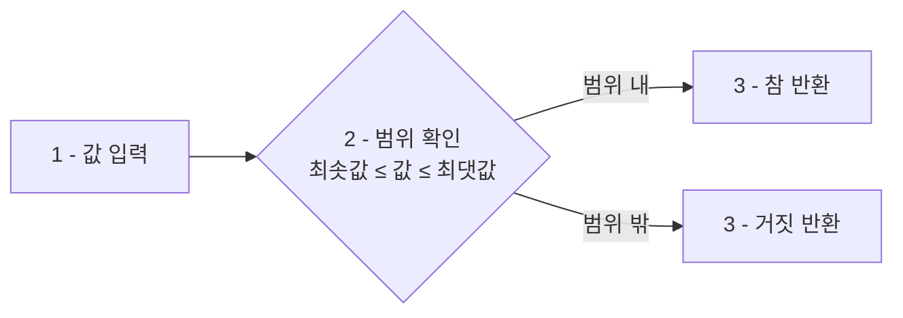

<highlight>BETWEEN 연산자는 특정 값이 두 값 사이에 있는지 확인하는 데 사용됩니다.</highlight> 범위 내의 값을 필터링할 때 매우 유용하며, **숫자, 날짜, 텍스트** 모두에 사용할 수 있습니다.

BETWEEN은 `>=`와 `<=`를 조합한 것과 동일하지만, 더 간결하고 읽기 쉬운 코드를 작성할 수 있습니다.



# 1. 간단한 BETWEEN 사용

간단한 SELECT 구문을 사용하여 BETWEEN 연산자를 연습해볼 수 있습니다.

```sql
SELECT 1 BETWEEN 1 AND 3; -- 1
SELECT 2 BETWEEN 1 AND 3; -- 1
SELECT 3 BETWEEN 1 AND 3; -- 1
SELECT 4 BETWEEN 1 AND 3; -- 0
```

다음은 알파벳 순서로 정렬된 텍스트 값의 예시입니다.

```sql
SELECT 'A' BETWEEN 'A' AND 'M'; -- 1
SELECT 'M' BETWEEN 'A' AND 'M'; -- 1
SELECT 'Z' BETWEEN 'A' AND 'M'; -- 0
```

# 2. 숫자 범위에서의 BETWEEN 사용

이번에는 테이블에서 조회해보도록 하겠습니다. 다음 쿼리는 가격이 50,000원에서 150,000원 사이인 상품을 조회하는 예시입니다. 실행한 다음 수치를 조금씩 변경해보세요.

```sql
SELECT 상품명, 가격
FROM 상품
WHERE 가격 BETWEEN 50000 AND 150000;
```

::a[실습환경 바로가기]{class='btn-link' href="https://sql.weniv.co.kr/?code=SELECT%20%EC%83%81%ED%92%88%EB%AA%85%2C%20%EA%B0%80%EA%B2%A9%0AFROM%20%EC%83%81%ED%92%88%0AWHERE%20%EA%B0%80%EA%B2%A9%20BETWEEN%2050000%20AND%20150000%3B" target="_blank"}

이 쿼리는 가격이 50,000원 이상 150,000원 이하인 상품을 조회합니다.

<highlight>BETWEEN 연산자는 범위의 양 끝값을 포함합니다.</highlight> 즉, `가격 BETWEEN 50000 AND 150000`은 `가격 >= 50000 AND 가격 <= 150000`과 동일합니다.

# 3. 날짜 범위에서의 BETWEEN 사용

**BETWEEN 연산자는 날짜 범위 검색에 매우 유용합니다.** 특정 기간 동안의 데이터를 조회할 때 자주 사용되며, 날짜 형식은 'YYYY-MM-DD'를 사용합니다.

다음 쿼리는 2024년 1월 1일부터 2024년 2월 28일 사이에 주문된 내역을 조회하는 예시입니다.

```sql
SELECT 주문ID, 주문날짜
FROM 주문
WHERE 주문날짜 BETWEEN '2024-01-01' AND '2024-02-28';
```

::a[실습환경 바로가기]{class='btn-link' href="https://sql.weniv.co.kr/?code=SELECT%20%EC%A3%BC%EB%AC%B8ID%2C%20%EC%A3%BC%EB%AC%B8%EB%82%A0%EC%A7%9C%0AFROM%20%EC%A3%BC%EB%AC%B8%0AWHERE%20%EC%A3%BC%EB%AC%B8%EB%82%A0%EC%A7%9C%20BETWEEN%20%272024-01-01%27%20AND%20%272024-02-28%27%3B" target="_blank"}

이 쿼리는 주어진 날짜 범위 내에 있는 모든 주문을 조회합니다.

# 4. 텍스트 범위에서의 BETWEEN 사용

텍스트 값에서도 `BETWEEN` 연산자를 사용할 수 있습니다. 텍스트 값은 알파벳 순서에 따라 비교됩니다. 다음 쿼리는 상품명이 'A'에서 'M'으로 시작하는 상품을 조회하는 예시입니다.

```sql
SELECT 상품명
FROM 상품
WHERE 상품명 BETWEEN 'A' AND 'M';
```

::a[실습환경 바로가기]{class='btn-link' href="https://sql.weniv.co.kr/?code=SELECT%20%EC%83%81%ED%92%88%EB%AA%85%0AFROM%20%EC%83%81%ED%92%88%0AWHERE%20%EC%83%81%ED%92%88%EB%AA%85%20BETWEEN%20%27A%27%20AND%20%27M%27%3B" target="_blank"}

이 쿼리는 상품명이 'A'로 시작하거나, 'M' 이전 알파벳으로 시작하는 상품을 모두 조회합니다.