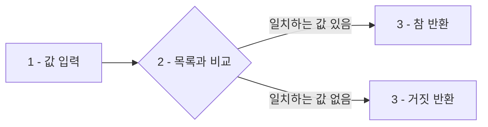
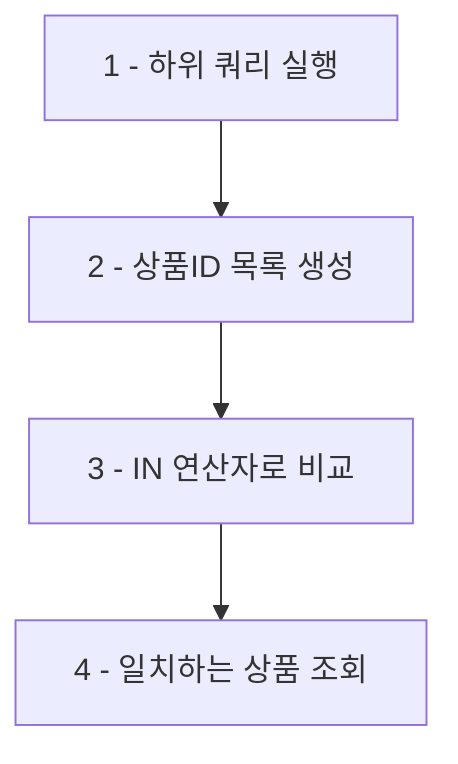

<highlight>IN 연산자는 지정된 여러 값 중 하나와 일치하는 데이터를 조회할 때 사용됩니다.</highlight> `IN` 연산자를 사용하면 `OR` 연산자를 여러 번 사용하는 것보다 훨씬 간결하게 여러 조건을 처리할 수 있습니다.



# 1. 간단한 IN 사용

간단한 SELECT 구문을 사용하여 `IN` 연산자를 연습할 수 있습니다.

<highlight>BETWEEN과 IN의 차이: BETWEEN은 연속된 범위를 지정할 때 사용하는 반면, IN은 불연속적인 여러 값 중 하나와 일치하는 데이터를 조회할 때 사용합니다.</highlight>

```sql
SELECT 1 IN (1, 2, 3); -- 1
SELECT 4 IN (1, 2, 3); -- 0
```

다음은 텍스트 값의 예시입니다.

```sql
SELECT 'A' IN ('A', 'B', 'C'); -- 1
SELECT 'D' IN ('A', 'B', 'C'); -- 0
```

# 2. 숫자 목록에서의 IN 사용

다음 쿼리는 `카테고리ID`가 3, 5, 9인 상품을 조회하는 예시입니다. IN을 사용하지 않으면 `WHERE 카테고리ID = 3 OR 카테고리ID = 5 OR 카테고리ID = 9`로 작성해야 하지만, IN을 사용하면 훨씬 간결합니다.

```sql
SELECT 상품명, 카테고리ID
FROM 상품
WHERE 카테고리ID IN (3, 5, 9);
```

::a[실습환경 바로가기]{class='btn-link' href="https://sql.weniv.co.kr/?code=SELECT%20%EC%83%81%ED%92%88%EB%AA%85%2C%20%EC%B9%B4%ED%85%8C%EA%B3%A0%EB%A6%ACID%0AFROM%20%EC%83%81%ED%92%88%0AWHERE%20%EC%B9%B4%ED%85%8C%EA%B3%A0%EB%A6%ACID%20IN%20%283%2C%205%2C%209%29%3B" target="_blank"}

이 쿼리는 `카테고리ID`가 3(식품), 5(생활용품), 9(디지털)에 해당하는 상품을 모두 조회합니다.

# 3. 텍스트 목록에서의 IN 사용

다음 쿼리는 상품명이 특정 값들 중 하나인 상품을 조회하는 예시입니다.

```sql
SELECT 상품명, 가격
FROM 상품
WHERE 상품명 IN ('한정판 노트북 스티커', '블루투스 스피커', '스마트 헬스 밴드');
```

::a[실습환경 바로가기]{class='btn-link' href="https://sql.weniv.co.kr/?code=SELECT%20%EC%83%81%ED%92%88%EB%AA%85%2C%20%EA%B0%80%EA%B2%A9%0AFROM%20%EC%83%81%ED%92%88%0AWHERE%20%EC%83%81%ED%92%88%EB%AA%85%20IN%20%28%27%ED%95%9C%EC%A0%95%ED%8C%90%20%EB%85%B8%ED%8A%B8%EB%B6%81%20%EC%8A%A4%ED%8B%B0%EC%BB%A4%27%2C%20%27%EB%B8%94%EB%A3%A8%ED%88%AC%EC%8A%A4%20%EC%8A%A4%ED%94%BC%EC%BB%A4%27%2C%20%27%EC%8A%A4%EB%A7%88%ED%8A%B8%20%ED%97%AC%EC%8A%A4%20%EB%B0%B4%EB%93%9C%27%29%3B" target="_blank"}

이 쿼리는 지정한 세 가지 상품명 중 하나에 해당하는 데이터를 조회합니다.

# 4. 하위 쿼리에서의 IN 사용

**IN 연산자는 하위 쿼리(subquery)와 함께 사용**할 수도 있습니다. 다음 쿼리는 특정 주문에 포함된 상품들을 조회하는 예시입니다.

```sql
SELECT 상품명
FROM 상품
WHERE 상품ID IN (SELECT 상품ID FROM 주문상세 WHERE 주문ID = 1001);
```

::a[실습환경 바로가기]{class='btn-link' href="https://sql.weniv.co.kr/?code=SELECT%20%EC%83%81%ED%92%88%EB%AA%85%0AFROM%20%EC%83%81%ED%92%88%0AWHERE%20%EC%83%81%ED%92%88ID%20IN%20%28SELECT%20%EC%83%81%ED%92%88ID%20FROM%20%EC%A3%BC%EB%AC%B8%EC%83%81%EC%84%B8%20WHERE%20%EC%A3%BC%EB%AC%B8ID%20%3D%201001%29%3B" target="_blank"}



이 쿼리는 주문ID가 1001인 주문에 포함된 상품들을 조회합니다. 하위 쿼리가 먼저 실행되어 상품ID 목록을 반환하고, IN 연산자가 그 목록과 비교합니다.
