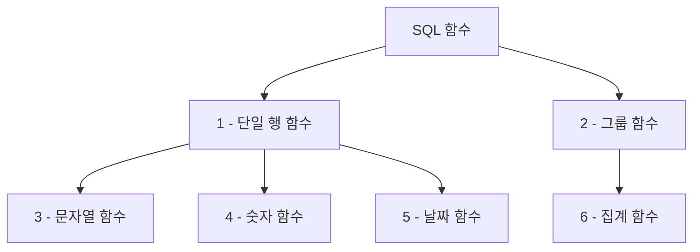
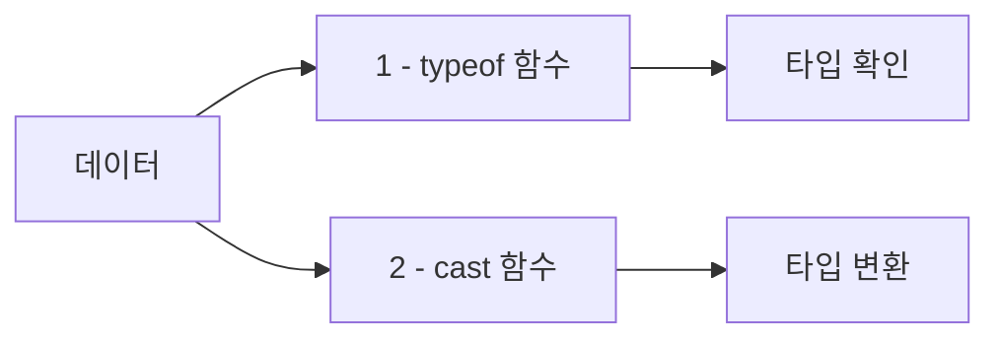
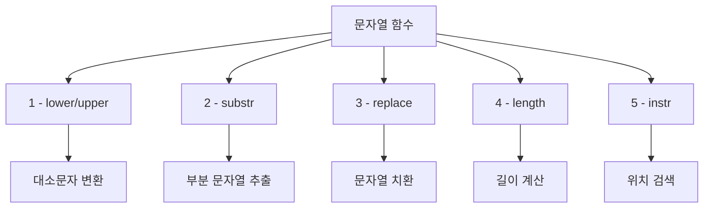
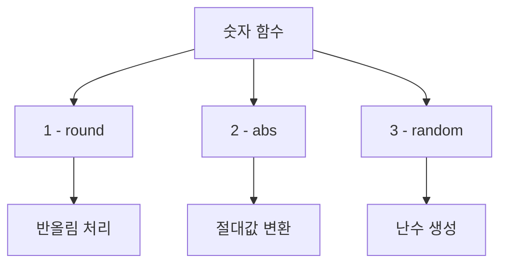
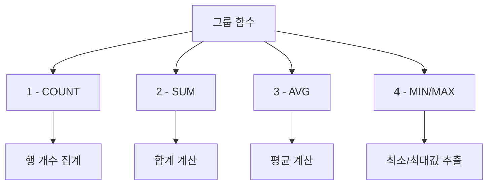

# 1. SQL 함수란?

SQL 함수는 미리 정의된 기능을 수행하는 구문으로, 데이터 처리와 변환을 간편하게 할 수 있도록 도와줍니다. <highlight>SQL 함수는 크게 단일 행 함수(한 행에 대해 하나의 값을 반환)와 그룹 함수(여러 행에 대해 하나의 값을 반환)로 나뉩니다.</highlight> 이 장에서는 SQLite에서 자주 사용되는 SQL 함수들을 다룹니다.



함수를 사용하면 복잡한 데이터 처리 로직을 간단하게 표현할 수 있으며, 코드의 재사용성과 가독성을 높일 수 있습니다.

## 1.1 데이터 타입 관련 함수

SQLite는 동적 타입 시스템을 사용하므로, 명시적인 데이터 타입 함수가 제한적입니다. 그러나 값의 타입을 확인하거나 변환할 때 사용할 수 있는 함수들이 있습니다.



### 1.1.1 typeof 함수

**typeof(값)** 함수는 값의 데이터 타입을 문자열로 반환합니다. SQLite에서는 다음과 같은 타입을 반환할 수 있습니다:
- `integer`: 정수형
- `real`: 실수형
- `text`: 문자열
- `blob`: 바이너리 데이터
- `null`: NULL 값

### 1.1.2 cast 함수

**cast(값 AS 타입)** 함수는 값을 지정된 타입으로 변환합니다. 데이터 타입 간 변환이 필요할 때 유용합니다.

```sql
SELECT typeof(123), typeof('abc'), typeof(4.56);
SELECT cast('123' AS INTEGER), cast(456 AS TEXT);
```
::a[실습환경 바로가기]{class='btn-link' href="https://sql.weniv.co.kr/?code=SELECT%20typeof%28123%29%2C%20typeof%28%27abc%27%29%2C%20typeof%284.56%29%3B%0ASELECT%20cast%28%27123%27%20AS%20INTEGER%29%2C%20cast%28456%20AS%20TEXT%29%3B" target="_blank"}


## 1.2 문자열 처리 함수

문자열을 다룰 때 사용하는 함수는 데이터 검색과 변환 시 유용합니다. 사용자 입력 데이터를 정규화하거나, 텍스트 분석을 수행할 때 필수적으로 활용됩니다.



### 주요 문자열 함수

- **lower('ABC')** → `'abc'`: 문자열을 소문자로 변환합니다. 대소문자 구분 없이 검색할 때 유용합니다.
- **upper('abc')** → `'ABC'`: 문자열을 대문자로 변환합니다. 데이터 정규화에 활용됩니다.
- **substr('hello world', 1, 5)** → `'hello'`: 문자열의 일부분을 추출합니다. 첫 번째 숫자는 시작 위치, 두 번째 숫자는 추출할 문자열의 길이를 나타냅니다.
- **replace('hello world', 'world', 'SQL')** → `'hello SQL'`: 문자열의 일부를 다른 문자열로 대체합니다. 데이터 정제 작업에 사용됩니다.
- **length('hello')** → `5`: 문자열의 길이를 반환합니다. 유효성 검증이나 데이터 분석에 활용됩니다.
- **instr('ABCDEF', 'B')** → `2`: 특정 문자가 문자열 내에서 처음 등장하는 위치를 반환합니다. <highlight>SQLite에서는 인덱스가 1부터 시작합니다.</highlight>

```sql
SELECT
    lower('HELLO'),
    upper('world'),
    substr('SQLite', 1, 3),
    replace('Hello World', 'World', 'SQLite'),
    length('Function'),
    instr('ABCDEF', 'D');
```
::a[실습환경 바로가기]{class='btn-link' href="https://sql.weniv.co.kr/?code=SELECT%20lower%28%27HELLO%27%29%2C%20upper%28%27world%27%29%2C%20substr%28%27SQLite%27%2C%201%2C%203%29%2C%20replace%28%27Hello%20World%27%2C%20%27World%27%2C%20%27SQLite%27%29%2C%20length%28%27Function%27%29%2C%20instr%28%27ABCDEF%27%2C%20%27D%27%29%3B" target="_blank"}


## 1.3 숫자 관련 함수

숫자를 처리할 때 사용할 수 있는 다양한 수학적 함수가 있습니다. 통계 계산, 재무 분석, 과학적 계산 등 다양한 분야에서 활용됩니다.



### 주요 숫자 함수

- **round(123.456, 2)** → `123.46`: 숫자를 반올림합니다. 두 번째 인자는 소수점 자릿수를 나타냅니다. 금융 데이터나 통계 계산에 자주 사용됩니다.
- **abs(-10)** → `10`: 절대값을 반환합니다. 음수를 양수로 변환하여 거리나 차이를 계산할 때 유용합니다.
- **random()**: -9223372036854775808과 +9223372036854775807 사이의 정수를 무작위로 반환합니다. 샘플링이나 테스트 데이터 생성에 활용됩니다.

### 실무 예제

```sql
-- 기본 숫자 함수 사용
SELECT round(123.456, 2), abs(-10), random();

-- 0부터 100 사이의 랜덤 정수 생성
SELECT abs(random()) % 101;

-- 가격 반올림 예제
SELECT
    상품명,
    가격,
    round(가격 * 1.1, 0) AS 부가세포함가격
FROM 상품;
```
::a[실습환경 바로가기]{class='btn-link' href="https://sql.weniv.co.kr/?code=SELECT%20round%28123.456%2C%202%29%2C%20abs%28-10%29%2C%20random%28%29%3B%0A--%200%EB%B6%80%ED%84%B0%20100%20%EC%82%AC%EC%9D%B4%EC%9D%98%20%EB%9E%9C%EB%8D%A4%20%EC%A0%95%EC%88%98%20%EC%83%9D%EC%84%B1%0ASELECT%20abs%28random%28%29%29%20%25%20101%3B" target="_blank"}


## 1.4 그룹 함수

그룹 함수는 여러 행의 데이터를 집계할 때 사용됩니다. <highlight>일반적으로 GROUP BY 절과 함께 사용되며, 대량의 데이터를 요약하고 통계를 산출하는 데 필수적입니다.</highlight>



### 주요 그룹 함수

- **count()**: 행의 개수를 셉니다. <highlight>NULL 값을 제외하고 계산합니다.</highlight> `COUNT(*)`는 NULL을 포함한 모든 행을 셉니다.
- **sum(컬럼명)**: 특정 열의 값을 모두 더합니다. 총 매출이나 총합을 계산할 때 사용됩니다.
- **avg(컬럼명)**: 특정 열의 평균 값을 계산합니다. 평균 가격이나 평균 점수를 구할 때 활용됩니다.
- **min(컬럼명)**: 특정 열의 최소 값을 반환합니다. 최저 가격이나 최소값을 찾을 때 사용됩니다.
- **max(컬럼명)**: 특정 열의 최대 값을 반환합니다. 최고 가격이나 최대값을 찾을 때 사용됩니다.

### 실무 예제

```sql
-- 전체 상품 가격의 합계
SELECT SUM(가격) AS 총가격 FROM 상품;

-- 상품 평균 가격
SELECT AVG(가격) AS 평균가격 FROM 상품;

-- 최저가와 최고가
SELECT MIN(가격) AS 최저가, MAX(가격) AS 최고가 FROM 상품;

-- 전체 상품 개수
SELECT COUNT(*) AS 상품개수 FROM 상품;

-- 카테고리별 집계 (GROUP BY와 함께 사용)
SELECT
    카테고리ID,
    COUNT(*) AS 상품수,
    AVG(가격) AS 평균가격,
    SUM(가격) AS 총가격
FROM 상품
GROUP BY 카테고리ID;
```
::a[실습환경 바로가기]{class='btn-link' href="https://sql.weniv.co.kr/?code=SELECT%20SUM%28%EA%B0%80%EA%B2%A9%29%20FROM%20%EC%83%81%ED%92%88%3B%0ASELECT%20AVG%28%EA%B0%80%EA%B2%A9%29%20FROM%20%EC%83%81%ED%92%88%3B%0ASELECT%20MIN%28%EA%B0%80%EA%B2%A9%29%2C%20MAX%28%EA%B0%80%EA%B2%A9%29%20FROM%20%EC%83%81%ED%92%88%3B%0ASELECT%20COUNT%28%2A%29%20from%20%EC%83%81%ED%92%88%3B" target="_blank"}

---

## 마무리

SQL 함수는 데이터를 효율적으로 처리하고 분석하는 데 필수적인 도구입니다. 각 함수는 데이터 타입이나 목적에 맞게 사용할 수 있으며, 여러 함수를 조합하여 복잡한 계산이나 변환도 손쉽게 수행할 수 있습니다.

SQLite에서는 일부 함수가 제한적일 수 있으므로, [SQLite 공식 문서](https://www.sqlite.org/lang_corefunc.html)를 참조하여 사용 가능한 함수를 확인하는 것이 좋습니다. 다음 장에서는 단일 행 함수를 더 자세히 살펴보겠습니다.