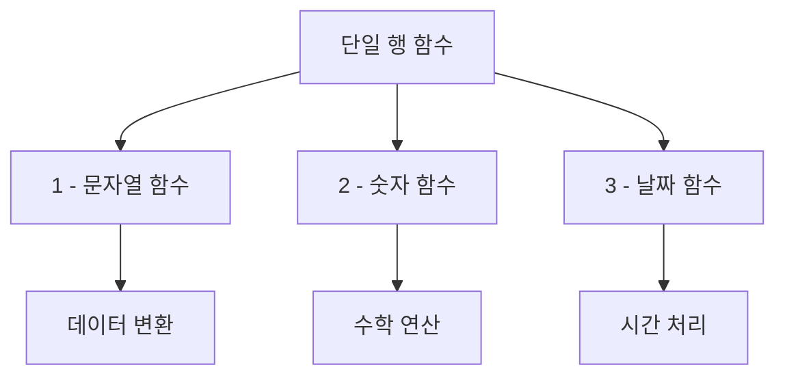
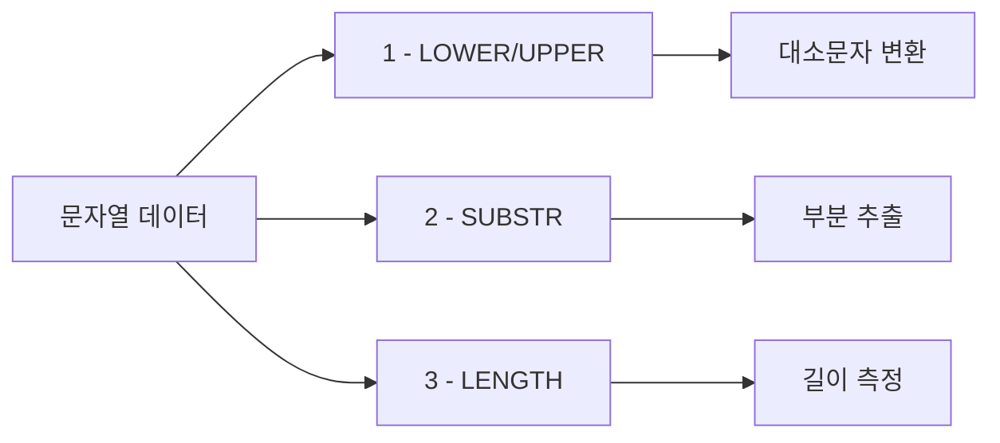
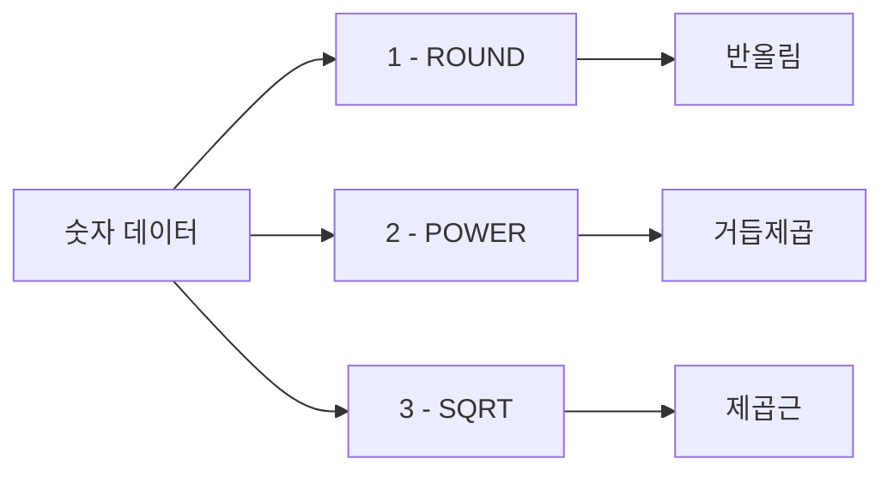
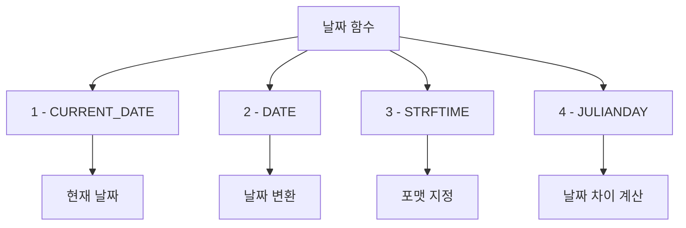
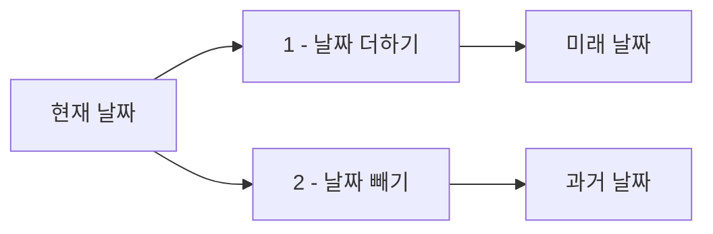

# 1. 단일 행 함수

단일 행 함수는 입력된 값에 대해 한 행마다 하나의 결과를 반환하는 함수입니다. <highlight>이 함수들은 데이터를 처리하고 변환하는 데 매우 유용하며, 특히 문자열, 숫자, 날짜 데이터를 처리할 때 자주 사용됩니다.</highlight>



단일 행 함수는 각 행에 독립적으로 적용되므로, 테이블의 모든 행에 대해 개별적인 변환 작업을 수행할 수 있습니다.

## 1.1 문자열 함수

문자열 함수는 텍스트 데이터를 가공하고 분석하는 데 필수적입니다. 사용자 입력 검증, 데이터 정제, 텍스트 분석 등 다양한 용도로 활용됩니다.



### 1.1.1 LOWER, UPPER

`LOWER` 함수는 문자열을 소문자로 변환하고, `UPPER` 함수는 문자열을 대문자로 변환합니다. 대소문자 구분 없이 검색하거나 데이터를 정규화할 때 매우 유용합니다.

**활용 사례:**
- 이메일 주소 정규화
- 대소문자 무관 검색
- 데이터 일관성 유지

```sql
-- 기본 사용
SELECT LOWER('SQL') AS lower_result, UPPER('sql') AS upper_result;

-- 실무 예제: 이메일 정규화
SELECT
    이름,
    LOWER(이메일) AS 정규화된이메일
FROM 고객;
```
::a[실습환경 바로가기]{class='btn-link' href="https://sql.weniv.co.kr/?code=SELECT%20LOWER%28%27SQL%27%29%20AS%20lower_result%2C%20UPPER%28%27sql%27%29%20AS%20upper_result%3B" target="_blank"}

### 1.1.2 SUBSTR

`SUBSTR` 함수는 문자열의 일부를 추출할 때 사용됩니다. 첫 번째 인자는 시작 위치, 두 번째 인자는 추출할 길이를 지정합니다.

**활용 사례:**
- 날짜 문자열에서 연도만 추출
- 전화번호에서 지역번호 추출
- 주민등록번호에서 생년월일 추출

```sql
-- 기본 사용
SELECT SUBSTR('Hello SQL', 1, 5) AS substring;

-- 실무 예제: 날짜에서 연도 추출
SELECT
    주문ID,
    주문날짜,
    SUBSTR(주문날짜, 1, 4) AS 연도
FROM 주문;
```
::a[실습환경 바로가기]{class='btn-link' href="https://sql.weniv.co.kr/?code=SELECT%20SUBSTR%28%27Hello%20SQL%27%2C%201%2C%205%29%20AS%20substring%3B" target="_blank"}

### 1.1.3 LENGTH

`LENGTH` 함수는 문자열의 길이를 반환합니다. 데이터 유효성 검증이나 문자열 분석에 활용됩니다.

**활용 사례:**
- 비밀번호 길이 검증
- 제목 길이 제한 확인
- 데이터 품질 검사

```sql
-- 기본 사용
SELECT LENGTH('Hello') AS length;

-- 실무 예제: 상품명 길이 검증
SELECT
    상품명,
    LENGTH(상품명) AS 길이,
    CASE
        WHEN LENGTH(상품명) > 50 THEN '너무 길음'
        WHEN LENGTH(상품명) < 3 THEN '너무 짧음'
        ELSE '적정'
    END AS 길이평가
FROM 상품;
```
::a[실습환경 바로가기]{class='btn-link' href="https://sql.weniv.co.kr/?code=SELECT%20LENGTH%28%27Hello%27%29%20AS%20length%3B" target="_blank"}

## 1.2 숫자 함수

숫자 함수는 수학적 계산을 수행하며, 재무 분석, 통계 계산, 과학적 연산 등에 활용됩니다.



### 1.2.1 ROUND

`ROUND` 함수는 숫자를 지정한 자릿수에서 반올림합니다. 금융 데이터나 통계 값을 표현할 때 필수적입니다.

**활용 사례:**
- 금액 반올림 (원 단위)
- 평균 점수 소수점 제한
- 통계 값 정리

```sql
-- 기본 사용
SELECT ROUND(123.456, 2) AS rounded_value;

-- 실무 예제: 할인가 계산
SELECT
    상품명,
    가격,
    ROUND(가격 * 0.85, 0) AS 할인가,
    ROUND(가격 * 0.15, 0) AS 할인금액
FROM 상품;
```
::a[실습환경 바로가기]{class='btn-link' href="https://sql.weniv.co.kr/?code=SELECT%20ROUND%28123.456%2C%202%29%20AS%20rounded_value%3B" target="_blank"}

### 1.2.2 POWER

`POWER` 함수는 주어진 숫자의 거듭제곱을 계산합니다. 복리 이자 계산이나 지수 성장 분석에 사용됩니다.

**활용 사례:**
- 복리 이자 계산
- 지수 성장률 분석
- 과학적 계산

```sql
-- 기본 사용
SELECT POWER(2, 3) AS power_result;

-- 실무 예제: 복리 이자 계산 (연 5%, 3년)
SELECT
    1000000 AS 원금,
    ROUND(1000000 * POWER(1.05, 3), 0) AS 만기금액,
    ROUND(1000000 * POWER(1.05, 3) - 1000000, 0) AS 이자
```
::a[실습환경 바로가기]{class='btn-link' href="https://sql.weniv.co.kr/?code=SELECT%20POWER%282%2C%203%29%20AS%20power_result%3B" target="_blank"}

### 1.2.3 SQRT

`SQRT` 함수는 제곱근을 계산합니다. 기하학적 계산이나 통계 분석에 사용됩니다.

**활용 사례:**
- 거리 계산
- 표준편차 계산
- 기하학적 분석

```sql
-- 기본 사용
SELECT SQRT(16) AS sqrt_result;

-- 실무 예제: 피타고라스 정리 활용 (거리 계산)
SELECT
    ROUND(SQRT(POWER(3, 2) + POWER(4, 2)), 2) AS 빗변길이
```
::a[실습환경 바로가기]{class='btn-link' href="https://sql.weniv.co.kr/?code=SELECT%20SQRT%2816%29%20AS%20sqrt_result%3B" target="_blank"}

# 2. 날짜 함수

SQL에서 날짜와 시간을 처리할 때 사용하는 함수들은 다양한 날짜 연산을 가능하게 해줍니다. <highlight>날짜 함수는 날짜 계산, 포맷 변환, 날짜와 시간의 차이 계산 등에 매우 유용합니다.</highlight>



날짜 함수는 예약 시스템, 계약 관리, 이벤트 관리 등 시간과 날짜가 중요한 비즈니스 로직에서 필수적입니다.

## 2.1 CURRENT_DATE

`CURRENT_DATE` 함수는 현재 날짜를 반환합니다. 시스템 날짜를 기준으로 오늘의 날짜를 가져오며, `YYYY-MM-DD` 형식으로 출력됩니다.

**활용 사례:**
- 주문일 기록
- 로그 생성 시간 기록
- 오늘 날짜 기준 조회

```sql
-- 기본 사용
SELECT CURRENT_DATE AS today;

-- 실무 예제: 오늘 주문된 내역 조회
SELECT *
FROM 주문
WHERE 주문날짜 = CURRENT_DATE;
```
::a[실습환경 바로가기]{class='btn-link' href="https://sql.weniv.co.kr/?code=SELECT%20CURRENT_DATE%20AS%20today%3B" target="_blank"}

## 2.2 DATE()

`DATE()` 함수는 문자열을 날짜 형식으로 변환하거나 날짜 연산을 수행할 때 사용됩니다. 주어진 문자열이 올바른 날짜 형식이어야 합니다.

**활용 사례:**
- 문자열 날짜 형식 변환
- 날짜 연산 (더하기, 빼기)
- 날짜 정규화

```sql
-- 기본 사용
SELECT DATE('2024-09-30') AS formatted_date;

-- 날짜 더하기: 7일 후
SELECT DATE('now', '+7 days') AS next_week;

-- 날짜 빼기: 1개월 전
SELECT DATE('now', '-1 month') AS last_month;
```
::a[실습환경 바로가기]{class='btn-link' href="https://sql.weniv.co.kr/?code=SELECT%20DATE%28%272024-09-30%27%29%20AS%20formatted_date%3B" target="_blank"}

## 2.3 STRFTIME()

`STRFTIME()` 함수는 날짜나 시간을 특정 형식으로 변환할 때 사용됩니다. <highlight>이 함수는 특히 SQLite에서 유용하며, 원하는 포맷으로 날짜를 변환할 수 있습니다.</highlight>

**주요 포맷 지정자:**
- `%Y`: 4자리 연도 (2024)
- `%m`: 월 (01-12)
- `%d`: 일 (01-31)
- `%H`: 시 (00-23)
- `%M`: 분 (00-59)
- `%S`: 초 (00-59)
- `%w`: 요일 (0=일요일, 6=토요일)

```sql
-- 날짜만 포맷
SELECT STRFTIME('%Y-%m-%d', 'now') AS formatted_date;

-- 날짜와 시간 포맷
SELECT STRFTIME('%Y-%m-%d %H:%M:%S', 'now') AS current_datetime;

-- 실무 예제: 월별 매출 집계
SELECT
    STRFTIME('%Y-%m', 주문날짜) AS 년월,
    COUNT(*) AS 주문수,
    SUM(총액) AS 매출액
FROM 주문
GROUP BY STRFTIME('%Y-%m', 주문날짜)
ORDER BY 년월;
```
::a[실습환경 바로가기]{class='btn-link' href="https://sql.weniv.co.kr/?code=SELECT%20STRFTIME%28%27%25Y-%25m-%25d%27%2C%20%27now%27%29%20AS%20formatted_date%3B" target="_blank"}

## 2.4 DATE 함수와 연산

SQL에서는 날짜에 대한 연산을 통해 특정 날짜를 계산할 수 있습니다. 이는 예약 시스템이나 만기일 계산에 매우 유용합니다.



**실무 예제:**

```sql
-- 7일 후 배송 예정일
SELECT
    주문ID,
    주문날짜,
    DATE(주문날짜, '+7 days') AS 배송예정일
FROM 주문;

-- 계약 만료 30일 전 알림 대상
SELECT
    고객명,
    계약종료일,
    DATE(계약종료일, '-30 days') AS 알림발송일
FROM 계약
WHERE DATE('now') >= DATE(계약종료일, '-30 days')
  AND DATE('now') < 계약종료일;
```
::a[실습환경 바로가기]{class='btn-link' href="https://sql.weniv.co.kr/?code=SELECT%20DATE%28%27now%27%2C%20%27%2B7%20days%27%29%20AS%20next_week%3B" target="_blank"}

## 2.5 날짜 차이 계산 (JULIANDAY)

`JULIANDAY` 함수는 날짜를 율리우스일(Julian Day)로 변환하여 날짜 간의 차이를 계산할 때 사용됩니다.

**활용 사례:**
- D-day 계산
- 경과 일수 계산
- 재고 보관 기간 계산

```sql
-- 기본 사용: 두 날짜 사이의 일수 차이
SELECT JULIANDAY('2024-09-30') - JULIANDAY('2024-01-01') AS days_difference;

-- 실무 예제: 주문 후 배송까지 소요 일수
SELECT
    주문ID,
    주문날짜,
    배송완료일,
    ROUND(JULIANDAY(배송완료일) - JULIANDAY(주문날짜)) AS 배송소요일수
FROM 주문
WHERE 배송완료일 IS NOT NULL;

-- D-day 계산
SELECT
    이벤트명,
    이벤트날짜,
    ROUND(JULIANDAY(이벤트날짜) - JULIANDAY('now')) AS D_day
FROM 이벤트
WHERE 이벤트날짜 >= DATE('now')
ORDER BY D_day;
```
::a[실습환경 바로가기]{class='btn-link' href="https://sql.weniv.co.kr/?code=SELECT%20JULIANDAY%28%272024-09-30%27%29%20-%20JULIANDAY%28%272024-01-01%27%29%20AS%20days_difference%3B" target="_blank"}

---

## 마무리

단일 행 함수는 각 행에 대해 독립적으로 작동하며, 데이터를 효과적으로 가공하고 변환하는 데 필수적인 도구입니다. 문자열 함수, 숫자 함수, 날짜 함수를 적절히 조합하면 복잡한 비즈니스 로직도 SQL만으로 구현할 수 있습니다.

다음 장에서는 여러 행을 그룹화하여 집계하는 집계 함수에 대해 알아보겠습니다.