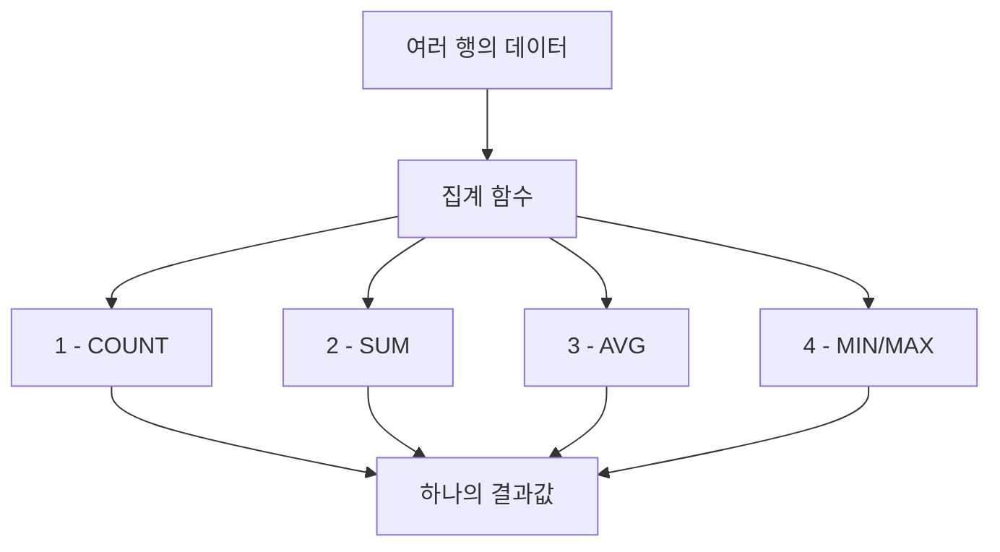
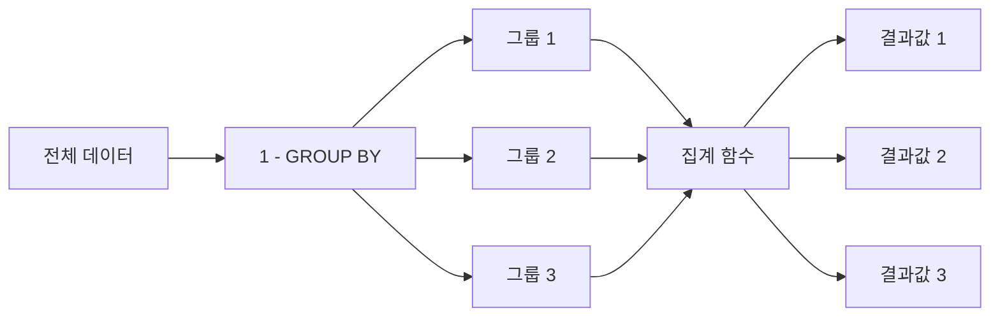
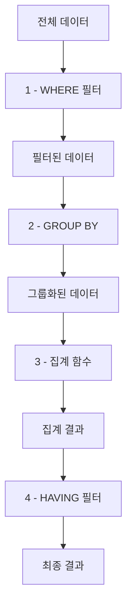

# 1. 집계 함수란?

집계 함수(Aggregate Functions)는 여러 행을 그룹화하여 하나의 값을 반환하는 함수입니다. 이 함수들은 주로 데이터를 요약하거나 통계를 계산할 때 사용됩니다. <highlight>집계 함수는 대량의 데이터를 분석하는 데 매우 유용하며, 일반적으로 GROUP BY 절과 함께 사용됩니다.</highlight>



집계 함수는 매출 분석, 재고 관리, 고객 통계, 성과 측정 등 비즈니스 인텔리전스(BI)의 핵심 도구입니다.

## 1.1 COUNT()

`COUNT()` 함수는 주어진 조건에 맞는 행의 개수를 반환합니다. 데이터의 행 수를 셀 때 매우 유용합니다.

**COUNT 함수의 종류:**
- `COUNT(*)`: NULL을 포함한 모든 행의 개수
- `COUNT(컬럼명)`: 해당 컬럼에서 NULL을 제외한 행의 개수
- `COUNT(DISTINCT 컬럼명)`: 중복을 제거한 고유값의 개수

**활용 사례:**
- 전체 데이터 개수 파악
- 조건에 맞는 레코드 수 집계
- 중복 제거 후 고유값 개수 확인

```sql
-- 전체 상품 개수
SELECT COUNT(*) AS total_rows FROM 상품;

-- NULL이 아닌 가격 정보 개수
SELECT COUNT(가격) AS price_count FROM 상품;

-- 고유한 카테고리 개수
SELECT COUNT(DISTINCT 카테고리ID) AS category_count FROM 상품;

-- 실무 예제: 오늘 주문 건수
SELECT COUNT(*) AS 오늘주문수
FROM 주문
WHERE DATE(주문날짜) = CURRENT_DATE;
```
::a[실습환경 바로가기]{class='btn-link' href="https://sql.weniv.co.kr/?code=SELECT%20COUNT%28%2A%29%20AS%20total_rows%0AFROM%20%EC%83%81%ED%92%88%3B" target="_blank"}

## 1.2 SUM()

`SUM()` 함수는 특정 열의 모든 값을 더한 결과를 반환합니다. <highlight>주로 숫자 데이터를 집계할 때 사용되며, NULL 값은 자동으로 무시됩니다.</highlight>

**활용 사례:**
- 총 매출액 계산
- 재고 수량 합계
- 총 비용 산출

```sql
-- 전체 상품 가격 합계
SELECT SUM(가격) AS total_price FROM 상품;

-- 실무 예제: 카테고리별 총 재고 가치
SELECT
    카테고리ID,
    SUM(가격 * 재고수량) AS 총재고가치
FROM 상품
GROUP BY 카테고리ID;

-- 월별 매출 합계
SELECT
    STRFTIME('%Y-%m', 주문날짜) AS 년월,
    SUM(총액) AS 월매출
FROM 주문
GROUP BY STRFTIME('%Y-%m', 주문날짜)
ORDER BY 년월;
```
::a[실습환경 바로가기]{class='btn-link' href="https://sql.weniv.co.kr/?code=SELECT%20SUM%28%EA%B0%80%EA%B2%A9%29%20AS%20total_price%0AFROM%20%EC%83%81%ED%92%88%3B" target="_blank"}

## 1.3 AVG()

`AVG()` 함수는 특정 열의 평균 값을 계산하여 반환합니다. 데이터의 중심 경향을 파악할 때 사용됩니다.

**활용 사례:**
- 평균 가격 계산
- 평균 매출 분석
- 평균 평점 산출

```sql
-- 상품 평균 가격
SELECT AVG(가격) AS average_price FROM 상품;

-- 실무 예제: 카테고리별 평균 가격
SELECT
    카테고리ID,
    COUNT(*) AS 상품수,
    ROUND(AVG(가격), 0) AS 평균가격,
    MIN(가격) AS 최저가,
    MAX(가격) AS 최고가
FROM 상품
GROUP BY 카테고리ID
ORDER BY 평균가격 DESC;

-- 고객별 평균 주문 금액
SELECT
    고객ID,
    COUNT(*) AS 주문수,
    ROUND(AVG(총액), 0) AS 평균주문금액
FROM 주문
GROUP BY 고객ID
HAVING COUNT(*) >= 3;
```
::a[실습환경 바로가기]{class='btn-link' href="https://sql.weniv.co.kr/?code=SELECT%20AVG%28%EA%B0%80%EA%B2%A9%29%20AS%20average_price%0AFROM%20%EC%83%81%ED%92%88%3B" target="_blank"}

## 1.4 MIN(), MAX()

`MIN()` 함수는 특정 열에서 가장 작은 값을 반환하고, `MAX()` 함수는 가장 큰 값을 반환합니다. 숫자뿐만 아니라 문자열, 날짜에도 사용 가능합니다.

**활용 사례:**
- 최저가/최고가 상품 찾기
- 가장 오래된/최근 날짜 조회
- 범위 확인

```sql
-- 최저가와 최고가
SELECT
    MIN(가격) AS min_price,
    MAX(가격) AS max_price
FROM 상품;

-- 실무 예제: 가격 범위와 가격 차이
SELECT
    MIN(가격) AS 최저가,
    MAX(가격) AS 최고가,
    MAX(가격) - MIN(가격) AS 가격차이,
    ROUND(AVG(가격), 0) AS 평균가
FROM 상품;

-- 날짜 범위 확인
SELECT
    MIN(주문날짜) AS 첫주문일,
    MAX(주문날짜) AS 최근주문일,
    ROUND(JULIANDAY(MAX(주문날짜)) - JULIANDAY(MIN(주문날짜))) AS 운영일수
FROM 주문;
```
::a[실습환경 바로가기]{class='btn-link' href="https://sql.weniv.co.kr/?code=SELECT%20MIN%28%EA%B0%80%EA%B2%A9%29%20AS%20min_price%2C%20MAX%28%EA%B0%80%EA%B2%A9%29%20AS%20max_price%0AFROM%20%EC%83%81%ED%92%88%3B" target="_blank"}

## 1.5 GROUP BY

`GROUP BY` 절은 데이터를 그룹화하여 집계 함수와 함께 사용됩니다. <highlight>특정 컬럼의 값을 기준으로 행들을 그룹으로 묶어 각 그룹별로 집계를 수행합니다.</highlight>



**활용 사례:**
- 카테고리별 통계
- 기간별 매출 분석
- 지역별 집계
- 부서별 인원 현황

```sql
-- 기본 사용: 카테고리별 상품 개수
SELECT
    카테고리ID,
    COUNT(*) AS category_count
FROM 상품
GROUP BY 카테고리ID;

-- 실무 예제: 카테고리별 종합 통계
SELECT
    카테고리ID,
    COUNT(*) AS 상품수,
    SUM(재고수량) AS 총재고,
    ROUND(AVG(가격), 0) AS 평균가격,
    MIN(가격) AS 최저가,
    MAX(가격) AS 최고가
FROM 상품
GROUP BY 카테고리ID
ORDER BY 상품수 DESC;

-- 월별 주문 통계
SELECT
    STRFTIME('%Y-%m', 주문날짜) AS 년월,
    COUNT(*) AS 주문건수,
    COUNT(DISTINCT 고객ID) AS 주문고객수,
    SUM(총액) AS 총매출,
    ROUND(AVG(총액), 0) AS 평균주문금액
FROM 주문
GROUP BY STRFTIME('%Y-%m', 주문날짜)
ORDER BY 년월 DESC;
```
::a[실습환경 바로가기]{class='btn-link' href="https://sql.weniv.co.kr/?code=SELECT%20%EC%B9%B4%ED%85%8C%EA%B3%A0%EB%A6%ACID%2C%20COUNT%28%2A%29%20AS%20category_count%0AFROM%20%EC%83%81%ED%92%88%0AGROUP%20BY%20%EC%B9%B4%ED%85%8C%EA%B3%A0%EB%A6%ACID%3B" target="_blank"}

## 1.6 HAVING

`HAVING` 절은 `GROUP BY` 결과에 대한 조건을 설정할 때 사용됩니다. <highlight>WHERE 절은 그룹화 전 행을 필터링하고, HAVING 절은 그룹화 후 집계 결과를 필터링합니다.</highlight>



**WHERE vs HAVING:**
- **WHERE**: 개별 행에 대한 조건 (그룹화 전)
- **HAVING**: 그룹 집계 결과에 대한 조건 (그룹화 후)

```sql
-- 기본 사용: 상품이 5개 이상인 카테고리만 조회
SELECT
    카테고리ID,
    COUNT(*) AS category_count
FROM 상품
GROUP BY 카테고리ID
HAVING COUNT(*) >= 5;

-- 실무 예제: 평균 가격이 10000원 이상인 카테고리
SELECT
    카테고리ID,
    COUNT(*) AS 상품수,
    ROUND(AVG(가격), 0) AS 평균가격,
    SUM(재고수량) AS 총재고
FROM 상품
GROUP BY 카테고리ID
HAVING AVG(가격) >= 10000
ORDER BY 평균가격 DESC;

-- WHERE와 HAVING 함께 사용
SELECT
    STRFTIME('%Y-%m', 주문날짜) AS 년월,
    COUNT(*) AS 주문건수,
    SUM(총액) AS 총매출
FROM 주문
WHERE 주문날짜 >= DATE('now', '-6 months')  -- 최근 6개월 데이터만
GROUP BY STRFTIME('%Y-%m', 주문날짜)
HAVING SUM(총액) >= 1000000  -- 월 매출 100만원 이상만
ORDER BY 년월 DESC;

-- 충성 고객 찾기 (3회 이상 주문, 평균 주문금액 5만원 이상)
SELECT
    고객ID,
    COUNT(*) AS 주문수,
    ROUND(AVG(총액), 0) AS 평균주문금액,
    SUM(총액) AS 총구매금액
FROM 주문
GROUP BY 고객ID
HAVING COUNT(*) >= 3 AND AVG(총액) >= 50000
ORDER BY 총구매금액 DESC;
```
::a[실습환경 바로가기]{class='btn-link' href="https://sql.weniv.co.kr/?code=SELECT%20%EC%B9%B4%ED%85%8C%EA%B3%A0%EB%A6%ACID%2C%20COUNT%28%2A%29%20AS%20category_count%0AFROM%20%EC%83%81%ED%92%88%0AGROUP%20BY%20%EC%B9%B4%ED%85%8C%EA%B3%A0%EB%A6%ACID%0AHAVING%20COUNT%28%2A%29%20%3E%3D%205%3B" target="_blank"}

---

## 마무리

집계 함수는 대량의 데이터를 효과적으로 요약하고 분석하는 핵심 도구입니다. `GROUP BY`와 `HAVING`을 함께 활용하면 복잡한 비즈니스 질문에 대한 답을 SQL 쿼리로 얻을 수 있습니다.

**집계 함수 활용 팁:**
- NULL 값 처리에 주의하세요 (COUNT를 제외한 함수는 NULL 무시)
- GROUP BY에 명시한 컬럼만 SELECT에서 개별적으로 조회 가능
- 집계 함수를 중첩해서 사용할 수 없음 (서브쿼리 활용)
- 성능을 위해 필요한 그룹만 HAVING으로 필터링

다음 장에서는 여러 테이블을 결합하는 JOIN에 대해 알아보겠습니다.