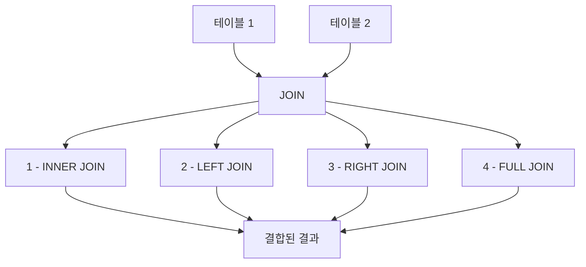
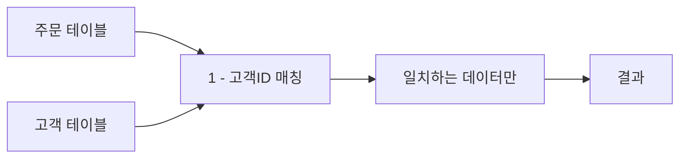
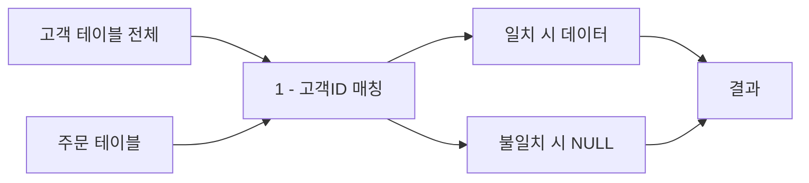
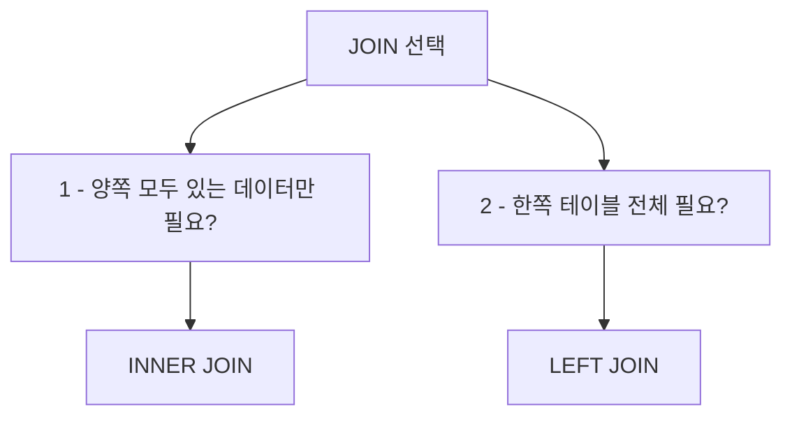

# 1. JOIN이란?

`JOIN`은 두 개 이상의 테이블을 결합하여 관련된 데이터를 조회할 때 사용되는 SQL 구문입니다. <highlight>여러 테이블에서 필요한 데이터를 한 번에 가져오고 싶을 때, 공통된 키를 기준으로 테이블을 결합하여 다양한 결과를 얻을 수 있습니다.</highlight>



**JOIN의 필요성:**
- 정규화된 데이터베이스에서 분산된 정보를 통합
- 관계형 데이터의 연관성을 활용한 조회
- 중복 데이터 없이 효율적인 데이터 관리

이번 장에서는 가장 많이 사용되는 `INNER JOIN`과 `LEFT JOIN` 2개를 실습하며 각 JOIN의 특징을 알아보겠습니다.

## 1.1 INNER JOIN

<highlight>INNER JOIN은 두 테이블에서 공통된 열(키 값)이 일치하는 데이터만 반환합니다.</highlight> 테이블 간 일치하는 데이터가 없으면 결과에 포함되지 않습니다.



**INNER JOIN의 특징:**
- 양쪽 테이블 모두에 존재하는 데이터만 반환
- 가장 일반적으로 사용되는 JOIN 유형
- NULL 값이 있는 경우 해당 행은 제외됨

**활용 사례:**
- 주문한 고객의 정보 조회
- 재고가 있는 상품의 카테고리 정보 조회
- 배정된 담당자가 있는 프로젝트 조회

### 기본 사용

```sql
SELECT 주문.주문ID, 고객.이름, 주문.주문날짜
FROM 주문
INNER JOIN 고객 ON 주문.고객ID = 고객.고객ID;
```
::a[실습환경 바로가기]{class='btn-link' href="https://sql.weniv.co.kr/?code=SELECT%20%EC%A3%BC%EB%AC%B8.%EC%A3%BC%EB%AC%B8ID%2C%20%EA%B3%A0%EA%B0%9D.%EC%9D%B4%EB%A6%84%2C%20%EC%A3%BC%EB%AC%B8.%EC%A3%BC%EB%AC%B8%EB%82%A0%EC%A7%9C%0AFROM%20%EC%A3%BC%EB%AC%B8%0AINNER%20JOIN%20%EA%B3%A0%EA%B0%9D%20ON%20%EC%A3%BC%EB%AC%B8.%EA%B3%A0%EA%B0%9DID%20%3D%20%EA%B3%A0%EA%B0%9D.%EA%B3%A0%EA%B0%9DID%3B" target="_blank"}

이 쿼리는 `주문` 테이블과 `고객` 테이블에서 공통된 `고객ID`를 기준으로 결합하여, 고객의 이름과 주문 날짜를 조회합니다.

### 실무 예제

```sql
-- 주문 상세 정보 조회 (고객명, 주문일, 주문금액)
SELECT
    주문.주문ID,
    고객.이름 AS 고객명,
    고객.연락처,
    주문.주문날짜,
    주문.총액
FROM 주문
INNER JOIN 고객 ON 주문.고객ID = 고객.고객ID
ORDER BY 주문.주문날짜 DESC;

-- 3개 테이블 JOIN: 주문 + 고객 + 주문상세
SELECT
    주문.주문ID,
    고객.이름 AS 고객명,
    상품.상품명,
    주문상세.수량,
    주문상세.가격,
    주문상세.수량 * 주문상세.가격 AS 소계
FROM 주문
INNER JOIN 고객 ON 주문.고객ID = 고객.고객ID
INNER JOIN 주문상세 ON 주문.주문ID = 주문상세.주문ID
INNER JOIN 상품 ON 주문상세.상품ID = 상품.상품ID
WHERE 주문.주문날짜 >= DATE('now', '-30 days');

-- 카테고리별 판매 현황
SELECT
    카테고리.카테고리명,
    COUNT(DISTINCT 주문상세.주문ID) AS 주문건수,
    SUM(주문상세.수량) AS 총판매수량,
    SUM(주문상세.수량 * 주문상세.가격) AS 총매출
FROM 주문상세
INNER JOIN 상품 ON 주문상세.상품ID = 상품.상품ID
INNER JOIN 카테고리 ON 상품.카테고리ID = 카테고리.카테고리ID
GROUP BY 카테고리.카테고리명
ORDER BY 총매출 DESC;
```

## 1.2 LEFT JOIN

<highlight>LEFT JOIN은 왼쪽(기준) 테이블의 모든 행을 반환하고, 오른쪽(조인된) 테이블에서 일치하는 데이터가 없으면 NULL 값을 반환합니다.</highlight> 일치하는 데이터가 없는 경우에도 왼쪽 테이블의 모든 데이터가 반환됩니다.



**LEFT JOIN의 특징:**
- 왼쪽(기준) 테이블의 모든 데이터 보존
- 오른쪽 테이블에 매칭되는 데이터가 없으면 NULL 반환
- 누락된 관계를 찾을 때 유용

**활용 사례:**
- 주문하지 않은 고객 찾기
- 할당되지 않은 리소스 확인
- 전체 목록과 실적 비교

### 기본 사용

```sql
SELECT 고객.이름, 주문.주문ID
FROM 고객
LEFT JOIN 주문 ON 고객.고객ID = 주문.고객ID;
```
::a[실습환경 바로가기]{class='btn-link' href="https://sql.weniv.co.kr/?code=SELECT%20%EA%B3%A0%EA%B0%9D.%EC%9D%B4%EB%A6%84%2C%20%EC%A3%BC%EB%AC%B8.%EC%A3%BC%EB%AC%B8ID%0AFROM%20%EA%B3%A0%EA%B0%9D%0ALEFT%20JOIN%20%EC%A3%BC%EB%AC%B8%20ON%20%EA%B3%A0%EA%B0%9D.%EA%B3%A0%EA%B0%9DID%20%3D%20%EC%A3%BC%EB%AC%B8.%EA%B3%A0%EA%B0%9DID%3B" target="_blank"}

이 쿼리는 `고객` 테이블의 모든 고객을 반환하며, 해당 고객이 주문한 내역이 있으면 함께 조회되고, 주문 내역이 없는 고객의 경우 `NULL`로 표시됩니다.

### 실무 예제

```sql
-- 주문하지 않은 고객 찾기
SELECT
    고객.고객ID,
    고객.이름,
    고객.이메일
FROM 고객
LEFT JOIN 주문 ON 고객.고객ID = 주문.고객ID
WHERE 주문.주문ID IS NULL;

-- 고객별 주문 통계 (주문이 없는 고객도 포함)
SELECT
    고객.이름,
    COUNT(주문.주문ID) AS 주문수,
    COALESCE(SUM(주문.총액), 0) AS 총구매금액,
    CASE
        WHEN COUNT(주문.주문ID) = 0 THEN '미구매고객'
        WHEN COUNT(주문.주문ID) <= 2 THEN '일반고객'
        ELSE '우수고객'
    END AS 고객등급
FROM 고객
LEFT JOIN 주문 ON 고객.고객ID = 주문.고객ID
GROUP BY 고객.고객ID, 고객.이름
ORDER BY 총구매금액 DESC;

-- 최근 3개월 내 주문이 없는 고객 (이탈 위험 고객)
SELECT
    고객.고객ID,
    고객.이름,
    고객.연락처,
    MAX(주문.주문날짜) AS 마지막주문일,
    ROUND(JULIANDAY('now') - JULIANDAY(MAX(주문.주문날짜))) AS 미주문일수
FROM 고객
LEFT JOIN 주문 ON 고객.고객ID = 주문.고객ID
GROUP BY 고객.고객ID, 고객.이름, 고객.연락처
HAVING MAX(주문.주문날짜) < DATE('now', '-90 days')
    OR MAX(주문.주문날짜) IS NULL
ORDER BY 마지막주문일;

-- 카테고리별 상품 및 판매 현황 (판매 실적이 없는 카테고리도 포함)
SELECT
    카테고리.카테고리명,
    COUNT(DISTINCT 상품.상품ID) AS 등록상품수,
    COUNT(DISTINCT 주문상세.주문ID) AS 판매건수,
    COALESCE(SUM(주문상세.수량), 0) AS 총판매수량,
    COALESCE(SUM(주문상세.수량 * 주문상세.가격), 0) AS 총매출
FROM 카테고리
LEFT JOIN 상품 ON 카테고리.카테고리ID = 상품.카테고리ID
LEFT JOIN 주문상세 ON 상품.상품ID = 주문상세.상품ID
GROUP BY 카테고리.카테고리ID, 카테고리.카테고리명
ORDER BY 총매출 DESC;
```

---

## 2. INNER JOIN vs LEFT JOIN 비교



**선택 기준:**
- **INNER JOIN**: 양쪽 테이블에 모두 존재하는 데이터만 필요할 때
  - 예: 실제 주문한 고객의 정보만 조회
  - 예: 배정된 담당자가 있는 프로젝트만 조회

- **LEFT JOIN**: 기준 테이블의 모든 데이터가 필요하고, 관련 데이터가 있으면 함께 조회할 때
  - 예: 전체 고객 목록과 주문 여부 확인
  - 예: 모든 상품과 판매 실적 조회

### 실전 예제: 같은 데이터로 두 JOIN 비교

```sql
-- INNER JOIN: 주문한 고객만 (10명)
SELECT
    고객.이름,
    COUNT(주문.주문ID) AS 주문수
FROM 고객
INNER JOIN 주문 ON 고객.고객ID = 주문.고객ID
GROUP BY 고객.고객ID, 고객.이름;

-- LEFT JOIN: 모든 고객 (주문 안한 고객도 포함, 15명)
SELECT
    고객.이름,
    COUNT(주문.주문ID) AS 주문수
FROM 고객
LEFT JOIN 주문 ON 고객.고객ID = 주문.고객ID
GROUP BY 고객.고객ID, 고객.이름;
```

---

## 마무리

JOIN은 관계형 데이터베이스의 핵심 기능으로, 여러 테이블에 분산된 데이터를 효과적으로 결합하여 조회할 수 있게 해줍니다.

**JOIN 활용 팁:**
- 적절한 인덱스를 사용하면 JOIN 성능이 크게 향상됩니다
- 테이블 별칭(alias)을 사용하면 쿼리가 간결해집니다
- WHERE 조건은 JOIN 조건과 명확히 구분하세요
- LEFT JOIN에서 NULL 체크를 활용하여 누락된 관계를 찾을 수 있습니다

다음 장에서는 더 복잡한 데이터 조작과 서브쿼리에 대해 알아보겠습니다.