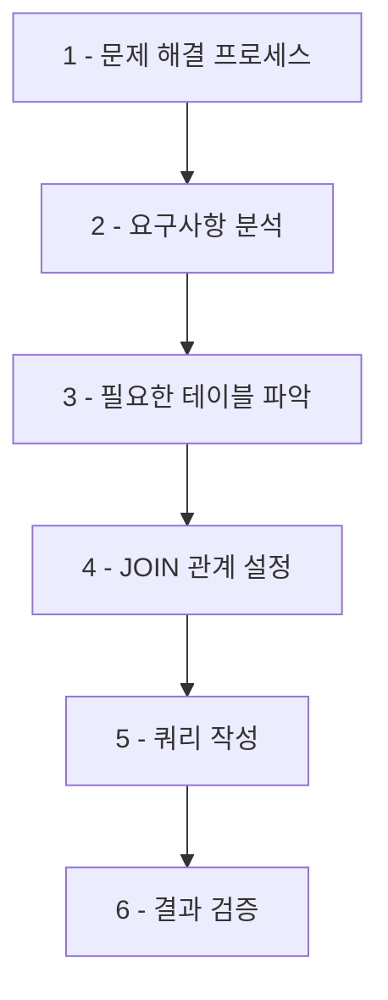
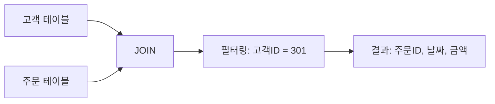
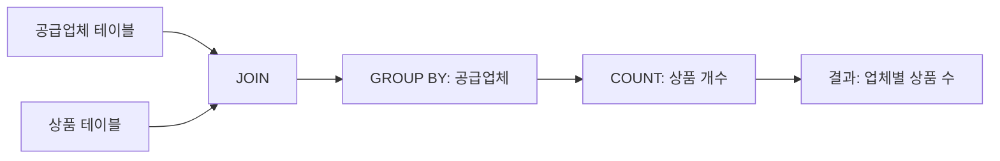

# SQL 실습 문제

이번 장에서는 지금까지 학습한 SQL 개념들을 종합적으로 활용하는 실습 문제를 다룹니다. <highlight>각 문제는 실무에서 자주 접하게 되는 데이터 조회 시나리오를 기반으로 구성되었습니다.</highlight>

## 문제 1: 특정 카테고리의 상품 정보 조회

**문제**: "디지털" 카테고리에 속하는 모든 상품의 이름과 가격을 조회하는 쿼리를 작성하세요.

**힌트**: 카테고리 테이블과 상품 테이블을 `JOIN`하여 해결합니다.

### 문제 접근 방법

**핵심 포인트**:
- 카테고리 테이블과 상품 테이블 간의 관계를 파악해야 합니다
- `JOIN` 조건에 사용할 공통 컬럼(외래키)을 확인하세요
- `WHERE` 절을 사용하여 특정 카테고리를 필터링합니다

## 문제 2: 고객의 주문 내역 확인

**문제**: 주문 테이블과 고객 테이블을 이용하여, `고객ID`가 301인 고객의 모든 주문 내역(주문ID, 주문날짜, 총주문금액)을 조회하는 쿼리를 작성하세요.

### 문제 접근 방법

**핵심 포인트**:
- 고객 테이블과 주문 테이블의 연결 관계를 확인하세요
- 특정 고객의 데이터만 필터링하는 조건을 추가합니다
- 필요한 컬럼만 `SELECT` 절에 명시하세요

## 문제 3: 공급업체별 상품 개수 조회

**문제**: 각 공급업체가 공급하는 상품의 개수를 조회하는 쿼리를 작성하세요.

**힌트**: 공급업체 테이블과 상품 테이블을 `GROUP BY`로 결합하여 해결합니다.

### 문제 접근 방법

**핵심 포인트**:
- `GROUP BY`를 사용하여 공급업체별로 데이터를 그룹화합니다
- `COUNT()` 함수를 사용하여 각 그룹의 상품 개수를 계산하세요
- 공급업체 이름과 함께 상품 개수를 표시하면 더 읽기 쉬운 결과가 됩니다

## 문제 풀이 체크리스트

문제를 해결할 때 다음 사항을 확인하세요:

1. **테이블 관계 파악**: 어떤 테이블들이 필요하고, 어떻게 연결되는지 확인했나요?
2. **JOIN 조건 설정**: 올바른 컬럼으로 테이블을 연결했나요?
3. **필터 조건 적용**: 필요한 데이터만 추출하기 위한 `WHERE` 절을 작성했나요?
4. **집계 함수 사용**: 그룹화가 필요한 경우 `GROUP BY`와 적절한 집계 함수를 사용했나요?
5. **결과 검증**: 쿼리 결과가 문제의 요구사항을 충족하는지 확인했나요?