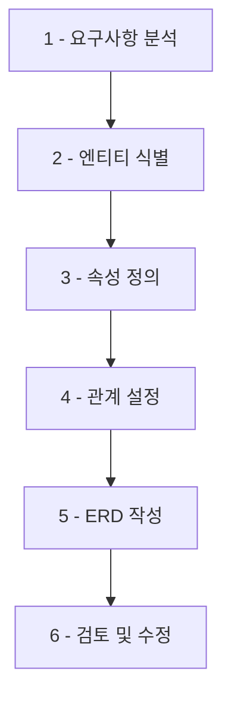
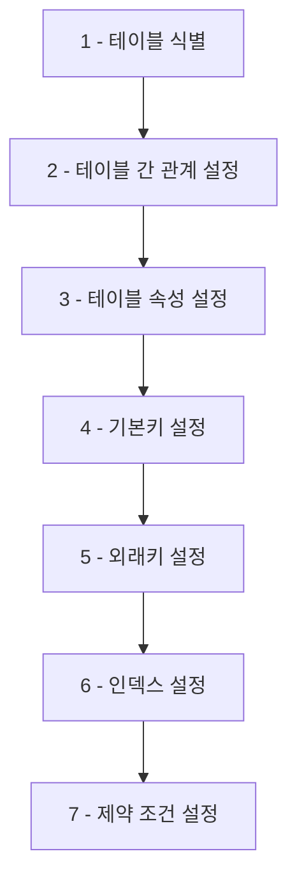

# 부록: ERD 작성 가이드

ERD(Entity-Relationship Diagram)는 데이터베이스 설계의 핵심 도구입니다. <highlight>데이터베이스를 구축하기 전에 테이블 구조와 관계를 시각적으로 설계함으로써, 효율적이고 확장 가능한 데이터베이스를 만들 수 있습니다.</highlight>



## 1. ERD를 그리는 서비스

데이터베이스 설계를 위해 ERD를 그리는 일은 매우 중요합니다. ERD는 데이터베이스의 구조를 시각적으로 표현한 다이어그램으로, 테이블 간의 관계를 파악하고 데이터베이스를 구성하는 데 도움이 됩니다.

### 추천 ERD 작성 도구

다음은 실무에서 많이 사용되는 ERD 작성 도구들입니다:

**1. DrawDB**
- URL: https://www.drawdb.app/
- 특징: 직관적인 인터페이스, 무료 사용 가능
- 추천 대상: ERD 입문자, 간단한 프로젝트

**2. dbdiagram.io**
- URL: https://dbdiagram.io/
- 특징: 코드 기반 ERD 작성, 팀 협업 지원
- 추천 대상: 개발자, 중급 이상 사용자

**3. ERDCloud**
- URL: https://www.erdcloud.com/
- 특징: 한글 지원, 직관적인 UI
- 추천 대상: 국내 사용자, 팀 프로젝트

**4. draw.io (diagrams.net)**
- URL: https://app.diagrams.net/
- 특징: 다양한 다이어그램 지원, 무료
- 추천 대상: 범용 다이어그램 도구 필요 시

### 실무 사례: Studyin ERD

아래 이미지는 [Studyin](https://www.studyin.co.kr/) 서비스의 초기 모델 ERD입니다. 현재 ERD는 아니며, 실제 서비스는 이보다 훨씬 복잡한 구조를 가지고 있습니다.


**ERD 분석 포인트**:
- 각 테이블의 역할과 책임을 명확히 파악하세요
- 테이블 간의 관계(1:1, 1:N, N:M)를 확인하세요
- 주요 속성과 데이터 타입을 검토하세요

## 2. ERD를 AI로 그리는 방법

ERD를 그리는 일은 매우 중요하지만, 시간이 많이 소요될 수 있습니다. 최근에는 AI 서비스를 활용하여 ERD를 빠르게 작성할 수 있습니다.

### AI를 활용한 ERD 작성 프로세스


### ChatGPT, Claude 활용하기

다음과 같이 AI에게 요청할 수 있습니다:

**예시 프롬프트**:
```
"머메이드를 이용해서 온라인 쇼핑몰의 ERD를 그려줘.
필요한 테이블: 회원, 상품, 주문, 주문상세, 카테고리"
```

AI가 생성한 Mermaid 코드를 [Mermaid Live Editor](https://mermaid.live/edit)에 붙여넣으면 시각적으로 확인할 수 있습니다.

### AI 기반 ERD 도구

**1. postgres.new**
- URL: https://postgres.new/
- 특징: 브라우저에서 바로 사용 가능한 AI 지원 Postgres 샌드박스
- 장점: 자연어로 데이터베이스 설계 가능

**2. Mermaid AI**
- URL: https://www.mermaidchart.com/mermaid-ai
- 특징: 텍스트 설명을 Mermaid 다이어그램으로 자동 변환
- 장점: 빠른 프로토타이핑

### AI 활용 시 주의사항

1. **검증 필수**: AI가 생성한 ERD는 반드시 검토하고 수정해야 합니다
2. **요구사항 명확화**: 구체적이고 명확한 요구사항을 제공하세요
3. **반복 개선**: 한 번에 완벽한 결과를 기대하지 말고, 점진적으로 개선하세요

## 3. ERD를 그리는 방법

체계적인 ERD 작성을 위한 단계별 가이드입니다.

### ERD 작성 7단계



**1. 테이블 식별**
- 비즈니스 도메인에서 핵심 엔티티를 찾아냅니다
- 예: 쇼핑몰 → 회원, 상품, 주문, 결제 등

**2. 테이블 간의 관계 설정**
- 1:1, 1:N, N:M 관계를 정의합니다
- 관계의 방향성과 필수/선택 여부를 결정합니다

**3. 테이블의 속성 설정**
- 각 테이블에 필요한 컬럼을 정의합니다
- 적절한 데이터 타입을 선택합니다

**4. 테이블의 기본키 설정**
- 각 레코드를 고유하게 식별할 수 있는 기본키를 설정합니다
- 자연키(Natural Key) vs 대리키(Surrogate Key)를 고려합니다

**5. 테이블의 외래키 설정**
- 테이블 간 관계를 구현하기 위한 외래키를 설정합니다
- 참조 무결성을 보장합니다

**6. 테이블의 인덱스 설정**
- 자주 조회되는 컬럼에 인덱스를 설정합니다
- 성능과 저장공간의 균형을 고려합니다

**7. 테이블의 제약 조건 설정**
- NOT NULL, UNIQUE, CHECK 등의 제약 조건을 정의합니다
- 데이터 무결성을 보장합니다

### ERD 학습의 중요성

<highlight>ERD는 데이터베이스를 설계하기 전 가장 중요한 단계입니다.</highlight> 단순히 데이터베이스만 잘 설계하면 되는 것이 아니라, 비즈니스 요구사항 분석도 함께 수행해야 합니다.

**ERD 학습 시 주의사항**:
- ERD는 이 부록 한 챕터로 다루기에는 그 중요성과 복잡성이 매우 높습니다
- 요구사항 분석, 정규화, 성능 최적화 등 다양한 주제를 포괄합니다
- 실무 프로젝트를 통해 경험을 쌓는 것이 가장 효과적입니다

**추가 학습 자료**:
- 데이터베이스 정규화 이론
- 엔티티-관계 모델링 기법
- 실무 ERD 사례 연구
- 데이터 모델링 패턴

ERD 작성 능력은 백엔드 개발자, 데이터베이스 관리자에게 필수적인 역량입니다. 충분한 시간을 투자하여 체계적으로 학습하시기 바랍니다.