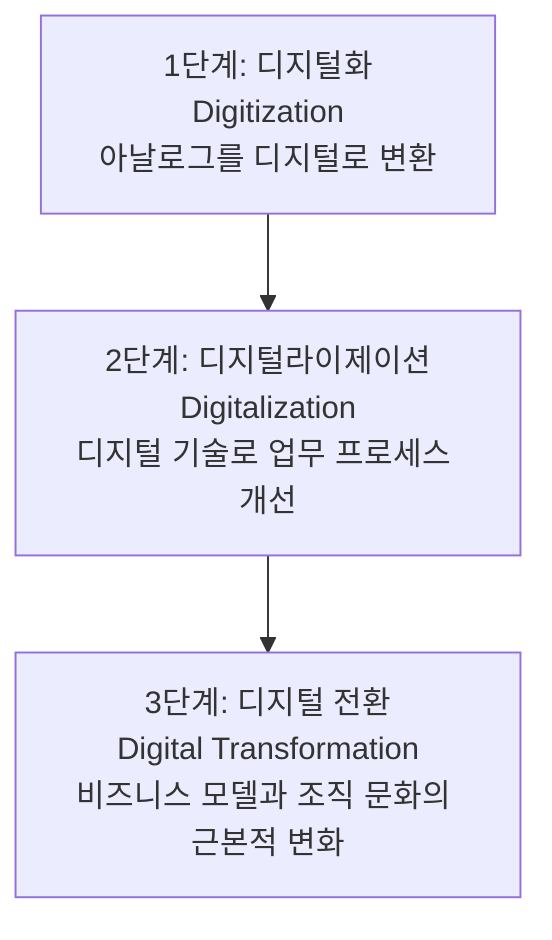

## 1.1 DX(Digital Transformation)란?

디지털 전환(Digital Transformation, DX)은 디지털 기술을 활용하여 기업의 비즈니스 모델, 조직 문화, 업무 프로세스를 근본적으로 변화시키는 것을 의미합니다.

### 1.1.1 DX의 요소

1. **프로세스 디지털화**: 종이 기반의 업무를 전산화하고 자동화
2. **데이터 중심 의사결정**: 경험이 아닌 데이터를 기반으로 판단
3. **업무 효율성 향상**: 반복적인 작업의 자동화
4. **기업 경쟁력 강화**: 디지털 기술을 활용한 새로운 비즈니스 모델 창출

### 1.1.2 DX의 단계



## 1.2 AX(AI Transformation)란?

AI 전환(AI Transformation, AX)은 인공지능 기술을 활용하여 업무 방식과 비즈니스를 혁신하는 것입니다. 특히 생성형 AI의 등장으로 AX는 선택의 영역에서 생존의 영역으로 그 의미가 확대되고 있습니다.

### 1.2.1 AX의 요소

1. **생산성 혁명**: 단순 반복 업무를 AI가 대신 처리
2. **창의성 증폭**: AI를 활용한 아이디어 생성 및 개선
3. **의사결정 지원**: 데이터 분석을 통한 인사이트 도출
4. **가치 창출**: AI를 활용한 새로운 제품 및 서비스 개발, 제품의 재구성, 제품의 지능화

### 1.2.2 DX vs AX

| 구분 | DX | AX |
|------|----|----|
| **핵심 기술** | 클라우드, 모바일, IoT | AI, 머신러닝, 생성형 AI |
| **목적** | 디지털화를 통한 효율성 | AI를 통한 지능화 |
| **적용 분야** | 프로세스 자동화 | 의사결정 지원, 콘텐츠 및 제품 생성 |
| **주요 효과** | 업무 효율성 향상 | 생산성 및 창의성 증대, 지능화로 도약 |

## 1.3 왜 지금 AX가 중요한가?

### 1.3.1 생성형 AI의 민주화

과거 AI는 전문가의 영역이었지만, ChatGPT, Claude와 같은 생성형 AI의 등장으로 누구나 AI를 활용할 수 있게 되었습니다.

```
과거: AI 전문가만 활용 → 특정 업무에만 적용
현재: 모든 직군이 활용 → 모든 업무에 적용 가능
```

claude code, codex, copilot, gemini cli 등 로컬 컴퓨터 기반의 다양한 도구가 출시 되면서 이제 개인 PC에서 모든 직군에게 AI 활용이 가능해졌습니다.

### 1.3.2 압도적인 생산성 향상

생성형 AI를 활용하면 다음과 같은 생산성 향상을 기대할 수 있습니다.

- **문서 작성**: 이제 컴퓨터에 문서를 읽고, 요약하고, 작성하는 일을 시킬 수 있습니다.(Claude Code) 회의록을 음성으로 녹음하여 요약하고 문서로 작성하는 것도 가능합니다.(Notion)
- **코드 개발**: GitHub Copilot, Claude Code 등을 활용하면 코드 작성, 디버깅, 리팩토링 등 개발 업무의 많은 부분을 자동화할 수 있습니다.
- **디자인 작업**: Midjourney, Figma AI 등을 활용하여 이미지 생성, 디자인 시안 제작 등을 빠르게 수행할 수 있습니다.
- **콘텐츠 제작**: 마케팅 카피, 블로그 글, 소셜 미디어 콘텐츠 등을 AI가 작성해 줍니다.
- **번역 및 커뮤니케이션**: 다국어 번역, 이메일 작성 등 커뮤니케이션 업무를 지원합니다.
- **연구 및 조사**: NotebookLM을 활용하여 방대한 양의 정보를 빠르게 수집하고 요약할 수 있습니다.
- **데이터 분석**: 데이터 분석 업무를 자동화하고 인사이트를 도출할 수 있습니다.
- **고객 응대**: 고객 문의에 대한 자동 응답 및 지원을 제공합니다.

### 1.3.3 비용 대비 효과

월 2~3만원의 투자로 직원 1명의 생산성을 20 ~ 30% 향상시킬 수 있습니다. 이는 커피 2-3잔 가격으로 인력을 추가 채용한 것과 같은 효과입니다.

다만 이러한 생산성 향상이 모든 직군에 동일하게 적용되지 않으며, 인간의 업무 병목성으로 인해 일부 직군에서는 드라마틱한 향상이 나타나지 않을 수 있습니다. 일부 직군에서는 마이너스 성장을 보이기도 했습니다.

## 1.4 AX 도입의 3단계

### 1.4.1 개인 단위 활용

- 직원들이 개별적으로 ChatGPT, Claude 등을 업무에 활용
- 문서 작성, 아이디어 도출, 번역 등 개인 생산성 도구로 사용

### 1.4.2 팀 단위 활용

- 팀 차원에서 AI 도구를 표준화하고 공유
- 프롬프트 템플릿 공유, 업무 프로세스에 AI 통합

### 1.4.3 조직 단위 전환

- 전사적 AI 전략 수립 및 실행(CAIO 임명 등)
- AI 기반의 새로운 비즈니스 모델 개발
- 프롬프트 템플릿 라이브러리 구축
- 자체 AI 시스템 구축 및 운영

## 1.5 정리

- **DX**는 디지털 기술로 업무를 효율화하는 것
- **AX**는 AI로 업무를 지능화하는 것
- 생성형 AI의 등장으로 **모든 직군**이 AI를 활용할 수 있는 시대
- 적은 비용으로 **큰 생산성 향상** 가능
- 개인 → 팀 → 조직 순서로 점진적 도입 권장