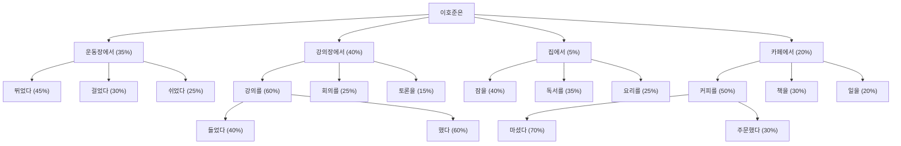

# 1. 프롬프트의 기본 개념과 예제

프롬프트는 컴퓨터 시스템에서 사용자의 입력을 기다리는 상태를 의미하는 오래된 개념입니다. 이는 단순히 최신 AI 모델인 ChatGPT와 같은 도구에만 국한되지 않고, 컴퓨터 역사 전반에 걸쳐 사용된 오래된 개념이죠. 아래와 같이 터미널에서 커서가 깜빡이며 사용자의 명령어 입력을 기다리는 상태도 하나의 프롬프트입니다.


최근 **AI 및 대화형 인터페이스의 발전으로 프롬프트의 개념은 더욱 확장**되었습니다. 대규모 언어 모델(LLM)과 함께 프롬프트는 단순한 입력 요청을 넘어, AI 시스템과의 상호작용을 하는 공간으로 변하였습니다.

아래 이미지에서 저는 Claude에게 인스타그램을 똑같이 만들라는 프롬프트를 입력했고, Claude는 이를 위한 코드와 실행 결과를 보여주고 있습니다.


ChatGPT에서도 별도 설정 없이 프롬프트를 통해 그래프와 같은 다양한 결과물을 받을 수 있습니다.


# 2. 프롬프트 엔지니어링의 중요성

우리는 **프롬프트로 다양한 형태의 결과물을 받아볼 수 있게 되었습니다. 인간이 사용하는 '자연어'를 사용**해서 말이죠. 

프롬프트로 더 많은 작업을 수행할 수 있게 되면서 AI 모델이 정확하고 유용한 결과를 만들어내도록 프롬프트를 설계하고 최적화하는 기술은 더욱 중요해졌습니다. 특히 GPT-3, GPT-4와 같은 고급 언어 모델이 등장하면서, 프롬프트 엔지니어링의 중요성은 더 커졌습니다.

단순히 즉흥적으로 생각나는 질문을 작성하는 것이 아니라 원하는 것을 얻기 위한 **전략적 접근**이 필요해진거죠. 예를 들어, 수학 풀이는 LLM이 잘 못하는 부분 중 하나입니다. 이는 LLM이 발전해도 마찬가지일 것입니다. LLM은 확률에 근거해서 텍스트를 생성하기 때문이죠. 이를 해결하기 위해 CoT 기법 등이 있습니다. 이러한 기법을 잘 활용하면 **결과의 품질과 정확도**를 크게 올릴 수 있습니다. 이는 AI 모델의 잠재력을 최대한 끌어내는 데 프롬프트 엔지니어링이 핵심적인 역할을 한다는 것을 의미합니다.

**또한 잘 구조화된 프롬프트는 반복적으로 사용**할 수 있어 **자산화** 할 수 있고, 이를 통해 일정한 퀄리티의 결과를 낼 수 있 수 있습니다. 이는 업무 프로세스의 표준화와 자동화로 이어져 개인과 기업의 생산성을 크게 올릴 수 있죠. 예를 들어, 위니브에서 사용 중인 '디자인 프롬프트 시스템'은 반복적인 페이지 작업을 효율적으로 처리하여, 업무의 신속성과 정확성을 크게 높여줍니다.

마지막으로 **프롬프트 엔지니어링은 AI가 잘못된 정보를 생성하는 할루시네이션 문제를 줄이는 데에도 중요한 역할**을 합니다. 특히 최신 데이터가 반영되지 않거나, 오류를 일으킬 수 있는 상황에서, 적절하게 설계된 프롬프트는 AI가 더 정확한 응답을 제공할 수 있도록 만듭니다.

프롬프트 엔지니어링은 AI의 잠재력을 최대한 발휘하고, 인간과 AI의 상호작용을 최적화하는 데 필수적인 기술입니다. 앞으로 AI 기술이 더욱 발전할수록, 프롬프트 엔지니어링의 중요성은 지속적으로 증가할 것으로 예상됩니다.

:::div{.callout}
모든 프롬프트 엔지니어링이 프롬프트 안으로 들어와서 결국 아무것도 소용없을 것이라는 무용론도 있습니다. 다만 프롬프트 엔지니어링이 AI 모델의 한계를 극복하고, 더 나은 결과를 얻기 위한 중요한 도구라는 점은 분명합니다.
:::

# 3. 프롬프트 활용방법 5단계

1. 유저 - 프롬프트 - 생성형AI - 답변 - 별도 SW
    - 예를 들어, 머메이드와 같은 도구를 활용하는 것을 의미합니다.

2. 유저 - 프롬프트 - 생성형AI - 생성형AI 도구 - 답변
    - 예를 들어, 압축을 풀게 한다던지, PDF를 읽게 한다던지, 웹 페이지에서 정보를 가져오는 것이나 이미지에서 텍스트를 추출하는 것 등을 의미합니다.

3. 유저 - 프롬프트 요구 - 생성형AI - 프롬프트 생성 - 생성형AI - 답변
    - 예를 들어, 프롬프트 템플릿을 요구하는 것을 의미합니다.

4. 프롬프트 엔지니어링
    - 아래서 배울 프롬프트 엔지니어링을 의미합니다. 

5. 프롬프트 라이브러리
    - 이미 만들어진 프롬프트 라이브러리를 활용하는 것을 의미합니다. 회사에서 직접 구축할 수도 있으며, 구축된 것을 가져와서 사용할 수 있습니다. 예를 들어, [PromptHero](https://prompthero.com/), [포켓 프롬프트](https://pocket-prompt.com/prompt/text)와 같은 사이트에서 프롬프트를 가져오는 것을 의미합니다.

# 4. 좋은 프롬프트 만들기

효과적인 프롬프트 작성은 AI와의 상호작용을 최적화하는 데 핵심적인 역할을 합니다. AI의 성능을 극대화하기 위해 다양한 전략과 기법이 개발되어 왔습니다.

지금은 ChatGPT, Claude와 같은 곳에서 프롬프트 엔지니어링을 소개하고, 이를 통해 AI와의 상호작용을 개선하기 위한 다양한 기법을 제시하고 있습니다.

링크: https://docs.claude.com/en/docs/build-with-claude/prompt-engineering/overview

좋은 프롬프트에는 다음과 같은 요소들이 포함됩니다.

```
1. 역할 (Role): AI가 어떤 역할을 해야 하는지 - 선택
2. 맥락 (Context): 배경 정보와 상황 설명
3. 작업과 절차 (Task and Procedure): 구체적으로 무엇을 해야 하는지
4. 형식 또는 예시 (Format or Example): 결과물의 형태와 스타일
```

좋지 못한 프롬프트는 아래와 같습니다. 단순히 한 줄로 요구사항만 짧게 적은 경우죠. 이렇게 되었을 때 통계적으로도 좋은 결과가 나오기 어렵지만, 이 결과물의 답변을 기다리고 읽어보는데 시간을 더 쓴다는 사실을 기억해야 합니다.

```md
마케팅 글 써줘
```

구성 요소를 모두 작성한 프롬프트는 아래와 같습니다.

```md
역할: 너는 B2B 마케팅 전문가야.
맥락: 우리는 중소기업 대상 프로젝트 관리 툴을 출시했어. 이 툴은 다른 툴과 OOOO이 비교되고, OOOO한 문제를 해결할 수 있어. 대표적으로는 OOOO 장점이 있어.
작업: 제품 출시 이메일을 작성해줘.
형식: 제목(10자 이내) + 본문(200자) + CTA 버튼 문구
```

아래는 이러한 프롬프트를 작성하기 위한 템플릿입니다. 먼저 여러분의 목적을 ChatGPT, Claude와 같은 AI 모델에게 말하고, 아래와 같은 템플릿을 요구하셔도 좋습니다. 중요한 것은 AI에게 명확한 답변을 얻기 위해서는 '노력'을 해야 한다는 점입니다.

```md
[역할]
너는 [산업/분야]의 전문 콘텐츠 마케터야.

[맥락]
- 타겟 독자: [구체적인 독자층]
- 목적: [인지도 향상/리드 생성/교육 등]
- 톤앤매너: [전문적/친근한/유머러스 등]

[작업]
다음 주제로 블로그 글을 써줘: [주제]

[형식]
- 제목: [클릭을 유도하는 제목]
- 도입부: [독자의 관심을 끄는 질문이나 통계]
- 본문: [3-5개 소제목으로 구조화]
- 결론: [명확한 CTA (Call To Action)]
- 길이: 약 [글자 수]
```


## 4.1 상세한 정보 제공하기

**상세한 정보 제공하는 것은 텍스트 생성의 길을 제시하는 것과 같습니다.** AI에게 명확한 역할, 대상, 목표, 답변 형식, 예시 등을 구체적으로 제시하면 생성형AI가 다음 텍스트를 더 명확하게 예측할 수 있습니다.



결국 좋은 프롬프트란 좋은 답변이 나오게 하기 위한 확률을 높여줄 수 있는 모든 행위, 정보를 제공하는 것입니다.

## 4.2 여러번 질문해보기

AI와 대화할 때, 여러 창을 띄어놓고 똑같은 질문을 던져보는 것도 좋은 방법입니다. AI는 확률에 기반한 모델이기 때문에, 같은 질문이라도 매번 다른 답변이 나오게 됩니다. 여러 번 질문을 던져보고, 그 중에서 가장 적합한 답변을 선택하거나, 다양한 답변을 조합하여 최종 결과물을 만드는 것도 효과적인 전략입니다.

## 4.3 프롬프팅 기법 활용하기

아래와 같은 **프롬프팅 기법**을 활용하면 AI의 성능을 한 단계 더 끌어올릴 수 있습니다.

- **제로샷 프롬프팅 (Zero-shot Prompting)**: 인공지능이 특정 작업을 수행하기 위해 **사전 학습 없이 바로 답변을 생성하는 방식**입니다. 예를 들어, "고양이에 대해 설명해줘"라는 질문에 대해 고양이에 대한 정보를 제공하는 것입니다. 다만 이 방식은 효율이 그리 좋지 않습니다. 아래 그래프를 참고해주세요. 원샷이나 퓨샷을 권합니다.
    
    .](/images/essentials-chatgpt/03_1_7.png)
    
    Brown, T. B. 외 (2020). *Language models are few-shot learners*. arXiv, [https://arxiv.org/abs/2005.14165](https://arxiv.org/abs/2005.14165).
    
- **원샷 러닝 (One-shot Learning)**: 인공지능이 **단 하나의 예시만 보고 학습하여 유사한 작업을 수행하는 방식**입니다. 예를 들어, 아래와 같은 프롬프트가 원샷 러닝에 속합니다.
    
    ```
    이 문장을 아래와 같은 형식으로 번역해줘.
    
    (한국어)안녕: (영어)'hello'
    ```
    
- **퓨샷 러닝 (Few-shot Learning)**: 인공지능이 **몇 개의 예시를 보고 학습하여 유사한 작업을 수행하는 방식**입니다. 다만 위에도 나와있는 것처럼 예제를 아주 많이 준다고 하더라도 올라가는 퍼센테이지가 그리 높지 않으니 들어가는 노력에 비해 얼마나 효율을 높일 수 있을지 실험해봐야 합니다.
- **CoT (Chain of Thought)**: 인공지능이 문제를 해결하기 위해 **단계별로 생각 과정**을 거치는 방식입니다.이 방식은 특히 복잡한 문제나 수학 문제, 논리적 추론이 필요한 작업에 유용합니다.
    
    예를 들어, 수학 문제를 풀 때, 문제를 이해하고, 필요한 정보를 찾고, 단계별로 계산하여 답을 도출하는 과정을 step by step으로 예시를 주고, step by step로 풀게하는 방법입니다.
    
    예를 들어 CoT 기법은 아래와 같습니다.
    
    ```
    1 + 2 + 3은 아래와 같이 풀 수 있어.
    
    step1. 1에 2를 더한 결과는 3이야.
    step2. 앞에서 얻은 결과 3에 3을 더해 6이라는 결과를 얻을 수 있어.
    
    답은 6이야. 10 + 20 + 30은 정답이 무엇일까?
    ```
    
- **제로샷 CoT (Zero-shot Chain of Thought)**: 사전 학습 없이 문제를 단계별로 해결하는 방식입니다. 질문 뒤에 “step by step로 풀어줘”라는 말로 제로샷 CoT를 구현할 수 있습니다.
- **롤플레잉:** 롤을 정해서 질문하면 답변의 퀄리티가 **일부** 올라갑니다.

:::div{.callout}
롤플레잉을 하는 프롬프트와 그렇지 않은 프롬프트를 비교해보시는 것을 권해드립니다. 창을 4개정도 띄우고 2개는 롤플레잉 2개는 롤플레잉이 아닌 것으로 해주시면 좋을 것 같습니다.

- 롤 기반에 대한 것은 긍정적 측면과 부정적 측면의 연구가 있습니다. 따라서 이걸 하나의 프롬프트 기법으로 보는 것이 좋습니다.
    
[When “A Helpful Assistant” Is Not Really Helpful: Personas in System Prompts Do Not Improve Performances of Large Language Models](https://arxiv.org/html/2311.10054v3)
    
- 아래 글은 긍정과 부정 모두에 대한 연구 결과를 보여줍니다.

[PromptHub Blog: Role-Prompting: Does Adding Personas to Your Prompts Really Make a Difference?](https://www.prompthub.us/blog/role-prompting-does-adding-personas-to-your-prompts-really-make-a-difference)
:::


## 4.4 맞춤형 데이터 업데이트 하기

AI 모델의 지식 한계를 보완하기 위해 **데이터 업데이트와 맞춤화가** 중요합니다. 대부분의 AI 모델은 특정 시점까지의 데이터로 학습(**보통 1년 전 데이터**)되어 있으므로, 최신 정보나 특정 분야의 전문 지식이 필요한 경우 이를 프롬프트에 포함해야합니다.

ChatGPT의 'My GPTs' 기능을 통해 개인화된 모델을 생성할 수 있으며, 이를 통해 특정 도메인에 특화된 AI 어시스턴트를 만들 수 있습니다. 개발자들 사이에서는 이처럼 특수 목적의 GPT를 만드는 것을 파인튜닝한다고 얘기하는데요. 이제 이러한 파인튜닝을 개발자가 아니더라도 누구나 할 수 있게 되었습니다. `My GPTs`라는 이름으로요.


직접 만든 GPTs: [나만의 ChatGPT를 만들기 / 출처: 유튜브 채널 '제주코딩베이스캠프'](https://youtu.be/YoUtkkdDnDg)

## 4.5 적절한 언어 선택하기

언어 선택도 중요한 고려사항입니다. 많은 AI 모델이 주로 영어 데이터로 학습되었기 때문에, 복잡하거나 전문적인 주제에서는 영어로 프롬프트를 작성할 경우 더 정확하고 상세한 응답을 받을 수 있습니다.

그러나 이는 모델의 특성과 사용 환경, 시점에 따라 다를 수 있습니다. 지금은 언어 지원이 고도화 되어서 영어 답변과 한국어 답변이 크게 다르지 않습니다.

다만 이 두개의 질문의 답변이 다를 수 있다는 것을 인지하고, 다양한 언어로 여러번 질문하여 좋은 답변을 얻을 수 있는 가능성에 대해 열어두는 것이 좋습니다.

## 4.6 개인화 기능 활용하기

개인화 기능을 활용하면 더욱 맞춤화된 결과를 얻을 수 있습니다. ChatGPT, Claude는 모두 맞춤형 지침과 메모리를 가지고 있습니다. 맞춤형 지침은 '이모지를 사용하지 말아줘' 등에 지침으로 줄 수 있습니다. 아래 지침은 제가 사용하는 지침입니다.

```md
- 학문적, 교육적 맥락에 적합하게 전문적이면서도 명확한 설명을 제공합니다.
- 학생들에게 설명하듯 쉽게 풀어주되, 원하면 더 깊은 학술적 배경을 덧붙입니다.
- 코드 예시는 가급적 최신 표준과 모범 사례를 따르며, 교육용으로 직관적이고 깔끔하게 작성합니다.
- 필요할 경우 비유, 다이어그램 설명, 단계별 설명을 활용해 이해를 돕습니다.
- 연구자 및 교수로서 참고할 만한 최신 정보(논문, 기술 동향 등)는 최신 자료를 기반으로 보강합니다.
- 말투는 지나치게 딱딱하지 않고, 교수와 동료 연구자 또는 조교가 대화하는 듯한 친근하면서도 전문적인 톤을 유지합니다.
```

ChatGPT는 `설정` > `개인 맞춤 설정` 탭에 맞춤형 지침이 있습니다. Claude는 `설정`에 `일반`에 개인 선호 사항을 입력할 수 있는 란이 있습니다.

메모리 부분은 ChatGPT는 `설정` > `개인 맞춤 설정` > `메모리` 탭에 있습니다. Claude는 `설정` > `개인정보보호` 탭에 있습니다. Claude의 경우 이 메뉴를 `설정` > `기능` 탭에서도 켜거나 끌 수 있습니다.

:::div{.callout}
가족과 함께 사용하는 경우 메모리 기능을 끄시길 권해드립니다. 메모리 기능이 켜져 있으면, 이전 대화 내용이 저장되어 이후 대화에 영향을 미칠 수 있기 때문입니다. 예를 들어, 내가 질문한 내용의 답변 퀄리티로 아이의 질문에 답변할 수도 있습니다.
:::

## 4.7 다양한 문서 양식 활용하기

업무에서는 다양한 파일을 종합적으로 검토하거나, 이전에 작성된 문서들을 바탕으로 새로운 자료를 만들어야 할 때가 있습니다. 2024년 7월 기준으로 ChatGPT를 활용하면 압축 파일 내의 데이터를 찾거나 요약, 발췌할 수 있어 다양한 파일을 종합적으로 검토하는 데에 유용합니다.


Claude에는 최대 5개의 파일을 업로드하여 이를 결합한 프로젝트 형태로 처리할 수 있는 Claude Project 기능이 있습니다. 팀원들과 실시간으로 작업 내용을 공유하며, 아티팩트 기능을 통해 프로젝트 진행 상황을 시각적으로 확인할 수 있어 협업의 효율성이 크게 향상됩니다. 

다만 주의할 점이 있어요. 대량의 파일을 처리할 때는 파일의 정확도와 응답 품질이 저하될 수 있다는 점입니다. 고품질의 문서를 분류별로 모아두는 것이 매우 중요합니다. 이를 위해서는 정기적인 데이터 클렌징과 업데이트 프로세스를 구축하고, 문서의 품질 및 메타데이터 관리를 강화해야 합니다. 

이렇게 압축 파일만 가능한 것이 아닙니다. 워드나 엑셀 양식의 파일 양식으로 답변을 요구할 수 있습니다.


## 4.8 출력 결과 형식 정해주기

일반적인 텍스트 답변을 주기 보다는 아래와 같이 예시를 주면서 JSON이나 문서에 대한 양식을 지정해주면 답변의 '정확도'를 높일 수 있습니다. 답변의 퀄리티를 올리는 것이 아니라 '정확도'를 올린다는 점을 주목하시면 좋을 것 같습니다.

또 이렇게 만들어진 JSON 답변 등을 가지고 있으면 줄글로 표현해달라고 하여 원하는 답변의 형식으로 '변환'시키기도 쉽습니다.

:::div{.callout}
문단만 구분해도 답변에 퀄리티가 달라진다는 얘기도 있습니다. 이는 토큰을 분석할 때 띄어쓰기, 개행이 주제를 파악하기 더 좋게 만들어주기 때문입니다. 아래와 같은 형식으로 주는 것도 같은 맥락이라 할 수 있죠. 같은 방식으로 괄호로 프롬프트의 맥락을 알려주는 것도 좋은 방식입니다.
:::

```md
[프롬프트]
다음과 같은 JSON 형식으로 애플, 삼성, 구글의 최신 스마트폰 정보를 알려줘.

{
  "brand": "브랜드명",
  "model": "모델명",
  "release_date": "출시일",
  "key_features": [
    "주요기능1",
    "주요기능2",
    "주요기능3"
  ],
  "price": "출시가격(원)"
}
```

```md
[프롬프트]
아래 형식에 맞춰서 2024년 1분기 시장 동향 보고서를 작성해줘.

제목: [보고서 제목]

작성일: YYYY-MM-DD

1. 개요
- 분석 기간:
- 분석 범위:

2. 주요 시장 지표
A) 경제 지표
B) 산업 지표

3. 주요 이슈 분석
- 이슈 1:
- 이슈 2:
- 이슈 3:

4. 전망 및 제언

* 모든 항목은 200자 이내로 작성
```

이런 식으로 구체적인 보고서 템플릿을 제시하면, AI는 정확히 해당 구조를 따르면서 각 섹션의 글자 수 제한도 지킬 것입니다. 보고서나 문서 작성 시 일관된 구조를 유지하는 데 효과적입니다.

## 3.8 할루시네이션 줄이기

예를 들어, 위 프롬프트에서 주요 이슈 분석 등의 사실 분석을 할 때에는 아래와 같이 할루시네이션을 줄일 수 있는 프롬프트를 작성할 수 있습니다. 포인트는 '사실'과 '거짓'을 구분할 수 있는 프롬프트를 작성하게 해주는 것이죠.

특히 검증과 같은 경우, 검증의 규칙을 설정할 수 있습니다. GPT스스로 검증하게 하는 것이죠. 프롬프트로 모호한 것에 대한 검증 규칙 등을 설정할 수 있습니다. 배제의 규칙도 정할 수 있는데요. 이러한 '검증 초안' 조차도 GPT에게 물어볼 수 있습니다.

```md
[프롬프트]
아래 형식에 맞춰서 2024년 1분기 시장 동향 보고서를 작성해줘.

제목: [보고서 제목]

작성일: YYYY-MM-DD

1. 개요
- 분석 기간:
- 분석 범위:

2. 주요 시장 지표
A) 경제 지표
  - 사실:
  - GPT의 견해:
  - 추측:
  - 검증:
B) 산업 지표
  - 사실:
  - GPT의 견해:
  - 추측:
  - 검증:

3. 주요 이슈 분석
- 이슈 1:
  - 사실:
  - GPT의 견해:
  - 추측:
  - 검증:
  
- 이슈 2:
  - 사실:
  - GPT의 견해:
  - 추측:
  - 검증:
- 이슈 3:
  - 사실:
  - GPT의 견해:
  - 추측:
  - 검증:

4. 전망 및 제언

* 모든 항목은 200자 이내로 작성
```

# 4. 프롬프트 엔지니어링의 미래

프롬프트 엔지니어링은 계속해서 중요한 역할을 차지할까요? 이에 대해 두 가지 의견이 있습니다. 

먼저 '프롬프트 엔지니어링도 LLM이 학습해 최적화된 답변을 제공할 수 있다'라는 의견이 있습니다. 이제는 CoT(Chain of Thought)를 사용하지 않더라도, 수학적 지식 등 복잡한 문제에 대해 CoT 방식이 기본적으로 적용되어 더 나은 응답을 받을 수 있습니다.


그렇다고 해서 'LLM의 응답이 정교해지면서 질문의 정교함이 더 중요해질 것'이라는 두 번째 의견이 틀렸다고 볼 수는 없습니다. 실제로 LLM이 발전할수록 사용자가 원하는 구체적인 결과를 얻기 위해서는 더욱 세밀하고 전문적인 프롬프트 작성 능력이 필요해질 것입니다. 단순한 질문은 AI가 자동으로 최적화할 수 있지만, 특정 도메인의 전문적인 작업이나 창의적인 결과물을 만들어내기 위해서는 여전히 인간의 섬세한 지시와 맥락 제공이 필수적입니다. 따라서 프롬프트 엔지니어링은 사라지는 것이 아니라, 더욱 고도화되고 전문화된 형태로 진화할 가능성이 높습니다.