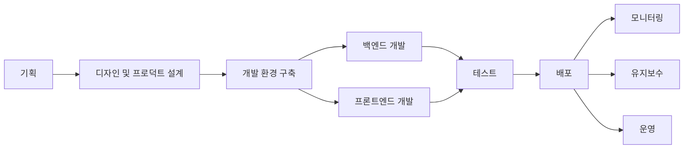
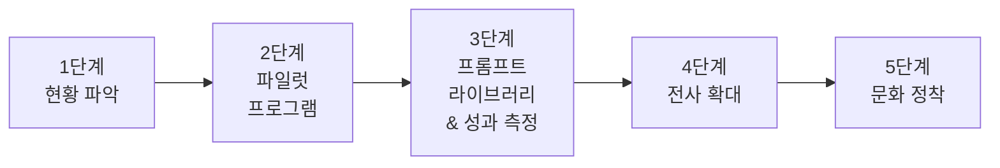
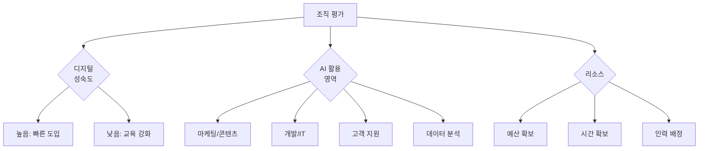
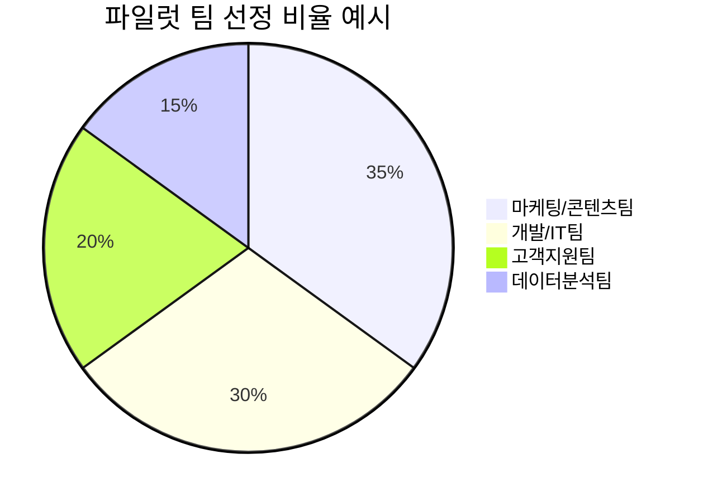
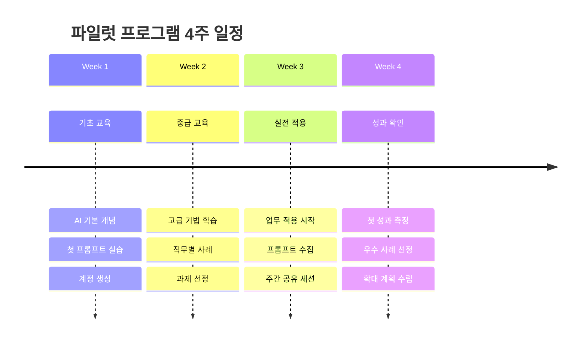

# 1. 조직에 AI 도입하기

개인이 AI를 사용하는 것과 조직 전체가 도입하는 것은 큰 차이가 있습니다. 예를 들어, 단지 프롬프트 몇 개로 프로젝트를 할 수 있는 개인과 달리 회사는 일관적인 품질과 보안, 효율성을 모두 고려해야 합니다. 이러한 고려사항들은 단지 개인이 몇 시간을 할애하여 달성할 수 있는 것이 아닙니다.

상황에 맞는 AI 도구 선정, 직원 교육, 프롬프트 라이브러리 구축, 성과 측정 등 다양한 요소들이 필요하죠. 또 이렇게 축적된 노하우는 제품을 개발하거나 서비스를 개선하는데 다시 활용이 되어야 합니다. 프로세스도 필요하며 권한도 필요하죠.

위니브는 CAIO를 두고 이러한 역할을 수행하고 있습니다. 회사 프로덕트 생산을 아래와 같은 단계로 나누어 보고 있습니다.

1. 기획
2. 디자인 및 프로덕트 설계
3. 개발 환경 구축
4. 백엔드 개발
5. 프론트엔드 개발
6. 테스트
7. 배포
8. 모니터링
9. 유지보수
10. 운영



성공적인 도입을 위해서는 권한, 체계적인 준비와 실행, 전사 교육, 단계별 성과물, 재활용 등을 고려해야 합니다. 무엇보다 **조직 맞춤형 프롬프트 라이브러리 구축**을 핵심으로 생각하고 있습니다. 이 장에서는 단계별 가이드를 제공합니다.



## 1.1 1단계: 현황 파악 및 준비

### 1.1.1 조직 평가

조직의 AI 도입 준비도를 평가하는 것이 첫 단계입니다. 평가 항목은 다음과 같습니다.

```
□ 디지털 성숙도
  - 클라우드 서비스 사용 정도
  - 데이터 관리 수준
  - 직원들의 기술 수용도

□ AI 활용 가능 영역
  - 반복적인 업무가 많은 부서
  - 데이터가 많이 발생하는 프로세스
  - 병목 지점

□ 리소스 확인
  - 예산 (도구 구매, 교육)
  - 시간 (학습 기간, 파일럿 운영)
  - 인력 (AI 챔피언, 전담 인력)
```



### 1.1.2 목표 설정

회사나 개인이 AI 도입 목표를 명확히 설정하는 것이 중요합니다. SMART 기준을 활용하여 구체적이고 측정 가능한 목표를 세워야 합니다.

```
나쁜 목표:
"AI를 도입한다"
→ 너무 모호, 측정 불가

좋은 목표:
"3개월 내에 마케팅팀의 콘텐츠 제작 시간을 30% 단축한다"
→ Specific, Measurable, Achievable, Relevant, Time-bound
```

단계별 목표 예시는 다음과 같습니다.

**1개월 차**
- 파일럿 팀 선정 및 교육 (2-3회)
- AI 도구 테스트 및 선정
- **기본 프롬프트 라이브러리 초안 작성**

**3개월 차**
- 파일럿 팀에서 성과 창출
- 성공 사례 문서화
- **부서별 프롬프트 템플릿 20개 이상 확보**

**6개월 차**
- 전사 확대
- 업무 프로세스 재설계
- **회사 전용 프롬프트 라이브러리 100개 이상 구축**

## 1.2 2단계: 파일럿 프로그램

### 1.2.1 파일럿 팀 선정 기준

파일럿 팀은 조직 내에서 AI 도입의 성공 가능성을 높일 수 있는 부서로 선정해야 합니다. 다음 기준을 참고하세요.

```
✅ 새로운 기술에 열린 마인드
✅ 반복적인 업무가 많음
✅ 데이터/문서 작업이 많음
✅ 팀장의 적극적 지원
✅ 성과 측정이 쉬운 업무

❌ 기술 저항이 강한 팀
❌ 보안이 극도로 중요한 업무 (1단계에는 부적합)
❌ 너무 복잡하거나 불확실한 업무
```



### 1.2.2 도구 선정

기본 도구와 직무별 도구를 조합하여 파일럿 팀에 적합한 AI 도구 세트를 구성합니다. 여기서 중요한 것은 **자원 지원**과 **직무 맞춤형 도구**입니다. 위니브는 인당 40만원 내에 AI 도구를 제공하고 있습니다. 처음에는 인당 4만원 정도부터 시작하여 점진적으로 확대하는 것을 추천합니다.

```
필수:
- ChatGPT Team 또는 Claude for Business
  (전 직원 또는 파일럿 팀)

개발팀:
- GitHub Copilot 또는 Cursor
- Claude Code

디자인팀:
- Midjourney
- Figma AI

선택:
- NotebookLM (자료 조사)
- Perplexity Pro (실시간 검색)
```

### 1.2.3 교육 프로그램

**Week 1: 기초 교육 (2시간)**

```
내용:
1. AI 기본 개념 (30분)
   - 생성형 AI란?
   - 가능한 것 vs 불가능한 것
   - Hallucination 주의사항

2. 실습: 첫 프롬프트 (1시간)
   - 계정 생성 및 로그인
   - 기본 프롬프트 작성 실습
   - 업무 적용 예시 5가지

3. Q&A 및 과제 (30분)
   - 자신의 업무에 적용해보기
   - 좋았던 프롬프트 공유하기
```

**Week 2: 중급 교육 (2시간)**

```
1. 고급 프롬프트 기법 (1시간)
   - 역할 부여, 구조화, Few-shot
   - Chain of Thought
   - 반복 개선 기법

2. 직무별 활용 사례 (30분)
   - 마케팅: 콘텐츠 제작
   - 개발: 코드 리뷰, 디버깅
   - 기획: 문서 작성, 데이터 분석

3. 실제 업무 프로젝트 시작 (30분)
   - 개인별 개선 과제 선정
```

**Week 3-4: 실전 적용 + 프롬프트 라이브러리 구축**

```
- 실제 업무에 적용
- 주 1회 경험 공유 세션 (30분)
- 효과적인 프롬프트 수집 및 공유
- 문제 해결 지원
```


