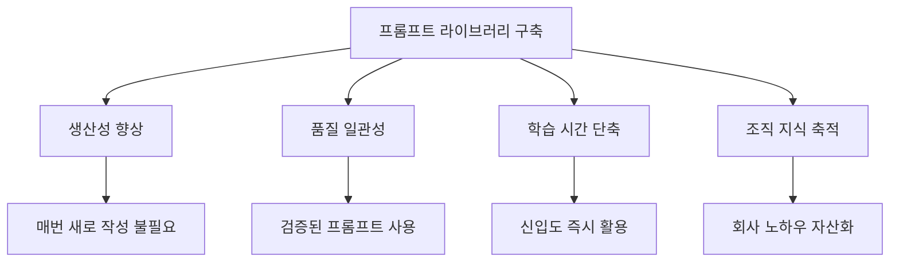
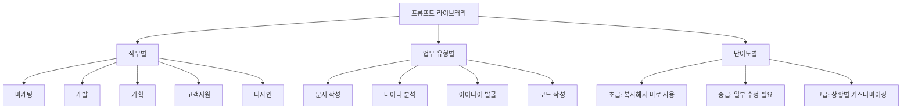
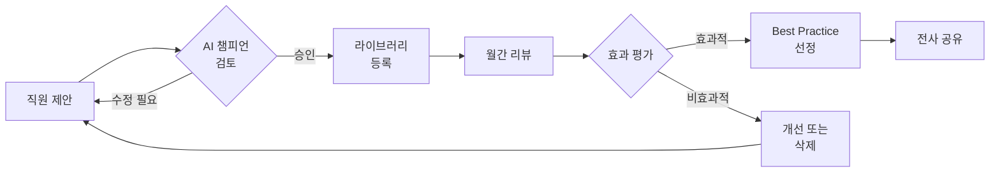
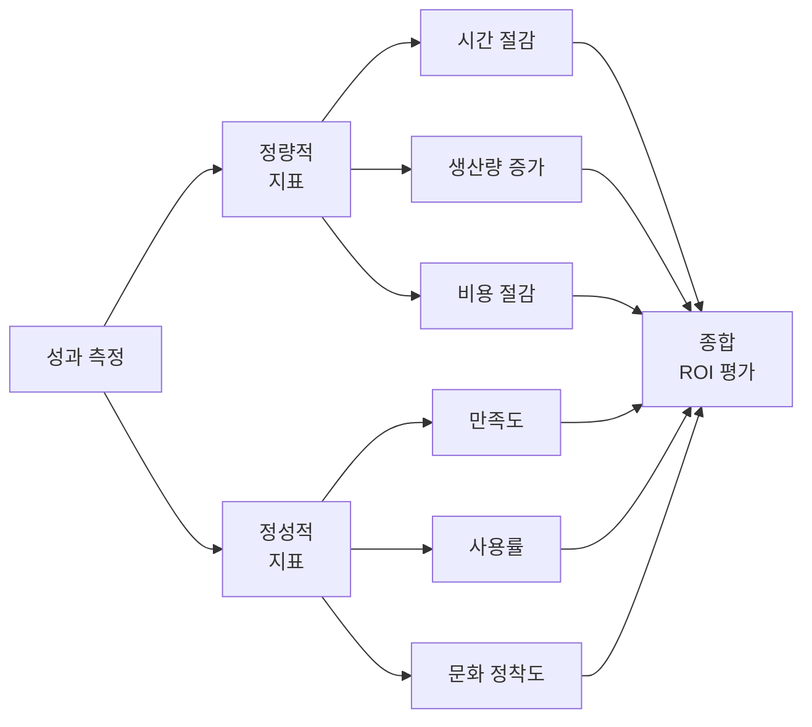

# 1. 핵심: 회사별 프롬프트 라이브러리 구축

프롬프트 라이브러리는 AI 도입 성공의 핵심입니다. 이 장에서는 조직 맞춤형 프롬프트 라이브러리를 구축하고 운영하는 방법을 다룹니다.

## 1.1 프롬프트 라이브러리가 중요한 이유



**프롬프트 라이브러리가 없을 때**
- 매번 프롬프트를 새로 작성해야 함
- 품질이 사람마다 다름
- 효과적인 방법을 공유하기 어려움
- 시행착오가 반복됨

**프롬프트 라이브러리가 있을 때**
- 검증된 프롬프트를 즉시 사용
- 일관된 품질 유지
- 신입 직원도 빠르게 적응
- 조직의 AI 활용 수준이 자산으로 축적

## 1.2 프롬프트 라이브러리 구축 방법

### 1.2.1 1단계: 수집

```
방법 1: 자연스러운 수집
- 슬랙/팀즈/디스코드에 '#ai-prompts' 채널 개설
- 직원들이 효과적이었던 프롬프트 공유
- 주간 베스트 프롬프트 선정

방법 2: 체계적 수집
- 월 1회 프롬프트 공유 세션
- 부서별로 필수 프롬프트 5개씩 제출
- AI 챔피언이 검토 및 정리
```

### 1.2.2 2단계: 분류



### 1.2.3 3단계: 템플릿화

각 프롬프트는 다음 형식으로 정리합니다.

```markdown
## 프롬프트명: [명확한 제목]

**난이도:** ⭐ (초급) / ⭐⭐ (중급) / ⭐⭐⭐ (고급)
**카테고리:** [마케팅/개발/기획/디자인 등]
**상세 카테고리:** [문서작성/데이터분석/아이디어발굴 등]
**업무 유형:** [문서작성/데이터분석/코드작성 등]
**소요 시간:** 약 X분
**효과:** [구체적인 효과 설명]

### 사용 상황
이런 상황에서 사용하세요.

### 프롬프트
[실제 프롬프트 내용]

{변수1}: 여기에 설명
{변수2}: 여기에 설명


### 사용 예시
**입력:**
[실제 사용 예시]

**출력:**
[기대되는 결과]

### 팁
- 팁 1
- 팁 2

### 작성자
김철수 (마케팅팀, 2025-11)
```

## 1.3 실전 프롬프트 라이브러리 예시

### 1.3.1 예시 1: 블로그 글 작성 (마케팅)

```markdown
**난이도:** ⭐
**카테고리:** 마케팅
**업무 유형:** 콘텐츠 작성
**상세 카테고리:** 블로그 글 작성
**소요 시간:** 약 10분
**효과:** 블로그 초안 작성 시간 70% 단축

**사용 상황**
- 회사 블로그 글 작성 시
- SEO 최적화가 필요한 콘텐츠

**프롬프트**
당신은 {회사명}의 콘텐츠 마케터입니다.

아래 주제로 블로그 글을 작성해주세요:
- 주제: {주제}
- 목적: {목적 (예: 제품 소개, 업계 트렌드 공유)}
- 타겟 독자: {타겟 (예: 30대 직장인, IT 개발자)}
- 톤앤매너: {톤 (예: 전문적이면서 친근하게)}
- 분량: 약 {글자수}자

구조:
1. 눈길을 끄는 도입부
2. 핵심 내용 3가지 (각각 소제목 포함)
3. 실용적인 팁이나 사례
4. 행동을 유도하는 마무리

추가 요구사항:
- SEO 키워드 '{키워드}' 자연스럽게 포함
- 제목 3개 후보 제시

**작성자:** 이지은 (마케팅팀, 2025-11)
```

### 1.3.2 예시 2: 코드 리뷰 요청 (개발)

```markdown
**난이도:** ⭐⭐
**카테고리:** 개발
**업무 유형:** 코드 리뷰
**상세 카테고리:** 코드 품질 향상
**소요 시간:** 약 5분
**효과:** 리뷰어 부담 50% 감소, 코드 품질 향상

**사용 상황**
- PR 올리기 전 자가 점검
- 코드 개선점 찾기

**프롬프트**
당신은 시니어 {언어} 개발자입니다.

아래 코드를 리뷰해주세요:

{언어}
{코드}


리뷰 관점:
1. 버그 가능성
2. 성능 이슈
3. 보안 취약점
4. 가독성 및 유지보수성
5. 베스트 프랙티스 준수

각 항목별로:
- 문제점 지적
- 개선 방법 제시
- 수정된 코드 예시

**팁**
- 민감한 API 키나 내부 로직은 제거하고 요청
- 컨텍스트 정보 (어떤 기능인지) 함께 제공하면 더 정확

**작성자:** 박준형 (개발팀, 2025-11)
```

## 1.4 프롬프트 라이브러리 운영

### 1.4.1 저장 위치

```
옵션 1: 노션 데이터베이스
- 장점: 검색, 필터링, 댓글 기능
- 템플릿 버튼으로 원클릭 복사

옵션 2: 사내 위키 (Confluence 등)
- 장점: 기존 시스템 활용
- 권한 관리 용이

옵션 3: GitHub/GitLab
- 장점: 버전 관리, PR로 개선 제안
- 개발팀에 친숙

옵션 4: 전용 프롬프트 관리 도구
- Promptbase, PromptHub 등

옵션 5: 서비스 구축
- 사내 전용 웹앱 개발
- 맞춤형 기능 구현 가능
```

### 1.4.2 관리 체계



### 1.4.3 업데이트 주기

```
주간:
- 새 프롬프트 3-5개 추가
- 댓글/피드백 반영

월간:
- 사용 빈도 분석
- 효과 없는 프롬프트 정리
- 베스트 프롬프트 선정

분기:
- 카테고리 재구성
- 신기술 반영 (새 AI 도구, 기능)
```

# 2. 성과 측정 및 개선

## 2.1 측정 지표 (KPI)

### 2.1.1 정량적 지표

| 업무 | 측정 지표 | 목표 | 측정 방법 |
|------|-----------|------|-----------|
| 콘텐츠 제작 | 제작 시간, 발행량 | 시간 30% 단축, 발행 2배 | 작업 시간 기록 |
| 개발 | 커밋 수, 버그 수정 시간 | 생산성 20% 향상 | Git 분석 |
| 고객 지원 | 응답 시간, 만족도 | 응답 50% 빠르게 | 티켓 시스템 |
| 데이터 분석 | 보고서 제작 시간 | 시간 60% 단축 | 작업 로그 |

### 2.1.2 정성적 지표

```
□ 직원 만족도 (월간 설문 1-5점)
  "AI 도구가 업무에 도움이 되는가?"

□ AI 도구 일일 사용률 (DAU/MAU)
  목표: 80% 이상

□ 업무 스트레스 감소
  "반복 업무가 줄었는가?"

□ 창의적 업무 시간 증가
  "전략적 사고에 더 많은 시간을 쓰는가?"

□ 프롬프트 라이브러리 기여도
  월 평균 신규 프롬프트 수: 10개 이상
```



## 2.2 성과 보고서 작성

월간 보고서를 생성하여 경영진과 팀에 공유하여 성과를 시각화하고 개선점을 도출합니다.

```markdown
# AI 도입 성과 보고서 (2025년 XX월)

## 요약
- 사용자 수: XX명 (목표 대비 XX%)
- 활성 사용자 (DAU): XX명 (XX%)
- 평균 사용 시간: 주 XX시간
- 프롬프트 라이브러리: XX개 (전월 대비 +XX)

## 정량적 성과
| 지표 | 기준 | 현재 | 개선율 |
|------|------|------|--------|
| 콘텐츠 제작 시간 | 4시간 | 2.5시간 | 37.5% ↓ |
| 버그 수정 시간 | 2시간 | 45분 | 62.5% ↓ |
| 고객 응답 시간 | 2시간 | 1시간 | 50% ↓ |

## 주요 성과 사례
1. **마케팅팀**: 블로그 발행량 월 3개→15개 (400% 증가)
   - 프롬프트 라이브러리 활용으로 작성 시간 단축
   - SEO 순위 평균 15위 상승

2. **개발팀**: 버그 수정 시간 평균 2시간→45분 (62% 단축)
   - 코드 리뷰 프롬프트 정착
   - 신입 개발자 온보딩 기간 2주 단축

3. **기획팀**: 회의록 정리 시간 80% 단축
   - 회의록 요약 프롬프트 전사 확대

## 프롬프트 라이브러리 현황
- 총 프롬프트: XX개
- 이번 달 신규: XX개
- 베스트 프롬프트 Top 3:
  1. [프롬프트명] - 사용 XX회
  2. [프롬프트명] - 사용 XX회
  3. [프롬프트명] - 사용 XX회

## 피드백 및 개선사항
- 좋았던 점: ...
- 어려웠던 점: ...
- 다음 달 계획: ...
```
