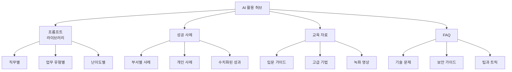
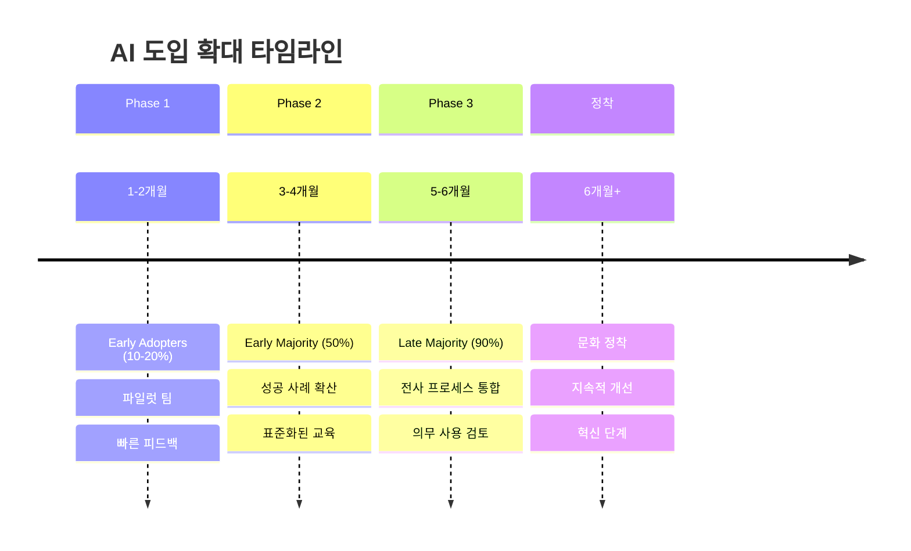
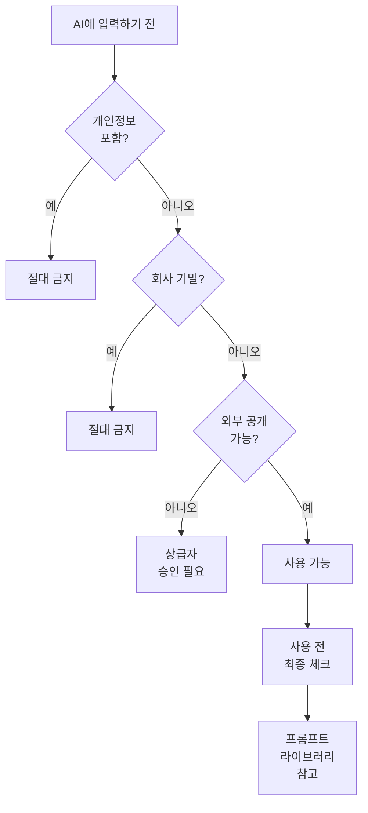
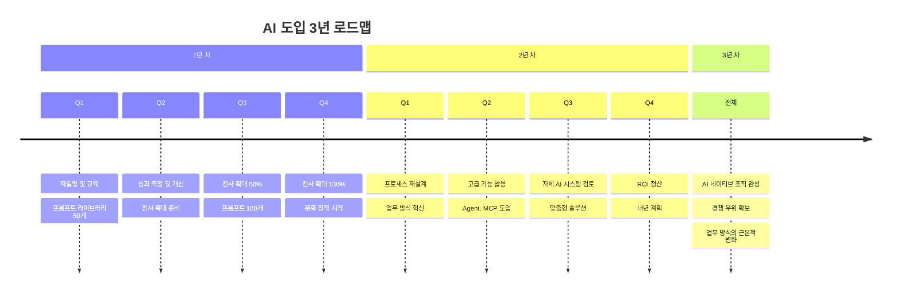

# 1. 4단계: 전사 확대

파일럿 프로그램의 성과를 바탕으로 전사로 확대하는 단계입니다.

## 1.1 성공 사례 공유

**1. 사내 발표회 (월 1회, 30분)**
```
형식:
- 각 팀의 AI 활용 우수 사례 발표 (10분)
- 실제 결과물 시연
- 사용한 프롬프트 공유
- Q&A
```

**2. 사내 위키/노션 페이지**


**3. 슬랙/팀즈/디스코드 채널**
```
#ai-tips: 일일 팁 공유
#ai-showcase: 결과물 자랑
#ai-help: 질문/답변
#ai-prompts: 프롬프트 공유 (라이브러리 연동)
```

## 1.2 단계적 확대



# 2. 5단계: 문화 정착

## 2.1 AI 가이드라인 수립

### 2.1.1 보안 가이드라인

```
허용
- 공개된 정보, 일반적 질문
- 템플릿, 아이디어 도출
- 공개 가능한 마케팅 콘텐츠
- 익명화된 데이터 분석

금지
- 고객 개인정보 (이름, 연락처, 주민번호)
- 회사 기밀 (재무제표, 전략 문서)
- 미공개 제품 정보
- 내부 직원 정보
- 소스 코드 (핵심 로직, 보안 관련)

회색 지대 (상급자 승인 필요)
- 프로젝트 기획서 (경쟁사 언급 있는 경우)
- 계약서 초안 (당사자 정보 익명화)
- 비공개 데이터 분석 (통계 수치만)
```



### 2.1.2 품질 가이드라인

```
필수 검증 항목:
□ 사실 확인 (통계, 인용, 데이터)
□ 법률/규정 준수 확인
□ 브랜드 톤앤매너 일치
□ 최종 검토는 반드시 사람이

선택 검증:
□ 문법/맞춤법
□ 논리적 일관성
□ 독자 관점에서 재검토
```

## 2.2 지속적 학습

분기별 교육 프로그램을 운영하여 직원들의 AI 활용 역량을 지속적으로 강화합니다.

```
Q1: 기초 다지기
- 프롬프트 엔지니어링 기본
- 각 팀별 필수 프롬프트 10개 학습

Q2: 고급 기법
- 멀티모달 활용 (이미지, 음성)
- 데이터 분석 고급 기법

Q3: 신기술 트렌드
- AI Agent, MCP, Function Calling
- 최신 도구 (Gemini 2.0, GPT-5 등)

Q4: 성과 리뷰 및 내년 계획
- 올해 성과 정리
- 베스트 프롬프트 시상
- 내년 목표 설정
```

# 3. 성공 체크리스트

## 3.1 도입 전

```
- [ ] 명확한 목표 설정 (SMART)
- [ ] 경영진 지지 확보
- [ ] 예산 승인 (도구 구매, 교육)
- [ ] 파일럿 팀 선정 (열정적인 팀)
- [ ] 도구 선정 및 계정 준비
- [ ] 보안 가이드라인 작성
- [ ] 프롬프트 라이브러리 플랫폼 준비 (노션, 위키 등)
```

## 3.2 도입 중

```
- [ ] 체계적 교육 실시 (Week 1, 2, 3-4)
- [ ] 주간 진행 상황 체크
- [ ] 문제점 빠른 해결 (슬랙 #ai-help 채널)
- [ ] 성공 사례 즉시 공유
- [ ] 피드백 수집 및 반영
- [ ] 프롬프트 라이브러리 기본 50개 확보
```

## 3.3 도입 후

```
- [ ] 정량적 성과 측정 (KPI 대시보드)
- [ ] 전사 공유 및 확대
- [ ] 지속적 교육 프로그램 (분기별 워크숍)
- [ ] 가이드라인 업데이트
- [ ] 신기술 모니터링
- [ ] 프롬프트 라이브러리 100개 이상 유지
- [ ] 월간 베스트 프롬프트 선정 및 시상
```

# 4. 장기 로드맵

