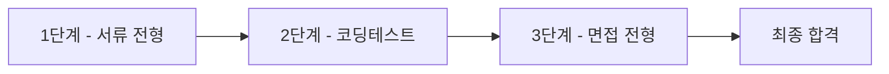
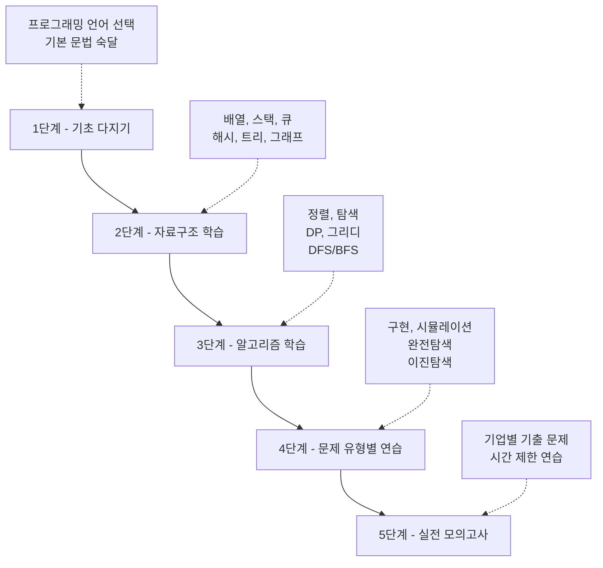

# 1. 코딩테스트, 왜 준비해야 할까요?

안녕하세요! 여러분은 취업을 준비하면서 '코딩테스트'라는 단어를 자주 들어보셨을 거예요. 요즘 IT 기업은 물론이고 금융, 제조, 유통 등 다양한 분야의 기업들이 채용 과정에 코딩테스트를 도입하고 있습니다. 처음에는 막연하고 어렵게 느껴질 수 있지만, 체계적으로 준비한다면 충분히 극복할 수 있습니다.

이 강의는 코딩테스트를 처음 접하시는 분들이 탄탄한 기초를 다지고, 실전에서 문제를 해결할 수 있는 능력을 키울 수 있도록 설계되었습니다. 함께 시작해볼까요?

# 2. 코딩테스트란?

코딩테스트(Coding Test)는 지원자의 프로그래밍 능력과 문제 해결 능력을 평가하기 위한 시험입니다. 주어진 문제를 분석하고, 효율적인 알고리즘을 설계한 뒤, 이를 코드로 구현하는 전 과정을 평가합니다.

## 2.1 코딩테스트의 목적

기업들이 코딩테스트를 실시하는 주요 이유는 다음과 같습니다:

1. **문제 해결 능력 평가**: 주어진 문제를 논리적으로 분석하고 해결할 수 있는지 확인합니다.
2. **알고리즘 이해도 측정**: 기본적인 자료구조와 알고리즘을 이해하고 활용할 수 있는지 평가합니다.
3. **코드 작성 능력 검증**: 깔끔하고 효율적인 코드를 작성할 수 있는지 확인합니다.
4. **시간 관리 능력**: 제한된 시간 내에 문제를 해결할 수 있는지 평가합니다.

<highlight>
코딩테스트는 단순히 코드를 작성하는 능력만 보는 것이 아니라, 문제를 분석하고 최적의 해결 방법을 찾아내는 종합적인 사고 능력을 평가합니다.
</highlight>

# 3. 주요 기업의 코딩테스트 유형

기업마다 코딩테스트의 형식과 난이도가 다릅니다. 대표적인 유형을 살펴보겠습니다.

## 3.1 국내 IT 기업

### 3.1.1 네이버, 카카오
- **플랫폼**: 프로그래머스
- **문제 수**: 5~7문제
- **시간**: 4~5시간
- **특징**: 구현 문제와 알고리즘 문제가 골고루 출제됨
- **난이도**: 중상

### 3.1.2 삼성전자
- **플랫폼**: 자체 플랫폼 (SWEA 유사)
- **문제 수**: 2문제
- **시간**: 3시간
- **특징**: 시뮬레이션과 구현 문제 위주
- **난이도**: 중상

### 3.1.3 라인
- **플랫폼**: 프로그래머스 또는 자체 플랫폼
- **문제 수**: 4~6문제
- **시간**: 2.5시간
- **특징**: 다양한 유형의 문제가 출제됨
- **난이도**: 중상

## 3.2 국내 비IT 기업

### 3.2.1 현대자동차, LG전자
- **플랫폼**: 자체 플랫폼 또는 프로그래머스
- **문제 수**: 3~5문제
- **시간**: 2~3시간
- **특징**: 기본적인 알고리즘과 구현 문제
- **난이도**: 중

### 3.2.2 금융권 (카카오뱅크, 토스 등)
- **플랫폼**: 프로그래머스
- **문제 수**: 4~6문제
- **시간**: 3~4시간
- **특징**: 실무 상황을 반영한 문제 출제
- **난이도**: 중

## 3.3 글로벌 IT 기업

### 3.3.1 Google, Meta, Amazon
- **플랫폼**: 화상 면접 또는 자체 플랫폼
- **문제 수**: 1~2문제 (면접 시)
- **시간**: 45분~1시간
- **특징**: 알고리즘과 자료구조에 대한 깊은 이해 필요
- **난이도**: 상

# 4. 온라인 저지 플랫폼 소개

코딩테스트를 준비하기 위해서는 온라인 저지(Online Judge) 플랫폼에서 꾸준히 문제를 풀어보는 것이 중요합니다. 대표적인 플랫폼들을 소개합니다.

## 4.1 백준 온라인 저지 (BOJ)

::a[백준 온라인 저지]{class='btn-link' href="https://www.acmicpc.net/" target="\_blank"}

**특징:**
- 국내 최대 규모의 알고리즘 문제 은행
- 27,000개 이상의 문제 보유
- 난이도별(Bronze, Silver, Gold, Platinum, Diamond, Ruby) 문제 분류
- 다양한 알고리즘 대회 개최

**장점:**
- 문제의 질이 높고 양이 방대함
- 체계적인 난이도 구분
- 활발한 커뮤니티

**단점:**
- 초보자에게는 UI가 다소 복잡할 수 있음
- 문제 설명이 간결해서 이해가 어려울 수 있음

**추천 활용법:**
- 난이도별로 체계적으로 학습
- solved.ac를 함께 활용하여 레벨업

## 4.2 프로그래머스

::a[프로그래머스]{class='btn-link' href="https://programmers.co.kr/" target="\_blank"}

**특징:**
- 기업 코딩테스트 연습용 플랫폼
- 실제 기업 코딩테스트 환경과 유사
- 난이도별(Level 0~5) 문제 분류
- SQL, 개발 상식 문제도 제공

**장점:**
- 실전과 유사한 환경
- 친절한 문제 설명
- 깔끔한 UI/UX

**단점:**
- 백준에 비해 문제 수가 적음
- 고난도 문제가 상대적으로 부족

**추천 활용법:**
- 코딩테스트 직전 실전 감각 익히기
- Level 1부터 차근차근 풀어보기

## 4.3 LeetCode

::a[LeetCode]{class='btn-link' href="https://leetcode.com/" target="\_blank"}

**특징:**
- 글로벌 표준 코딩테스트 플랫폼
- 영어 기반 문제 (한국어 지원 없음)
- 난이도별(Easy, Medium, Hard) 문제 분류
- 기업별 문제 태그 제공

**장점:**
- 글로벌 기업 면접 준비에 최적
- 문제 해설(Editorial)이 상세함
- 다양한 접근법 제시

**단점:**
- 영어로만 제공
- 국내 기업 코딩테스트와는 다소 차이가 있음

**추천 활용법:**
- 영어 실력 향상과 동시에 학습
- 글로벌 기업 지원 시 필수

## 4.4 코드업

::a[코드업]{class='btn-link' href="https://codeup.kr/" target="\_blank"}

**특징:**
- 입문자를 위한 기초 문제 중심
- 100제, 200제 등 체계적인 커리큘럼
- Python 기초 문법 학습에 최적

**장점:**
- 매우 친절한 문제 설명
- 입문자에게 최적화됨

**단점:**
- 고급 알고리즘 문제 부족

**추천 활용법:**
- 프로그래밍을 처음 시작할 때
- Python 기초 문법 복습용

# 5. 코딩테스트 준비 로드맵

## 5.1 1단계: 기초 다지기 (1~2주)
- 프로그래밍 언어 선택 및 기본 문법 숙달
- 입출력 처리 연습
- 코드업 또는 백준 Bronze 문제 풀이

## 5.2 2단계: 자료구조 학습 (2~3주)
- 배열, 연결 리스트
- 스택, 큐, 덱
- 해시 테이블
- 트리, 그래프

## 5.3 3단계: 알고리즘 학습 (4~6주)
- 정렬 알고리즘
- 탐색 알고리즘
- 동적 프로그래밍
- 그리디 알고리즘
- DFS/BFS

## 5.4 4단계: 문제 유형별 연습 (4~8주)
- 구현 및 시뮬레이션
- 완전 탐색
- 이진 탐색
- 문자열 처리
- 수학 및 기하

## 5.5 5단계: 실전 모의고사 (2~4주)
- 기업별 기출 문제 풀이
- 시간 제한 연습
- 약점 보완

<highlight>
코딩테스트 준비는 마라톤과 같습니다. 단기간에 끝낼 수 있는 것이 아니라, 꾸준히 연습하고 실력을 쌓아가는 과정입니다. 하루에 1~2문제씩이라도 꾸준히 풀어보세요.
</highlight>

# 6. 성공적인 코딩테스트 준비를 위한 팁

## 6.1 1. 꾸준함이 핵심입니다
- 하루 1~2문제씩 매일 풀기
- 주말에는 조금 더 시간을 투자하기
- 100일 연속 문제 풀이 도전

## 6.2 2. 모르는 문제는 30분~1시간 고민 후 해설 보기
- 무작정 오래 고민하는 것보다 효율적
- 해설을 보고 이해한 후 다시 스스로 풀어보기
- 일주일 후 다시 풀어보기

## 6.3 3. 손으로 먼저 풀어보기
- 코드를 작성하기 전에 종이에 알고리즘을 그려보기
- 시간 복잡도를 미리 계산해보기
- 예외 케이스를 미리 생각해보기

## 6.4 4. 다른 사람의 코드 읽어보기
- 같은 문제를 다양한 방법으로 푸는 법 배우기
- 더 효율적인 코드 작성법 익히기
- 코드 리뷰 습관 들이기

## 6.5 5. 약점 파악하고 집중 공략하기
- 자주 틀리는 유형 정리하기
- 해당 유형 문제만 모아서 집중 연습
- 오답 노트 작성하기

# 7. 이 강의를 통해 얻을 수 있는 것

이 강의를 완주하시면 다음과 같은 능력을 갖추게 됩니다:

1. **알고리즘의 기초 개념을 확실히 이해**합니다.
2. **다양한 자료구조를 상황에 맞게 활용**할 수 있습니다.
3. **문제를 보고 어떤 알고리즘을 사용해야 할지 판단**할 수 있습니다.
4. **시간 복잡도를 고려하여 효율적인 코드를 작성**할 수 있습니다.
5. **기업 코딩테스트에서 합격할 수 있는 실력**을 갖추게 됩니다.

코딩테스트는 처음에는 어렵고 막막하게 느껴질 수 있습니다. 하지만 올바른 방향으로 꾸준히 노력한다면 반드시 좋은 결과를 얻을 수 있습니다. 지금부터 함께 시작해봅시다!
