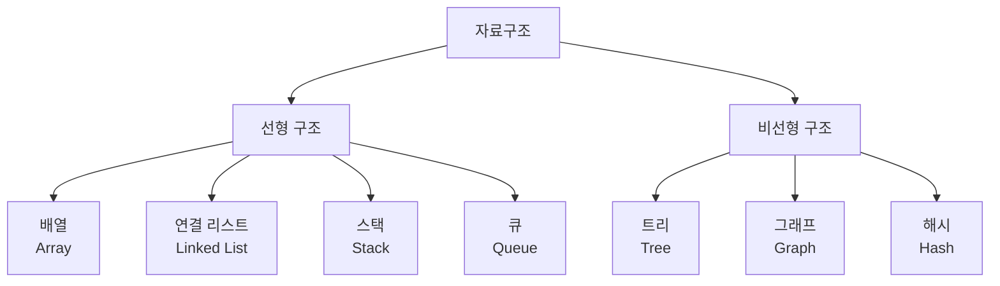
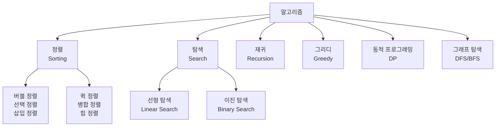
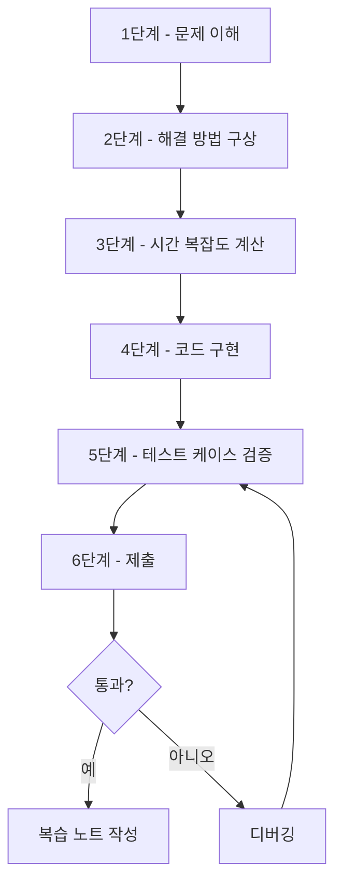

# 1. 효과적인 학습 전략

코딩테스트 준비는 단순히 많은 문제를 푸는 것이 아니라, 체계적이고 전략적으로 접근해야 합니다. 이번 장에서는 효율적인 학습 방법과 실전 팁을 알아보겠습니다.

# 2. 단계별 학습 로드맵

코딩테스트 준비는 크게 5단계로 나눌 수 있습니다. 각 단계별로 집중해야 할 내용과 추천 문제를 소개합니다.

## 2.1 1단계: 기초 다지기 (1~2주)

### 2.1.1 학습 목표
- 선택한 프로그래밍 언어의 기본 문법 완벽히 숙지
- 입출력 처리 방법 익히기
- 기본적인 연산과 조건문, 반복문 활용

### 2.1.2 추천 학습 자료
- **백준**: Bronze 5~4 단계 문제
- **코드업**: 기초 100제
- **프로그래머스**: Level 0 문제

### 2.1.3 주요 학습 내용
```python
# 3. 입출력 처리
n = int(input())  # 정수 입력
a, b = map(int, input().split())  # 여러 정수 입력
arr = list(map(int, input().split()))  # 리스트로 입력

# 4. 기본 연산
result = a + b
result = a * b
result = a // b  # 정수 나누기
result = a % b   # 나머지

# 5. 조건문
if a > b:
    print("a가 더 큽니다")
elif a == b:
    print("같습니다")
else:
    print("b가 더 큽니다")

# 6. 반복문
for i in range(n):
    print(i)

while n > 0:
    print(n)
    n -= 1
```

<highlight>
기초가 탄탄하지 않으면 나중에 복잡한 알고리즘을 구현할 때 어려움을 겪습니다. 이 단계를 절대 건너뛰지 마세요!
</highlight>

## 6.1 2단계: 자료구조 학습 (2~3주)

### 6.1.1 학습 목표
- 배열, 스택, 큐, 해시 등 기본 자료구조 이해
- 각 자료구조의 특징과 시간 복잡도 파악
- 상황에 맞는 자료구조 선택 능력 향상

### 6.1.2 주요 자료구조



### 6.1.3 배열과 리스트
```python
# 7. 배열 기본 연산
arr = [1, 2, 3, 4, 5]

# 8. 추가: O(1)
arr.append(6)

# 9. 삽입: O(n)
arr.insert(0, 0)

# 10. 삭제: O(n)
arr.remove(3)

# 11. 접근: O(1)
print(arr[2])

# 12. 슬라이싱: O(k)
sub_arr = arr[1:4]
```

### 12.0.1 스택 (Stack)
```python
# 13. 스택: LIFO (Last In First Out)
stack = []

# 14. 삽입: push
stack.append(1)
stack.append(2)
stack.append(3)

# 15. 삭제: pop
top = stack.pop()  # 3

# 16. 확인: peek
if stack:
    top = stack[-1]  # 2

# 17. 비어있는지 확인
is_empty = len(stack) == 0
```

### 17.0.1 큐 (Queue)
```python
from collections import deque

# 18. 큐: FIFO (First In First Out)
queue = deque()

# 19. 삽입: enqueue
queue.append(1)
queue.append(2)
queue.append(3)

# 20. 삭제: dequeue
front = queue.popleft()  # 1

# 21. 확인
if queue:
    front = queue[0]  # 2
```

### 21.0.1 해시 (Hash)
```python
# 22. 딕셔너리 활용
hash_map = {}

# 23. 삽입: O(1)
hash_map['apple'] = 1
hash_map['banana'] = 2

# 24. 조회: O(1)
count = hash_map.get('apple', 0)

# 25. 삭제: O(1)
del hash_map['apple']

# 26. 존재 확인: O(1)
if 'banana' in hash_map:
    print("존재합니다")
```

### 26.0.1 추천 문제
- **백준**: 10828(스택), 10845(큐), 1620(해시)
- **프로그래머스**: 같은 숫자는 싫어(스택), 기능개발(큐)

## 26.1 3단계: 기본 알고리즘 학습 (4~6주)

### 26.1.1 학습 목표
- 정렬, 탐색 등 기본 알고리즘 이해
- 재귀와 완전탐색 개념 습득
- 그리디와 동적 프로그래밍 기초 다지기

### 26.1.2 주요 알고리즘



### 26.1.3 정렬 알고리즘
```python
# 27. 버블 정렬 O(n²)
def bubble_sort(arr):
    n = len(arr)
    for i in range(n):
        for j in range(n - 1 - i):
            if arr[j] > arr[j + 1]:
                arr[j], arr[j + 1] = arr[j + 1], arr[j]
    return arr

# 28. 파이썬 내장 정렬 O(n log n)
arr = [5, 2, 8, 1, 9]
arr.sort()  # 오름차순
arr.sort(reverse=True)  # 내림차순

# 29. 커스텀 정렬
students = [('Alice', 85), ('Bob', 75), ('Charlie', 90)]
students.sort(key=lambda x: x[1])  # 점수 기준 정렬
students.sort(key=lambda x: x[1], reverse=True)  # 점수 내림차순
```

### 29.0.1 이진 탐색
```python
# 30. 이진 탐색: O(log n)
def binary_search(arr, target):
    left, right = 0, len(arr) - 1

    while left <= right:
        mid = (left + right) // 2

        if arr[mid] == target:
            return mid
        elif arr[mid] < target:
            left = mid + 1
        else:
            right = mid - 1

    return -1

# 31. 사용 예시
arr = [1, 3, 5, 7, 9, 11, 13]
result = binary_search(arr, 7)  # 3
```

### 31.0.1 추천 문제
- **백준**: 2750(정렬), 1920(이진탐색), 11047(그리디)
- **프로그래머스**: K번째수(정렬), 타겟 넘버(DFS)

## 31.1 4단계: 고급 알고리즘 학습 (4~8주)

### 31.1.1 학습 목표
- DFS/BFS 마스터
- 동적 프로그래밍 문제 해결 능력 향상
- 최단 경로, 최소 신장 트리 등 그래프 알고리즘 이해

### 31.1.2 DFS (깊이 우선 탐색)
```python
# 32. 재귀를 이용한 DFS
def dfs_recursive(graph, v, visited):
    visited[v] = True
    print(v, end=' ')

    for i in graph[v]:
        if not visited[i]:
            dfs_recursive(graph, i, visited)

# 33. 스택을 이용한 DFS
def dfs_stack(graph, start):
    visited = [False] * len(graph)
    stack = [start]

    while stack:
        v = stack.pop()
        if not visited[v]:
            visited[v] = True
            print(v, end=' ')

            # 역순으로 추가 (작은 번호부터 방문하기 위해)
            for i in sorted(graph[v], reverse=True):
                if not visited[i]:
                    stack.append(i)
```

### 33.0.1 BFS (너비 우선 탐색)
```python
from collections import deque

def bfs(graph, start):
    visited = [False] * len(graph)
    queue = deque([start])
    visited[start] = True

    while queue:
        v = queue.popleft()
        print(v, end=' ')

        for i in graph[v]:
            if not visited[i]:
                queue.append(i)
                visited[i] = True
```

### 33.0.2 추천 문제
- **백준**: 1260(DFS/BFS), 2606(DFS), 1697(BFS)
- **프로그래머스**: 네트워크(DFS), 게임 맵 최단거리(BFS)

## 33.1 5단계: 실전 모의고사 (2~4주)

### 33.1.1 학습 목표
- 기업별 기출 문제 풀이
- 시간 제한 내 문제 해결 연습
- 실전 감각 익히기

### 33.1.2 실전 연습 방법
1. **타이머 설정**: 실제 시험 시간과 동일하게 설정
2. **기출 문제 풀이**: 지원할 기업의 기출 문제 위주로 연습
3. **복기**: 풀이 후 다른 사람의 코드와 비교
4. **약점 보완**: 자주 틀리는 유형 집중 연습

<highlight>
실전 모의고사는 최소 10회 이상 연습하는 것을 추천합니다. 처음에는 시간 내에 못 풀 수 있지만, 반복하면서 속도가 빨라집니다.
</highlight>

# 34. 언어 선택 가이드

코딩테스트에서 어떤 언어를 선택할지는 매우 중요합니다. 각 언어의 장단점을 비교해보겠습니다.

## 34.1 Python

### 34.1.1 장점
- 문법이 간결하고 배우기 쉬움
- 내장 라이브러리가 풍부함
- 코드 작성 속도가 빠름
- 리스트, 딕셔너리 등 자료구조 활용이 편리함

### 34.1.2 단점
- 실행 속도가 느림
- 시간 제한이 빡빡한 문제에서 불리할 수 있음

### 34.1.3 적합한 사람
- 코딩테스트를 처음 준비하는 사람
- 빠른 구현이 필요한 사람
- 대부분의 기업 코딩테스트

```python
# 35. Python 코드 예시: 간결함
def solution(numbers):
    return sorted(set([a + b for i, a in enumerate(numbers)
                       for b in numbers[i+1:]]))
```

## 35.1 Java

### 35.1.1 장점
- 실행 속도가 빠름
- 안정적이고 예측 가능한 성능
- 대기업에서 선호하는 언어
- 객체지향 프로그래밍에 유리

### 35.1.2 단점
- 코드가 길어짐
- 작성 속도가 느림
- 초기 학습 곡선이 높음

### 35.1.3 적합한 사람
- Java에 이미 익숙한 사람
- 삼성, LG 등 대기업 지원자
- 안정적인 성능이 필요한 문제

```java
// Java 코드 예시: 안정적이지만 길다
import java.util.*;

class Solution {
    public int[] solution(int[] numbers) {
        Set<Integer> set = new HashSet<>();

        for (int i = 0; i < numbers.length; i++) {
            for (int j = i + 1; j < numbers.length; j++) {
                set.add(numbers[i] + numbers[j]);
            }
        }

        return set.stream()
                  .sorted()
                  .mapToInt(Integer::intValue)
                  .toArray();
    }
}
```

## 35.2 C++

### 35.2.1 장점
- 가장 빠른 실행 속도
- STL(Standard Template Library)이 강력함
- 메모리 제어가 자유로움
- PS(Problem Solving) 대회에서 표준

### 35.2.2 단점
- 문법이 복잡함
- 디버깅이 어려움
- 실수하기 쉬움

### 35.2.3 적합한 사람
- C++에 이미 익숙한 사람
- 알고리즘 대회 참가자
- 시간 제한이 매우 빡빡한 문제

```cpp
// C++ 코드 예시: 빠르지만 복잡
#include <vector>
#include <set>
#include <algorithm>

using namespace std;

vector<int> solution(vector<int> numbers) {
    set<int> s;

    for (int i = 0; i < numbers.size(); i++) {
        for (int j = i + 1; j < numbers.size(); j++) {
            s.insert(numbers[i] + numbers[j]);
        }
    }

    return vector<int>(s.begin(), s.end());
}
```

## 35.3 언어별 비교표

| 항목 | Python | Java | C++ |
|------|--------|------|-----|
| 학습 난이도 | ★☆☆ | ★★☆ | ★★★ |
| 실행 속도 | ★☆☆ | ★★☆ | ★★★ |
| 코드 작성 속도 | ★★★ | ★☆☆ | ★☆☆ |
| 내장 기능 | ★★★ | ★★☆ | ★★☆ |
| 기업 선호도 | ★★★ | ★★★ | ★★☆ |

<highlight>
초보자라면 Python을 추천합니다. Java나 C++에 이미 익숙하다면 그 언어를 사용하는 것이 좋습니다. 중요한 것은 한 언어를 완벽하게 마스터하는 것입니다.
</highlight>

# 36. 시간 관리 및 학습 방법

## 36.1 효율적인 학습 스케줄

### 36.1.1 평일 (주 5일)
- **1시간 코스**: 1~2문제 집중 풀이
- **2시간 코스**: 3~4문제 + 복습
- **3시간 코스**: 5~6문제 + 이론 학습

### 36.1.2 주말
- **3~4시간**: 실전 모의고사 1회
- **2시간**: 한 주 틀린 문제 복습
- **1시간**: 다음 주 학습 계획 수립

## 36.2 문제 풀이 전략



### 36.2.1 1단계: 문제 이해 (5분)
- 문제를 천천히 2~3번 읽기
- 입력과 출력 형식 파악
- 제약 조건 확인
- 예제 입출력 직접 손으로 풀어보기

### 36.2.2 2단계: 해결 방법 구상 (10분)
- 어떤 알고리즘이 필요한지 판단
- 자료구조 선택
- 간단한 예시로 논리 검증

### 36.2.3 3단계: 시간 복잡도 계산 (2분)
- 예상되는 시간 복잡도 계산
- 제한 시간 내에 실행 가능한지 확인
- 필요시 더 효율적인 알고리즘 재선택

### 36.2.4 4단계: 코드 구현 (20~30분)
- 깔끔한 코드 작성
- 변수명을 명확하게
- 주석 달기 (복잡한 부분)

### 36.2.5 5단계: 테스트 케이스 검증 (5분)
- 예제 입출력 확인
- 엣지 케이스 테스트
  - 최솟값, 최댓값
  - 빈 입력
  - 중복된 값

### 36.2.6 6단계: 제출 및 복습
- 통과하면 다른 사람의 코드 확인
- 실패하면 디버깅 후 재제출
- 복습 노트에 핵심 내용 정리

## 36.3 슬럼프 극복 방법

### 36.3.1 문제가 안 풀릴 때
1. **30분 규칙**: 30분 고민 후 해설 보기
2. **난이도 낮추기**: 더 쉬운 문제로 자신감 회복
3. **산책하기**: 잠시 쉬고 다시 도전

### 36.3.2 동기 부여가 필요할 때
1. **스터디 참여**: 함께 공부하는 동료 만들기
2. **목표 설정**: 단기 목표 (이번 주 10문제) 달성
3. **성장 기록**: solved.ac 레벨업, 잔디 심기

### 36.3.3 시간이 부족할 때
1. **우선순위**: 핵심 알고리즘 위주로 학습
2. **짧은 시간 활용**: 출퇴근 시간에 이론 복습
3. **주말 집중**: 평일은 복습, 주말은 신규 학습

<highlight>
코딩테스트 준비는 단거리 달리기가 아니라 마라톤입니다. 무리하지 말고 자신의 페이스를 유지하세요. 중요한 것은 매일 조금씩이라도 꾸준히 하는 것입니다.
</highlight>

# 37. 학습 효율을 높이는 도구들

## 37.1 1. solved.ac
::a[solved.ac]{class='btn-link' href="https://solved.ac/" target="\_blank"}

- 백준 문제에 난이도 부여
- 레벨업 시스템으로 동기 부여
- CLASS 시스템으로 체계적 학습

## 37.2 2. GitHub
- 풀이 코드 관리
- 복습 노트 작성
- 포트폴리오 활용

## 37.3 3. Notion / Obsidian
- 알고리즘 개념 정리
- 오답 노트 작성
- 학습 진도 관리

## 37.4 4. Anki
- 알고리즘 개념 암기
- 시간 복잡도 복습
- 주요 공식 암기

이제 준비가 되셨나요? 다음 장에서는 코딩테스트를 위한 개발 환경을 설정하고, 실제로 문제를 풀어보겠습니다!
