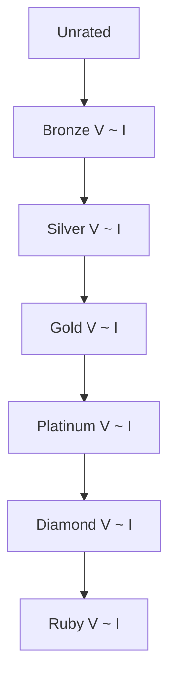

# 1. 개발 환경, 왜 중요할까요?

좋은 도구는 일을 두 배로 쉽게 만듭니다. 코딩테스트도 마찬가지입니다. 적절한 개발 환경을 구축하면 문제 풀이에만 집중할 수 있고, 디버깅도 훨씬 수월해집니다.

이번 장에서는 코딩테스트를 위한 개발 환경 설정 방법과 효율적인 디버깅 기법을 알아보겠습니다.

# 2. IDE 선택 및 설정

IDE(Integrated Development Environment)는 코드를 작성하고 실행하며 디버깅하는 통합 개발 환경입니다. 각자의 스타일과 사용하는 언어에 맞는 IDE를 선택하는 것이 중요합니다.

## 2.1 Visual Studio Code (VS Code)

### 2.1.1 장점
- 가볍고 빠름
- 무료
- 다양한 확장 프로그램
- 모든 언어 지원
- Git 통합

### 2.1.2 설치 방법

1. **VS Code 설치**

::a[VS Code 다운로드]{class='btn-link' href="https://code.visualstudio.com/" target="\_blank"}

2. **Python 확장 프로그램 설치**
   - VS Code 실행
   - 왼쪽 확장(Extensions) 아이콘 클릭
   - "Python" 검색 후 설치

3. **유용한 확장 프로그램**
   - **Python**: Python 언어 지원
   - **Code Runner**: 빠른 코드 실행
   - **Better Comments**: 주석 하이라이팅
   - **Error Lens**: 에러 즉시 표시
   - **GitLens**: Git 기록 확인

### 2.1.3 VS Code 추천 설정

```json
{
    "editor.fontSize": 14,
    "editor.tabSize": 4,
    "editor.insertSpaces": true,
    "editor.formatOnSave": true,
    "editor.minimap.enabled": true,
    "editor.suggestSelection": "first",
    "python.languageServer": "Pylance",
    "code-runner.executorMap": {
        "python": "python -u"
    },
    "code-runner.runInTerminal": true,
    "code-runner.saveFileBeforeRun": true
}
```

### 2.1.4 단축키 (Windows/Linux 기준)

| 기능 | 단축키 |
|------|--------|
| 코드 실행 | Ctrl + Alt + N |
| 터미널 열기 | Ctrl + ` |
| 파일 검색 | Ctrl + P |
| 전체 검색 | Ctrl + Shift + F |
| 정의로 이동 | F12 |
| 되돌리기 | Ctrl + Z |
| 다시 실행 | Ctrl + Y |
| 주석 토글 | Ctrl + / |

<highlight>
단축키를 외우면 코딩 속도가 2배 이상 빨라집니다. 처음에는 어색하더라도 의식적으로 사용하면 금방 익숙해집니다.
</highlight>

## 2.2 PyCharm

### 2.2.1 장점
- Python 전용 IDE
- 강력한 디버깅 기능
- 자동 완성이 뛰어남
- 리팩토링 도구 제공

### 2.2.2 단점
- 무겁고 느림
- 유료 (Community Edition은 무료)

### 2.2.3 설치 방법

::a[PyCharm 다운로드]{class='btn-link' href="https://www.jetbrains.com/pycharm/" target="\_blank"}

- Community Edition 선택 (무료)
- 설치 후 Python 인터프리터 설정

### 2.2.4 PyCharm 추천 설정
- **Appearance**: Darcula 테마 (눈의 피로 감소)
- **Editor > Code Style > Python**: Tab size 4
- **Editor > General > Auto Import**: 자동 import 활성화

## 2.3 온라인 IDE

인터넷만 있으면 어디서든 코드를 작성할 수 있는 온라인 IDE도 유용합니다.

### 2.3.1 Repl.it
::a[Repl.it]{class='btn-link' href="https://replit.com/" target="\_blank"}

- 설치 없이 바로 사용
- 다양한 언어 지원
- 코드 공유 쉬움

### 2.3.2 Google Colab
::a[Google Colab]{class='btn-link' href="https://colab.research.google.com/" target="\_blank"}

- Python 전용
- GPU 사용 가능
- Jupyter Notebook 형식

# 3. 언어별 개발 환경 설정

## 3.1 Python 환경 설정

### 3.1.1 1. Python 설치

::a[Python 다운로드]{class='btn-link' href="https://www.python.org/downloads/" target="\_blank"}

- Python 3.9 이상 권장
- 설치 시 "Add Python to PATH" 체크

### 3.1.2 2. 설치 확인

```bash
# 4. 터미널에서 확인
python --version
# 5. 또는
python3 --version
```

### 5.0.1 3. 코딩테스트용 템플릿 작성

```python
# 6. template.py
import sys
input = sys.stdin.readline

def solve():
    # 입력
    n = int(input())

    # 로직
    result = 0

    # 출력
    print(result)

if __name__ == "__main__":
    solve()
```

<highlight>
sys.stdin.readline을 사용하면 입력 속도가 훨씬 빨라집니다. 특히 입력이 많은 문제에서는 필수입니다!
</highlight>

### 6.0.1 4. 유용한 라이브러리

```python
# 7. 필수 라이브러리
import sys
from collections import deque, Counter, defaultdict
from itertools import combinations, permutations
import heapq
import bisect
```

## 7.1 Java 환경 설정

### 7.1.1 1. JDK 설치

::a[JDK 다운로드]{class='btn-link' href="https://www.oracle.com/java/technologies/downloads/" target="\_blank"}

- JDK 11 이상 권장

### 7.1.2 2. 코딩테스트용 템플릿

```java
import java.io.*;
import java.util.*;

public class Main {
    static BufferedReader br = new BufferedReader(new InputStreamReader(System.in));
    static BufferedWriter bw = new BufferedWriter(new OutputStreamWriter(System.out));
    static StringTokenizer st;

    public static void main(String[] args) throws IOException {
        int n = Integer.parseInt(br.readLine());

        // 로직
        int result = 0;

        bw.write(result + "\n");
        bw.flush();
        bw.close();
    }
}
```

## 7.2 C++ 환경 설정

### 7.2.1 1. 컴파일러 설치

- **Windows**: MinGW 또는 Visual Studio
- **Mac**: Xcode Command Line Tools
- **Linux**: g++ (대부분 기본 설치)

### 7.2.2 2. 코딩테스트용 템플릿

```cpp
#include <iostream>
#include <vector>
#include <algorithm>
#include <string>
#include <queue>
#include <stack>
#include <map>
#include <set>
using namespace std;

int main() {
    ios_base::sync_with_stdio(false);
    cin.tie(NULL);
    cout.tie(NULL);

    int n;
    cin >> n;

    // 로직
    int result = 0;

    cout << result << '\n';

    return 0;
}
```

# 8. 온라인 저지 활용법

온라인 저지 플랫폼을 효과적으로 활용하는 방법을 알아보겠습니다.

## 8.1 백준 온라인 저지 활용법

### 8.1.1 1. 회원가입 및 로그인

::a[백준 회원가입]{class='btn-link' href="https://www.acmicpc.net/register" target="\_blank"}

### 8.1.2 2. 문제 제출 방법


### 8.1.3 3. 채점 결과의 의미

| 결과 | 의미 | 해결 방법 |
|------|------|-----------|
| 맞았습니다!! | 정답 | 다른 사람의 풀이도 확인 |
| 틀렸습니다 | 오답 | 로직 재검토, 엣지 케이스 확인 |
| 시간 초과 | 시간 제한 초과 | 알고리즘 개선, 시간 복잡도 줄이기 |
| 메모리 초과 | 메모리 제한 초과 | 메모리 사용량 줄이기 |
| 런타임 에러 | 실행 중 에러 | 배열 범위, 0으로 나누기 등 확인 |
| 컴파일 에러 | 컴파일 실패 | 문법 오류 수정 |

### 8.1.4 4. 입출력 예시

**문제: A+B 문제 (1000번)**

입력:
```
1 2
```

출력:
```
3
```

코드 (Python):
```python
a, b = map(int, input().split())
print(a + b)
```

코드 (Java):
```java
import java.util.Scanner;

public class Main {
    public static void main(String[] args) {
        Scanner sc = new Scanner(System.in);
        int a = sc.nextInt();
        int b = sc.nextInt();
        System.out.println(a + b);
    }
}
```

### 8.1.5 5. 자주 하는 실수

```python
# 9. 잘못된 예시 1: 출력 형식 오류
print(f"답은 {result}입니다")  # ❌ 추가 문자 출력
print(result)  # ✅ 정답만 출력

# 10. 잘못된 예시 2: 불필요한 입력
n = int(input())
arr = list(map(int, input().split()))
m = int(input())  # ❌ 문제에서 요구하지 않은 입력

# 11. 올바른 예시
n = int(input())
arr = list(map(int, input().split()))
```

## 11.1 프로그래머스 활용법

### 11.1.1 1. 로그인 및 문제 풀이

::a[프로그래머스]{class='btn-link' href="https://programmers.co.kr/" target="\_blank"}

### 11.1.2 2. 함수 형태로 코드 작성

```python
def solution(numbers):
    answer = []

    # 로직 구현
    for i in range(len(numbers)):
        for j in range(i + 1, len(numbers)):
            answer.append(numbers[i] + numbers[j])

    # 중복 제거 및 정렬
    answer = sorted(list(set(answer)))

    return answer
```

### 11.1.3 3. 테스트 케이스 직접 실행

```python
# 12. 로컬에서 테스트
if __name__ == "__main__":
    print(solution([2, 1, 3, 4, 1]))  # [2, 3, 4, 5, 6, 7]
    print(solution([5, 0, 2, 7]))     # [2, 5, 7, 9, 12]
```

## 12.1 solved.ac 활용법

::a[solved.ac]{class='btn-link' href="https://solved.ac/" target="\_blank"}

### 12.1.1 1. 티어 시스템



### 12.1.2 2. CLASS 시스템 활용

- **CLASS 1**: 입출력, 사칙연산
- **CLASS 2**: 기본 자료구조, 수학
- **CLASS 3**: 정렬, 이분탐색, 그리디
- **CLASS 4**: DP, 그래프 기초
- **CLASS 5**: 고급 알고리즘

<highlight>
CLASS 시스템을 따라가면 체계적으로 실력을 쌓을 수 있습니다. CLASS 3까지만 마스터해도 대부분의 기업 코딩테스트를 통과할 수 있습니다!
</highlight>

### 12.1.3 3. 문제 추천 받기

- 자신의 티어에 맞는 문제 자동 추천
- solved.ac 레벨로 난이도 필터링
- 태그별로 문제 검색

# 13. 디버깅 기법

코딩테스트에서 가장 중요한 것 중 하나가 빠르고 정확한 디버깅입니다.

## 13.1 기본 디버깅 방법

### 13.1.1 1. print 디버깅

```python
def solution(arr):
    print(f"입력 배열: {arr}")  # 입력 확인

    for i in range(len(arr)):
        print(f"i = {i}, arr[i] = {arr[i]}")  # 반복문 확인

        # 로직
        result = arr[i] * 2
        print(f"result = {result}")  # 중간 결과 확인

    return result
```

### 13.1.2 2. 단계별 실행

```python
def binary_search(arr, target):
    left, right = 0, len(arr) - 1

    while left <= right:
        mid = (left + right) // 2
        print(f"left: {left}, right: {right}, mid: {mid}")  # 상태 출력

        if arr[mid] == target:
            return mid
        elif arr[mid] < target:
            left = mid + 1
        else:
            right = mid - 1

    return -1
```

### 13.1.3 3. assert를 활용한 검증

```python
def solution(n):
    assert n > 0, "n은 양수여야 합니다"
    assert n <= 100000, "n이 너무 큽니다"

    result = 0
    for i in range(1, n + 1):
        result += i

    # 결과 검증
    assert result == n * (n + 1) // 2, "계산 오류"

    return result
```

## 13.2 자주 발생하는 오류와 해결법

### 13.2.1 1. IndexError (인덱스 범위 초과)

```python
# 14. 잘못된 코드
arr = [1, 2, 3, 4, 5]
for i in range(len(arr) + 1):  # ❌ 범위 초과
    print(arr[i])

# 15. 올바른 코드
arr = [1, 2, 3, 4, 5]
for i in range(len(arr)):  # ✅
    print(arr[i])
```

### 15.0.1 2. RecursionError (재귀 깊이 초과)

```python
# 16. Python 재귀 깊이 제한 해제
import sys
sys.setrecursionlimit(10**6)

def dfs(v, depth):
    if depth > 100000:
        return
    dfs(v + 1, depth + 1)
```

### 16.0.1 3. ValueError (잘못된 값)

```python
# 17. 잘못된 코드
n = int(input())  # 입력: "1 2" → ❌ ValueError

# 18. 올바른 코드
a, b = map(int, input().split())  # ✅
```

### 18.0.1 4. ZeroDivisionError (0으로 나누기)

```python
# 19. 방어 코드 추가
def divide(a, b):
    if b == 0:
        return 0  # 또는 적절한 처리
    return a / b
```

## 19.1 VS Code 디버거 사용법

### 19.1.1 1. 중단점 설정
- 코드 줄 번호 왼쪽 클릭

### 19.1.2 2. 디버깅 시작
- F5 또는 "실행 > 디버깅 시작"

### 19.1.3 3. 단계별 실행
- **F10**: 다음 줄로 이동 (Step Over)
- **F11**: 함수 안으로 들어가기 (Step Into)
- **Shift + F11**: 함수 밖으로 나가기 (Step Out)
- **F5**: 다음 중단점까지 실행 (Continue)

### 19.1.4 4. 변수 확인
- 왼쪽 "변수" 패널에서 현재 변수 값 확인
- 마우스를 변수에 올리면 값 표시

## 19.2 엣지 케이스 테스트

코드를 제출하기 전에 다양한 엣지 케이스를 테스트해야 합니다.

### 19.2.1 체크리스트

```python
def test_solution():
    # 1. 최솟값
    assert solution([1]) == expected_result_1

    # 2. 최댓값
    assert solution([1] * 100000) == expected_result_2

    # 3. 빈 입력
    assert solution([]) == expected_result_3

    # 4. 중복된 값
    assert solution([1, 1, 1, 1]) == expected_result_4

    # 5. 정렬된 입력
    assert solution([1, 2, 3, 4, 5]) == expected_result_5

    # 6. 역순 입력
    assert solution([5, 4, 3, 2, 1]) == expected_result_6

    # 7. 음수 포함
    assert solution([-5, -3, 0, 3, 5]) == expected_result_7

    print("모든 테스트 통과!")

test_solution()
```

<highlight>
엣지 케이스를 미리 테스트하면 제출 후 틀릴 확률이 크게 줄어듭니다. 특히 최솟값, 최댓값, 빈 입력은 반드시 확인하세요!
</highlight>

# 20. 코딩테스트 당일 체크리스트

시험 당일 실수를 줄이기 위한 체크리스트입니다.

## 20.1 시험 전 (1시간 전)

- [ ] 컴퓨터와 인터넷 연결 확인
- [ ] 개발 환경 정상 작동 확인
- [ ] 템플릿 코드 준비
- [ ] 필요한 라이브러리 import 문 준비
- [ ] 물과 간식 준비

## 20.2 시험 중

- [ ] 모든 문제 훑어보기 (5분)
- [ ] 쉬운 문제부터 풀기
- [ ] 입출력 형식 정확히 확인
- [ ] 제한 시간과 메모리 확인
- [ ] 시간 복잡도 계산 후 코드 작성
- [ ] 제출 전 엣지 케이스 테스트
- [ ] 제출 후 바로 다음 문제로 이동

## 20.3 시험 후

- [ ] 틀린 문제 복기
- [ ] 다른 사람의 풀이 확인
- [ ] 오답 노트 작성
- [ ] 부족한 부분 정리

이제 개발 환경 설정이 완료되었습니다! 다음 장부터는 본격적으로 알고리즘을 학습하고 문제를 풀어보겠습니다.
