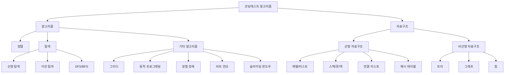

# 1. 문제 유형 분석의 중요성

코딩테스트를 준비할 때 가장 중요한 것 중 하나는 출제 경향을 파악하는 것입니다. 모든 알고리즘과 자료구조를 완벽하게 공부하기에는 시간이 부족하기 때문에, 자주 출제되는 유형을 중심으로 효율적으로 준비하는 것이 중요합니다.

실제 기업 코딩테스트에서는 모든 알고리즘 지식을 요구하지 않습니다. 통계적으로 보면 특정 유형의 문제가 반복적으로 출제되는 경향이 있으며, 이러한 패턴을 이해하고 준비하면 훨씬 효율적으로 합격선에 도달할 수 있습니다.

# 2. 주요 출제 유형과 비중

한빛미디어에서 분석한 자료에 따르면, 코딩테스트에서 가장 많이 출제되는 알고리즘 유형과 그 비중은 다음과 같습니다.

* 참고 링크: [코딩 테스트에 가장 많이 출제 되는 알고리즘](https://www.hanbit.co.kr/media/channel/view.html?cms_code=CMS7793635735&cate_cd=)
* 참고 링크: [언어 유불리 여부](https://www.hanbit.co.kr/media/channel/view.html?cms_code=CMS9145550324&cate_cd=)

| 순위 | 알고리즘 유형 | 출제 비중 | 난이도 | 준비 우선순위 |
|------|--------------|-----------|--------|--------------|
| 1 | 구현/시뮬레이션 | 33% | 중하 | ⭐⭐⭐⭐⭐ |
| 2 | 그리디 알고리즘 | 20% | 중 | ⭐⭐⭐⭐⭐ |
| 3 | DFS/BFS | 20% | 중상 | ⭐⭐⭐⭐⭐ |
| 4 | 정렬 | 8% | 중하 | ⭐⭐⭐⭐ |
| 5 | 동적 프로그래밍 | 6% | 상 | ⭐⭐⭐ |
| 6 | 최단 경로 | 5% | 상 | ⭐⭐ |
| 7 | 이진 탐색 | 4% | 중 | ⭐⭐⭐⭐ |
| 8 | 기타 | 4% | - | - |

:::div{.callout}
위 통계는 일반적인 경향이며, 기업과 직군에 따라 차이가 있을 수 있습니다. 지원하려는 기업의 기출 문제를 반드시 확인하세요.
:::

## 2.1 구현/시뮬레이션 (33%)

**특징:**
- 가장 높은 출제 비중
- 문제에서 요구하는 것을 그대로 코드로 구현
- 복잡한 알고리즘보다는 정확한 구현 능력 평가
- 조건문, 반복문을 활용한 순차적 처리

**대표 유형:**
- 배열 조작 (회전, 뒤집기, 이동)
- 문자열 처리
- 날짜/시간 계산
- 2차원 배열 탐색 (달팽이, 시계방향 등)
- 게임 로직 구현

## 2.2 그리디 알고리즘 (20%)

**특징:**
- 매 순간 최선의 선택을 하는 알고리즘
- 정렬과 함께 자주 사용됨
- 최적해를 보장하는지 증명이 중요

**대표 유형:**
- 거스름돈 문제
- 회의실 배정
- 최소 동전 개수
- 큰 수 만들기
- 체육복 문제

## 2.3 DFS/BFS (20%)

**특징:**
- 그래프/트리 탐색의 기본
- 재귀(DFS) 또는 큐(BFS) 활용
- 최단거리, 경로 찾기, 연결 요소 문제에 필수

**대표 유형:**
- 미로 탐색
- 섬의 개수
- 최단 거리
- 네트워크 연결
- 타겟 넘버

## 2.4 정렬 (8%)

정렬 문제는 8%로 표기되었지만 최근에는 정렬을 활용한 문제가 더 자주 출제되고 있습니다. 정렬 알고리즘 자체를 구현하는 문제보다는 정렬을 어떻게 활용하는지가 더 중요합니다.

**특징:**
- 기본 중의 기본
- 다른 알고리즘과 결합되어 출제
- Python의 sort(), sorted() 활용

**대표 유형:**
- K번째 수
- 가장 큰 수
- H-Index
- 문자열 정렬

## 2.5 동적 프로그래밍 (6%)

**특징:**
- 상대적으로 높은 난이도
- Lv3 이상 문제에서 주로 출제
- 메모이제이션 또는 테이블 방식 활용

**대표 유형:**
- 피보나치 수열
- 계단 오르기
- 배낭 문제 (Knapsack)
- 최장 공통 부분 수열 (LCS)
- 편집 거리

# 3. 전체 알고리즘 분류 체계

코딩테스트에서 다루는 알고리즘과 자료구조를 체계적으로 분류하면 다음과 같습니다.

# 4. 기업별 출제 경향 분석

코딩테스트는 연도에 따라 출제 경향이 변하기 때문에 매년 후기를 검색하는 것이 중요합니다. 기업별로도 선호하는 문제 유형이 다르므로, 지원하려는 기업의 기출 문제를 분석하는 것이 필요합니다.

## 4.1 출제 경향 조사 방법

기업별 코딩테스트 준비를 위해서는 다음과 같은 방법으로 출제 경향을 조사할 수 있습니다.

1. **기출 문제 검색**
   - 프로그래머스, 백준 등에서 기업명으로 검색
   - GitHub에서 "[기업명] 코딩테스트 후기" 검색

2. **커뮤니티 활용**
   - 블라인드, 원티드, 잡플래닛 등의 취업 커뮤니티
   - 해당 기업 지원자들의 후기 정리

3. **분석 서비스 활용**
   - ::a[AlgoView]{class='btn-link' href="https://algoview.co.kr/" target="\_blank"}: 기업별 알고리즘 출제 경향 분석
   - 프로그래머스의 기업별 기출 문제 모음

4. **정리 문서 활용**
   - ::a[코딩테스트 경향 정리 (Notion)](https://paullabworkspace.notion.site/446d03bf38df42e19d9fedcf5ceaec61?pvs=4)

## 4.2 분석 항목

기업별 코딩테스트를 분석할 때는 다음 항목을 체크하세요.

| 분석 항목 | 확인 내용 | 중요도 |
|-----------|----------|--------|
| 플랫폼 | 프로그래머스, 구름, 자체 플랫폼 등 | ⭐⭐⭐⭐⭐ |
| 문제 수 | 일반적으로 3~7문제 | ⭐⭐⭐⭐⭐ |
| 시간 | 2~5시간 | ⭐⭐⭐⭐⭐ |
| 난이도 분포 | Lv1 1문제, Lv2 3문제 등 | ⭐⭐⭐⭐⭐ |
| 주요 유형 | 구현, DFS/BFS, 그리디 등 | ⭐⭐⭐⭐⭐ |
| 제한 모듈 | numpy, pandas 사용 가능 여부 | ⭐⭐⭐⭐ |
| AI 허용 여부 | ChatGPT 등 생성형 AI 사용 가능 여부 | ⭐⭐⭐⭐ |
| 인터넷 검색 | 구글링 허용 여부 | ⭐⭐⭐ |
| SQL 문제 | SQL 문제 포함 여부 (주로 금융권) | ⭐⭐⭐ |