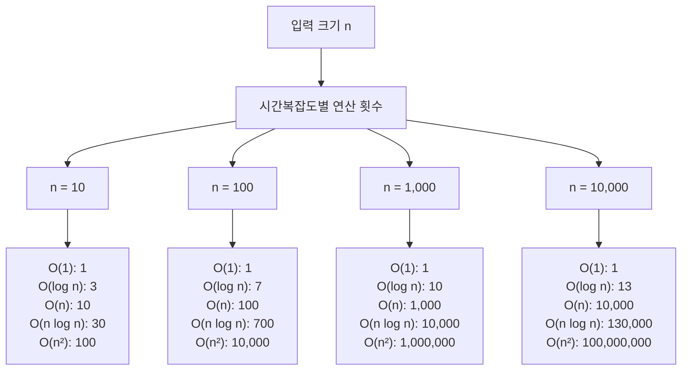
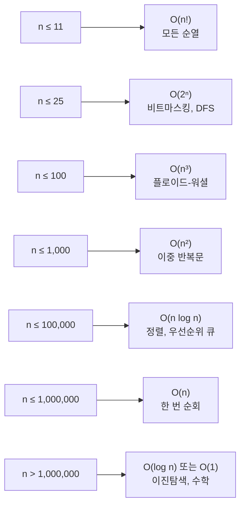

# 1. 시간복잡도, 왜 중요할까요?

여러분이 작성한 코드가 정답을 출력한다고 해서 모두 통과하는 것은 아닙니다. 코딩테스트에서는 '정확성'뿐만 아니라 '효율성'도 중요합니다. 아무리 정확한 답을 내더라도 시간 제한을 초과하면 오답 처리됩니다.

시간복잡도는 알고리즘이 문제를 해결하는 데 걸리는 시간을 나타내는 지표입니다. 이를 이해하면 코드를 작성하기 전에 "이 알고리즘이 시간 내에 실행될 수 있을까?"를 미리 판단할 수 있습니다.

# 2. 시간복잡도란?

**시간복잡도(Time Complexity)**는 입력 크기 n에 따라 알고리즘이 실행되는 데 필요한 연산 횟수를 나타냅니다. 보통 최악의 경우(Worst Case)를 기준으로 계산합니다.

## 2.1 왜 최악의 경우를 고려할까요?

```python
# 배열에서 특정 값 찾기
def find_value(arr, target):
    for i in range(len(arr)):
        if arr[i] == target:
            return i
    return -1

# 최선의 경우: 첫 번째 원소가 target → 1번 비교
# 평균의 경우: 중간쯤에서 발견 → n/2번 비교
# 최악의 경우: 마지막 원소가 target 또는 없음 → n번 비교
```

코딩테스트에서는 최악의 경우에도 시간 내에 실행되어야 하므로, 최악의 경우를 기준으로 시간복잡도를 계산합니다.

# 3. Big-O 표기법

Big-O 표기법은 시간복잡도를 표현하는 가장 일반적인 방법입니다. 입력 크기 n이 커질수록 어떤 속도로 증가하는지를 나타냅니다.

## 3.1 Big-O 표기법의 특징

1. **상수는 무시**: O(2n) → O(n)
2. **최고차항만 표시**: O(n² + n) → O(n²)
3. **계수는 무시**: O(3n²) → O(n²)

```python
# 예시 1: O(2n) → O(n)
def example1(n):
    for i in range(n):
        print(i)
    for i in range(n):  # 두 번 반복해도 O(n)
        print(i)

# 예시 2: O(n² + n) → O(n²)
def example2(n):
    for i in range(n):
        for j in range(n):
            print(i, j)  # O(n²)
    for i in range(n):
        print(i)  # O(n)
    # 최종: O(n² + n) = O(n²)
```

<highlight>
Big-O 표기법은 알고리즘의 효율성을 비교할 때 사용됩니다. 정확한 실행 시간이 아니라, 입력 크기가 커질 때의 성장 추세를 나타냅니다.
</highlight>

# 4. 주요 시간복잡도 비교

대표적인 시간복잡도를 빠른 순서대로 정리하면 다음과 같습니다.

```
O(1) < O(log n) < O(n) < O(n log n) < O(n²) < O(n³) < O(2ⁿ) < O(n!)
```

## 4.1 시간복잡도별 특징

### 4.1.1 O(1) - 상수 시간

입력 크기와 무관하게 항상 일정한 시간이 걸립니다.

```python
# 예시: 배열의 첫 번째 원소 접근
def get_first(arr):
    return arr[0]  # O(1)

# 예시: 딕셔너리에서 값 찾기
def get_value(hash_map, key):
    return hash_map.get(key)  # O(1)

# 예시: 수학 공식 활용
def sum_1_to_n(n):
    return n * (n + 1) // 2  # O(1)
```

**특징:**
- 가장 빠른 알고리즘
- 입력 크기가 아무리 커도 실행 시간 동일

### 4.1.2 O(log n) - 로그 시간

입력 크기가 2배가 되어도 실행 시간은 +1만 증가합니다.

```python
# 예시: 이진 탐색
def binary_search(arr, target):
    left, right = 0, len(arr) - 1

    while left <= right:
        mid = (left + right) // 2

        if arr[mid] == target:
            return mid
        elif arr[mid] < target:
            left = mid + 1
        else:
            right = mid - 1

    return -1

# n = 1,000 → 약 10번 비교
# n = 1,000,000 → 약 20번 비교
```

**특징:**
- 매우 빠른 알고리즘
- 이진 탐색, 트리 높이 등에서 나타남

### 4.1.3 O(n) - 선형 시간

입력 크기에 비례하여 실행 시간이 증가합니다.

```python
# 예시 1: 배열 순회
def print_all(arr):
    for item in arr:  # n번 반복
        print(item)

# 예시 2: 최댓값 찾기
def find_max(arr):
    max_val = arr[0]
    for item in arr:  # n번 반복
        if item > max_val:
            max_val = item
    return max_val

# 예시 3: 리스트 합계
def sum_array(arr):
    total = 0
    for item in arr:  # n번 반복
        total += item
    return total
```

**특징:**
- 가장 일반적인 시간복잡도
- 배열을 한 번 순회하는 알고리즘

### 4.1.4 O(n log n) - 선형 로그 시간

효율적인 정렬 알고리즘의 시간복잡도입니다.

```python
# 예시 1: 병합 정렬
def merge_sort(arr):
    if len(arr) <= 1:
        return arr

    mid = len(arr) // 2
    left = merge_sort(arr[:mid])  # log n번 분할
    right = merge_sort(arr[mid:])

    return merge(left, right)  # n번 병합

# 예시 2: 파이썬 내장 정렬
arr = [5, 2, 8, 1, 9]
arr.sort()  # O(n log n)
sorted_arr = sorted(arr)  # O(n log n)
```

**특징:**
- 효율적인 정렬의 한계
- 대부분의 경우 충분히 빠름

### 4.1.5 O(n²) - 이차 시간

중첩 반복문에서 자주 나타납니다.

```python
# 예시 1: 이중 반복문
def print_pairs(arr):
    for i in range(len(arr)):  # n번
        for j in range(len(arr)):  # n번
            print(arr[i], arr[j])  # n × n = n²

# 예시 2: 버블 정렬
def bubble_sort(arr):
    n = len(arr)
    for i in range(n):  # n번
        for j in range(n - 1 - i):  # n번
            if arr[j] > arr[j + 1]:
                arr[j], arr[j + 1] = arr[j + 1], arr[j]
    return arr

# 예시 3: 모든 쌍의 합 구하기
def all_pair_sum(arr):
    result = []
    for i in range(len(arr)):  # n번
        for j in range(i + 1, len(arr)):  # n번
            result.append(arr[i] + arr[j])
    return result
```

**특징:**
- n이 작을 때만 사용 가능
- n > 10,000이면 시간 초과 가능성 높음

### 4.1.6 O(n³) - 삼차 시간

삼중 반복문에서 나타납니다.

```python
# 예시: 삼중 반복문
def print_triples(arr):
    for i in range(len(arr)):  # n번
        for j in range(len(arr)):  # n번
            for k in range(len(arr)):  # n번
                print(arr[i], arr[j], arr[k])  # n × n × n = n³
```

**특징:**
- 매우 느림
- n > 1,000이면 대부분 시간 초과

### 4.1.7 O(2ⁿ) - 지수 시간

재귀적으로 모든 경우를 탐색할 때 나타납니다.

```python
# 예시: 피보나치 (재귀)
def fibonacci(n):
    if n <= 1:
        return n
    return fibonacci(n - 1) + fibonacci(n - 2)  # O(2ⁿ)

# n = 5 → 15번 호출
# n = 10 → 177번 호출
# n = 30 → 2,692,537번 호출
```

**특징:**
- 매우 매우 느림
- n > 20이면 거의 실행 불가능

### 4.1.8 O(n!) - 팩토리얼 시간

모든 순열을 생성할 때 나타납니다.

```python
# 예시: 모든 순열 생성
from itertools import permutations

def all_permutations(arr):
    return list(permutations(arr))  # O(n!)

# n = 5 → 120개
# n = 10 → 3,628,800개
# n = 13 → 6,227,020,800개
```

**특징:**
- 가장 느림
- n > 10이면 거의 실행 불가능

# 5. 시간복잡도 비교 그래프

입력 크기 n에 따른 연산 횟수를 비교해봅시다.



## 5.1 실제 실행 시간 예측

일반적으로 컴퓨터는 1초에 약 1억(10⁸) 번의 연산을 수행할 수 있습니다.

| 시간복잡도 | n = 100 | n = 1,000 | n = 10,000 | n = 100,000 | n = 1,000,000 |
|-----------|---------|-----------|------------|-------------|---------------|
| O(1) | 0.00001ms | 0.00001ms | 0.00001ms | 0.00001ms | 0.00001ms |
| O(log n) | 0.00007ms | 0.0001ms | 0.00013ms | 0.00017ms | 0.0002ms |
| O(n) | 0.001ms | 0.01ms | 0.1ms | 1ms | 10ms |
| O(n log n) | 0.007ms | 0.1ms | 1.3ms | 17ms | 200ms |
| O(n²) | 0.1ms | 10ms | 1초 | 100초 | 2.7시간 |
| O(n³) | 10ms | 1초 | 16.7분 | 11.6일 | 31.7년 |

<highlight>
코딩테스트의 시간 제한은 보통 1~5초입니다. n의 크기를 보고 어떤 시간복잡도로 풀어야 할지 미리 계산하세요!
</highlight>

# 6. 시간복잡도 선택 가이드

입력 크기 n에 따라 사용 가능한 시간복잡도를 정리하면 다음과 같습니다.



## 6.1 문제별 예상 시간복잡도

### 6.1.1 n ≤ 20
- 완전 탐색 (백트래킹)
- 비트마스킹
- 모든 조합/순열

```python
# n개 중 r개 선택하는 모든 조합
from itertools import combinations

def all_combinations(arr, r):
    return list(combinations(arr, r))  # O(nCr)
```

### 6.1.2 n ≤ 100
- O(n³) 알고리즘
- 플로이드-워셜
- 삼중 반복문

```python
# 플로이드-워셜: 모든 쌍의 최단 경로
def floyd_warshall(graph):
    n = len(graph)
    dist = [[float('inf')] * n for _ in range(n)]

    # 초기화
    for i in range(n):
        dist[i][i] = 0

    # 플로이드-워셜
    for k in range(n):  # 경유지
        for i in range(n):  # 출발지
            for j in range(n):  # 도착지
                dist[i][j] = min(dist[i][j], dist[i][k] + dist[k][j])

    return dist
```

### 6.1.3 n ≤ 10,000
- O(n²) 알고리즘
- 이중 반복문
- 버블 정렬

```python
# 모든 쌍의 거리 계산
def all_distances(points):
    n = len(points)
    distances = []

    for i in range(n):
        for j in range(i + 1, n):
            x1, y1 = points[i]
            x2, y2 = points[j]
            dist = ((x2 - x1)**2 + (y2 - y1)**2)**0.5
            distances.append(dist)

    return distances
```

### 6.1.4 n ≤ 1,000,000
- O(n log n) 알고리즘
- 정렬
- 우선순위 큐

```python
# 정렬 후 처리
def solution(arr):
    arr.sort()  # O(n log n)

    result = 0
    for i in range(len(arr)):  # O(n)
        result += arr[i]

    return result
```

### 6.1.5 n > 1,000,000
- O(n) 알고리즘
- 한 번 순회
- 해시맵

```python
# 해시맵을 이용한 빠른 검색
def two_sum(nums, target):
    hash_map = {}

    for i, num in enumerate(nums):  # O(n)
        complement = target - num
        if complement in hash_map:  # O(1)
            return [hash_map[complement], i]
        hash_map[num] = i

    return []
```

# 7. 실전 예제

## 7.1 예제 1: 배열에서 최댓값 찾기

**문제**: 배열에서 가장 큰 값을 찾아라.

**입력**: n (1 ≤ n ≤ 1,000,000)

### 7.1.1 풀이 1: O(n log n) - 정렬

```python
def find_max_sort(arr):
    arr.sort()  # O(n log n)
    return arr[-1]  # O(1)

# 시간복잡도: O(n log n)
```

### 7.1.2 풀이 2: O(n) - 한 번 순회

```python
def find_max_linear(arr):
    max_val = arr[0]
    for num in arr:  # O(n)
        if num > max_val:
            max_val = num
    return max_val

# 시간복잡도: O(n)
```

### 7.1.3 풀이 3: O(1) - 내장 함수

```python
def find_max_builtin(arr):
    return max(arr)  # O(n)이지만 C로 구현되어 빠름

# 시간복잡도: O(n) (하지만 가장 빠름)
```

**결론**: 세 가지 모두 통과하지만, 풀이 3이 가장 빠릅니다.

## 7.2 예제 2: 배열에서 두 수의 합

**문제**: 배열에서 두 수를 더해 target이 되는 인덱스를 찾아라.

**입력**: n (1 ≤ n ≤ 10,000)

### 7.2.1 풀이 1: O(n²) - 이중 반복문

```python
def two_sum_brute(nums, target):
    n = len(nums)
    for i in range(n):  # O(n)
        for j in range(i + 1, n):  # O(n)
            if nums[i] + nums[j] == target:
                return [i, j]
    return []

# 시간복잡도: O(n²)
# n = 10,000 → 약 50,000,000번 연산 → 통과
```

### 7.2.2 풀이 2: O(n) - 해시맵

```python
def two_sum_hash(nums, target):
    hash_map = {}
    for i, num in enumerate(nums):  # O(n)
        complement = target - num
        if complement in hash_map:  # O(1)
            return [hash_map[complement], i]
        hash_map[num] = i
    return []

# 시간복잡도: O(n)
# n = 10,000 → 약 10,000번 연산 → 훨씬 빠름
```

**결론**: 두 가지 모두 통과하지만, 풀이 2가 5,000배 빠릅니다!

<highlight>
같은 문제라도 알고리즘에 따라 실행 시간이 크게 달라집니다. 항상 더 효율적인 방법이 있는지 고민하세요!
</highlight>

다음 장에서는 공간복잡도에 대해 알아보겠습니다.
