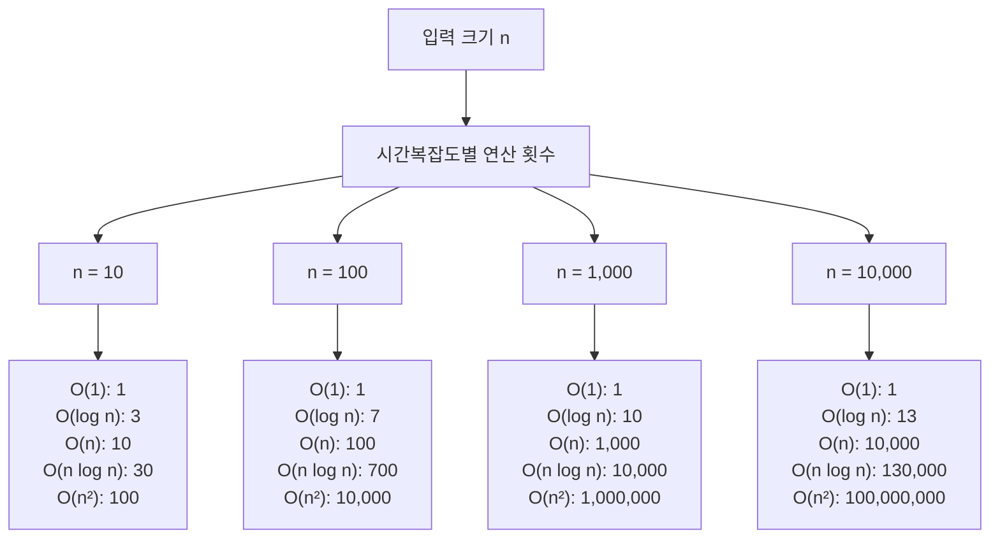

# 1. 시간복잡도, 왜 중요할까요?

요즘 코딩테스트에서는 시간복잡도를 고려하지 않아도 되는 문제들이 주로 출제되곤 합니다. 하지만 시간복잡도를 이해하고 있으면 더 효율적인 코드를 작성할 수 있으며, 더 이해하기 좋은 코드를 만들 수 있기도 합니다.

* 시간 복잡도: 얼마나 많은 시간이 걸리는가?
* 공간 복잡도: 얼마나 많은 공간(메모리)을 사용하는가?

# 2. 시간복잡도란?

**시간복잡도**(Time Complexity)는 입력 크기 n에 따라 알고리즘이 실행되는 데 필요한 연산 횟수를 나타냅니다. 보통 최악의 경우(Worst Case)를 기준으로 계산합니다. 아래 코드를 보며 시간 복잡도를 이해해봅시다.

```python
# 배열에서 특정 값 찾기
def find_value(arr, target):
    for i in range(len(arr)):
        if arr[i] == target:
            return i
    return -1

# 최선의 경우: 첫 번째 원소가 target → 1번 비교
# 평균의 경우: 중간쯤에서 발견 → n/2번 비교
# 최악의 경우: 마지막 원소가 target 또는 없음 → n번 비교
```

최악의 경우에도 시간 내에 실행되어야 하므로, 최악의 경우를 기준으로 시간복잡도를 계산하는 것이 일반적입니다.

:::div{.callout}
* **빅오(O, Big-O) 표기법**: 최악의 상황에서 알고리즘이 얼마나 느려질 수 있는지를 나타내며, 실무에서 가장 많이 사용됩니다.
* **빅세타(Θ, Big-Theta) 표기법**: 알고리즘의 평균적인 실행 시간을 나타내며, 최선과 최악이 비슷할 때 사용합니다.
* **빅오메가(Ω, Big-Omega) 표기법**: 최선의 상황에서 알고리즘이 최소한 얼마나 빠른지를 나타내며, 성능의 하한선을 표현합니다.
:::

# 3. Big-O 표기법

Big-O 표기법은 시간복잡도를 표현하는 가장 일반적인 방법입니다. 입력 크기 n이 커질수록 어떤 속도로 증가하는지를 나타냅니다.

## 3.1 Big-O 표기법의 특징

1. **상수는 무시**: O(2n) → O(n)
2. **최고차항만 표시**: O(n² + n) → O(n²)
3. **계수는 무시**: O(3n²) → O(n²)

```python
# 예시 1: O(2n) → O(n)
def example1(n):
    for i in range(n):
        print(i)
    for i in range(n):  # 두 번 반복해도 O(n)
        print(i)

# 예시 2: O(n² + n) → O(n²)
def example2(n):
    for i in range(n):
        for j in range(n):
            print(i, j)  # O(n²)
    for i in range(n):
        print(i)  # O(n)
    # 최종: O(n² + n) = O(n²)
```

<highlight>
Big-O 표기법은 알고리즘의 효율성을 비교할 때 사용됩니다. 정확한 실행 시간이 아니라, 입력 크기가 커질 때의 성장 추세를 나타냅니다.
</highlight>

# 4. 주요 시간복잡도 비교

대표적인 시간복잡도를 빠른 순서대로 정리하면 다음과 같습니다.

```
O(1) < O(log n) < O(n) < O(n log n) < O(n²) < O(n³) < O(2ⁿ) < O(n!)
```


## 4.1 시간복잡도별 특징

### 4.1.1 O(1) - 상수 시간

입력 크기와 무관하게 항상 일정한 시간이 걸립니다. 가장 빠른 알고리즘이며, 입력 크기가 커져도 실행 시간이 변하지 않습니다.

```python
# 예시: 배열의 첫 번째 원소 접근
def get_first(arr):
    return arr[0]  # O(1)

# 예시: 딕셔너리에서 값 찾기
def get_value(hash_map, key):
    return hash_map.get(key)  # O(1)

# 예시: 수학 공식 활용
def sum_1_to_n(n):
    return n * (n + 1) // 2  # O(1)
```

### 4.1.2 O(log n) - 로그 시간

입력 크기가 2배가 되어도 실행 시간은 +1만 증가합니다. 이진 탐색, 트리 탐색 등에서 자주 나타납니다. 역시나 빠른 알고리즘에 속합니다.

```python
# 예시: 이진 탐색
def binary_search(arr, target):
    left, right = 0, len(arr) - 1

    while left <= right:
        mid = (left + right) // 2

        if arr[mid] == target:
            return mid
        elif arr[mid] < target:
            left = mid + 1
        else:
            right = mid - 1

    return -1

# n = 1,000 → 약 10번 비교
# n = 1,000,000 → 약 20번 비교
```

### 4.1.3 O(n) - 선형 시간

입력 크기에 비례하여 실행 시간이 증가합니다. 배열 순회, 리스트 합계 등에서 자주 나타납니다. 일반적인 시간복잡도입니다.

```python
# 예시 1: 배열 순회
def print_all(arr):
    for item in arr:  # n번 반복
        print(item)

# 예시 2: 리스트 합계
def sum_array(arr):
    total = 0
    for item in arr:  # n번 반복
        total += item
    return total
```

### 4.1.4 O(n log n) - 선형 로그 시간

효율적인 정렬 알고리즘의 시간복잡도입니다. 대부분의 경우에는 충분히 빠릅니다. 정렬은 이 시간복잡도보다 빠르게 하기 힘듭니다.

```python
# 예시 1: 병합 정렬
def merge_sort(arr):
    if len(arr) <= 1:
        return arr

    mid = len(arr) // 2
    left = merge_sort(arr[:mid])  # log n번 분할
    right = merge_sort(arr[mid:])

    return merge(left, right)  # n번 병합

# 예시 2: 파이썬 내장 정렬
arr = [5, 2, 8, 1, 9]
arr.sort()  # O(n log n)
sorted_arr = sorted(arr)  # O(n log n)

# 예시 2: 파이썬 내장 정렬
arr = [5, 2, 8, 1, 9]
arr.sort()  # O(n log n) - 팀소트(Timsort) 알고리즘 사용
sorted_arr = sorted(arr)  # O(n log n)
```

### 4.1.5 O(n²) - 이차 시간

중첩 반복문에서 자주 나타납니다. 입력 크기가 커지면 급격히 느려집니다. 따라서 n이 작을 때만 사용해야 합니다. 코딩테스트에서는 n이 10,000 이상이면 시간 초과가 날 가능성이 높습니다.

```python
# 예시 1: 이중 반복문
def print_pairs(arr):
    for i in range(len(arr)):  # n번
        for j in range(len(arr)):  # n번
            print(arr[i], arr[j])  # n × n = n²

# 예시 2: 모든 쌍의 합 구하기
def all_pair_sum(arr):
    result = []
    for i in range(len(arr)):  # n번
        for j in range(i + 1, len(arr)):  # n번
            result.append(arr[i] + arr[j])
    return result
```

### 4.1.6 O(n³) - 삼차 시간

삼중 반복문에서 나타납니다. 매우 느립니다. n이 1,000 이상이면 시간 초과가 날 가능성이 높습니다.

```python
# 예시: 삼중 반복문
def print_triples(arr):
    for i in range(len(arr)):  # n번
        for j in range(len(arr)):  # n번
            for k in range(len(arr)):  # n번
                print(arr[i], arr[j], arr[k])  # n × n × n = n³
```

### 4.1.7 O(2ⁿ) - 지수 시간

재귀적으로 모든 경우를 탐색할 때 나타납니다. 매우 매우 느립니다. n이 20 이상이면 거의 실행 불가능합니다.

```python
# 예시: 피보나치 (재귀)
def fibonacci(n):
    if n <= 1:
        return n
    return fibonacci(n - 1) + fibonacci(n - 2)  # O(2ⁿ)

# n = 5 → 15번 호출
# n = 10 → 177번 호출
# n = 30 → 2,692,537번 호출
```

### 4.1.8 O(n!) - 팩토리얼 시간

모든 순열을 생성할 때 나타납니다. 가장 느립니다. n이 10 이상이면 거의 실행 불가능합니다.

```python
# 예시: 모든 순열 생성
from itertools import permutations

def all_permutations(arr):
    return list(permutations(arr))  # O(n!)

# n = 5 → 120개
# n = 10 → 3,628,800개
# n = 13 → 6,227,020,800개
```

# 5. 시간복잡도 비교

입력 크기 n에 따른 연산 횟수를 비교해봅시다.



## 5.1 실제 실행 시간 예측

일반적으로 컴퓨터는 1초에 약 1억(10⁸) 번의 연산을 수행할 수 있습니다.

| 시간복잡도 | n = 100 | n = 1,000 | n = 10,000 | n = 100,000 | n = 1,000,000 |
|-----------|---------|-----------|------------|-------------|---------------|
| O(1) | 0.00001ms | 0.00001ms | 0.00001ms | 0.00001ms | 0.00001ms |
| O(log n) | 0.00007ms | 0.0001ms | 0.00013ms | 0.00017ms | 0.0002ms |
| O(n) | 0.001ms | 0.01ms | 0.1ms | 1ms | 10ms |
| O(n log n) | 0.007ms | 0.1ms | 1.3ms | 17ms | 200ms |
| O(n²) | 0.1ms | 10ms | 1초 | 100초 | 2.7시간 |
| O(n³) | 10ms | 1초 | 16.7분 | 11.6일 | 31.7년 |

**코딩테스트의 시간 제한은 보통 1~5초**입니다. 만약 효율성 테스트가 있는 문제라면 시간 복잡도를 낮출 수 있는 방법을 고민해야 합니다.

# 6. 걸린 시간을 측정하는 방법

파이썬에서는 여러 방법으로 코드 실행 시간을 측정할 수 있습니다. timeit 모듈 사용이 가장 권장되는 방법입니다.

## 6.1 time 모듈 사용

가장 기본적인 방법입니다.
```python
import time

start_time = time.time()  # 시작 시간 기록
# 측정할 코드
end_time = time.time()  # 종료 시간 기록
print("걸린 시간:", end_time - start_time, "초")
```

## 6.2 timeit 모듈 사용

더 정확한 측정이 가능하며, 여러 번 반복 실행하여 평균을 냅니다. 가장 권장하는 방법입니다.
```python
import timeit

# 방법 1: 문자열로 코드 전달
time_taken = timeit.timeit('sum(range(100))', number=10000)
print("걸린 시간:", time_taken, "초")

# 방법 2: 함수로 측정
def my_function():
    return sum(range(100))

time_taken = timeit.timeit(my_function, number=10000)
print("걸린 시간:", time_taken, "초")

# 방법 3: repeat로 여러 번 측정
times = timeit.repeat(my_function, number=10000, repeat=5)
print("최소 시간:", min(times), "초")
```

## 6.3 perf_counter 사용

`time.time()`보다 더 정밀한 측정이 가능합니다.
```python
import time

start_time = time.perf_counter()  # 더 정밀한 시간 측정
# 측정할 코드
end_time = time.perf_counter()
print("걸린 시간:", end_time - start_time, "초")
```

## 6.4 데코레이터로 함수 실행 시간 측정

재사용 가능한 방법입니다.
```python
import time

def measure_time(func):
    def wrapper(*args, **kwargs):
        start_time = time.perf_counter()
        result = func(*args, **kwargs)
        end_time = time.perf_counter()
        print(f"{func.__name__} 실행 시간: {end_time - start_time:.6f}초")
        return result
    return wrapper

@measure_time
def slow_function():
    total = 0
    for i in range(1000000):
        total += i
    return total

slow_function()  # 실행 시간이 자동으로 출력됨
```

## 6.5 Notebook에서 측정

Colab이나 Jupyter Notebook을 사용한다면 매직 커맨드를 활용할 수 있습니다.
```python
# 한 줄 코드 측정
%timeit sum(range(100))

# 여러 줄 코드 측정
%%timeit
total = 0
for i in range(100):
    total += i
```

:::div{.callout}
**측정 방법 선택 가이드**
* 간단한 측정: `time.time()` 또는 `time.perf_counter()`
* 정확한 성능 비교: `timeit` 모듈 (여러 번 반복 실행)
* 함수 성능 모니터링: 데코레이터 패턴
* Notebook 환경: `%timeit` 매직 커맨드
:::