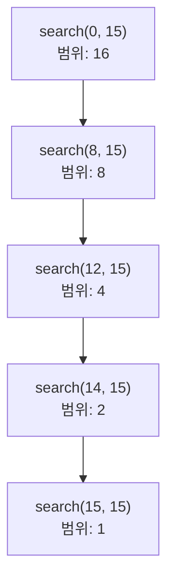
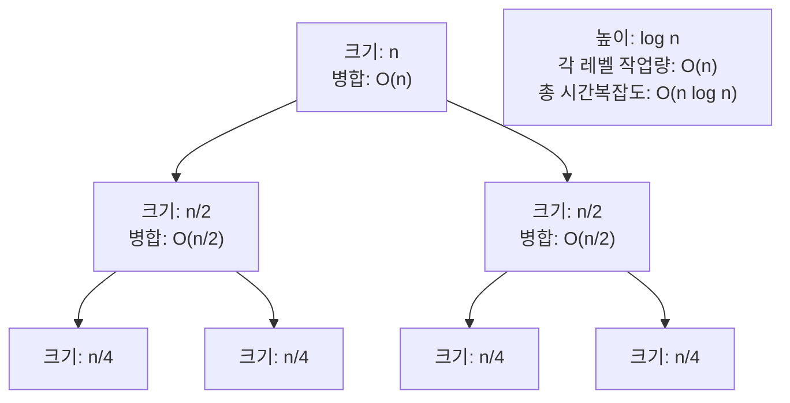

# 1. 시간복잡도 계산, 이제 직접 해봅시다!

이전 장에서 시간복잡도의 개념을 배웠다면, 이번 장에서는 실제 코드를 보고 시간복잡도를 계산하는 연습을 해보겠습니다. 코딩테스트에서는 코드를 작성하기 전에 시간복잡도를 미리 계산하여 시간 초과 여부를 판단하는 것이 중요합니다.

# 2. 반복문 분석

반복문의 시간복잡도를 계산하는 방법을 단계별로 알아보겠습니다.

## 2.1 단순 반복문

### 2.1.1 예제 1: 한 번의 반복

```python
def example1(n):
    for i in range(n):  # n번 반복
        print(i)  # O(1)

# 3. 시간복잡도: O(n) × O(1) = O(n)
```

**계산 과정:**
- 반복 횟수: n번
- 반복문 내부 연산: O(1)
- 총 시간복잡도: O(n)

### 3.0.1 예제 2: 두 번의 연속 반복

```python
def example2(n):
    for i in range(n):  # n번
        print(i)  # O(1)

    for j in range(n):  # n번
        print(j)  # O(1)

# 4. 시간복잡도: O(n) + O(n) = O(2n) = O(n)
```

**계산 과정:**
- 첫 번째 반복문: O(n)
- 두 번째 반복문: O(n)
- 총 시간복잡도: O(n + n) = O(2n) = O(n)
- 상수 2는 무시

### 4.0.1 예제 3: 반복 범위가 다른 경우

```python
def example3(n, m):
    for i in range(n):  # n번
        print(i)

    for j in range(m):  # m번
        print(j)

# 5. 시간복잡도: O(n + m)
```

**계산 과정:**
- n과 m이 다른 변수이므로 합침
- 총 시간복잡도: O(n + m)

## 5.1 중첩 반복문

### 5.1.1 예제 4: 이중 반복문

```python
def example4(n):
    for i in range(n):  # n번
        for j in range(n):  # n번
            print(i, j)  # O(1)

# 6. 시간복잡도: O(n) × O(n) = O(n²)
```

**계산 과정:**
- 외부 반복문: n번
- 내부 반복문: n번
- 총 시간복잡도: O(n × n) = O(n²)

### 6.0.1 예제 5: 범위가 다른 이중 반복문

```python
def example5(n, m):
    for i in range(n):  # n번
        for j in range(m):  # m번
            print(i, j)

# 7. 시간복잡도: O(n × m)
```

**계산 과정:**
- 외부 반복문: n번
- 내부 반복문: m번
- 총 시간복잡도: O(n × m)

### 7.0.1 예제 6: 내부 반복 범위가 변하는 경우

```python
def example6(n):
    for i in range(n):  # n번
        for j in range(i):  # i번 (0, 1, 2, ..., n-1)
            print(i, j)

# 8. 총 반복 횟수: 0 + 1 + 2 + ... + (n-1) = n(n-1)/2 = n²/2
# 9. 시간복잡도: O(n²/2) = O(n²)
```

**계산 과정:**
- i = 0일 때: 0번
- i = 1일 때: 1번
- i = 2일 때: 2번
- ...
- i = n-1일 때: n-1번
- 총합: 0 + 1 + 2 + ... + (n-1) = n(n-1)/2
- 최고차항만 남기면: O(n²)

### 9.0.1 예제 7: 삼중 반복문

```python
def example7(n):
    for i in range(n):  # n번
        for j in range(n):  # n번
            for k in range(n):  # n번
                print(i, j, k)

# 10. 시간복잡도: O(n) × O(n) × O(n) = O(n³)
```

## 10.1 반복문과 조건문

### 10.1.1 예제 8: 조건문 포함

```python
def example8(n):
    for i in range(n):  # n번
        if i % 2 == 0:  # O(1)
            print(i)  # O(1)

# 11. 시간복잡도: O(n)
```

**계산 과정:**
- 조건문은 O(1)
- 반복문이 주요 요인
- 총 시간복잡도: O(n)

### 11.0.1 예제 9: 내부 반복문이 조건에 따라 실행

```python
def example9(n):
    for i in range(n):  # n번
        if i % 2 == 0:  # O(1)
            for j in range(n):  # n번
                print(i, j)

# 12. 최악의 경우 모든 i가 짝수라고 가정
# 13. 시간복잡도: O(n²)
```

**계산 과정:**
- 최악의 경우를 고려
- 모든 i에 대해 내부 반복문 실행
- 총 시간복잡도: O(n²)

## 13.1 특수한 반복 패턴

### 13.1.1 예제 10: 반씩 줄어드는 반복

```python
def example10(n):
    i = n
    while i > 0:
        print(i)
        i //= 2  # 절반으로 줄어듦

# 14. n → n/2 → n/4 → ... → 1
# 15. 반복 횟수: log₂n
# 16. 시간복잡도: O(log n)
```

**계산 과정:**
- i가 매번 절반으로 줄어듦
- n → n/2 → n/4 → ... → 1
- 반복 횟수: log₂n
- 총 시간복잡도: O(log n)

### 16.0.1 예제 11: 2배씩 증가하는 반복

```python
def example11(n):
    i = 1
    while i < n:
        print(i)
        i *= 2  # 2배로 증가

# 17. 1 → 2 → 4 → 8 → ... → n
# 18. 반복 횟수: log₂n
# 19. 시간복잡도: O(log n)
```

### 19.0.1 예제 12: 제곱근까지만 반복

```python
def example12(n):
    i = 1
    while i * i <= n:
        print(i)
        i += 1

# 20. i = 1, 2, 3, ..., √n
# 21. 반복 횟수: √n
# 22. 시간복잡도: O(√n)
```

<highlight>
반복문의 범위가 절반씩 줄어들거나 2배씩 증가하면 O(log n)입니다. 이진 탐색이 대표적인 예시입니다.
</highlight>

# 23. 재귀 함수 분석

재귀 함수의 시간복잡도는 재귀 트리를 그려서 계산합니다.

## 23.1 단순 재귀

### 23.1.1 예제 13: 1부터 n까지 합

```python
def sum_recursive(n):
    if n == 1:  # 기저 조건
        return 1
    return n + sum_recursive(n - 1)  # 재귀 호출

# 24. 재귀 깊이: n
# 25. 각 호출당 연산: O(1)
# 26. 시간복잡도: O(n)
```

**계산 과정:**
```
sum_recursive(5)
= 5 + sum_recursive(4)
= 5 + (4 + sum_recursive(3))
= 5 + (4 + (3 + sum_recursive(2)))
= 5 + (4 + (3 + (2 + sum_recursive(1))))
= 5 + (4 + (3 + (2 + 1)))
```
- 재귀 호출 횟수: n번
- 시간복잡도: O(n)

### 26.0.1 예제 14: 팩토리얼

```python
def factorial(n):
    if n <= 1:
        return 1
    return n * factorial(n - 1)

# 27. 재귀 깊이: n
# 28. 시간복잡도: O(n)
```

## 28.1 이진 재귀

### 28.1.1 예제 15: 피보나치 (비효율적)

```python
def fibonacci(n):
    if n <= 1:
        return n
    return fibonacci(n - 1) + fibonacci(n - 2)

# 29. 시간복잡도: O(2ⁿ)
```

**재귀 트리:**
```
              fib(5)
            /         \
        fib(4)        fib(3)
       /      \       /     \
    fib(3)  fib(2) fib(2)  fib(1)
    /   \   /   \  /   \
fib(2) fib(1) ...
```

**계산 과정:**
- fib(5) = fib(4) + fib(3)
- fib(4) = fib(3) + fib(2)
- fib(3) = fib(2) + fib(1)
- 중복 계산이 많음
- 대략 2ⁿ번 호출
- 시간복잡도: O(2ⁿ)

### 29.0.1 예제 16: 이진 탐색 (재귀)

```python
def binary_search_recursive(arr, target, left, right):
    if left > right:
        return -1

    mid = (left + right) // 2

    if arr[mid] == target:
        return mid
    elif arr[mid] < target:
        return binary_search_recursive(arr, target, mid + 1, right)
    else:
        return binary_search_recursive(arr, target, left, mid - 1)

# 30. 매번 절반씩 줄어듦
# 31. 재귀 깊이: log₂n
# 32. 시간복잡도: O(log n)
```

**재귀 트리:**


**계산 과정:**
- 매번 탐색 범위가 절반으로 줄어듦
- 재귀 깊이: log₂n
- 시간복잡도: O(log n)

## 32.1 분할 정복

### 32.1.1 예제 17: 병합 정렬

```python
def merge_sort(arr):
    if len(arr) <= 1:
        return arr

    mid = len(arr) // 2
    left = merge_sort(arr[:mid])  # 절반 정렬
    right = merge_sort(arr[mid:])  # 절반 정렬

    return merge(left, right)  # O(n) 병합

def merge(left, right):
    result = []
    i = j = 0

    while i < len(left) and j < len(right):
        if left[i] < right[j]:
            result.append(left[i])
            i += 1
        else:
            result.append(right[j])
            j += 1

    result.extend(left[i:])
    result.extend(right[j:])
    return result

# 33. 시간복잡도: O(n log n)
```

**재귀 트리:**


**계산 과정:**
- 재귀 깊이: log₂n (매번 절반으로 분할)
- 각 레벨에서의 병합 시간: O(n)
- 총 시간복잡도: O(n) × O(log n) = O(n log n)

<highlight>
재귀 함수의 시간복잡도는 재귀 트리를 그려보면 쉽게 계산할 수 있습니다. 재귀 깊이 × 각 호출당 연산 = 시간복잡도
</highlight>

# 34. 실전 예제 연습

실제 코딩테스트 문제에서 시간복잡도를 계산하는 연습을 해봅시다.

## 34.1 연습 문제 1: 배열의 모든 쌍 출력

```python
def print_all_pairs(arr):
    n = len(arr)
    for i in range(n):
        for j in range(i + 1, n):
            print(arr[i], arr[j])
```

**시간복잡도 계산:**
- 외부 반복: n번
- 내부 반복: (n-1) + (n-2) + ... + 1 = n(n-1)/2
- 총 시간복잡도: O(n²)

**입력 크기별 가능 여부:**
- n = 100: 약 5,000번 → 가능
- n = 1,000: 약 500,000번 → 가능
- n = 10,000: 약 50,000,000번 → 가능
- n = 100,000: 약 5,000,000,000번 → 시간 초과

## 34.2 연습 문제 2: 정렬 후 이진 탐색

```python
def search_sorted(arr, target):
    arr.sort()  # O(n log n)

    # 이진 탐색
    left, right = 0, len(arr) - 1
    while left <= right:  # O(log n)
        mid = (left + right) // 2
        if arr[mid] == target:
            return mid
        elif arr[mid] < target:
            left = mid + 1
        else:
            right = mid - 1

    return -1
```

**시간복잡도 계산:**
- 정렬: O(n log n)
- 이진 탐색: O(log n)
- 총 시간복잡도: O(n log n) + O(log n) = O(n log n)

**입력 크기별 가능 여부:**
- n = 100,000: 약 1,700,000번 → 가능
- n = 1,000,000: 약 20,000,000번 → 가능

## 34.3 연습 문제 3: 중복 제거

```python
# 35. 방법 1: 이중 반복문
def remove_duplicates_brute(arr):
    result = []
    for i in range(len(arr)):  # O(n)
        is_duplicate = False
        for j in range(len(result)):  # O(n)
            if arr[i] == result[j]:
                is_duplicate = True
                break
        if not is_duplicate:
            result.append(arr[i])
    return result

# 36. 시간복잡도: O(n²)

# 37. 방법 2: 집합 사용
def remove_duplicates_set(arr):
    return list(set(arr))  # O(n)

# 38. 시간복잡도: O(n)
```

**비교:**
- 방법 1: O(n²) → n = 10,000일 때 약 100,000,000번
- 방법 2: O(n) → n = 10,000일 때 약 10,000번
- 방법 2가 10,000배 빠름!

## 38.1 연습 문제 4: 부분 수열의 합

```python
# 39. 방법 1: 재귀 (모든 경우 탐색)
def subset_sum_recursive(arr, target, index=0, current_sum=0):
    if index == len(arr):
        return current_sum == target

    # 현재 원소를 포함하는 경우
    if subset_sum_recursive(arr, target, index + 1, current_sum + arr[index]):
        return True

    # 현재 원소를 포함하지 않는 경우
    if subset_sum_recursive(arr, target, index + 1, current_sum):
        return True

    return False

# 40. 시간복잡도: O(2ⁿ)

# 41. 방법 2: 동적 프로그래밍
def subset_sum_dp(arr, target):
    n = len(arr)
    dp = [[False] * (target + 1) for _ in range(n + 1)]

    # 초기화
    for i in range(n + 1):
        dp[i][0] = True

    # DP
    for i in range(1, n + 1):
        for j in range(1, target + 1):
            dp[i][j] = dp[i-1][j]  # 포함하지 않는 경우
            if j >= arr[i-1]:
                dp[i][j] |= dp[i-1][j-arr[i-1]]  # 포함하는 경우

    return dp[n][target]

# 42. 시간복잡도: O(n × target)
```

**비교:**
- 방법 1: O(2ⁿ) → n = 20일 때 약 1,000,000번
- 방법 2: O(n × target) → n = 100, target = 10,000일 때 약 1,000,000번
- n이 작으면 방법 1, target이 작으면 방법 2

## 42.1 연습 문제 5: 최장 증가 부분 수열 (LIS)

```python
# 43. 방법 1: 동적 프로그래밍 O(n²)
def lis_dp(arr):
    n = len(arr)
    dp = [1] * n

    for i in range(1, n):  # O(n)
        for j in range(i):  # O(n)
            if arr[j] < arr[i]:
                dp[i] = max(dp[i], dp[j] + 1)

    return max(dp)

# 44. 시간복잡도: O(n²)

# 45. 방법 2: 이진 탐색 O(n log n)
import bisect

def lis_binary_search(arr):
    lis = []

    for num in arr:  # O(n)
        pos = bisect.bisect_left(lis, num)  # O(log n)
        if pos == len(lis):
            lis.append(num)
        else:
            lis[pos] = num

    return len(lis)

# 46. 시간복잡도: O(n log n)
```

**비교:**
- 방법 1: O(n²) → n = 1,000일 때 약 1,000,000번
- 방법 2: O(n log n) → n = 100,000일 때 약 1,700,000번
- n이 크면 방법 2 필수

# 47. 시간복잡도 계산 연습 문제

다음 코드의 시간복잡도를 계산해보세요.

## 47.1 문제 1

```python
def problem1(n):
    count = 0
    for i in range(n):
        for j in range(i, n):
            count += 1
    return count
```

<details>
<summary>정답 보기</summary>

**시간복잡도: O(n²)**

계산 과정:
- i = 0일 때: n번
- i = 1일 때: n-1번
- i = 2일 때: n-2번
- ...
- 총합: n + (n-1) + (n-2) + ... + 1 = n(n+1)/2
- 최고차항: O(n²)
</details>

## 47.2 문제 2

```python
def problem2(n):
    i = 1
    count = 0
    while i < n:
        j = 0
        while j < n:
            count += 1
            j += 1
        i *= 2
    return count
```

<details>
<summary>정답 보기</summary>

**시간복잡도: O(n log n)**

계산 과정:
- 외부 반복: i가 2배씩 증가 → log₂n번
- 내부 반복: j가 1씩 증가 → n번
- 총 시간복잡도: O(log n) × O(n) = O(n log n)
</details>

## 47.3 문제 3

```python
def problem3(arr):
    n = len(arr)
    for i in range(n):
        for j in range(i):
            for k in range(j):
                print(i, j, k)
```

<details>
<summary>정답 보기</summary>

**시간복잡도: O(n³)**

계산 과정:
- 삼중 중첩 반복문
- 총 반복 횟수는 n³에 비례
- 시간복잡도: O(n³)
</details>

## 47.4 문제 4

```python
def problem4(n):
    result = []
    for i in range(n):
        result.append(i)
    result.sort()
    return result
```

<details>
<summary>정답 보기</summary>

**시간복잡도: O(n log n)**

계산 과정:
- 반복문: O(n)
- 정렬: O(n log n)
- 총 시간복잡도: O(n) + O(n log n) = O(n log n)
</details>

<highlight>
코드를 작성하기 전에 시간복잡도를 미리 계산하는 습관을 들이세요. 이렇게 하면 시간 초과를 피할 수 있고, 더 효율적인 알고리즘을 선택할 수 있습니다!
</highlight>

# 48. 정리

## 48.1 시간복잡도 계산 방법

1. **단순 반복문**: 반복 횟수 세기
2. **중첩 반복문**: 각 반복문의 시간복잡도 곱하기
3. **재귀 함수**: 재귀 트리 그려서 깊이 × 각 호출당 연산
4. **여러 구간**: 가장 큰 시간복잡도만 남기기

## 48.2 빠른 계산 팁

| 코드 패턴 | 시간복잡도 |
|-----------|-----------|
| for i in range(n) | O(n) |
| for i in range(n): <br/> &nbsp;&nbsp; for j in range(n) | O(n²) |
| while i < n: <br/> &nbsp;&nbsp; i \*= 2 | O(log n) |
| arr.sort() | O(n log n) |
| set(arr) | O(n) |
| arr[i] | O(1) |
| arr.append(x) | O(1) |
| arr.pop(0) | O(n) |

다음 장에서는 공간복잡도와 메모리 최적화에 대해 알아보겠습니다!
