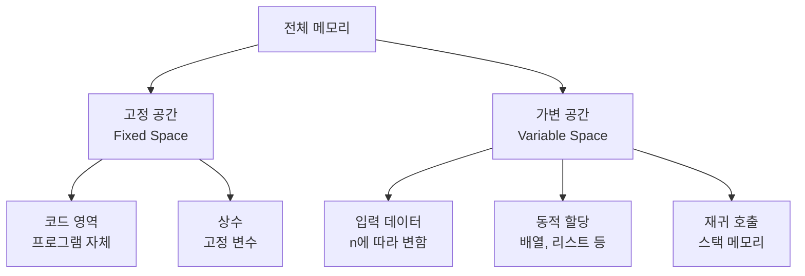

# 1. 공간복잡도, 왜 중요할까요?

시간 제한만큼이나 중요한 것이 메모리 제한입니다. 아무리 빠른 알고리즘이라도 메모리를 너무 많이 사용하면 '메모리 초과'가 발생할 수 있습니다.

공간복잡도(Space Complexity)는 알고리즘이 실행되는 동안 사용하는 메모리 공간을 나타냅니다. 효율적인 알고리즘은 시간과 공간을 모두 고려해야 합니다.

# 2. 공간복잡도란?

공간복잡도는 프로그램이 실행되는 동안 사용하는 메모리 공간의 양을 나타냅니다.

## 2.1 메모리 사용 구성 요소



**공간복잡도 = 고정 공간 + 가변 공간**

하지만 일반적으로 고정 공간은 상수이므로 무시하고, 가변 공간만 고려합니다.<highlight> 공간복잡도는 입력 크기 n에 따라 필요한 메모리 공간이 어떻게 증가하는지를 나타냅니다. 시간복잡도와 마찬가지로 Big-O 표기법을 사용합니다.</highlight>

# 3. 기본 자료형의 메모리 크기

Python에서 기본 자료형이 차지하는 메모리 크기를 알아봅시다.

## 3.1 Python 자료형 메모리 크기

```python
import sys

# 정수형
print(sys.getsizeof(0))          # 28 bytes
print(sys.getsizeof(100))        # 28 bytes
print(sys.getsizeof(10**100))    # 76 bytes (큰 수는 더 많은 메모리)

# 실수형
print(sys.getsizeof(3.14))       # 24 bytes

# 문자열
print(sys.getsizeof(""))         # 49 bytes (빈 문자열)
print(sys.getsizeof("a"))        # 50 bytes
print(sys.getsizeof("hello"))    # 54 bytes

# 리스트
print(sys.getsizeof([]))         # 56 bytes (빈 리스트)
print(sys.getsizeof([1, 2, 3]))  # 88 bytes

# 딕셔너리
print(sys.getsizeof({}))         # 64 bytes (빈 딕셔너리)
print(sys.getsizeof({'a': 1}))   # 232 bytes
```

## 3.2 일반적인 메모리 제한

일반적인 가상환경의 메모리 제한은 다음과 같습니다.

- **128 MB**: 가장 일반적인 제한
- **256 MB**: 여유있는 제한
- **512 MB**: 매우 여유로운 제한

**128 MB로 저장 가능한 데이터:**
- int 배열: 약 3,200만 개
- float 배열: 약 1,600만 개
- 이차원 배열(n×n): n ≈ 5,600

# 4. 공간복잡도 계산

## 4.1 O(1) - 상수 공간

입력 크기와 무관하게 고정된 메모리만 사용합니다.

```python
# 예시 1: 변수만 사용
def sum_array(arr):
    total = 0  # 4 bytes
    for num in arr:
        total += num
    return total

# 공간복잡도: O(1)
# 추가 메모리: total 변수 하나만 사용
```

```python
# 예시 2: 스왑
def swap(arr, i, j):
    temp = arr[i]  # 임시 변수
    arr[i] = arr[j]
    arr[j] = temp

# 공간복잡도: O(1)
# 추가 메모리: temp 변수 하나만 사용
```

## 4.2 O(n) - 선형 공간

입력 크기에 비례하여 메모리를 사용합니다.

```python
# 예시 1: 배열 복사
def copy_array(arr):
    new_arr = []
    for item in arr:
        new_arr.append(item)
    return new_arr

# 공간복잡도: O(n)
# 추가 메모리: new_arr (크기 n)
```

```python
# 예시 2: 해시맵 사용
def count_frequency(arr):
    freq = {}
    for item in arr:
        freq[item] = freq.get(item, 0) + 1
    return freq

# 공간복잡도: O(n)
# 최악의 경우 모든 원소가 다르면 딕셔너리 크기가 n
```

## 4.3 O(n²) - 이차 공간

이차원 배열을 사용할 때 나타납니다.

```python
# 예시 1: 이차원 배열 생성
def create_matrix(n):
    matrix = [[0] * n for _ in range(n)]
    return matrix

# 공간복잡도: O(n²)
# 메모리: n × n = n²
```

## 4.4 O(log n) - 로그 공간

이진 탐색 등에서 재귀 깊이가 log n인 경우입니다.

```python
# 예시: 이진 탐색 (재귀)
def binary_search(arr, target, left, right):
    if left > right:
        return -1

    mid = (left + right) // 2

    if arr[mid] == target:
        return mid
    elif arr[mid] < target:
        return binary_search(arr, target, mid + 1, right)
    else:
        return binary_search(arr, target, left, mid - 1)

# 공간복잡도: O(log n)
# 재귀 깊이가 log n
```

# 5. 메모리 사용 최적화

효율적인 메모리 사용을 위한 기법들을 알아봅시다.

## 5.1 제자리 알고리즘 (In-place Algorithm)

추가 메모리를 거의 사용하지 않고 입력 자료 구조 내에서 처리합니다.

다만 메모리 사용은 최적화 될지 몰라도 시간복잡도가 더 나빠질 수 있으니 주의하세요. 요즘 코딩 테스트에서는 둘 다 고려하지 않는 경우가 더 많습니다.

:::div{.callout}
시간복잡도와 공간복잡도가 모두 좋은 알고리즘은 매우 드뭅니다. 보통 하나를 희생해야 다른 하나를 최적화할 수 있습니다. 이를 '시간-공간 트레이드오프'라고 합니다.
:::

### 5.1.1 배열 뒤집기

```python
# 비효율적 방법: O(n) 공간
def reverse_inefficient(arr):
    return arr[::-1]  # 새로운 배열 생성

# 효율적 방법: O(1) 공간
def reverse_inplace(arr):
    left, right = 0, len(arr) - 1
    while left < right:
        arr[left], arr[right] = arr[right], arr[left]
        left += 1
        right -= 1
    return arr

# 공간복잡도: O(1)
# 추가 메모리: left, right 변수만 사용
```

### 5.1.2중복 제거

```python
# 비효율적 방법: O(n) 공간
def remove_duplicates_inefficient(arr):
    return list(set(arr))  # 새로운 리스트 생성

# 효율적 방법: O(1) 공간 (정렬된 배열)
def remove_duplicates_inplace(arr):
    if not arr:
        return 0

    arr.sort()  # 제자리 정렬
    i = 0
    for j in range(1, len(arr)):
        if arr[j] != arr[i]:
            i += 1
            arr[i] = arr[j]

    return i + 1  # 고유한 원소의 개수
```

## 5.2 재귀를 반복문으로 변환

재귀 호출은 스택 메모리를 사용하므로, 반복문으로 바꾸면 메모리를 절약할 수 있습니다.

### 5.2.1 팩토리얼

```python
# 재귀: O(n) 공간
def factorial_recursive(n):
    if n <= 1:
        return 1
    return n * factorial_recursive(n - 1)

# 반복문: O(1) 공간
def factorial_iterative(n):
    result = 1
    for i in range(2, n + 1):
        result *= i
    return result
```

### 5.2.2 피보나치

```python
# 재귀: O(n) 공간 (메모이제이션 포함)
def fibonacci_recursive(n, memo={}):
    if n in memo:
        return memo[n]
    if n <= 1:
        return n
    memo[n] = fibonacci_recursive(n - 1, memo) + fibonacci_recursive(n - 2, memo)
    return memo[n]

# 반복문: O(1) 공간
def fibonacci_iterative(n):
    if n <= 1:
        return n

    prev, curr = 0, 1
    for _ in range(2, n + 1):
        prev, curr = curr, prev + curr

    return curr
```