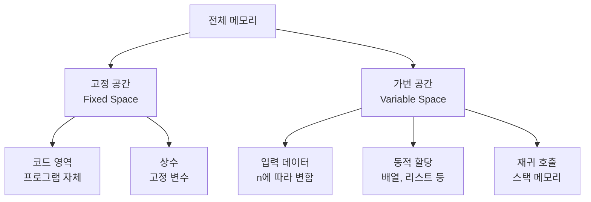
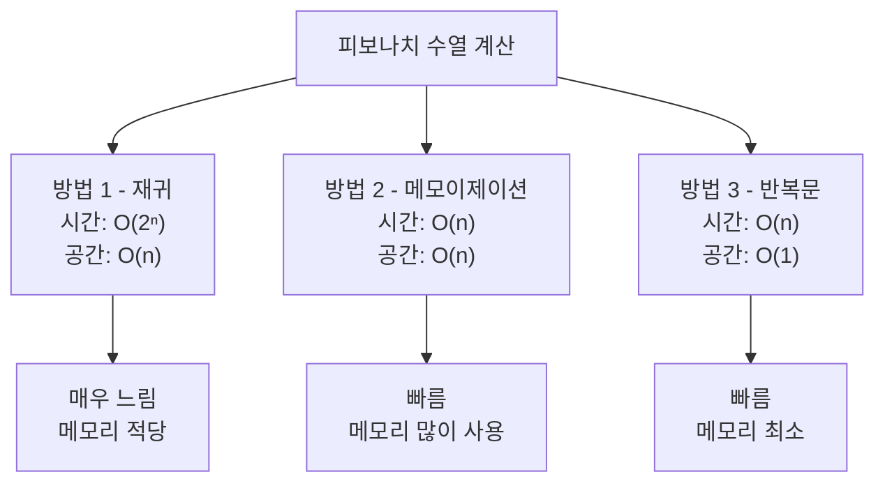

# 1. 공간복잡도, 왜 중요할까요?

코딩테스트에서 시간 제한만큼이나 중요한 것이 메모리 제한입니다. 아무리 빠른 알고리즘이라도 메모리를 너무 많이 사용하면 '메모리 초과'로 오답 처리됩니다.

공간복잡도(Space Complexity)는 알고리즘이 실행되는 동안 사용하는 메모리 공간을 나타냅니다. 효율적인 알고리즘은 시간과 공간을 모두 고려해야 합니다.

# 2. 공간복잡도란?

공간복잡도는 프로그램이 실행되는 동안 사용하는 메모리 공간의 양을 나타냅니다.

## 2.1 메모리 사용 구성 요소



**공간복잡도 = 고정 공간 + 가변 공간**

하지만 일반적으로 고정 공간은 상수이므로 무시하고, 가변 공간만 고려합니다.

<highlight>
공간복잡도는 입력 크기 n에 따라 필요한 메모리 공간이 어떻게 증가하는지를 나타냅니다. 시간복잡도와 마찬가지로 Big-O 표기법을 사용합니다.
</highlight>

# 3. 기본 자료형의 메모리 크기

Python에서 기본 자료형이 차지하는 메모리 크기를 알아봅시다.

## 3.1 Python 자료형 메모리 크기

```python
import sys

# 4. 정수형
print(sys.getsizeof(0))          # 28 bytes
print(sys.getsizeof(100))        # 28 bytes
print(sys.getsizeof(10**100))    # 76 bytes (큰 수는 더 많은 메모리)

# 5. 실수형
print(sys.getsizeof(3.14))       # 24 bytes

# 6. 문자열
print(sys.getsizeof(""))         # 49 bytes (빈 문자열)
print(sys.getsizeof("a"))        # 50 bytes
print(sys.getsizeof("hello"))    # 54 bytes

# 7. 리스트
print(sys.getsizeof([]))         # 56 bytes (빈 리스트)
print(sys.getsizeof([1, 2, 3]))  # 88 bytes

# 8. 딕셔너리
print(sys.getsizeof({}))         # 64 bytes (빈 딕셔너리)
print(sys.getsizeof({'a': 1}))   # 232 bytes
```

## 8.1 일반적인 메모리 제한

코딩테스트에서 일반적인 메모리 제한은 다음과 같습니다:

- **128 MB**: 가장 일반적인 제한
- **256 MB**: 여유있는 제한
- **512 MB**: 매우 여유로운 제한

**128 MB로 저장 가능한 데이터:**
- int 배열: 약 3,200만 개
- float 배열: 약 1,600만 개
- 이차원 배열(n×n): n ≈ 5,600

# 9. 공간복잡도 계산

## 9.1 O(1) - 상수 공간

입력 크기와 무관하게 고정된 메모리만 사용합니다.

```python
# 10. 예시 1: 변수만 사용
def sum_array(arr):
    total = 0  # 4 bytes
    for num in arr:
        total += num
    return total

# 11. 공간복잡도: O(1)
# 12. 추가 메모리: total 변수 하나만 사용
```

```python
# 13. 예시 2: 스왑
def swap(arr, i, j):
    temp = arr[i]  # 임시 변수
    arr[i] = arr[j]
    arr[j] = temp

# 14. 공간복잡도: O(1)
# 15. 추가 메모리: temp 변수 하나만 사용
```

## 15.1 O(n) - 선형 공간

입력 크기에 비례하여 메모리를 사용합니다.

```python
# 16. 예시 1: 배열 복사
def copy_array(arr):
    new_arr = []
    for item in arr:
        new_arr.append(item)
    return new_arr

# 17. 공간복잡도: O(n)
# 18. 추가 메모리: new_arr (크기 n)
```

```python
# 19. 예시 2: 해시맵 사용
def count_frequency(arr):
    freq = {}
    for item in arr:
        freq[item] = freq.get(item, 0) + 1
    return freq

# 20. 공간복잡도: O(n)
# 21. 최악의 경우 모든 원소가 다르면 딕셔너리 크기가 n
```

```python
# 22. 예시 3: 재귀 호출 스택
def factorial(n):
    if n <= 1:
        return 1
    return n * factorial(n - 1)

# 23. 공간복잡도: O(n)
# 24. 재귀 깊이가 n이므로 스택에 n개의 함수 호출 저장
```

## 24.1 O(n²) - 이차 공간

이차원 배열을 사용할 때 나타납니다.

```python
# 25. 예시 1: 이차원 배열 생성
def create_matrix(n):
    matrix = [[0] * n for _ in range(n)]
    return matrix

# 26. 공간복잡도: O(n²)
# 27. 메모리: n × n = n²
```

```python
# 28. 예시 2: 그래프 인접 행렬
def create_adjacency_matrix(n):
    graph = [[0] * n for _ in range(n)]
    return graph

# 29. 공간복잡도: O(n²)
```

```python
# 30. 예시 3: 동적 프로그래밍 테이블
def fibonacci_dp(n):
    dp = [[0] * n for _ in range(n)]
    # ... DP 로직
    return dp

# 31. 공간복잡도: O(n²)
```

## 31.1 O(log n) - 로그 공간

이진 탐색 등에서 재귀 깊이가 log n인 경우입니다.

```python
# 32. 예시: 이진 탐색 (재귀)
def binary_search(arr, target, left, right):
    if left > right:
        return -1

    mid = (left + right) // 2

    if arr[mid] == target:
        return mid
    elif arr[mid] < target:
        return binary_search(arr, target, mid + 1, right)
    else:
        return binary_search(arr, target, left, mid - 1)

# 33. 공간복잡도: O(log n)
# 34. 재귀 깊이가 log n
```

# 35. 메모리 사용 최적화

효율적인 메모리 사용을 위한 기법들을 알아봅시다.

## 35.1 1. 제자리 알고리즘 (In-place Algorithm)

추가 메모리를 거의 사용하지 않고 입력 자료 구조 내에서 처리합니다.

### 35.1.1 배열 뒤집기

```python
# 36. 비효율적 방법: O(n) 공간
def reverse_inefficient(arr):
    return arr[::-1]  # 새로운 배열 생성

# 37. 효율적 방법: O(1) 공간
def reverse_inplace(arr):
    left, right = 0, len(arr) - 1
    while left < right:
        arr[left], arr[right] = arr[right], arr[left]
        left += 1
        right -= 1
    return arr

# 38. 공간복잡도: O(1)
# 39. 추가 메모리: left, right 변수만 사용
```

### 39.0.1 중복 제거

```python
# 40. 비효율적 방법: O(n) 공간
def remove_duplicates_inefficient(arr):
    return list(set(arr))  # 새로운 리스트 생성

# 41. 효율적 방법: O(1) 공간 (정렬된 배열)
def remove_duplicates_inplace(arr):
    if not arr:
        return 0

    arr.sort()  # 제자리 정렬
    i = 0
    for j in range(1, len(arr)):
        if arr[j] != arr[i]:
            i += 1
            arr[i] = arr[j]

    return i + 1  # 고유한 원소의 개수
```

## 41.1 2. 재귀를 반복문으로 변환

재귀 호출은 스택 메모리를 사용하므로, 반복문으로 바꾸면 메모리를 절약할 수 있습니다.

### 41.1.1 팩토리얼

```python
# 42. 재귀: O(n) 공간
def factorial_recursive(n):
    if n <= 1:
        return 1
    return n * factorial_recursive(n - 1)

# 43. 반복문: O(1) 공간
def factorial_iterative(n):
    result = 1
    for i in range(2, n + 1):
        result *= i
    return result
```

### 43.0.1 피보나치

```python
# 44. 재귀: O(n) 공간 (메모이제이션 포함)
def fibonacci_recursive(n, memo={}):
    if n in memo:
        return memo[n]
    if n <= 1:
        return n
    memo[n] = fibonacci_recursive(n - 1, memo) + fibonacci_recursive(n - 2, memo)
    return memo[n]

# 45. 반복문: O(1) 공간
def fibonacci_iterative(n):
    if n <= 1:
        return n

    prev, curr = 0, 1
    for _ in range(2, n + 1):
        prev, curr = curr, prev + curr

    return curr
```

## 45.1 3. 슬라이딩 윈도우

고정된 크기의 윈도우를 유지하여 메모리를 절약합니다.

```python
# 46. 비효율적 방법: O(n×k) 공간
def max_sum_subarray_inefficient(arr, k):
    result = []
    for i in range(len(arr) - k + 1):
        window = arr[i:i+k]  # 매번 새로운 배열 생성
        result.append(sum(window))
    return max(result)

# 47. 효율적 방법: O(1) 공간
def max_sum_subarray_efficient(arr, k):
    # 첫 윈도우의 합
    window_sum = sum(arr[:k])
    max_sum = window_sum

    # 슬라이딩
    for i in range(k, len(arr)):
        window_sum = window_sum - arr[i-k] + arr[i]
        max_sum = max(max_sum, window_sum)

    return max_sum

# 48. 공간복잡도: O(1)
```

## 48.1 4. 제너레이터 사용

큰 데이터를 한 번에 메모리에 올리지 않고 필요할 때마다 생성합니다.

```python
# 49. 비효율적 방법: O(n) 공간
def get_even_numbers_list(n):
    return [i for i in range(n) if i % 2 == 0]

# 50. 효율적 방법: O(1) 공간
def get_even_numbers_generator(n):
    return (i for i in range(n) if i % 2 == 0)

# 51. 사용 예시
# 52. 리스트: 모든 짝수를 메모리에 저장
evens_list = get_even_numbers_list(1000000)  # 메모리 많이 사용

# 53. 제너레이터: 필요할 때마다 하나씩 생성
evens_gen = get_even_numbers_generator(1000000)  # 메모리 절약
for num in evens_gen:
    print(num)  # 하나씩 생성
```

<highlight>
메모리 최적화의 핵심은 "꼭 필요한 데이터만 저장하고, 재사용 가능한 것은 덮어쓰기"입니다.
</highlight>

# 54. 시간-공간 트레이드오프

때로는 시간을 줄이기 위해 공간을 희생하거나, 공간을 줄이기 위해 시간을 희생해야 합니다.

## 54.1 예시 1: 피보나치 수열



### 54.1.1 방법 1: 단순 재귀 (시간 ✗, 공간 ○)

```python
def fib_recursive(n):
    if n <= 1:
        return n
    return fib_recursive(n - 1) + fib_recursive(n - 2)

# 55. 시간복잡도: O(2ⁿ) - 매우 느림
# 56. 공간복잡도: O(n) - 재귀 스택
```

### 56.0.1 방법 2: 메모이제이션 (시간 ○, 공간 △)

```python
def fib_memo(n, memo={}):
    if n in memo:
        return memo[n]
    if n <= 1:
        return n
    memo[n] = fib_memo(n - 1, memo) + fib_memo(n - 2, memo)
    return memo[n]

# 57. 시간복잡도: O(n) - 빠름
# 58. 공간복잡도: O(n) - 메모 딕셔너리
```

### 58.0.1 방법 3: 반복문 (시간 ○, 공간 ○)

```python
def fib_iterative(n):
    if n <= 1:
        return n
    prev, curr = 0, 1
    for _ in range(2, n + 1):
        prev, curr = curr, prev + curr
    return curr

# 59. 시간복잡도: O(n) - 빠름
# 60. 공간복잡도: O(1) - 최소
```

**결론**: 방법 3이 시간과 공간 모두 최적!

## 60.1 예시 2: 두 수의 합 찾기

```python
# 61. 방법 1: 이중 반복문 (시간 ✗, 공간 ○)
def two_sum_brute(nums, target):
    n = len(nums)
    for i in range(n):
        for j in range(i + 1, n):
            if nums[i] + nums[j] == target:
                return [i, j]
    return []

# 62. 시간복잡도: O(n²) - 느림
# 63. 공간복잡도: O(1) - 최소

# 64. 방법 2: 해시맵 (시간 ○, 공간 △)
def two_sum_hash(nums, target):
    hash_map = {}
    for i, num in enumerate(nums):
        complement = target - num
        if complement in hash_map:
            return [hash_map[complement], i]
        hash_map[num] = i
    return []

# 65. 시간복잡도: O(n) - 빠름
# 66. 공간복잡도: O(n) - 해시맵 사용
```

**트레이드오프:**
- n이 작으면 (< 1,000): 방법 1도 괜찮음 (메모리 절약)
- n이 크면 (> 10,000): 방법 2 필수 (시간 절약)

## 66.1 예시 3: 동적 프로그래밍 - 배낭 문제

```python
# 67. 방법 1: 2차원 DP (시간 ○, 공간 △)
def knapsack_2d(weights, values, capacity):
    n = len(weights)
    dp = [[0] * (capacity + 1) for _ in range(n + 1)]

    for i in range(1, n + 1):
        for w in range(capacity + 1):
            if weights[i-1] <= w:
                dp[i][w] = max(dp[i-1][w],
                              dp[i-1][w-weights[i-1]] + values[i-1])
            else:
                dp[i][w] = dp[i-1][w]

    return dp[n][capacity]

# 68. 시간복잡도: O(n × capacity)
# 69. 공간복잡도: O(n × capacity)

# 70. 방법 2: 1차원 DP (시간 ○, 공간 ○)
def knapsack_1d(weights, values, capacity):
    dp = [0] * (capacity + 1)

    for i in range(len(weights)):
        for w in range(capacity, weights[i] - 1, -1):
            dp[w] = max(dp[w], dp[w - weights[i]] + values[i])

    return dp[capacity]

# 71. 시간복잡도: O(n × capacity)
# 72. 공간복잡도: O(capacity)
```

**결론**: 방법 2가 시간은 같지만 공간은 n배 절약!

# 73. 실전 팁

## 73.1 1. 메모리 제한 확인

```python
# 74. 문제: 메모리 128 MB
# 75. 필요한 배열 크기: n = 1,000,000
# 76. int 배열: 4 bytes × 1,000,000 = 4 MB → 가능
# 77. int 2차원 배열: 4 bytes × 1,000,000 × 1,000,000 = 4 TB → 불가능
```

## 77.1 2. 큰 배열 사용 시 주의

```python
# 78. 잘못된 코드: 메모리 초과
def create_big_array(n):
    arr = [[0] * n for _ in range(n)]  # n²
    return arr

# 79. n = 10,000 → 10,000 × 10,000 × 4 bytes = 400 MB → 메모리 초과

# 80. 올바른 코드: 필요한 만큼만 사용
def create_sparse_array(n):
    arr = {}  # 딕셔너리로 희소 배열 표현
    return arr

# 81. 실제 사용하는 셀만 저장 → 메모리 절약
```

## 81.1 3. 입력 크기별 공간복잡도 가이드

| 입력 크기 n | 가능한 공간복잡도 | 예시 |
|-------------|-------------------|------|
| n ≤ 10 | O(2ⁿ) | 비트마스킹 |
| n ≤ 100 | O(n³) | 3차원 DP |
| n ≤ 1,000 | O(n²) | 2차원 DP |
| n ≤ 100,000 | O(n log n) | 우선순위 큐 |
| n ≤ 1,000,000 | O(n) | 1차원 배열 |
| n > 1,000,000 | O(log n) 또는 O(1) | 변수만 사용 |

## 81.2 4. Python 메모리 절약 팁

```python
# 82. 리스트 컴프리헨션 대신 제너레이터
# 83. 메모리 많이 사용
big_list = [i**2 for i in range(1000000)]

# 84. 메모리 절약
big_gen = (i**2 for i in range(1000000))

# 85. 불필요한 복사 피하기
# 86. 나쁜 예
def process_inefficient(arr):
    new_arr = arr[:]  # 복사
    return new_arr

# 87. 좋은 예
def process_efficient(arr):
    return arr  # 원본 사용

# 88. del로 불필요한 변수 삭제
arr = [1, 2, 3, 4, 5]
# 89. ... arr 사용 완료
del arr  # 메모리 해제

# 90. 작은 정수는 재사용
# 91. Python은 -5 ~ 256 정수를 캐싱하므로 메모리 절약
a = 100
b = 100
# 92. a와 b는 같은 객체를 참조
```

# 93. 실전 예제

## 93.1 문제: 최장 증가 부분 수열 (LIS)

**입력**: n (1 ≤ n ≤ 1,000)

### 93.1.1 풀이 1: DP - O(n²) 시간, O(n) 공간

```python
def lis_dp(arr):
    n = len(arr)
    dp = [1] * n  # O(n) 공간

    for i in range(1, n):
        for j in range(i):
            if arr[j] < arr[i]:
                dp[i] = max(dp[i], dp[j] + 1)

    return max(dp)

# 94. 시간복잡도: O(n²)
# 95. 공간복잡도: O(n)
# 96. n = 1,000일 때: 약 1,000,000번 연산, 4 KB 메모리
```

### 96.0.1 풀이 2: 이진 탐색 - O(n log n) 시간, O(n) 공간

```python
import bisect

def lis_binary_search(arr):
    lis = []  # O(n) 공간

    for num in arr:
        pos = bisect.bisect_left(lis, num)
        if pos == len(lis):
            lis.append(num)
        else:
            lis[pos] = num

    return len(lis)

# 97. 시간복잡도: O(n log n)
# 98. 공간복잡도: O(n)
# 99. n = 1,000일 때: 약 10,000번 연산, 4 KB 메모리
```

**결론**: 시간은 풀이 2가 100배 빠르지만, 공간은 같음!

<highlight>
코딩테스트에서는 시간 제한이 더 빡빡하므로, 공간복잡도가 허용 범위 내라면 시간복잡도를 우선 최적화하세요.
</highlight>

# 100. 정리

## 100.1 공간복잡도 최적화 체크리스트

- [ ] 입력 크기 n과 메모리 제한 확인
- [ ] 필요한 배열 크기 계산 (n, n², n³)
- [ ] 제자리 알고리즘으로 변경 가능한지 확인
- [ ] 재귀를 반복문으로 변경 가능한지 확인
- [ ] 2차원 DP를 1차원으로 줄일 수 있는지 확인
- [ ] 제너레이터나 슬라이딩 윈도우 활용 가능한지 확인

## 100.2 시간-공간 트레이드오프 결정 기준

1. **시간 제한이 빡빡하면**: 공간을 희생해서라도 시간 최적화
2. **메모리 제한이 빡빡하면**: 시간을 희생해서라도 공간 최적화
3. **둘 다 여유로우면**: 코드 가독성과 구현 편의성 우선

다음 장부터는 본격적으로 자료구조를 배우고 실전 문제를 풀어보겠습니다!
