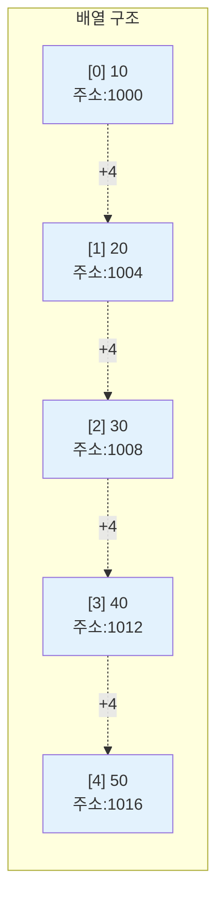
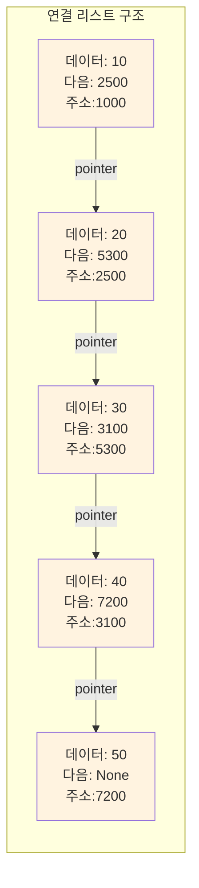
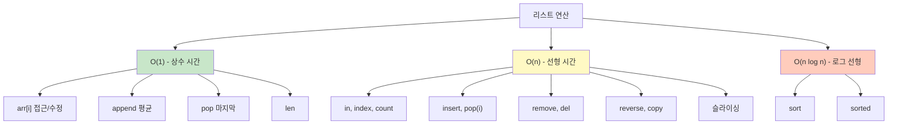

# 1. 배열과 리스트의 메모리 구조

배열과 리스트는 통상 같은 개념으로 사용되기도 하지만, 엄밀히 말하면 다릅니다. 배열과 리스트는 메모리 상에서 전혀 다른 방식으로 데이터를 저장합니다.

## 1.1 배열의 메모리 구조

배열(Array)은 **연속된 메모리 공간**에 데이터를 저장합니다. 마치 아파트 동호수처럼 1000번지, 1004번지, 1008번지와 같은 식으로 **붙어있는 주소**에 데이터가 차례대로 저장됩니다.



## 1.2 연결 리스트의 메모리 구조

반면 연결 리스트(Linked List)는 **메모리 상 이어져 있지 않습니다**. 각 데이터(노드)가 메모리의 여기저기 흩어져 있고, **다음 데이터의 주소를 가리키는 포인터**로 연결되어 있습니다.



## 1.3 차이점이 왜 중요한가?

이러한 메모리 구조의 차이는 각 자료구조의 성능 특성을 결정합니다.

| 특성 | 배열 (연속된 메모리) | 연결 리스트 (흩어진 메모리) |
|------|---------------------|---------------------------|
| **인덱스 접근** | O(1) - 주소 계산으로 즉시 접근 | O(n) - 처음부터 순차 탐색 |
| **중간 삽입/삭제** | O(n) - 뒤 요소들을 모두 이동 | O(1) - 포인터만 변경 (위치를 안다면) |
| **메모리 효율** | 높음 (데이터만 저장) | 낮음 (포인터도 함께 저장) |
| **캐시 효율** | 높음 (연속된 메모리 접근) | 낮음 (메모리 주소가 흩어짐) |

:::div{.callout}
**핵심 개념**

- **배열**: 메모리가 연속 → 인덱스로 빠른 접근 가능 → 하지만 중간 삽입/삭제는 느림
- **연결 리스트**: 메모리가 비연속 → 순차 탐색 필요 → 하지만 삽입/삭제는 포인터만 조작

Python의 `list`도 배열(동적 배열)로 구현되어 있습니다. 동적 배열은 내부적으로 포인터들을 연속된 메모리 공간에 저장하는 방식으로 구현되어 있습니다. 포인터 배열 자체는 연속되어 있어서 인덱스 접근이 O(1)이지만, 중간 삽입/삭제 시에는 뒤의 포인터들을 모두 이동시켜야 하므로 O(n)입니다. 용량이 부족하면 더 큰 메모리를 새로 할당받아 기존 데이터를 복사하는 방식으로 크기를 동적으로 조절합니다.
:::

# 2. Python 리스트

Python의 리스트는 동적 배열(Dynamic Array)로 구현되어 있으며, 크기가 가변적이고 다양한 타입의 데이터를 저장할 수 있습니다.

## 2.1 리스트 생성과 초기화

```python
# 빈 리스트 생성
empty_list = []
empty_list2 = list()

# 값을 가진 리스트 생성
numbers = [1, 2, 3, 4, 5]
mixed = [1, "hello", 3.14, True]

# 특정 크기의 리스트 초기화
zeros = [0] * 5  # [0, 0, 0, 0, 0]
matrix = [[0] * 3 for _ in range(2)]  # 2x3 행렬 [[0,0,0], [0,0,0]]

# 리스트 컴프리헨션
squares = [i**2 for i in range(1, 6)]  # [1, 4, 9, 16, 25]
evens = [i for i in range(10) if i % 2 == 0]  # [0, 2, 4, 6, 8]
```

## 2.2 리스트 접근과 슬라이싱

```python
arr = [10, 20, 30, 40, 50]

# 인덱스 접근
print(arr[0])      # 10 (첫 번째 요소)
print(arr[-1])     # 50 (마지막 요소)
print(arr[-2])     # 40 (뒤에서 두 번째 요소)

# 슬라이싱 [시작:끝:간격]
print(arr[1:4])    # [20, 30, 40] - 인덱스 1부터 3까지
print(arr[:3])     # [10, 20, 30] - 처음부터 인덱스 2까지
print(arr[2:])     # [30, 40, 50] - 인덱스 2부터 끝까지
print(arr[::2])    # [10, 30, 50] - 2칸씩 건너뛰기
print(arr[::-1])   # [50, 40, 30, 20, 10] - 역순
```

## 2.3 리스트 수정 메서드

### 2.3.1 요소 추가

```python
arr = [1, 2, 3]

# append(): 끝에 요소 하나 추가 - O(1)
arr.append(4)           # [1, 2, 3, 4]

# insert(): 특정 위치에 요소 삽입 - O(n)
arr.insert(1, 10)       # [1, 10, 2, 3, 4]

# extend(): 여러 요소 추가 - O(k), k는 추가할 요소 개수
arr.extend([5, 6, 7])   # [1, 10, 2, 3, 4, 5, 6, 7]

# + 연산자: 새 리스트 생성 - O(n+m)
new_arr = arr + [8, 9]  # 원본은 변경 안 됨
```

### 2.3.2 요소 삭제

```python
arr = [10, 20, 30, 40, 50, 30]

# pop(): 인덱스로 삭제하고 반환
arr.pop()              # 50 반환, 마지막 요소 제거 - O(1)
arr.pop(0)             # 10 반환, 첫 번째 요소 제거 - O(n)

# remove(): 값으로 삭제 (첫 번째 일치하는 요소만)
arr.remove(30)         # 첫 번째 30 제거 - O(n)

# del: 인덱스나 슬라이스로 삭제
del arr[1]             # 인덱스 1 요소 제거 - O(n)
del arr[1:3]           # 인덱스 1~2 요소 제거 - O(n)

# clear(): 모든 요소 삭제
arr.clear()            # [] - O(n)
```

### 2.3.3 요소 수정

```python
arr = [1, 2, 3, 4, 5]

# 단일 요소 수정
arr[0] = 10            # [10, 2, 3, 4, 5] - O(1)

# 슬라이스 수정
arr[1:4] = [20, 30]    # [10, 20, 30, 5] - O(n)
```

## 2.4 리스트 검색 메서드

```python
arr = [10, 20, 30, 20, 40]

# index(): 값의 인덱스 찾기 - O(n)
idx = arr.index(20)        # 1 (첫 번째 20의 인덱스)
idx = arr.index(20, 2)     # 3 (인덱스 2부터 찾기)

# count(): 값의 개수 세기 - O(n)
cnt = arr.count(20)        # 2

# in 연산자: 값 존재 여부 - O(n)
if 30 in arr:
    print("30이 있습니다")

# min, max, sum
print(min(arr))            # 10 - O(n)
print(max(arr))            # 40 - O(n)
print(sum(arr))            # 120 - O(n)
```

## 2.5 리스트 정렬 메서드

```python
numbers = [5, 2, 8, 1, 9]

# sort(): 원본 리스트를 정렬 - O(n log n)
numbers.sort()                    # [1, 2, 5, 8, 9]
numbers.sort(reverse=True)        # [9, 8, 5, 2, 1]

# sorted(): 정렬된 새 리스트 반환 (원본 유지) - O(n log n)
original = [5, 2, 8, 1, 9]
sorted_nums = sorted(original)    # [1, 2, 5, 8, 9]
# original은 그대로 [5, 2, 8, 1, 9]

# key 매개변수로 정렬 기준 지정
words = ["apple", "pie", "zoo", "a"]
words.sort(key=len)               # 길이 순: ['a', 'pie', 'zoo', 'apple']

# reverse(): 리스트 뒤집기 - O(n)
numbers.reverse()                 # [1, 8, 5, 2, 9]
```

## 2.6 기타 유용한 메서드

```python
arr = [1, 2, 3, 4, 5]

# len(): 리스트 길이 - O(1)
print(len(arr))           # 5

# copy(): 얕은 복사 - O(n)
arr_copy = arr.copy()     # arr[:]와 같음
arr_copy = arr[:]

# 깊은 복사 (중첩 리스트용)
import copy
nested = [[1, 2], [3, 4]]
deep = copy.deepcopy(nested)

# enumerate(): 인덱스와 값 함께 순회
for i, val in enumerate(arr):
    print(f"인덱스 {i}: 값 {val}")

# enumerate(시작 인덱스 지정)
for i, val in enumerate(arr, start=1):
    print(f"{i}번째: {val}")
```

# 3. 시간복잡도 정리

리스트의 주요 연산별 시간복잡도를 이해하는 것은 효율적인 알고리즘 설계에 필수적입니다.

## 3.1 시간복잡도 표

| 연산 | 시간복잡도 | 설명 |
|------|-----------|------|
| **접근/수정** | | |
| `arr[i]` | O(1) | 인덱스로 직접 계산하여 접근 |
| `arr[i] = x` | O(1) | 인덱스로 직접 수정 |
| `arr[i:j]` | O(k) | k는 슬라이스 길이 (j-i) |
| **검색** | | |
| `x in arr` | O(n) | 처음부터 순차 탐색 |
| `arr.index(x)` | O(n) | 첫 번째 일치 항목까지 순차 탐색 |
| `arr.count(x)` | O(n) | 전체 리스트 순회 |
| `min(arr)`, `max(arr)` | O(n) | 전체 리스트 순회 |
| **추가** | | |
| `arr.append(x)` | O(1) 평균 | 공간이 있으면 즉시 추가, 공간 부족 시 O(n) |
| `arr.insert(i, x)` | O(n) | i 이후 요소들을 모두 한 칸씩 이동 |
| `arr.extend(lst)` | O(k) | k는 추가할 요소 개수 |
| `arr + other` | O(n+m) | 새 리스트 생성 및 복사 |
| **삭제** | | |
| `arr.pop()` | O(1) | 마지막 요소만 제거 |
| `arr.pop(i)` | O(n) | i 이후 요소들을 모두 한 칸씩 이동 |
| `arr.remove(x)` | O(n) | 검색(O(n)) + 삭제(O(n)) |
| `del arr[i]` | O(n) | pop(i)와 동일 |
| `arr.clear()` | O(n) | 모든 요소 제거 |
| **정렬** | | |
| `arr.sort()` | O(n log n) | Timsort 알고리즘 사용 |
| `sorted(arr)` | O(n log n) | 새 리스트 생성 + 정렬 |
| `arr.reverse()` | O(n) | 양 끝에서 스왑하며 진행 |
| **기타** | | |
| `len(arr)` | O(1) | 길이는 내부에 저장되어 있음 |
| `arr.copy()` | O(n) | 모든 요소 복사 |

## 3.2 시간복잡도 시각화



:::div{.callout}
**코딩테스트 팁: 시간복잡도를 고려한 설계**

- **빈번한 중간 삽입/삭제**: 리스트보다는 `collections.deque` 사용 (양 끝 삽입/삭제 O(1))
- **빈번한 검색**: 리스트보다는 `set` (검색 O(1)) 또는 `dict` 사용
- **정렬된 상태 유지**: 매번 정렬하지 말고 `bisect` 모듈로 정렬된 상태 유지
- **중복 제거**: `set()`으로 변환 (O(n))
- **최대/최소 유지**: `heapq` 모듈 사용 (삽입/삭제 O(log n))
:::