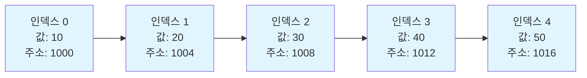
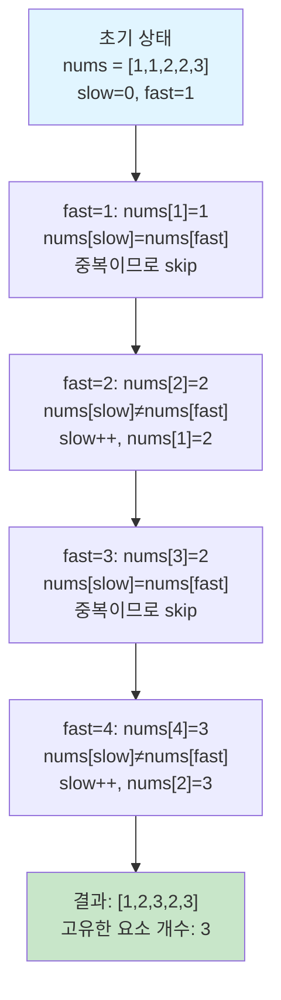

# 1. 학습목표

- 배열의 개념과 특징을 이해한다.
- Python 리스트의 다양한 활용법을 익힌다.
- 배열 연산의 시간복잡도를 분석할 수 있다.
- 실전 코딩테스트에서 배열 문제를 해결할 수 있다.

# 2. 배열이란?

배열(Array)은 **동일한 타입의 데이터를 연속된 메모리 공간에 저장하는 자료구조**입니다. 가장 기본적이면서도 중요한 자료구조로, 인덱스를 통해 빠르게 데이터에 접근할 수 있다는 특징이 있습니다.

## 2.1 배열의 특징

- **연속된 메모리 공간**: 데이터가 메모리에 순차적으로 저장됩니다.
- **인덱스 접근**: 0부터 시작하는 인덱스로 데이터에 직접 접근할 수 있습니다.
- **고정된 크기**: 대부분의 언어에서 배열은 생성 시 크기가 고정됩니다. (Python 리스트는 예외)
- **빠른 조회**: 인덱스를 알고 있다면 O(1) 시간에 데이터 조회가 가능합니다.

## 2.2 배열의 메모리 구조

배열은 메모리에 연속적으로 저장되기 때문에, 시작 주소만 알면 인덱스를 통해 특정 위치의 데이터를 바로 계산할 수 있습니다.



:::div{.callout}
**인덱스를 통한 빠른 접근의 원리**

배열에서 특정 인덱스의 주소는 다음 공식으로 계산됩니다:
```
주소 = 시작주소 + (인덱스 × 데이터크기)
```
예를 들어, 인덱스 3의 주소는 `1000 + (3 × 4) = 1012`로 즉시 계산할 수 있습니다.
이러한 직접 계산 방식 덕분에 배열은 O(1) 시간에 데이터에 접근할 수 있습니다.
:::

# 3. Python 리스트

Python의 리스트는 동적 배열(Dynamic Array)로 구현되어 있으며, 크기가 가변적이고 다양한 타입의 데이터를 저장할 수 있습니다.

## 3.1 리스트 생성과 초기화

```python
# 4. 빈 리스트 생성
empty_list = []
empty_list2 = list()

# 5. 값을 가진 리스트 생성
numbers = [1, 2, 3, 4, 5]
mixed = [1, "hello", 3.14, True]

# 6. 특정 크기의 리스트 초기화
zeros = [0] * 5  # [0, 0, 0, 0, 0]

# 7. 리스트 컴프리헨션
squares = [i**2 for i in range(1, 6)]  # [1, 4, 9, 16, 25]
```

## 7.1 리스트 주요 연산

```python
arr = [10, 20, 30, 40, 50]

# 8. 인덱스 접근
print(arr[0])      # 10 (첫 번째 요소)
print(arr[-1])     # 50 (마지막 요소)
print(arr[-2])     # 40 (뒤에서 두 번째 요소)

# 9. 슬라이싱
print(arr[1:4])    # [20, 30, 40]
print(arr[:3])     # [10, 20, 30]
print(arr[2:])     # [30, 40, 50]
print(arr[::2])    # [10, 30, 50] (2칸씩 건너뛰기)

# 10. 요소 추가
arr.append(60)          # 끝에 추가: [10, 20, 30, 40, 50, 60]
arr.insert(2, 25)       # 인덱스 2에 25 삽입
arr.extend([70, 80])    # 여러 요소 추가

# 11. 요소 삭제
arr.pop()              # 마지막 요소 제거하고 반환
arr.pop(0)             # 인덱스 0 요소 제거하고 반환
arr.remove(30)         # 값 30을 찾아서 제거
del arr[1]             # 인덱스 1 요소 제거

# 12. 검색
idx = arr.index(40)    # 40의 인덱스 반환
cnt = arr.count(20)    # 20의 개수 반환
```

## 12.1 리스트 정렬

```python
numbers = [5, 2, 8, 1, 9]

# 13. 원본 변경 O
numbers.sort()              # 오름차순 정렬: [1, 2, 5, 8, 9]
numbers.sort(reverse=True)  # 내림차순 정렬: [9, 8, 5, 2, 1]

# 14. 원본 변경 X
sorted_nums = sorted(numbers)  # 정렬된 새 리스트 반환
```

# 15. 시간복잡도 분석

배열/리스트의 주요 연산별 시간복잡도를 이해하는 것은 효율적인 알고리즘 설계에 필수적입니다.

| 연산 | 시간복잡도 | 설명 |
|------|-----------|------|
| 인덱스 접근 (`arr[i]`) | O(1) | 직접 계산으로 접근 |
| 끝에 추가 (`append`) | O(1) (평균) | 공간이 있으면 즉시 추가 |
| 중간에 삽입 (`insert`) | O(n) | 뒤 요소들을 모두 이동 |
| 끝에서 삭제 (`pop`) | O(1) | 마지막 요소만 제거 |
| 중간에서 삭제 (`pop(i)`) | O(n) | 뒤 요소들을 모두 이동 |
| 값으로 검색 (`index`) | O(n) | 순차 탐색 필요 |
| 정렬 (`sort`) | O(n log n) | 일반적인 정렬 알고리즘 |

:::div{.callout}
<highlight>**코딩테스트 팁: 시간복잡도를 고려한 설계**</highlight>

- **빈번한 중간 삽입/삭제**: 리스트보다는 다른 자료구조(연결 리스트, 덱) 고려
- **빈번한 검색**: 리스트보다는 해시 테이블(딕셔너리, 셋) 고려
- **정렬된 상태 유지**: 매번 정렬하지 말고 삽입 시 적절한 위치에 넣거나 힙 사용
:::

# 16. 실전 문제 해결

## 16.1 예제: 두 수의 합 찾기

**문제**: 정수 배열과 타겟 값이 주어졌을 때, 합이 타겟이 되는 두 수의 인덱스를 반환하세요.

```python
def two_sum(nums, target):
    """
    접근 방법: 해시맵을 활용한 O(n) 풀이
    - 각 원소를 순회하면서 (target - 현재값)이 이미 본 값인지 확인
    - 해시맵에 {값: 인덱스} 형태로 저장
    """
    seen = {}  # {값: 인덱스}

    for i, num in enumerate(nums):
        complement = target - num

        # complement가 이미 seen에 있다면 답을 찾은 것
        if complement in seen:
            return [seen[complement], i]

        # 현재 값과 인덱스 저장
        seen[num] = i

    return []  # 답이 없는 경우

# 17. 테스트
nums = [2, 7, 11, 15]
target = 9
print(two_sum(nums, target))  # [0, 1] (2 + 7 = 9)

nums = [3, 2, 4]
target = 6
print(two_sum(nums, target))  # [1, 2] (2 + 4 = 6)
```

**시간복잡도**: O(n) - 배열을 한 번만 순회
**공간복잡도**: O(n) - 해시맵에 최대 n개의 요소 저장

## 17.1 예제: 배열 회전

**문제**: 배열을 오른쪽으로 k칸 회전시키세요.

```python
def rotate(nums, k):
    """
    접근 방법 1: 슬라이싱 활용
    - k만큼 회전 = 뒤의 k개를 앞으로 이동
    - 배열 길이보다 큰 k는 k % len(nums)로 처리
    """
    n = len(nums)
    k = k % n  # k가 배열 길이보다 클 경우 처리

    # 뒤의 k개 + 앞의 (n-k)개
    nums[:] = nums[-k:] + nums[:-k]

# 18. 테스트
nums = [1, 2, 3, 4, 5, 6, 7]
rotate(nums, 3)
print(nums)  # [5, 6, 7, 1, 2, 3, 4]
```

**다른 접근법: 역전 활용**

```python
def rotate_reverse(nums, k):
    """
    접근 방법 2: 3단계 역전
    1. 전체 배열 역전
    2. 앞의 k개 역전
    3. 뒤의 n-k개 역전
    """
    def reverse(arr, start, end):
        while start < end:
            arr[start], arr[end] = arr[end], arr[start]
            start += 1
            end -= 1

    n = len(nums)
    k = k % n

    # 1. 전체 역전: [7,6,5,4,3,2,1]
    reverse(nums, 0, n - 1)
    # 2. 앞의 k개 역전: [5,6,7,4,3,2,1]
    reverse(nums, 0, k - 1)
    # 3. 뒤의 n-k개 역전: [5,6,7,1,2,3,4]
    reverse(nums, k, n - 1)

# 19. 테스트
nums = [1, 2, 3, 4, 5, 6, 7]
rotate_reverse(nums, 3)
print(nums)  # [5, 6, 7, 1, 2, 3, 4]
```

**시간복잡도**: O(n)
**공간복잡도**: O(1) - 추가 공간 사용 없음

## 19.1 예제: 배열에서 중복 제거

**문제**: 정렬된 배열에서 중복을 제거하고 고유한 요소의 개수를 반환하세요. (공간복잡도 O(1) 요구)

```python
def remove_duplicates(nums):
    """
    접근 방법: 투 포인터
    - slow: 고유한 요소를 저장할 위치
    - fast: 배열을 순회하면서 새로운 값을 찾음
    - 정렬되어 있으므로 인접한 요소만 비교하면 됨
    """
    if not nums:
        return 0

    slow = 0  # 고유한 요소의 마지막 인덱스

    for fast in range(1, len(nums)):
        # 새로운 값을 발견하면
        if nums[fast] != nums[slow]:
            slow += 1
            nums[slow] = nums[fast]

    return slow + 1  # 고유한 요소의 개수

# 20. 테스트
nums = [1, 1, 2, 2, 2, 3, 4, 4, 5]
length = remove_duplicates(nums)
print(f"고유한 요소 개수: {length}")
print(f"결과 배열: {nums[:length]}")  # [1, 2, 3, 4, 5]
```

**시간복잡도**: O(n)
**공간복잡도**: O(1) - 추가 배열 없이 원본 수정



# 21. 언제 배열을 사용하는가?

배열은 다음과 같은 상황에서 적합합니다:

## 21.1 배열이 적합한 경우

- **인덱스를 통한 빠른 접근이 필요할 때**
  - 예: 특정 위치의 데이터를 자주 조회

- **순차적인 데이터를 다룰 때**
  - 예: 점수 목록, 온도 기록, 주식 가격

- **크기가 미리 정해져 있거나 예측 가능할 때**
  - 예: 요일별 데이터 (7개), 월별 데이터 (12개)

- **정렬이 필요한 데이터**
  - 배열은 정렬 알고리즘과 함께 사용하기 좋음

## 21.2 배열이 부적합한 경우

- **빈번한 중간 삽입/삭제가 필요할 때**
  - 대안: 연결 리스트, 덱(Deque)

- **크기를 예측할 수 없고 자주 변경될 때**
  - 대안: Python의 동적 리스트 (하지만 여전히 배열 기반)

- **빠른 검색이 중요할 때**
  - 대안: 해시 테이블(딕셔너리), 이진 탐색 트리

# 22. 핵심 정리

:::div{.callout}
<highlight>**배열/리스트 핵심 포인트**</highlight>

1. **인덱스 접근은 O(1)** - 배열의 최대 강점
2. **중간 삽입/삭제는 O(n)** - 요소들을 이동시켜야 함
3. **Python 리스트는 동적 배열** - 크기가 자동으로 조정됨
4. **슬라이싱 활용** - Python의 강력한 기능
5. **시간복잡도를 고려한 자료구조 선택** - 문제에 맞는 최적의 도구 사용

**코딩테스트 필수 패턴**:
- 투 포인터 (Two Pointers)
- 슬라이딩 윈도우 (Sliding Window)
- 이진 탐색 (Binary Search)
- 정렬 활용 (Sorting)
:::

# 23. 연습 문제

다음 문제들을 풀어보며 배열 개념을 확실히 다져보세요:

1. **최대/최소값 찾기**: 배열에서 최댓값과 최솟값의 인덱스 찾기
2. **연속된 부분 배열의 합**: 주어진 합을 만드는 연속된 부분 배열 찾기
3. **배열 재배치**: 짝수는 앞으로, 홀수는 뒤로 재배치하기 (순서 유지)
4. **누적 합**: 배열의 누적 합을 O(1)에 구하기 위한 전처리
5. **회전 배열 검색**: 회전된 정렬 배열에서 특정 값 찾기

다음 절에서는 스택과 큐에 대해 알아보겠습니다!
