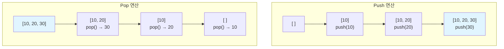
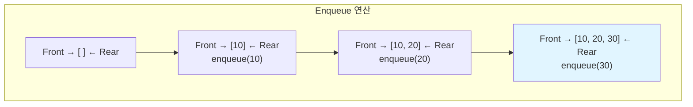
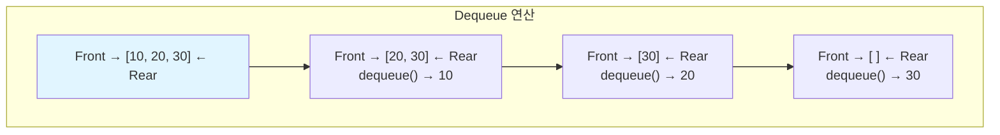
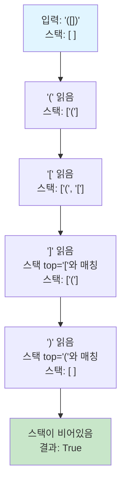

# 1. 학습목표

- 스택의 개념과 LIFO 원리를 이해한다.
- 큐의 개념과 FIFO 원리를 이해한다.
- Python으로 스택과 큐를 구현할 수 있다.
- 덱(Deque)의 활용법을 익힌다.
- 실전 문제에서 스택과 큐를 적절히 활용할 수 있다.

# 2. 스택 (Stack)

스택은 **후입선출(LIFO: Last In First Out)** 방식으로 동작하는 자료구조입니다. 마지막에 들어온 데이터가 가장 먼저 나가는 구조로, 책을 쌓아올리는 것과 유사합니다.

## 2.1 스택의 특징

- **LIFO 구조**: 마지막에 삽입된 데이터가 가장 먼저 삭제됨
- **한쪽 끝에서만 삽입/삭제**: Top이라고 부르는 한쪽 끝에서만 연산 수행
- **주요 연산**:
  - `push`: 데이터를 스택의 맨 위에 추가
  - `pop`: 스택의 맨 위 데이터를 제거하고 반환
  - `peek/top`: 스택의 맨 위 데이터를 제거하지 않고 반환
  - `is_empty`: 스택이 비어있는지 확인

## 2.2 스택의 동작 원리



## 2.3 Python으로 스택 구현

```python
# 3. 방법 1: 리스트 활용 (가장 간단)
stack = []

# 4. Push - O(1)
stack.append(10)
stack.append(20)
stack.append(30)
print(stack)  # [10, 20, 30]

# 5. Pop - O(1)
top = stack.pop()
print(top)    # 30
print(stack)  # [10, 20]

# 6. Peek - O(1)
if stack:
    top = stack[-1]
    print(top)  # 20

# 7. Is Empty
is_empty = len(stack) == 0
print(is_empty)  # False
```

**클래스로 구현하기**:

```python
class Stack:
    def __init__(self):
        self.items = []

    def push(self, item):
        """스택에 요소 추가"""
        self.items.append(item)

    def pop(self):
        """스택에서 요소 제거하고 반환"""
        if self.is_empty():
            raise IndexError("Stack is empty")
        return self.items.pop()

    def peek(self):
        """스택의 맨 위 요소 반환 (제거 X)"""
        if self.is_empty():
            raise IndexError("Stack is empty")
        return self.items[-1]

    def is_empty(self):
        """스택이 비어있는지 확인"""
        return len(self.items) == 0

    def size(self):
        """스택의 크기 반환"""
        return len(self.items)

# 8. 사용 예제
s = Stack()
s.push(1)
s.push(2)
s.push(3)
print(s.pop())    # 3
print(s.peek())   # 2
print(s.size())   # 2
```

# 9. 큐 (Queue)

큐는 **선입선출(FIFO: First In First Out)** 방식으로 동작하는 자료구조입니다. 먼저 들어온 데이터가 먼저 나가는 구조로, 줄을 서는 것과 유사합니다.

## 9.1 큐의 특징

- **FIFO 구조**: 먼저 삽입된 데이터가 가장 먼저 삭제됨
- **양쪽 끝에서 연산**: Front(앞)에서 삭제, Rear(뒤)에서 삽입
- **주요 연산**:
  - `enqueue`: 큐의 뒤에 데이터 추가
  - `dequeue`: 큐의 앞에서 데이터 제거하고 반환
  - `front/peek`: 큐의 앞 데이터를 제거하지 않고 반환
  - `is_empty`: 큐가 비어있는지 확인

## 9.2 큐의 동작 원리





## 9.3 Python으로 큐 구현

```python
from collections import deque

# 10. 방법 1: deque 활용 (권장)
queue = deque()

# 11. Enqueue - O(1)
queue.append(10)
queue.append(20)
queue.append(30)
print(queue)  # deque([10, 20, 30])

# 12. Dequeue - O(1)
front = queue.popleft()
print(front)  # 10
print(queue)  # deque([20, 30])

# 13. Peek
if queue:
    front = queue[0]
    print(front)  # 20

# 14. Is Empty
is_empty = len(queue) == 0
```

:::div{.callout}
<highlight>**왜 리스트 대신 deque를 사용하나?**</highlight>

리스트의 `pop(0)`은 O(n) 시간이 걸립니다. 첫 번째 요소를 제거한 후 나머지 모든 요소를 앞으로 이동시켜야 하기 때문입니다.

반면 `deque`의 `popleft()`는 O(1) 시간에 동작합니다. 따라서 큐를 구현할 때는 반드시 `collections.deque`를 사용하세요.
:::

**클래스로 구현하기**:

```python
from collections import deque

class Queue:
    def __init__(self):
        self.items = deque()

    def enqueue(self, item):
        """큐에 요소 추가"""
        self.items.append(item)

    def dequeue(self):
        """큐에서 요소 제거하고 반환"""
        if self.is_empty():
            raise IndexError("Queue is empty")
        return self.items.popleft()

    def front(self):
        """큐의 맨 앞 요소 반환 (제거 X)"""
        if self.is_empty():
            raise IndexError("Queue is empty")
        return self.items[0]

    def is_empty(self):
        """큐가 비어있는지 확인"""
        return len(self.items) == 0

    def size(self):
        """큐의 크기 반환"""
        return len(self.items)

# 15. 사용 예제
q = Queue()
q.enqueue(1)
q.enqueue(2)
q.enqueue(3)
print(q.dequeue())  # 1
print(q.front())    # 2
print(q.size())     # 2
```

# 16. 덱 (Deque)

덱(Deque, Double-Ended Queue)은 **양쪽 끝에서 삽입과 삭제가 모두 가능한** 자료구조입니다. 스택과 큐의 기능을 모두 가지고 있습니다.

## 16.1 덱의 주요 연산

```python
from collections import deque

dq = deque()

# 17. 뒤에 추가
dq.append(10)        # [10]
dq.append(20)        # [10, 20]

# 18. 앞에 추가
dq.appendleft(5)     # [5, 10, 20]
dq.appendleft(1)     # [1, 5, 10, 20]

# 19. 뒤에서 제거
dq.pop()             # [1, 5, 10] (20 제거)

# 20. 앞에서 제거
dq.popleft()         # [5, 10] (1 제거)

# 21. 확장
dq.extend([30, 40])         # [5, 10, 30, 40]
dq.extendleft([3, 1])       # [1, 3, 5, 10, 30, 40]

# 22. 회전
dq.rotate(2)         # 오른쪽으로 2칸 회전: [30, 40, 1, 3, 5, 10]
dq.rotate(-1)        # 왼쪽으로 1칸 회전: [40, 1, 3, 5, 10, 30]
```

## 22.1 덱의 시간복잡도

| 연산 | 시간복잡도 |
|------|-----------|
| `append()` / `appendleft()` | O(1) |
| `pop()` / `popleft()` | O(1) |
| 인덱스 접근 `dq[i]` | O(n) |
| `extend()` / `extendleft()` | O(k) (k는 추가할 요소 개수) |

# 23. 실전 문제 해결

## 23.1 예제: 괄호 검사

**문제**: 괄호 문자열이 올바른지 검사하세요. `()`, `[]`, `{}`의 쌍이 맞아야 합니다.

```python
def is_valid_parentheses(s):
    """
    접근 방법: 스택 활용
    - 여는 괄호는 스택에 push
    - 닫는 괄호를 만나면 스택의 top과 매칭 확인
    - 최종적으로 스택이 비어있어야 올바른 괄호
    """
    stack = []
    pairs = {')': '(', ']': '[', '}': '{'}

    for char in s:
        if char in '([{':
            # 여는 괄호는 스택에 추가
            stack.append(char)
        elif char in ')]}':
            # 닫는 괄호 처리
            if not stack or stack[-1] != pairs[char]:
                return False
            stack.pop()

    # 모든 괄호가 매칭되었다면 스택이 비어있어야 함
    return len(stack) == 0

# 24. 테스트
print(is_valid_parentheses("()"))        # True
print(is_valid_parentheses("()[]{}"))    # True
print(is_valid_parentheses("(]"))        # False
print(is_valid_parentheses("([)]"))      # False
print(is_valid_parentheses("{[]}"))      # True
```

**동작 과정 시각화**:



## 24.1 예제: 프린터 큐

**문제**: 프린터 대기열에서 특정 문서가 언제 인쇄되는지 찾으세요. 중요도가 높은 문서가 먼저 인쇄됩니다.

```python
from collections import deque

def solution(priorities, location):
    """
    접근 방법: 큐와 우선순위 활용
    - (인덱스, 우선순위) 튜플을 큐에 저장
    - 현재 문서보다 중요한 문서가 있으면 뒤로 보냄
    - 없으면 인쇄하고, 목표 문서인지 확인
    """
    queue = deque([(i, p) for i, p in enumerate(priorities)])
    print_order = 0

    while queue:
        current = queue.popleft()

        # 현재 문서보다 중요한 문서가 남아있는지 확인
        if any(current[1] < q[1] for q in queue):
            # 있다면 뒤로 보냄
            queue.append(current)
        else:
            # 없다면 인쇄
            print_order += 1
            if current[0] == location:
                return print_order

    return print_order

# 25. 테스트
priorities = [2, 1, 3, 2]
location = 2
print(solution(priorities, location))  # 1
# 26. 설명: [2, 1, 3, 2]에서 인덱스 2인 문서(우선순위 3)가 가장 먼저 인쇄됨

priorities = [1, 1, 9, 1, 1, 1]
location = 0
print(solution(priorities, location))  # 5
# 27. 설명: 우선순위 9가 먼저, 그 다음 나머지 문서들이 순서대로
```

## 27.1 예제: 주식 가격

**문제**: 주식 가격이 떨어지지 않은 기간을 구하세요.

```python
def stock_prices(prices):
    """
    접근 방법: 스택 활용
    - 스택에 (인덱스, 가격) 저장
    - 현재 가격이 스택 top의 가격보다 낮으면
      그때까지의 기간을 계산
    """
    n = len(prices)
    answer = [0] * n
    stack = []  # (인덱스, 가격)

    for i, price in enumerate(prices):
        # 가격이 떨어진 경우
        while stack and stack[-1][1] > price:
            idx, _ = stack.pop()
            answer[idx] = i - idx

        stack.append((i, price))

    # 끝까지 가격이 떨어지지 않은 경우
    while stack:
        idx, _ = stack.pop()
        answer[idx] = n - 1 - idx

    return answer

# 28. 테스트
prices = [1, 2, 3, 2, 3]
print(stock_prices(prices))  # [4, 3, 1, 1, 0]
# 29. 설명:
# 30. 1 -> 4초간 안떨어짐 (끝까지)
# 31. 2 -> 3초간 안떨어짐 (끝까지)
# 32. 3 -> 1초간 안떨어짐 (다음에 2로 떨어짐)
# 33. 2 -> 1초간 안떨어짐 (끝까지)
# 34. 3 -> 0초 (마지막)
```

## 34.1 예제: 슬라이딩 윈도우 최댓값

**문제**: 크기가 k인 윈도우가 배열을 슬라이딩할 때 각 윈도우의 최댓값을 구하세요.

```python
from collections import deque

def max_sliding_window(nums, k):
    """
    접근 방법: 덱 활용
    - 덱에 인덱스를 저장 (값이 아닌)
    - 덱의 앞쪽은 항상 현재 윈도우의 최댓값 인덱스
    - 새 원소가 덱의 뒤 원소들보다 크면 제거 (더 이상 최댓값이 될 수 없음)
    - 덱의 앞 원소가 윈도우 범위를 벗어나면 제거
    """
    result = []
    dq = deque()  # 인덱스 저장

    for i, num in enumerate(nums):
        # 윈도우 범위를 벗어난 인덱스 제거
        while dq and dq[0] < i - k + 1:
            dq.popleft()

        # 현재 값보다 작은 뒤쪽 값들 제거
        while dq and nums[dq[-1]] < num:
            dq.pop()

        dq.append(i)

        # 윈도우가 완성되면 최댓값 추가
        if i >= k - 1:
            result.append(nums[dq[0]])

    return result

# 35. 테스트
nums = [1, 3, -1, -3, 5, 3, 6, 7]
k = 3
print(max_sliding_window(nums, k))  # [3, 3, 5, 5, 6, 7]
# 36. 설명:
# 37. [1  3  -1] -3  5  3  6  7  -> 3
# 38. 1 [3  -1  -3] 5  3  6  7  -> 3
# 39. 1  3 [-1  -3  5] 3  6  7  -> 5
# 40. 1  3  -1 [-3  5  3] 6  7  -> 5
# 41. 1  3  -1  -3 [5  3  6] 7  -> 6
# 42. 1  3  -1  -3  5 [3  6  7] -> 7
```

# 43. 언제 스택과 큐를 사용하는가?

## 43.1 스택을 사용하는 경우

- **괄호 검사, 수식 계산**
  - 여는 괄호와 닫는 괄호 매칭
  - 중위 표기법을 후위 표기법으로 변환

- **함수 호출 관리**
  - 재귀 함수의 호출 스택
  - 프로그램의 실행 컨텍스트

- **되돌리기(Undo) 기능**
  - 텍스트 에디터의 Ctrl+Z
  - 브라우저의 뒤로 가기

- **깊이 우선 탐색(DFS)**
  - 그래프/트리 순회

- **히스토그램 문제**
  - 최대 직사각형 넓이 찾기

## 43.2 큐를 사용하는 경우

- **작업 대기열 처리**
  - 프린터 대기열
  - CPU 작업 스케줄링

- **너비 우선 탐색(BFS)**
  - 최단 경로 찾기
  - 레벨 순회

- **캐시 구현**
  - LRU Cache (큐 + 해시맵)

- **스트리밍 데이터 처리**
  - 실시간 데이터 버퍼

## 43.3 덱을 사용하는 경우

- **양쪽 끝 접근이 필요한 경우**
  - 슬라이딩 윈도우 최댓값/최솟값

- **회문(Palindrome) 검사**
  - 양쪽에서 비교

- **작업 스케줄러**
  - 양방향 우선순위 처리

# 44. 핵심 정리

:::div{.callout}
<highlight>**스택과 큐 핵심 포인트**</highlight>

**스택 (LIFO)**:
- 한쪽 끝에서만 삽입/삭제
- Python: 리스트의 `append()`, `pop()` 사용
- 시간복잡도: 모든 연산 O(1)
- 활용: 괄호 검사, DFS, 되돌리기

**큐 (FIFO)**:
- 한쪽 끝에서 삽입, 반대쪽 끝에서 삭제
- Python: `collections.deque` 사용 (필수!)
- 시간복잡도: 모든 연산 O(1)
- 활용: BFS, 작업 대기열, 캐시

**덱 (양방향)**:
- 양쪽 끝에서 삽입/삭제 모두 가능
- Python: `collections.deque`
- 시간복잡도: 양쪽 끝 연산 O(1), 중간 접근 O(n)
- 활용: 슬라이딩 윈도우, 회문 검사

**선택 기준**:
- 마지막 것부터 처리? → 스택
- 먼저 온 것부터 처리? → 큐
- 양쪽 끝 접근 필요? → 덱
:::

# 45. 연습 문제

다음 문제들을 풀어보며 스택과 큐 개념을 확실히 다져보세요:

1. **기능 개발**: 작업 완료 순서와 배포 순서가 다를 때 (큐)
2. **다리를 지나는 트럭**: 제한된 다리 위의 트럭들 (큐)
3. **탑**: 각 탑에서 신호를 받을 수 있는 왼쪽 탑 찾기 (스택)
4. **후위 표기식 계산**: 중위 표기식을 후위로 변환하고 계산 (스택)
5. **카드 뭉치**: 두 카드 덱을 이용해 목표 문장 만들기 (덱)

다음 절에서는 해시 테이블에 대해 알아보겠습니다!
