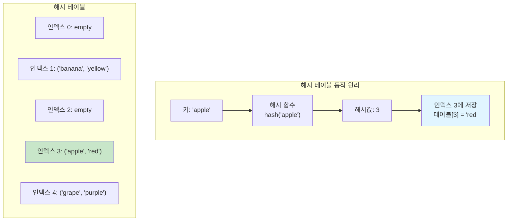
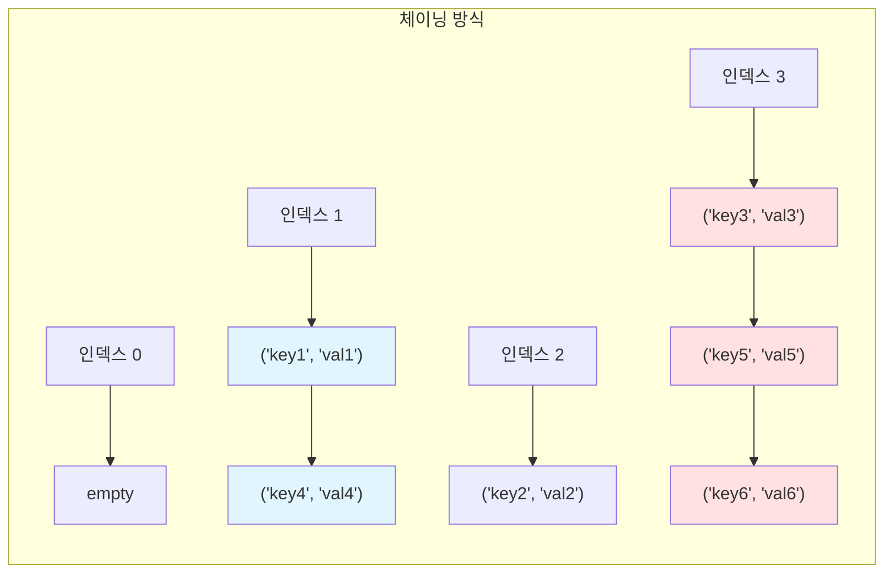

# 1. 학습목표

- 해시 테이블의 개념과 동작 원리를 이해한다.
- 해시 함수와 해시 충돌에 대해 이해한다.
- Python의 dict와 set을 활용할 수 있다.
- 실전 문제에서 해시 테이블을 효과적으로 활용할 수 있다.

# 2. 해시 테이블이란?

해시 테이블(Hash Table)은 **키(Key)와 값(Value)의 쌍으로 데이터를 저장하는 자료구조**입니다. 해시 함수를 사용하여 키를 해시값으로 변환하고, 이 해시값을 인덱스로 사용하여 데이터를 저장합니다.

## 2.1 해시 테이블의 특징

- **빠른 검색**: 평균 O(1) 시간에 데이터 검색
- **빠른 삽입/삭제**: 평균 O(1) 시간에 데이터 삽입/삭제
- **키-값 쌍**: 키를 통해 값에 직접 접근
- **유일한 키**: 각 키는 고유해야 함 (중복 불가)

## 2.2 해시 테이블의 구조



## 2.3 해시 함수

해시 함수는 **임의의 크기를 가진 데이터를 고정된 크기의 값으로 변환하는 함수**입니다.

**좋은 해시 함수의 조건**:
- **결정성**: 같은 입력에는 항상 같은 출력
- **균등 분포**: 해시값이 고르게 분포
- **빠른 계산**: 계산 속도가 빠름
- **충돌 최소화**: 서로 다른 키가 같은 해시값을 가질 확률이 낮음

```python
# 3. Python의 내장 해시 함수
print(hash("apple"))      # 정수값 (매 실행마다 다를 수 있음)
print(hash("banana"))     # 정수값
print(hash(42))           # 정수값

# 4. 간단한 해시 함수 예제
def simple_hash(key, size):
    """문자열 키를 테이블 크기에 맞는 인덱스로 변환"""
    hash_value = 0
    for char in key:
        hash_value += ord(char)
    return hash_value % size

print(simple_hash("apple", 10))   # 0~9 사이의 값
print(simple_hash("banana", 10))  # 0~9 사이의 값
```

# 5. 해시 충돌 (Hash Collision)

해시 충돌은 **서로 다른 키가 같은 해시값을 가지는 현상**입니다. 해시 테이블의 크기가 유한하기 때문에 불가피하게 발생합니다.

## 5.1 충돌 해결 방법

### 5.1.1 체이닝 (Chaining)

같은 해시값을 가진 데이터들을 연결 리스트로 연결하는 방법입니다.



```python
class HashTableChaining:
    def __init__(self, size=10):
        self.size = size
        self.table = [[] for _ in range(size)]

    def _hash(self, key):
        """해시 함수"""
        return hash(key) % self.size

    def insert(self, key, value):
        """키-값 쌍 삽입"""
        hash_value = self._hash(key)
        bucket = self.table[hash_value]

        # 이미 존재하는 키면 값 업데이트
        for i, (k, v) in enumerate(bucket):
            if k == key:
                bucket[i] = (key, value)
                return

        # 새 키-값 쌍 추가
        bucket.append((key, value))

    def get(self, key):
        """키로 값 조회"""
        hash_value = self._hash(key)
        bucket = self.table[hash_value]

        for k, v in bucket:
            if k == key:
                return v
        raise KeyError(f"Key '{key}' not found")

    def delete(self, key):
        """키-값 쌍 삭제"""
        hash_value = self._hash(key)
        bucket = self.table[hash_value]

        for i, (k, v) in enumerate(bucket):
            if k == key:
                del bucket[i]
                return
        raise KeyError(f"Key '{key}' not found")

# 6. 사용 예제
ht = HashTableChaining()
ht.insert("apple", "red")
ht.insert("banana", "yellow")
ht.insert("grape", "purple")
print(ht.get("apple"))  # "red"
```

### 6.0.1 개방 주소법 (Open Addressing)

충돌이 발생하면 다른 빈 공간을 찾아 저장하는 방법입니다.

- **선형 탐사**: 충돌 시 다음 인덱스를 순차적으로 탐색
- **이차 탐사**: 충돌 시 제곱수만큼 떨어진 위치를 탐색
- **이중 해싱**: 두 번째 해시 함수를 사용

```python
class HashTableOpenAddressing:
    def __init__(self, size=10):
        self.size = size
        self.keys = [None] * size
        self.values = [None] * size

    def _hash(self, key):
        """해시 함수"""
        return hash(key) % self.size

    def insert(self, key, value):
        """선형 탐사를 사용한 삽입"""
        hash_value = self._hash(key)

        # 빈 공간을 찾을 때까지 탐색
        while self.keys[hash_value] is not None:
            # 이미 존재하는 키면 값 업데이트
            if self.keys[hash_value] == key:
                self.values[hash_value] = value
                return

            # 다음 위치로 이동 (선형 탐사)
            hash_value = (hash_value + 1) % self.size

        # 빈 공간에 삽입
        self.keys[hash_value] = key
        self.values[hash_value] = value

    def get(self, key):
        """선형 탐사를 사용한 조회"""
        hash_value = self._hash(key)
        start_pos = hash_value

        while self.keys[hash_value] is not None:
            if self.keys[hash_value] == key:
                return self.values[hash_value]

            # 다음 위치로 이동
            hash_value = (hash_value + 1) % self.size

            # 한 바퀴 돌았으면 종료
            if hash_value == start_pos:
                break

        raise KeyError(f"Key '{key}' not found")
```

# 7. Python의 dict와 set

Python은 해시 테이블을 기반으로 한 내장 자료구조인 `dict`와 `set`을 제공합니다.

## 7.1 딕셔너리 (dict)

딕셔너리는 **키-값 쌍을 저장하는 해시 테이블**입니다.

```python
# 8. 딕셔너리 생성
fruits = {}
fruits = dict()
fruits = {"apple": "red", "banana": "yellow", "grape": "purple"}

# 9. 요소 추가/수정
fruits["orange"] = "orange"
fruits["apple"] = "green"  # 값 업데이트

# 10. 요소 조회
print(fruits["apple"])           # "green"
print(fruits.get("apple"))       # "green"
print(fruits.get("melon", "N/A"))  # "N/A" (기본값)

# 11. 요소 삭제
del fruits["banana"]
color = fruits.pop("grape")      # "purple" 반환하고 삭제

# 12. 존재 확인
if "apple" in fruits:
    print("Apple exists")

# 13. 순회
for key in fruits:
    print(f"{key}: {fruits[key]}")

for key, value in fruits.items():
    print(f"{key}: {value}")

# 14. 키/값 리스트
keys = list(fruits.keys())
values = list(fruits.values())
items = list(fruits.items())
```

## 14.1 집합 (set)

집합은 **값만 저장하는 해시 테이블**로, 중복을 허용하지 않습니다.

```python
# 15. 집합 생성
numbers = set()
numbers = {1, 2, 3, 4, 5}

# 16. 요소 추가
numbers.add(6)
numbers.update([7, 8, 9])

# 17. 요소 삭제
numbers.remove(5)      # 없으면 KeyError
numbers.discard(10)    # 없어도 에러 없음
num = numbers.pop()    # 임의의 요소 제거하고 반환

# 18. 존재 확인
if 3 in numbers:
    print("3 exists")

# 19. 집합 연산
a = {1, 2, 3, 4, 5}
b = {4, 5, 6, 7, 8}

union = a | b           # 합집합: {1, 2, 3, 4, 5, 6, 7, 8}
intersection = a & b    # 교집합: {4, 5}
difference = a - b      # 차집합: {1, 2, 3}
symmetric_diff = a ^ b  # 대칭 차집합: {1, 2, 3, 6, 7, 8}

# 20. 부분집합/상위집합
is_subset = {1, 2} <= a       # True
is_superset = a >= {1, 2}     # True
```

## 20.1 시간복잡도

| 연산 | dict | set | 비고 |
|------|------|-----|------|
| 조회 | O(1) | O(1) | 평균 |
| 삽입 | O(1) | O(1) | 평균 |
| 삭제 | O(1) | O(1) | 평균 |
| 존재 확인 (`in`) | O(1) | O(1) | 평균 |
| 최악의 경우 | O(n) | O(n) | 모든 키가 충돌 |

:::div{.callout}
<highlight>**리스트 vs 딕셔너리/집합 검색 속도**</highlight>

```python
# 21. 리스트 검색: O(n)
my_list = [1, 2, 3, 4, 5, ..., 1000000]
if 999999 in my_list:  # 최악의 경우 100만 번 비교
    pass

# 22. 집합 검색: O(1)
my_set = {1, 2, 3, 4, 5, ..., 1000000}
if 999999 in my_set:   # 평균 1번 비교
    pass
```

대량의 데이터에서 검색이 빈번하다면 반드시 해시 테이블을 사용하세요!
:::

# 23. 실전 문제 해결

## 23.1 예제: 완주하지 못한 선수

**문제**: 마라톤에 참여한 선수들의 명단과 완주한 선수들의 명단이 주어집니다. 완주하지 못한 선수의 이름을 반환하세요.

```python
def solution(participant, completion):
    """
    접근 방법: 해시맵(딕셔너리) 활용
    - 참가자 이름을 카운트
    - 완주자 이름을 감소
    - 남은 이름 반환
    """
    # 참가자 카운트
    hash_dict = {}
    for name in participant:
        hash_dict[name] = hash_dict.get(name, 0) + 1

    # 완주자 카운트 감소
    for name in completion:
        hash_dict[name] -= 1

    # 카운트가 1인 사람 찾기
    for name, count in hash_dict.items():
        if count > 0:
            return name

# 24. 테스트
participant = ["leo", "kiki", "eden"]
completion = ["eden", "kiki"]
print(solution(participant, completion))  # "leo"

participant = ["marina", "josipa", "nikola", "vinko", "filipa"]
completion = ["josipa", "filipa", "marina", "nikola"]
print(solution(participant, completion))  # "vinko"

participant = ["mislav", "stanko", "mislav", "ana"]
completion = ["stanko", "ana", "mislav"]
print(solution(participant, completion))  # "mislav" (동명이인 처리)
```

**다른 풀이: Counter 활용**

```python
from collections import Counter

def solution_counter(participant, completion):
    """Counter를 활용한 간결한 풀이"""
    answer = Counter(participant) - Counter(completion)
    return list(answer.keys())[0]
```

**시간복잡도**: O(n) - 참가자와 완주자를 각각 한 번씩 순회
**공간복잡도**: O(n) - 딕셔너리에 참가자 이름 저장

## 24.1 예제: 전화번호 목록

**문제**: 전화번호 목록에서 어떤 번호가 다른 번호의 접두어인 경우가 있는지 확인하세요.

```python
def solution(phone_book):
    """
    접근 방법 1: 해시셋 활용
    - 모든 전화번호를 셋에 저장
    - 각 번호의 모든 접두어가 셋에 있는지 확인
    """
    # 전화번호를 셋에 저장
    phone_set = set(phone_book)

    # 각 전화번호의 접두어 확인
    for phone in phone_book:
        # 해당 번호의 모든 접두어 검사
        for i in range(1, len(phone)):
            prefix = phone[:i]
            if prefix in phone_set:
                return False

    return True

# 25. 테스트
print(solution(["119", "97674223", "1195524421"]))  # False (119가 1195524421의 접두어)
print(solution(["123", "456", "789"]))              # True
print(solution(["12", "123", "1235", "567", "88"]))  # False
```

**다른 풀이: 정렬 활용**

```python
def solution_sort(phone_book):
    """
    접근 방법 2: 정렬 활용
    - 정렬하면 접두어 관계에 있는 번호들이 인접함
    - 인접한 번호만 비교하면 됨
    """
    phone_book.sort()

    for i in range(len(phone_book) - 1):
        # 다음 번호가 현재 번호로 시작하는지 확인
        if phone_book[i+1].startswith(phone_book[i]):
            return False

    return True
```

**시간복잡도**:
- 방법 1: O(n × m) (n은 번호 개수, m은 번호 평균 길이)
- 방법 2: O(n log n) (정렬)

## 25.1 예제: 위장

**문제**: 스파이가 가진 의상들이 주어질 때, 서로 다른 조합의 개수를 구하세요. 최소 한 가지는 입어야 합니다.

```python
def solution(clothes):
    """
    접근 방법: 해시맵으로 종류별 카운트
    - 각 종류별로 옷의 개수를 센다
    - 각 종류마다 (개수 + 1)을 곱한다 (+1은 안 입는 경우)
    - 최종 결과에서 1을 뺀다 (모두 안 입는 경우 제외)
    """
    clothes_dict = {}

    # 종류별 옷의 개수 카운트
    for name, kind in clothes:
        clothes_dict[kind] = clothes_dict.get(kind, 0) + 1

    # 조합의 수 계산
    answer = 1
    for count in clothes_dict.values():
        answer *= (count + 1)  # 각 종류마다 안 입는 경우 포함

    return answer - 1  # 모두 안 입는 경우 제외

# 26. 테스트
clothes = [
    ["yellow_hat", "headgear"],
    ["blue_sunglasses", "eyewear"],
    ["green_turban", "headgear"]
]
print(solution(clothes))  # 5
# 27. 설명:
# 28. headgear: 2개 (yellow_hat, green_turban)
# 29. eyewear: 1개 (blue_sunglasses)
# 30. 조합: (2+1) × (1+1) - 1 = 5
# 31. (yellow_hat), (blue_sunglasses), (green_turban),
# 32. (yellow_hat, blue_sunglasses), (green_turban, blue_sunglasses)
```

## 32.1 예제: 베스트앨범

**문제**: 장르별로 가장 많이 재생된 노래를 최대 2개씩 모아 베스트 앨범을 만드세요.

```python
def solution(genres, plays):
    """
    접근 방법: 해시맵 활용
    1. 장르별 총 재생 횟수 계산
    2. 장르별 노래 목록 저장 (인덱스, 재생 횟수)
    3. 장르를 재생 횟수 순으로 정렬
    4. 각 장르 내에서 재생 횟수 순으로 정렬하여 최대 2곡 선택
    """
    # 1. 장르별 총 재생 횟수
    genre_play_count = {}
    # 2. 장르별 노래 목록
    genre_songs = {}

    for i, (genre, play) in enumerate(zip(genres, plays)):
        # 총 재생 횟수 누적
        genre_play_count[genre] = genre_play_count.get(genre, 0) + play

        # 노래 목록에 추가
        if genre not in genre_songs:
            genre_songs[genre] = []
        genre_songs[genre].append((i, play))

    # 3. 장르를 총 재생 횟수 순으로 정렬
    sorted_genres = sorted(genre_play_count.keys(),
                          key=lambda x: genre_play_count[x],
                          reverse=True)

    # 4. 각 장르에서 노래 선택
    answer = []
    for genre in sorted_genres:
        # 장르 내 노래를 재생 횟수 순으로 정렬
        # 재생 횟수가 같으면 인덱스가 낮은 것 우선
        songs = sorted(genre_songs[genre],
                      key=lambda x: (-x[1], x[0]))

        # 최대 2곡 선택
        for i in range(min(2, len(songs))):
            answer.append(songs[i][0])

    return answer

# 33. 테스트
genres = ["classic", "pop", "classic", "classic", "pop"]
plays = [500, 600, 150, 800, 2500]
print(solution(genres, plays))  # [4, 1, 3, 0]
# 34. 설명:
# 35. pop: 3100 (인덱스 4: 2500, 인덱스 1: 600)
# 36. classic: 1450 (인덱스 3: 800, 인덱스 0: 500)
```

# 37. 언제 해시 테이블을 사용하는가?

## 37.1 해시 테이블이 적합한 경우

- **빠른 검색이 필요할 때**
  - 특정 값의 존재 여부 확인
  - 중복 검사

- **데이터 매핑이 필요할 때**
  - 키-값 쌍으로 데이터 관리
  - 빠른 접근이 필요한 캐시

- **카운팅이 필요할 때**
  - 요소별 개수 세기
  - 빈도수 계산

- **그룹핑이 필요할 때**
  - 특정 기준으로 데이터 분류
  - 카테고리별 데이터 관리

- **중복 제거가 필요할 때**
  - 유일한 값만 저장
  - 집합 연산

## 37.2 해시 테이블이 부적합한 경우

- **순서가 중요할 때**
  - 대안: 리스트, OrderedDict

- **범위 검색이 필요할 때**
  - 대안: 이진 탐색 트리

- **최소/최대값을 자주 찾을 때**
  - 대안: 힙(우선순위 큐)

- **메모리가 제한적일 때**
  - 해시 테이블은 공간을 더 사용함

# 38. 핵심 정리

:::div{.callout}
<highlight>**해시 테이블 핵심 포인트**</highlight>

**기본 개념**:
- 키-값 쌍으로 데이터 저장
- 해시 함수로 키를 인덱스로 변환
- 평균 O(1) 시간에 삽입/삭제/검색

**충돌 해결**:
- 체이닝: 연결 리스트로 연결
- 개방 주소법: 다른 빈 공간 찾기

**Python 구현**:
- `dict`: 키-값 쌍 저장
- `set`: 값만 저장, 중복 불가
- 둘 다 O(1) 평균 시간복잡도

**활용 시나리오**:
- 빠른 검색/존재 확인
- 데이터 매핑 및 카운팅
- 중복 제거
- 그룹핑 및 분류

**코딩테스트 팁**:
- 검색이 많으면 해시 테이블 고려
- 리스트의 `in` 연산을 반복하면 O(n²) → set 사용으로 O(n) 개선
- `collections.Counter`로 빈도수 계산 간편화
:::

# 39. 연습 문제

다음 문제들을 풀어보며 해시 테이블 개념을 확실히 다져보세요:

1. **두 개 뽑아서 더하기**: 배열에서 두 수를 뽑아 더한 모든 경우의 수 (중복 제거)
2. **폰켓몬**: N/2마리를 선택할 때 최대 종류 수
3. **영어 끝말잇기**: 끝말잇기에서 탈락하는 사람 찾기
4. **오픈채팅방**: 채팅방 입장/퇴장 기록 정리
5. **신고 결과 받기**: 신고 횟수에 따른 메일 발송

다음 절에서는 트리와 그래프에 대해 알아보겠습니다!
