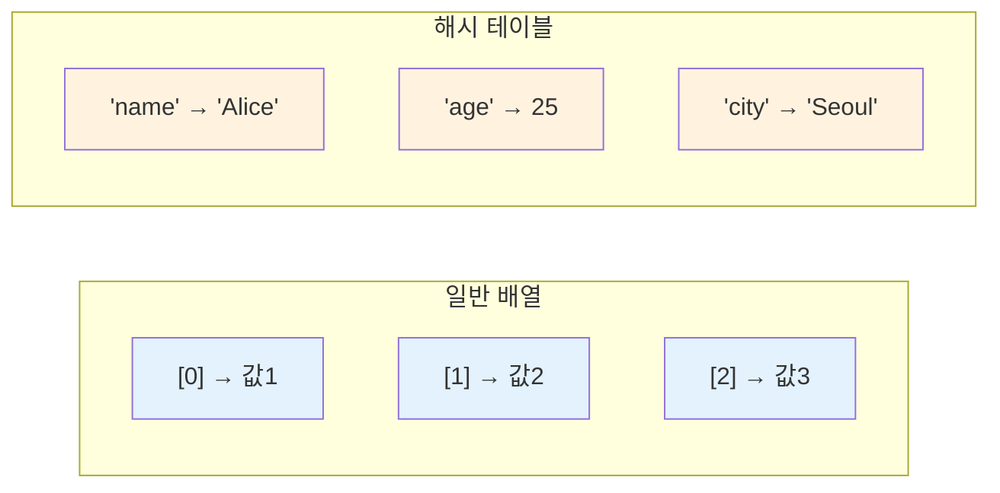
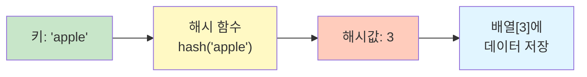
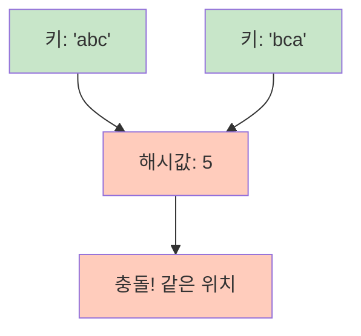
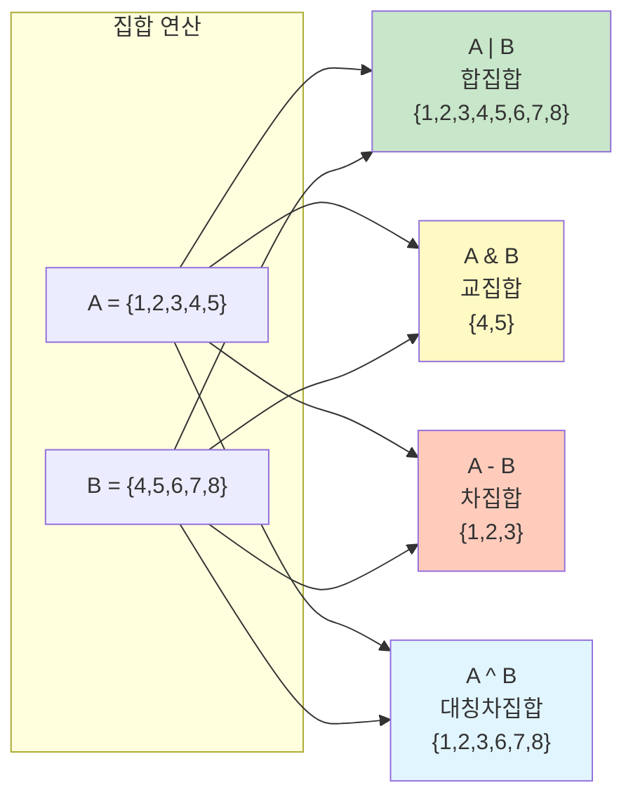

# 1. 해시 테이블 (Hash Table)

해시 테이블은 **키(key)와 값(value)의 쌍**으로 데이터를 저장하는 자료구조입니다. 해시 함수를 사용하여 키를 해시값으로 변환하고, 이 해시값을 인덱스로 사용하여 데이터를 저장합니다. 파이썬에서는 딕셔너리로 구현되어 있습니다.

## 1.1 해시 테이블의 개념

일반적인 배열은 인덱스(0, 1, 2, ...)로 데이터에 접근하지만, 해시 테이블은 **의미있는 키**로 데이터에 접근할 수 있습니다. 일부 언어는 이 두개의 자료구조를 구분하지 않고 동일하게 취급하기도 합니다.



## 1.2 해시 함수의 동작 원리

해시 함수는 키를 입력받아 고정된 범위의 해시값(정수)으로 변환합니다. 이 해시값이 데이터가 저장될 위치(인덱스)가 됩니다.



**예시: 간단한 해시 함수**

```python
def simple_hash(key, table_size):
    """문자열 키를 해시값으로 변환"""
    hash_value = 0
    for char in key:
        hash_value += ord(char)  # 각 문자의 ASCII 값을 더함
    return hash_value % table_size  # 테이블 크기로 나눈 나머지

# 테이블 크기가 10인 경우
print(simple_hash("apple", 10))   # 예: 2
print(simple_hash("banana", 10))  # 예: 6
print(simple_hash("cherry", 10))  # 예: 3
```

## 1.3 해시 충돌 (Hash Collision)

서로 다른 키가 같은 해시값을 가질 때 **해시 충돌**이 발생합니다.



## 1.4 해시 테이블의 시간복잡도

| 연산 | 평균 | 최악 |
|------|------|------|
| **삽입** | O(1) | O(n) |
| **삭제** | O(1) | O(n) |
| **검색** | O(1) | O(n) |

- **평균 O(1)**: 충돌이 적을 때
- **최악 O(n)**: 모든 키가 같은 해시값으로 충돌할 때

:::div{.callout}
**해시 테이블의 핵심**

- **장점**: 키로 데이터를 빠르게 검색/삽입/삭제 (평균 O(1))
- **단점**: 순서 보장 안 됨, 해시 충돌 가능성, 메모리 오버헤드
- **활용**: 데이터베이스 인덱싱, 캐시, 중복 검사, 빈도 계산
:::

# 2. Python 딕셔너리 (Dictionary)

Python의 `dict`는 해시 테이블로 구현된 자료구조입니다. Python 3.7+부터는 **삽입 순서가 보장**됩니다.

## 2.1 딕셔너리 생성

```python
# 빈 딕셔너리 생성
empty_dict = {}
empty_dict2 = dict()

# 값을 가진 딕셔너리 생성
student = {
    "name": "Alice",
    "age": 20,
    "major": "CS"
}

# dict() 생성자 사용
student2 = dict(name="Bob", age=22, major="Math")

# 리스트로부터 생성
pairs = [("a", 1), ("b", 2), ("c", 3)]
dict_from_pairs = dict(pairs)  # {'a': 1, 'b': 2, 'c': 3}

# dict comprehension
squares = {x: x**2 for x in range(1, 6)}  # {1: 1, 2: 4, 3: 9, 4: 16, 5: 25}
```

## 2.2 딕셔너리 접근과 수정

### 2.2.1 값 접근

```python
student = {"name": "Alice", "age": 20, "major": "CS"}

# 대괄호로 접근 - 키가 없으면 KeyError 발생
print(student["name"])      # "Alice"
# print(student["gender"])  # KeyError 발생!

# get() 메서드 - 키가 없으면 None 또는 기본값 반환
print(student.get("name"))           # "Alice"
print(student.get("gender"))         # None
print(student.get("gender", "미지정"))  # "미지정" (기본값)
```

### 2.2.2 값 수정과 추가

```python
student = {"name": "Alice", "age": 20}

# 기존 키의 값 수정
student["age"] = 21         # {"name": "Alice", "age": 21}

# 새로운 키-값 추가
student["major"] = "CS"     # {"name": "Alice", "age": 21, "major": "CS"}

# update(): 여러 키-값 한번에 추가/수정
student.update({"age": 22, "city": "Seoul"})
# {"name": "Alice", "age": 22, "major": "CS", "city": "Seoul"}

# setdefault(): 키가 없을 때만 추가
student.setdefault("name", "Bob")    # "Alice" (이미 있음, 변경 안 됨)
student.setdefault("phone", "010")   # "010" (새로 추가됨)
```

### 2.2.3 값 삭제

```python
student = {"name": "Alice", "age": 20, "major": "CS"}

# del: 키로 삭제
del student["age"]          # {"name": "Alice", "major": "CS"}

# pop(): 키로 삭제하고 값 반환
major = student.pop("major")         # "CS" 반환, 딕셔너리에서 제거
# grade = student.pop("grade")       # KeyError 발생!
grade = student.pop("grade", "A+")   # "A+" 반환 (기본값), 에러 없음

# popitem(): 마지막 키-값 쌍 삭제하고 반환 (Python 3.7+)
item = student.popitem()    # ("name", "Alice") 반환

# clear(): 모든 항목 삭제
student.clear()             # {}
```

## 2.3 딕셔너리 순회

```python
student = {"name": "Alice", "age": 20, "major": "CS"}

# 키만 순회
for key in student:
    print(key)              # name, age, major

for key in student.keys():
    print(key)              # 위와 동일

# 값만 순회
for value in student.values():
    print(value)            # Alice, 20, CS

# 키-값 쌍 순회
for key, value in student.items():
    print(f"{key}: {value}")
# name: Alice
# age: 20
# major: CS
```

## 2.4 딕셔너리 메서드

### 2.4.1 검색 메서드

```python
student = {"name": "Alice", "age": 20, "major": "CS"}

# in 연산자: 키 존재 여부 확인 - O(1)
if "name" in student:
    print("이름이 있습니다")

if "gender" not in student:
    print("성별 정보가 없습니다")

# keys(), values(), items(): 뷰 객체 반환
keys = student.keys()       # dict_keys(['name', 'age', 'major'])
values = student.values()   # dict_values(['Alice', 20, 'CS'])
items = student.items()     # dict_items([('name', 'Alice'), ('age', 20), ('major', 'CS')])

# 리스트로 변환
key_list = list(student.keys())      # ['name', 'age', 'major']
value_list = list(student.values())  # ['Alice', 20, 'CS']
```

### 2.4.2 복사 메서드

```python
original = {"a": 1, "b": 2}

# copy(): 얕은 복사
copied = original.copy()
copied["a"] = 10
print(original)  # {"a": 1, "b": 2} - 원본은 변경 안 됨

# 중첩 딕셔너리는 깊은 복사 필요
import copy
nested = {"a": {"x": 1}, "b": 2}
deep = copy.deepcopy(nested)
deep["a"]["x"] = 10
print(nested)    # {"a": {"x": 1}, "b": 2} - 원본은 변경 안 됨
```

## 2.5 딕셔너리 활용 패턴

### 2.5.1 빈도 계산

```python
# 문자열에서 각 문자의 빈도 계산
text = "hello world"
freq = {}
for char in text:
    if char != " ":
        freq[char] = freq.get(char, 0) + 1

print(freq)  # {'h': 1, 'e': 1, 'l': 3, 'o': 2, 'w': 1, 'r': 1, 'd': 1}

# collections.Counter 사용 (더 간단)
from collections import Counter
freq = Counter(text.replace(" ", ""))
print(freq)  # Counter({'l': 3, 'o': 2, 'h': 1, 'e': 1, 'w': 1, 'r': 1, 'd': 1})
```

### 2.5.2 그룹화

```python
# 학생들을 전공별로 그룹화
students = [
    {"name": "Alice", "major": "CS"},
    {"name": "Bob", "major": "Math"},
    {"name": "Charlie", "major": "CS"},
    {"name": "David", "major": "Physics"}
]

grouped = {}
for student in students:
    major = student["major"]
    if major not in grouped:
        grouped[major] = []
    grouped[major].append(student["name"])

print(grouped)
# {'CS': ['Alice', 'Charlie'], 'Math': ['Bob'], 'Physics': ['David']}

# defaultdict 사용 (더 간단)
from collections import defaultdict
grouped = defaultdict(list)
for student in students:
    grouped[student["major"]].append(student["name"])
```

### 2.5.3 캐싱 (메모이제이션)

```python
# 피보나치 수열을 캐싱으로 최적화
cache = {}

def fibonacci(n):
    if n in cache:
        return cache[n]

    if n <= 1:
        return n

    result = fibonacci(n-1) + fibonacci(n-2)
    cache[n] = result
    return result

print(fibonacci(100))  # 빠르게 계산됨

# functools.lru_cache 사용 (더 간단)
from functools import lru_cache

@lru_cache(maxsize=None)
def fibonacci_cached(n):
    if n <= 1:
        return n
    return fibonacci_cached(n-1) + fibonacci_cached(n-2)

print(fibonacci_cached(100))
```

### 2.5.4 두 리스트를 딕셔너리로 결합

```python
keys = ["name", "age", "major"]
values = ["Alice", 20, "CS"]

# zip()과 dict() 사용
student = dict(zip(keys, values))
print(student)  # {'name': 'Alice', 'age': 20, 'major': 'CS'}
```

# 3. 집합 (Set)

집합은 **중복을 허용하지 않는** 해시 테이블 기반 자료구조입니다. 딕셔너리에서 값 없이 키만 저장하는 형태입니다.

## 3.1 집합 생성

```python
# 빈 집합 생성
empty_set = set()  # {}는 빈 딕셔너리!

# 값을 가진 집합 생성
numbers = {1, 2, 3, 4, 5}
fruits = {"apple", "banana", "cherry"}

# 리스트로부터 생성 (중복 자동 제거)
numbers_list = [1, 2, 2, 3, 3, 3, 4, 5]
unique_numbers = set(numbers_list)  # {1, 2, 3, 4, 5}

# 문자열로부터 생성
chars = set("hello")  # {'h', 'e', 'l', 'o'} - 중복 제거됨
```

## 3.2 집합 연산

### 3.2.1 요소 추가/제거

```python
fruits = {"apple", "banana"}

# add(): 요소 하나 추가 - O(1)
fruits.add("cherry")         # {"apple", "banana", "cherry"}

# update(): 여러 요소 추가 - O(k), k는 추가할 요소 개수
fruits.update(["mango", "grape"])  # {"apple", "banana", "cherry", "mango", "grape"}

# remove(): 요소 제거 (없으면 KeyError) - O(1)
fruits.remove("banana")      # {"apple", "cherry", "mango", "grape"}
# fruits.remove("kiwi")      # KeyError 발생!

# discard(): 요소 제거 (없어도 에러 안 남) - O(1)
fruits.discard("mango")      # {"apple", "cherry", "grape"}
fruits.discard("kiwi")       # 에러 안 남

# pop(): 임의의 요소 제거하고 반환 - O(1)
item = fruits.pop()          # 임의의 과일 반환

# clear(): 모든 요소 제거
fruits.clear()               # set()
```

### 3.2.2 집합 연산

```python
a = {1, 2, 3, 4, 5}
b = {4, 5, 6, 7, 8}

# 합집합 (Union) - O(len(a) + len(b))
print(a | b)                 # {1, 2, 3, 4, 5, 6, 7, 8}
print(a.union(b))            # 위와 동일

# 교집합 (Intersection) - O(min(len(a), len(b)))
print(a & b)                 # {4, 5}
print(a.intersection(b))     # 위와 동일

# 차집합 (Difference) - O(len(a))
print(a - b)                 # {1, 2, 3}
print(a.difference(b))       # 위와 동일

# 대칭 차집합 (Symmetric Difference) - O(len(a) + len(b))
print(a ^ b)                 # {1, 2, 3, 6, 7, 8}
print(a.symmetric_difference(b))  # 위와 동일
```



### 3.2.3 부분집합 검사

```python
a = {1, 2, 3}
b = {1, 2, 3, 4, 5}

# 부분집합 (Subset)
print(a <= b)                # True, a는 b의 부분집합
print(a.issubset(b))         # True

# 진부분집합 (Proper Subset)
print(a < b)                 # True, a는 b의 진부분집합

# 상위집합 (Superset)
print(b >= a)                # True, b는 a의 상위집합
print(b.issuperset(a))       # True

# 진상위집합 (Proper Superset)
print(b > a)                 # True

# 서로소 (Disjoint) - 교집합이 없음
c = {6, 7, 8}
print(a.isdisjoint(c))       # True
```

## 3.3 집합 활용 패턴

### 3.3.1 중복 제거

```python
# 리스트에서 중복 제거
numbers = [1, 2, 2, 3, 3, 3, 4, 5, 5]
unique = list(set(numbers))  # [1, 2, 3, 4, 5]

# 순서 유지하면서 중복 제거 (dict 사용)
def remove_duplicates(lst):
    return list(dict.fromkeys(lst))

numbers = [1, 2, 2, 3, 3, 3, 4, 5, 5]
print(remove_duplicates(numbers))  # [1, 2, 3, 4, 5]
```

### 3.3.2 빠른 멤버십 테스트

```python
# 리스트 vs 집합 - 멤버십 테스트
large_list = list(range(1000000))
large_set = set(large_list)

# 리스트: O(n) - 느림
# if 999999 in large_list:  # 느림!
#     print("found")

# 집합: O(1) - 빠름
if 999999 in large_set:      # 빠름!
    print("found")
```

### 3.3.3 공통 요소 찾기

```python
# 두 리스트의 공통 요소
list1 = [1, 2, 3, 4, 5]
list2 = [4, 5, 6, 7, 8]

common = list(set(list1) & set(list2))  # [4, 5]
```

# 4. 딕셔너리 vs 집합 비교

## 4.1 특징 비교표

| 특징 | 딕셔너리 (dict) | 집합 (set) |
|------|----------------|-----------|
| **저장 방식** | 키-값 쌍 | 키만 (값 없음) |
| **중복** | 키 중복 불가, 값 중복 가능 | 중복 불가 |
| **순서** | 삽입 순서 보장 (3.7+) | 순서 없음 |
| **인덱싱** | 키로 접근 `dict[key]` | 인덱싱 불가 |
| **가변성** | 가변 (mutable) | 가변 (mutable) |
| **키/요소 타입** | 불변 타입만 가능 | 불변 타입만 가능 |
| **사용 예** | 매핑, 캐싱, 그룹화 | 중복 제거, 멤버십 테스트, 집합 연산 |

## 4.2 시간복잡도 비교

| 연산 | 딕셔너리 | 집합 |
|------|---------|------|
| **접근** | `dict[key]` - O(1) | 인덱싱 불가 |
| **검색** | `key in dict` - O(1) | `item in set` - O(1) |
| **추가** | `dict[key] = val` - O(1) | `set.add(item)` - O(1) |
| **삭제** | `del dict[key]` - O(1) | `set.remove(item)` - O(1) |
| **순회** | `for k, v in dict.items()` - O(n) | `for item in set` - O(n) |

:::div{.callout}
**딕셔너리와 집합 선택 가이드**

**딕셔너리를 사용할 때:**
- 키-값 매핑이 필요할 때
- 빈도 계산, 그룹화, 캐싱
- 데이터 조회가 빈번할 때

**집합을 사용할 때:**
- 중복 제거가 필요할 때
- 멤버십 테스트가 빈번할 때 (리스트의 `in` 연산보다 훨씬 빠름)
- 합집합, 교집합 등 집합 연산이 필요할 때
- 순서가 중요하지 않을 때
:::

# 5. 연습문제

* (해시) 중복 제거하기: https://100.pyalgo.co.kr/?page=101
* (해시) 가장 많이 등장하는 문자: https://100.pyalgo.co.kr/?page=102
* (해시) 완주하지 못한 선수: https://100.pyalgo.co.kr/?page=103
* (해시) 디스코드 채팅방: https://100.pyalgo.co.kr/?page=104