# 1. 트리 (Tree)

트리는 **노드들이 계층적으로 연결된 자료구조**입니다. 하나의 루트 노드에서 시작하여 자식 노드들로 뻗어나가는 형태로, 사이클이 없는 연결 그래프입니다.

## 1.1 트리의 기본 용어

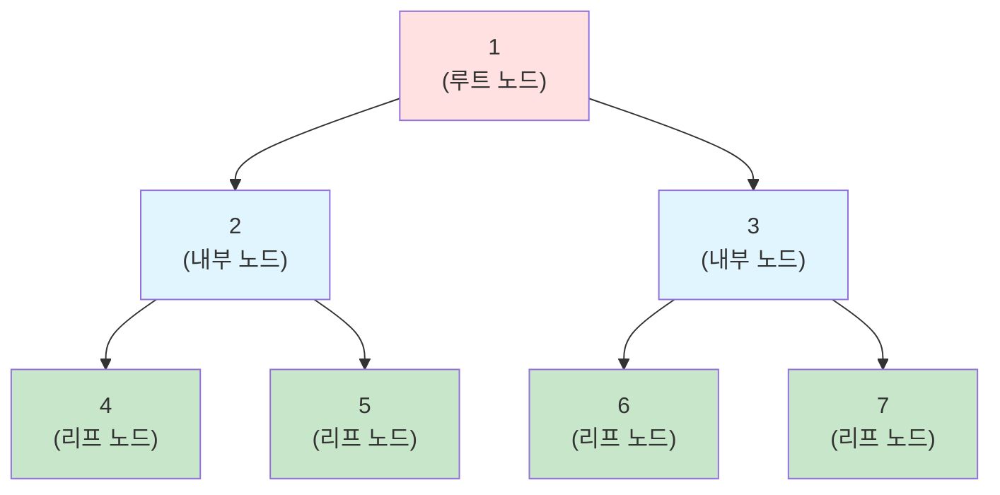

- **노드(Node)**: 트리의 구성 요소
- **루트(Root)**: 최상위 노드 (노드 1)
- **부모(Parent)**: 특정 노드의 상위 노드 (2의 부모는 1)
- **자식(Child)**: 특정 노드의 하위 노드 (1의 자식은 2, 3)
- **형제(Sibling)**: 같은 부모를 가진 노드 (2와 3)
- **리프(Leaf)**: 자식이 없는 노드 (4, 5, 6, 7)
- **내부 노드(Internal Node)**: 자식이 있는 노드 (1, 2, 3)
- **깊이(Depth)**: 루트에서 특정 노드까지의 경로 길이 (4의 깊이: 2)
- **높이(Height)**: 트리의 최대 깊이 (이 트리의 높이: 2)
- **레벨(Level)**: 루트를 0 또는 1로 시작하는 깊이

## 1.2 트리의 특징

- **계층 구조**: 부모-자식 관계로 연결
- **사이클 없음**: 순환 구조가 없음
- **하나의 경로**: 두 노드 사이에는 정확히 하나의 경로만 존재
- **N개 노드, N-1개 간선**: N개의 노드는 N-1개의 간선으로 연결

# 2. 이진 트리 (Binary Tree)

이진 트리는 **각 노드가 최대 2개의 자식을 가지는 트리**입니다.

## 2.1 이진 트리의 종류

- **포화 이진 트리 (Full Binary Tree)**: 모든 레벨이 노드로 꽉 차있음

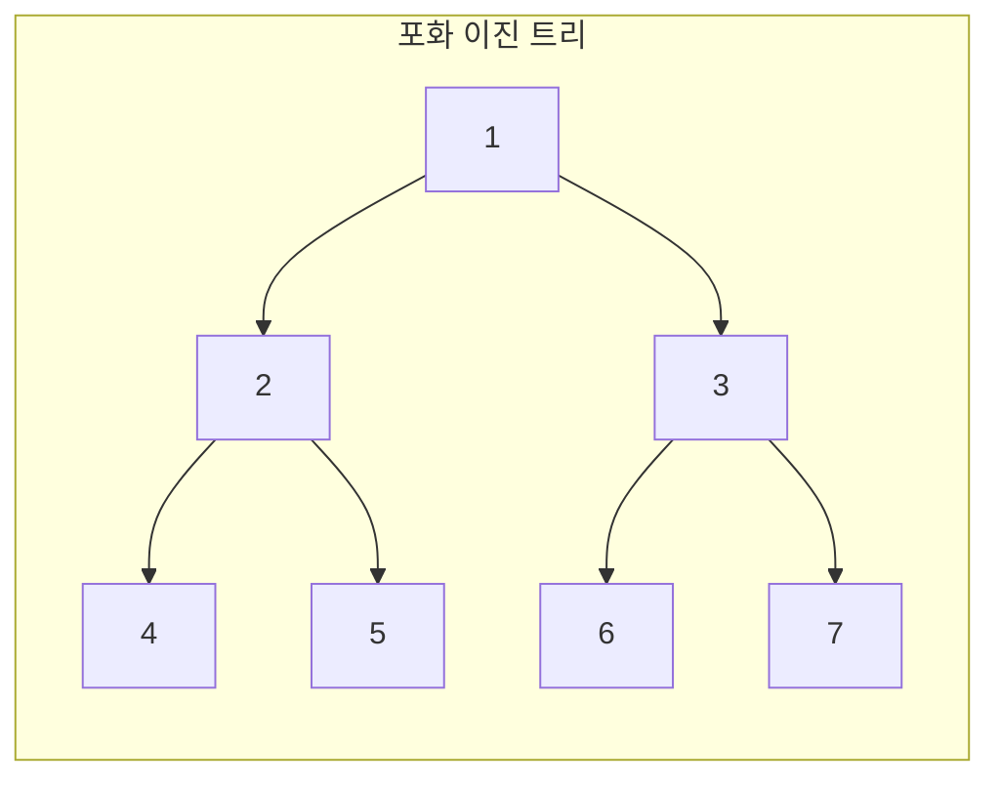


- **완전 이진 트리 (Complete Binary Tree)**: 마지막 레벨을 제외하고 모든 레벨이 꽉 차있고, 마지막 레벨은 왼쪽부터 채워짐

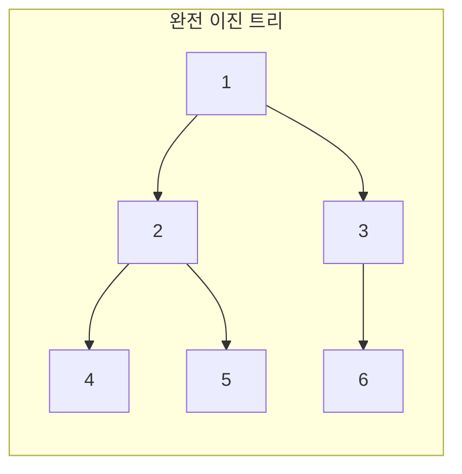
- **편향 이진 트리 (Skewed Binary Tree)**: 한쪽으로만 자식이 있는 트리

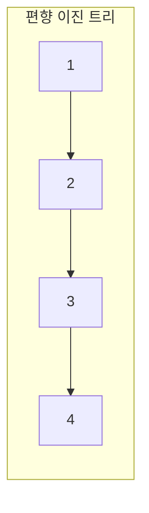

## 2.2 이진 트리 구현

```python
class TreeNode:
    def __init__(self, value):
        self.value = value
        self.left = None
        self.right = None

# 트리 생성
#     1
#    / \
#   2   3
#  / \
# 4   5

root = TreeNode(1)
root.left = TreeNode(2)
root.right = TreeNode(3)
root.left.left = TreeNode(4)
root.left.right = TreeNode(5)
```

:::div{.callout}
만약 위 문법이 어렵다면 다음과 같이 딕셔너리와 리스트로도 구현할 수 있습니다. 함께 공부하기 좋은 개념으로는 링크드 리스트가 있습니다. 여기서는 링크드 리스트를 다루지는 않습니다. 스택과 마찬가지로 '개념'이기 때문에 다양한 방식으로 구현할 수 있습니다.

1. 딕셔너리 활용: 딕셔너리에서 'value'는 노드의 값, 'left'는 왼쪽 자식, 'right'는 오른쪽 자식을 의미합니다.

```python
tree = {
    'value': 1,
    'left': {
        'value': 2,
        'left': {'value': 4, 'left': None, 'right': None},
        'right': {'value': 5, 'left': None, 'right': None}
    },
    'right': {
        'value': 3,
        'left': None,
        'right': None
    }
}
```
2. 리스트 활용 (완전 이진 트리의 경우) : 리스트에서 0번째 값은 값이고, 1번째 값은 왼쪽 자식, 2번째 값은 오른쪽 자식을 의미합니다.

```python
tree =  [1, 
            [2, 
                [4, None, None], 
                [5, None, None]
            ], 
            [3, None, None]
        ]
```
:::

## 2.3 이진 트리 순회

트리 순회는 트리의 모든 노드를 체계적으로 방문하는 과정입니다. 재귀로 구현이 되어 있습니다. 가볍게만 훑어봐주세요. 이 부분은 깊이우선탐색, 넓이우선탐색을 제외하고 코딩테스트에서는 잘 출제되지 않습니다.

### 2.3.1 전위 순회 (Preorder)

**루트 → 왼쪽 → 오른쪽** 순서로 방문합니다.

```python
def preorder(node):
    """전위 순회: Root → Left → Right"""
    if node is None:
        return

    print(node.value, end=' ')  # 루트 방문
    preorder(node.left)         # 왼쪽 서브트리
    preorder(node.right)        # 오른쪽 서브트리

# 결과: 1 2 4 5 3
```

### 2.3.2 중위 순회 (Inorder)

**왼쪽 → 루트 → 오른쪽** 순서로 방문합니다.

```python
def inorder(node):
    """중위 순회: Left → Root → Right"""
    if node is None:
        return

    inorder(node.left)          # 왼쪽 서브트리
    print(node.value, end=' ')  # 루트 방문
    inorder(node.right)         # 오른쪽 서브트리

# 결과: 4 2 5 1 3
```

:::div{.callout}
**이진 탐색 트리(BST)와 중위 순회**

이진 탐색 트리를 중위 순회하면 **오름차순으로 정렬된 값**을 얻을 수 있습니다. 이는 BST의 왼쪽 자식 < 부모 < 오른쪽 자식 속성 때문입니다.
:::

### 2.3.3 후위 순회 (Postorder)

**왼쪽 → 오른쪽 → 루트** 순서로 방문합니다.

```python
def postorder(node):
    """후위 순회: Left → Right → Root"""
    if node is None:
        return

    postorder(node.left)        # 왼쪽 서브트리
    postorder(node.right)       # 오른쪽 서브트리
    print(node.value, end=' ')  # 루트 방문

# 결과: 4 5 2 3 1
```

### 2.3.4 순회 방식 비교

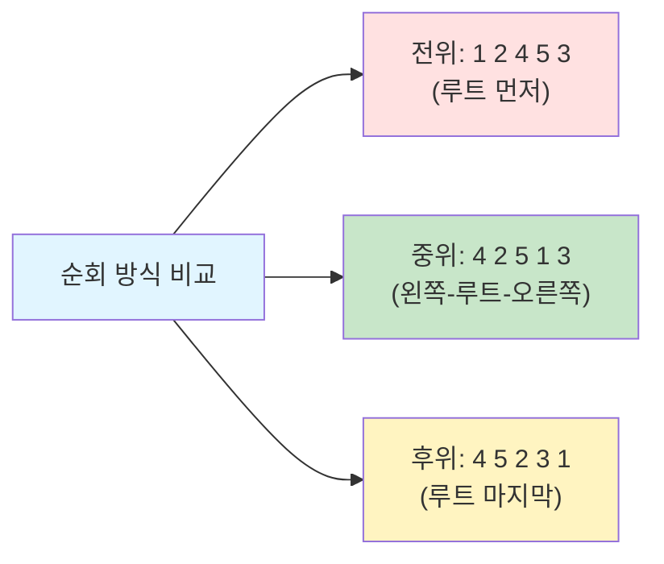

## 2.4 깊이 우선 탐색 (DFS)과 넓이 우선 탐색 (BFS)

트리 순회는 깊이 우선 탐색(DFS)과 넓이 우선 탐색(BFS)으로 나눌 수 있습니다. DFS는 스택을 사용하고, BFS는 큐를 사용합니다. 예제를 간소화 하기 위해서 트리는 클래스로 구현하지 않고, 딕셔너리로 표현하였습니다.

### 2.4.1 깊이 우선 탐색의 개념

깊이 우선 탐색(DFS, Depth-First Search)은 **한 방향으로 끝까지 탐색한 후 다시 돌아와서 다른 방향을 탐색**하는 방법입니다. 스택(Stack) 자료구조를 사용하거나 재귀 함수로 구현합니다.

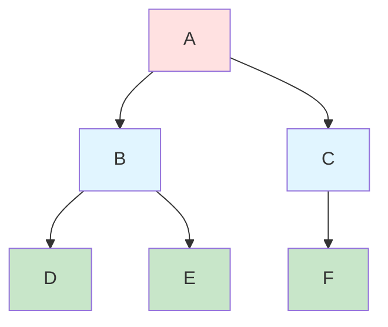

**DFS 탐색 순서**: A → B → D → E → C → F (깊이 우선으로 탐색)

### 2.4.2 단계별 DFS 동작 과정

**초기 상태**: A를 스택에 넣은 상태로 시작합니다. 값은 뒤에서 추가하고, 뒤에서 꺼내는 구조입니다.
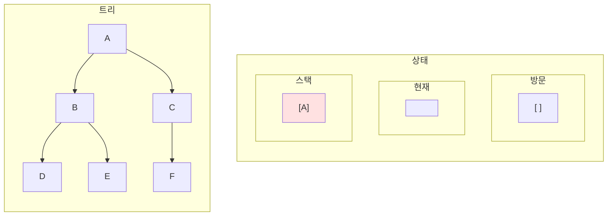

**Step 1: A를 스택에서 꺼내고 방문**
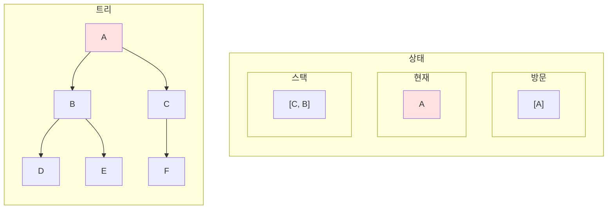

**Step 2: B를 스택에서 꺼내고 방문**
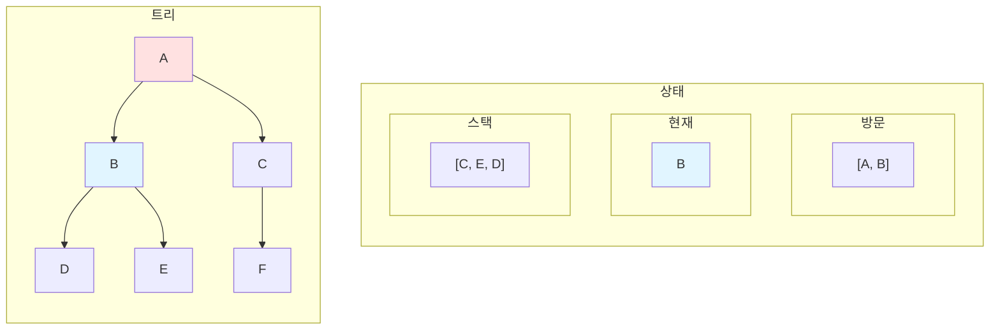

**Step 3: D를 스택에서 꺼내고 방문**
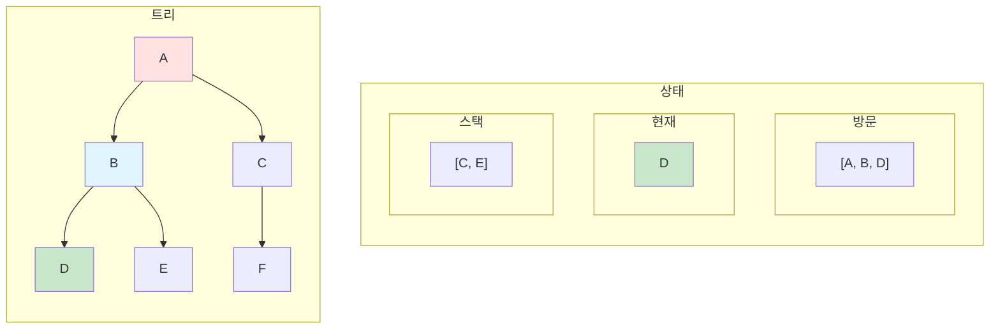

**Step 4: E를 스택에서 꺼내고 방문**
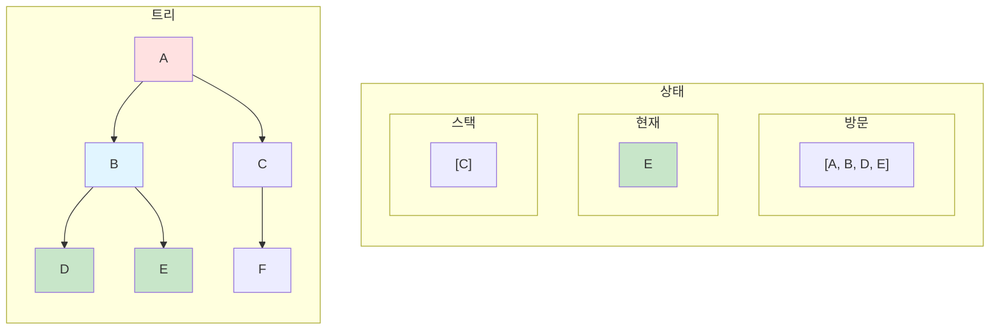

**Step 5: C를 스택에서 꺼내고 방문**
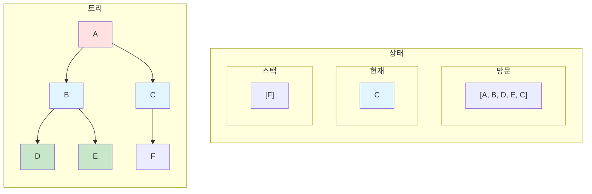

**Step 6: F를 스택에서 꺼내고 방문 (완료)**
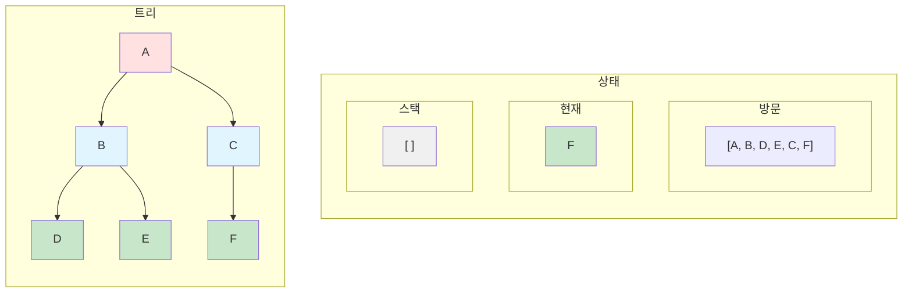

### 2.4.3 깊이 우선 탐색 구현

```python
def dfs(graph, start):
    """딕셔너리 그래프에서 DFS 수행"""
    visited = []  # 방문한 노드 기록
    stack = [start]  # 스택 초기화

    while stack:
        # 스택에서 노드 꺼내기
        current = stack.pop()

        # 아직 방문하지 않았다면
        if current not in visited:
            visited.append(current)
            print(f"방문: {current}")

            # 자식 노드들을 스택에 추가 (역순으로)
            if current in graph:
                # 역순으로 추가해야 올바른 순서로 방문
                for neighbor in reversed(graph[current]):
                    if neighbor not in visited:
                        stack.append(neighbor)

    return visited

# 그래프 정의 (딕셔너리)
graph = {
    'A': ['B', 'C'],
    'B': ['D', 'E'],
    'C': ['F'],
    'D': [],
    'E': [],
    'F': []
}

# DFS 실행
result = dfs(graph, 'A')
print(f"DFS 탐색 순서: {' → '.join(result)}")
# 출력: DFS 탐색 순서: A → B → D → E → C → F
```

### 2.4.4 넓이 우선 탐색의 개념

넓이 우선 탐색(BFS, Breadth-First Search)은 **같은 레벨의 노드들을 먼저 모두 탐색한 후 다음 레벨로 이동**하는 방법입니다. 큐(Queue) 자료구조를 사용합니다.


**BFS 탐색 순서**: A → B → C → D → E → F (레벨별로 탐색)

### 2.4.6 단계별 BFS 동작 과정

**초기 상태**: A를 큐에 넣은 상태로 시작합니다. 값은 뒤에서 추가하고, 앞에서 꺼내는 구조입니다.
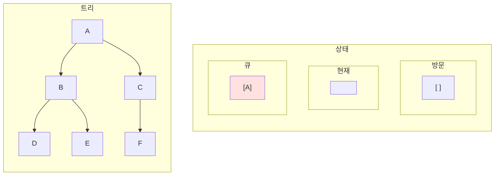

**Step 1: A를 큐에서 꺼내고 방문**
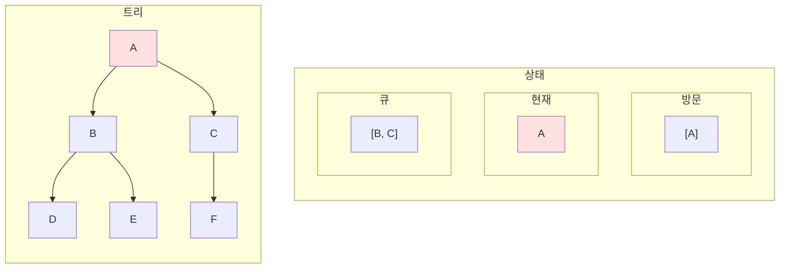

**Step 2: B를 큐에서 꺼내고 방문**
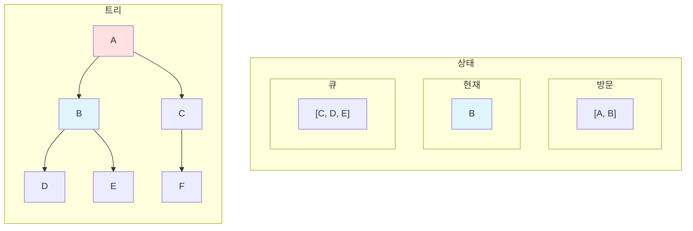

**Step 3: C를 큐에서 꺼내고 방문**


**Step 4: D를 큐에서 꺼내고 방문**
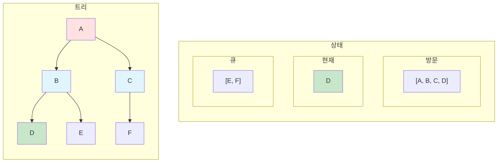

**Step 5: E를 큐에서 꺼내고 방문**
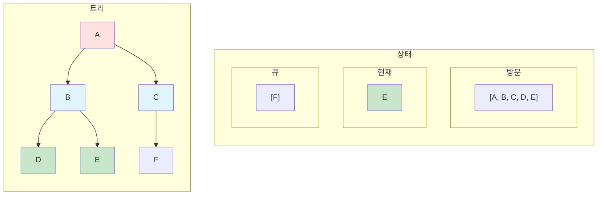

**Step 6: F를 큐에서 꺼내고 방문 (완료)**
```mermaid
flowchart LR
    subgraph tree["트리"]
        direction TB
        T6A[A] --> T6B[B]
        T6A --> T6C[C]
        T6B --> T6D[D]
        T6B --> T6E[E]
        T6C --> T6F[F]

        style T6A fill:#ffe1e1
        style T6B fill:#e1f5ff
        style T6C fill:#e1f5ff
        style T6D fill:#c8e6c9
        style T6E fill:#c8e6c9
        style T6F fill:#c8e6c9
    end

    subgraph info["상태"]
        direction TB
        subgraph visited["방문"]
            V6["[A, B, C, D, E, F]"]
        end
        subgraph current["현재"]
            C6["F"]
        end
        subgraph queue["큐"]
            Q6["[ ]"]
        end
    end

    tree ~~~ info

    style C6 fill:#c8e6c9
    style Q6 fill:#f0f0f0
```

### 2.4.6 넓이 우선 탐색 구현

```python
from collections import deque

def bfs(graph, start):
    """딕셔너리 그래프에서 BFS 수행"""
    visited = []  # 방문한 노드 기록
    queue = deque([start])  # 큐 초기화

    while queue:
        # 큐에서 노드 꺼내기 (앞에서 꺼냄)
        current = queue.popleft()

        # 아직 방문하지 않았다면
        if current not in visited:
            visited.append(current)
            print(f"방문: {current}")

            # 자식 노드들을 큐에 추가 (순서대로)
            if current in graph:
                for neighbor in graph[current]:
                    if neighbor not in visited and neighbor not in queue:
                        queue.append(neighbor)

    return visited

# 그래프 정의 (딕셔너리)
graph = {
    'A': ['B', 'C'],
    'B': ['D', 'E'],
    'C': ['F'],
    'D': [],
    'E': [],
    'F': []
}

# BFS 실행
result = bfs(graph, 'A')
print(f"BFS 탐색 순서: {' → '.join(result)}")
# 출력: BFS 탐색 순서: A → B → C → D → E → F
```

### 2.4.7 DFS vs BFS 비교

```mermaid
graph TB
    subgraph "DFS (깊이 우선)"
        D1["특징"]
        D1 --> D2["스택 사용"]
        D1 --> D3["한 방향 끝까지"]
        D1 --> D4["메모리 효율적"]

        D5["탐색 순서"]
        D5 --> D6["A → B → D → E → C → F"]

        style D1 fill:#ffe1e1
        style D5 fill:#ffe1e1
    end

    subgraph "BFS (넓이 우선)"
        B1["특징"]
        B1 --> B2["큐 사용"]
        B1 --> B3["레벨별 탐색"]
        B1 --> B4["최단 경로 보장"]

        B5["탐색 순서"]
        B5 --> B6["A → B → C → D → E → F"]

        style B1 fill:#e1f5ff
        style B5 fill:#e1f5ff
    end
```

| 특성 | DFS (깊이 우선) | BFS (넓이 우선) |
|------|----------------|----------------|
| 자료구조 | 스택 (Stack) | 큐 (Queue) |
| 탐색 방식 | 한 방향 끝까지 | 레벨별로 |
| 메모리 | 적게 사용 | 많이 사용 |
| 최단 경로 | 보장 안 됨 | 보장됨 |
| 구현 | 재귀/반복문 | 반복문 주로 사용 |
| 적용 사례 | 미로 탐색, 백트래킹 | 최단 경로, 레벨 순회 |

# 5. 연습문제

* (DFS/BFS) (라이캣의 꿈-1) 출항 준비!: https://pyalgo.co.kr/?page=14
* (DFS/BFS) 제주에 남겨진 단서: https://to.pyalgo.co.kr/?page=5
* 간단하게 아래 문제를 DFS와 BFS로 풀어보세요.
```python
# 딕셔너리로 표현한 트리 (인접 리스트 방식)
tree = {
    'A': ['B', 'C'],
    'B': ['D', 'E'],
    'C': ['F', 'G'],
    'D': [],
    'E': [],
    'F': [],
    'G': []
}
#         A
#        / \
#       B   C
#      / \ / \
#     D  E F  G
```
